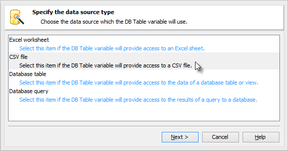
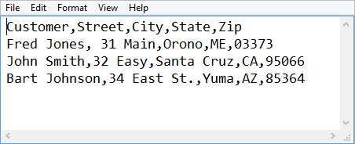
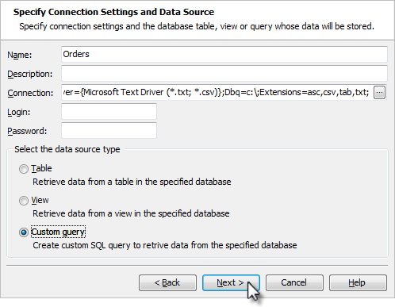
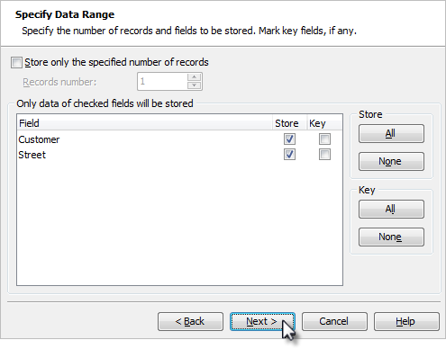
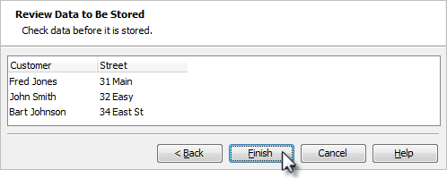

### Data Driven Testing

#### Objectives
>
> This chapter demonstrates how you can drive tests from data stored in
> a database, spreadsheet or text document. You\'ll learn about the DB
> Table object used to automatically feed data to your test and how to
> leverage the DBTable checkpoint to verify database contents.
>
#### The DB Table Object
>
> TestComplete provides a built-in data driven testing object type
> called **DB Table** that provides a straight forward and consistent
> mechanism for working with a wide variety of data sources. DB Tables
> can provide connection to Excel spreadsheets, comma delimited CSV
> files and database tables such as Oracle or MS SQL.

#### Creating a DB Table Variable

> To create a DB Table variable:

32. Navigate to the **Variables** tab of for the project. Right-click
    the **Temporary Variables**

> area and select **New Item\...** from the context menu.

33. Provide a name for the table, drop down the Type list and select
    **DB Table**. Click the ellipses in the **Default Value** column.
    This will bring up **Edit DB Table Variable Value** dialog.

> **Figure 147 \--Defining the Table**

34. In the **Edit DB Table Variable Value** dialog, select one of the
    data source types from the list. In the screenshot below the **CSV
    file** type is selected. Click the **Next** button to continue.

> **Figure 148 \--Selecting the Data Source Type**

35. In this page specify a CSV file, an Excel file or a database table,
    depending on the data source type you specified in the preceding
    step. In this example we specify the path to a CSV file called
    \"orders.txt\". Click the **Create File** button to invoke Notepad.

> **Figure 149 \--Selecting a CSV File**

36. In Notepad, enter a comma-delimited list of information as shown in
    the screenshot below. The first row of information will be used as
    headings. Once you have entered the data, save and close Notepad.
    Click the **Next** button to continue.

37. The CSV Format Parameters page of the wizard shows a preview of the
    data and allows you to tweak parameters including the delimeters,
    treat several consecutive delimiters as a single entity, and to use
    the first row for column names. You can leave the default settings
    and click the **Finish** button.

38. When the wizard is finished you will have a new **Default Value**
    column entry. This entry will vary depending on the path you\'ve
    taken through the wizard. Examples of results for several file type
    choices are shown in the screenshot below. Notice that in all three
    cases, the name \"Orders\" stays the same and the type is DB Table.
    Later, if you need to change the data source, assuming the data
    source contains the same named columns, you can swap in a new data
    source without changing your test.

#### Accessing DB Table Values

> In Script, use the **DBTable** variable type. To consume DBTable
> variable values, access them through the ProjectSuite or Project
> Variables object, followed by the DBTable variable name. Use the
> **Value()** method and pass the column name of the value you want to
> extract. The basic syntax is:
>
> ProjectSuite.Variables.MyTable.Value(\"TheColumnName\")
>
> The code example below accesses a column called \"Customer\" in the
> \"Orders\" table and writes the value to the test log. The \"Orders\"
> DBTable variable must already exist in the Variables collection and
> must have a column with the same name as passed to the Value() method.
>
> **function** DBTableUseValues()
>
> {
>
> *// Retrieve a value*
>
> value = Project.Variables.Orders.Value(\"Customer\");
>
> Log.Message(\"Name:\" + value);
>
> }
>
> **Sub** DBTableUseValues()
>
> *\' Retrieve a value*
>
> value = Project.Variables.Orders.Value(\"Customer\")
>
> **Log**.Message(\"Name:\" & value)
>
> **End Sub**
>
> []{#Creating_a_Data_Driven_Test .anchor}**Creating a Data Driven
> Test**
>
> A productive way to construct data driven Keyword Tests is to identify
> areas within your application where repetitious data entry is required
> such as adding customer records or creating orders. These scenarios
> are generally good targets for performing data driven testing. In this
> section we\'ll construct a data driven Keyword Test that illustrates
> just such a scenario using the \"Orders\" sample application. In this
> example we\'ll illustrate using the DB Table to read data from a comma
> separated file (CSV). To start, we\'ll record a basic data entry
> scenario of inserting a new customer order.

#### Recording the Test

1.  Select **File \| New \| Project\...** and click **OK** on the Create
    Project dialog.

2.  Launch the \"Orders\" sample application.

3.  Right-click the \"Orders\" process in the Object Browser and select
    **Add to TestedApps** from the context menu. You may need to click
    the **Refresh** option if you don\'t see the \"Orders\" process in
    the Object Browser.

> **Figure 150 \--Adding to TestedApps**

4.  Close the \"Orders\" application. We\'ll launch it during the
    recording using the

> **TestedApps** button.

5.  Click the **Record** button on the toolbar button.

6.  Using the **TestedApps** button launch the Orders application.

7.  Select **Orders \| New Order\...**

8.  Fill in Customer, Street, City, State and Zip.

9.  Click **OK.**

10. Click the **Stop** button on the recording toolbar to end the
    recording.

#### Data Driven Loops

> You can set up a loop in code that iterates the rows of a DBTable and
> accesses values for particular columns during each iteration. A
> cleaned-up version of the recorded \"New Order\" test might look
> something like the code example below.
>
> **function** CreateNewOrder() { TestedApps.Orders.Run();
>
> Aliases.Orders().MainForm().MainMenu.Click(\"Orders\|New order\...\");
> Aliases.Orders().OrderForm().Group().Customer().SetText(\"Bob
> Smith\"); Aliases.Orders().OrderForm().Group().Street().SetText(\"Easy
> St.\"); Aliases.Orders().OrderForm().Group().City().SetText(\"Santa
> Cruz\"); Aliases.Orders().OrderForm().Group().State().SetText(\"CA\");
> Aliases.Orders().OrderForm().Group().Zip().SetText(\"951234\");
> Aliases.Orders().OrderForm().ButtonOK().ClickButton();
>
> }
>
> **Private Function CreateNewOrder() As \[function\]
> TestedApps.Orders.Run()**
>
> **Aliases.Orders().MainForm().MainMenu.Click(\"Orders\|New
> order\...\")
> Aliases.Orders().OrderForm().Group().Customer().SetText(\"Bob Smith\")
> Aliases.Orders().OrderForm().Group().Street().SetText(\"Easy St.\")
> Aliases.Orders().OrderForm().Group().City().SetText(\"Santa Cruz\")
> Aliases.Orders().OrderForm().Group().State().SetText(\"CA\")
> Aliases.Orders().OrderForm().Group().Zip().SetText(\"951234\")
> Aliases.Orders().OrderForm().ButtonOK().ClickButton()**
>
> **End Function**
>
> By using DBTable methods **Reset()**, **IsEOF()** and **Next()** we
> can drive through all the rows in the data and extract them using the
> DBTable **Value()** method. The **Reset()** method initializes the
> iterator, **IsEOF()** tests if we\'ve read the last record of the
> table and **Next()** moves the iterator to the next record in the
> table. Notice the call to **Disconnect()** that unlocks the files in
> use without having to stop the test.
>
> The example below runs the sample \"Orders\" application, starts the
> \"Orders\" DBTable iterator on the first record, enters a loop that
> checks for the DBTable end of file and retrieves the column values for
> each row and places them in the calls to SetText() for each edit box.
>
> **function** CreateNewOrders(){ TestedApps.Orders.Run();
> Project.Variables.Orders.Reset();
>
> **for**(; !Project.Variables.Orders.IsEOF();) {
> Aliases.Orders().MainForm().MainMenu.Click(\"Orders\|New order\...\");
> Aliases.Orders().OrderForm().Group().Customer()
>
> .SetText(Project.Variables.Orders.Value(\"Customer\"));
> Aliases.Orders().OrderForm().Group().Street()
>
> .SetText(Project.Variables.Orders.Value(\"Street\"));
> Aliases.Orders().OrderForm().Group().City()
>
> .SetText(Project.Variables.Orders.Value(\"City\"));
> Aliases.Orders().OrderForm().Group().State()
>
> .SetText(Project.Variables.Orders.Value(\"State\"));
> Aliases.Orders().OrderForm().Group().Zip()
>
> .SetText(Project.Variables.Orders.Value(\"Zip\"));
> Aliases.Orders().OrderForm().ButtonOK().ClickButton();
> Project.Variables.Orders.Next();
>
> }
>
> Project.Variables.Orders.Disconnect();
>
> }
>
> **Private Function** CreateNewOrders() **As** \[**function**\]
> TestedApps.Orders.Run() Project.Variables.Orders.**Reset**()
>
> **While Not** Project.Variables.Orders.IsEOF()
> Aliases.Orders().MainForm().MainMenu.Click(\"Orders\|New order\...\")
> Aliases.Orders().OrderForm().Group().Customer()\_
>
> .SetText(Project.Variables.Orders.Value(\"Customer\"))
> Aliases.Orders().OrderForm().Group().Street()\_
>
> .SetText(Project.Variables.Orders.Value(\"Street\"))
> Aliases.Orders().OrderForm().Group().City()\_
>
> .SetText(Project.Variables.Orders.Value(\"City\"))
> Aliases.Orders().OrderForm().Group().State()\_
>
> .SetText(Project.Variables.Orders.Value(\"State\"))
> Aliases.Orders().OrderForm().Group().Zip()\_
>
> .SetText(Project.Variables.Orders.Value(\"Zip\"))
> Aliases.Orders().OrderForm().ButtonOK().ClickButton()
> Project.Variables.Orders.\[**Next**\]()
>
> **End While**
>
> Project.Variables.Orders.Disconnect()
>
> **End Function**
>
#### Database Table Checkpoint
>
> The **Table Checkpoint** verifies live database content, both rows and
> columns, against a static snapshot of the data stored when the
> checkpoint was created. Using the **Table Checkpoint** is very similar
> to using the Table checkpoint with the exception being the location
> where the data is retrieved. To use a **Table Checkpoint** we need:
>
> A connection string that defines access to a data provider so we can
> connect to a data store.
>
> A specific Table, View or Query that defines criteria used to fetch
> data from the store.
>
> The connection string allows for connecting to any ADO or ADO.NET
> supported data provider including data sources such as .CSV files,
> Excel spreadsheets or a wide variety of database servers.

#### Creating a DBTables Store

> For this example, we\'ll use Microsoft\'s Text Driver which provides
> access to data stored in . CSV files to illustrate the DBTable store.
> We\'ll use this provider as it does not require an actual database
> server backend and is generally available on most computers. The
> connection string for the Microsoft Text Driver is:
>
> Driver={Microsoft Text Driver (\*.txt;
> \*.csv)};Dbq=c:\\;Extensions=asc,csv,tab,txt;
>
> In this connection string the name **Dbq** specifies the folder where
> our CSV files are located. We\'ll use a file called \"c:\\order.txt\"
> to create our store from.

1.  If the **Stores \| DBTables** node does not exist in the Project
    Explorer, right-click the **Stores** node, select **Add \| New
    Item\...** from the context menu. Select the **DB tables** item from
    the list of item types and click the **OK** button to close the
    dialog.

2.  Right-click the **Stores \| DBTables** node in the Project Explorer
    and select the **Add \| New Item\...** option. This will display a
    dialog that allows you to define the store.

3.  Select the **Create a new item in Stores** option and click
    **Next**. If there are no existing DBTables stores, skip this step.

4.  Use the following values on the **Specify Connection Settings\...**
    page of the wizard.

> **Name** \-- Orders
>
> **Connection** \-- Driver={Microsoft Text Driver (\*.txt;
> \*.csv)};Dbq=c:\\;Extensions=asc,csv, tab,txt;
>
> **Custom query** \-- radio button should be checked

> **Figure 151 \--Setting the Connection**

5.  Type \"select Customer, Street from Orders.txt\" as the SQL
    statement and click **Next**.

> **Figure 152 \--Entering SQL**
>
> Note that you can also click the Design button here to get help
> building your SQL string.

6.  The **Specify Data Range** page of the wizard defines the number of
    rows and which columns to store. Click **Next** (we\'re using the
    defaults here).

> **Figure 153 \--Setting the Data Range**

7.  Next, preview of the data then click **Finish** to complete the
    DBTable checkpoint.

> **Figure 154 \--Previewing the Data**

#### Creating a Database Table Checkpoint

> To create a Database Table checkpoint that compares the current state
> of the data with a DBTable store:

1.  From the Code Editor toolbar, drop down the list from the
    checkpoints button and select the **Create Database Table
    Checkpoint** option.

> **Figure 155 \--Creating a Database Table Checkpoint**

2.  In the **Specify DBTable Element** page of the wizard, select the
    **Use an existing stores item** option, make sure that the
    \"Orders\" store is selected and click **Next**.

> **Figure 156 \--Specifying an Existing DBTable Store**

3.  The **Copy Text to Clipboard** dialog appears. Click the **Copy**
    button and paste the code to the editor.

> **Figure 157 \--Copying the Code from Clipboard**

#### Modifying the Checkpoint

> Once the checkpoint has been created we\'ll see a new Orders node
> under **Stores \| DBTables** in our Project Explorer and we can review
> the data in the Checkpoint editor window. Using the **Edit\...**
> button we can walk through the wizard again and modify any part of the
> checkpoint.

> **Figure 158 \--DBTables Checkpoint Editor**
>
> The DBTables Checkpoint editor also allows you to specify which rows
> and columns to use as well as edit the data in any individual cell. As
> an example, make a few changes here to modify the stored data. In the
> screenshot below, notice that the \"Customer\" name in row
>
> \#2 is changed.

> **Figure 159 \--Editing the Data**

#### Executing the Table Checkpoint

> Now we can execute our test to compare the DBTable data against the
> actual CSV file on disk. Again, this checkpoint is reading data from
> the CSV file and comparing it to the data we stored in the DBTables
> checkpoint for our project. When the checkpoint executes it will open
> the CSV file, execute our \"select\" query statement, return the
> results and perform the comparison. Notice, we now get a error because
> the stored data no longer matches the data from the CSV file:
>
> \"Warning: The \'Customer\' field of row 1 contains a value (John
> Smith) that differs from the stored one (Sam).\"

> **Figure 160 \--DBTables Checkpoint Failure**
>
#### Summary
>
> This chapter demonstrated how you can drive tests from data stored in
> a database, spreadsheet or text document. You learned about the DB
> Table object used to automatically feed data to your test and how to
> leverage the DBTable checkpoint to verify database contents.