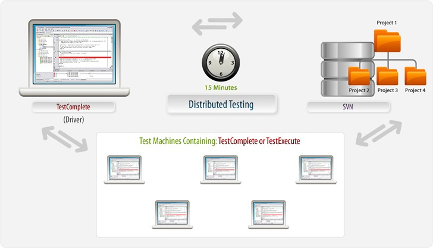
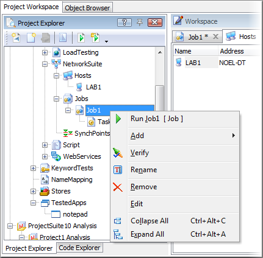

### Distributed Testing

#### Objectives
>
> This chapter looks at TestComplete Distributed Testing features and
> illustrates how you can use this feature to leverage multiple machines
> during test execution. You'll learn how to create projects for use in
> distributed testing and how to make them available to remote machines.
> You\'ll also explore some of the issues with executing and
> synchronizing tests on multiple computers.

About the Network Suite
-----------------------

> Distributed tests are executed using the Project Explorer. To enable
> Distributed Testing within a project it is necessary to add the
> **Network Suite** Project Item. The Network Suite contains sub-nodes
> allowing you to configure which tests will execute and on which
> machines. The machine running the Distributed Test functions as a
> heads-up display, allowing you to monitor the status of the machines
> participating in the test.
>
> All of the machines participating in a Distributed Test must be using
> the same version of TestComplete.

#### Single Machine Test Execution

> To get a better understanding of how Distributed Testing works let\'s
> first take a look at how a single project works on one machine. In the
> illustration below we can see a single machine connected to a source
> code repository running a project where tests are executed locally.

> **Figure 189 \--Single Project Executing on a Single CPU**
>
> In this setup the machine running TestComplete (or TestExecute) pulls
> the project source files from the repository and executes the test.
> Because the tests run synchronously, the total runtime is one hour.

#### Multiple Machine Test Execution

> Now, let\'s look at the same test run in a Distributed Testing
> environment using the Network Suite. In the illustration below, we see
> a single driver machine running a copy of TestComplete which controls
> test execution on multiple host machines running either TestComplete
> or TestExecute. All of the machines have access to the project, which
> contains the Network Suite Project Item, from the repository. In this
> setup the total running time of the project takes only 15 minutes as
> each machine executes different tests within the project.

> **Figure 190 \--Running Parts of a Project Across Multiple Machines**
>
> In fact, this example illustrates just one scenario for Distributed
> Testing where all of the machines execute tests from a single project.
> However, tests can be executed from any project that has the Network
> Suite Project Item and do not have to be related in any significant
> way. TestComplete Distributed Testing features allow testers to tailor
> test execution to cover a wide variety of scenarios.

Setting up a Distributed Test
-----------------------------

> In this section we\'ll create a project with a simple test that we can
> execute using Distributed Testing. First, we\'ll use the recorder to
> create a basic test then modify the Project to add support for
> Distributed Testing.
>
> Our focus here is creating and configuring a Distributed Test,
> therefore we\'re going to record a very simplistic test for
> illustration purposes only.

#### Recording a Simple Test Case

54. Select **File \| New \| Project\...** and click the **OK** button on
    the Create Project dialog.

55. Right click the **TestedApps** node and select **Add \| New
    Item\...** Using the Add Tested Application dialog select
    \"C:\\Windows\\System32\\Notepad.exe\".

> **Figure 191 \--Adding a TestedApp**

56. Double click the **TestedApps** node to open the editor in the
    Workspace.

57. Change the File Path for \"Notepad\" to %SystemRoot%\\System32\\
    using an environment variable to ensure the test will work on any
    Windows machine.

> **Figure 192 \--Change the File Path to use an Environm ent Variable**

58. Click the Record button on the recording toolbar.

59. Using the TestedApps drop down button start \"Notepad\".

> **Figure 193 \--Running Notepad**

60. In the Notepad main window type \"this is a test\".

61. On the Notepad main window select **File \| Exit** and click the
    **No** button on the confirmation dialog.

#### Configuring the Project for Distributed Testing

> We now have a test that will execute on any remote machine so let\'s
> add the **Network Suite** Project Item and configure our test to run
> on a remote system.

1.  Right click the Project node in the Project Explorer and select
    **Add \|New Item\...** from the context menu.

2.  In the Create Project Item dialog select **NetworkSuite**.

> **Figure 194 \--Creating the Network Suite Project Item**
>
> This adds the following nodes to our Project:

> **Figure 195 --Network Suite nodes**
>
> Now we can begin to add Hosts and Jobs to our Network Suite to
> construct a Distributed Test.

#### Working With Hosts

##### Adding Hosts

> Under the **NetworkSuite**, **Hosts** are machines that will execute
> as part of a Distributed Test. From the **Project Explorer** you can
> double click the **Hosts** node to view the Hosts editor window in the
> Workspace and all of the hosts configured for the Distributed Test
> will appear in the list.
>
> To add a Host to the NetworkSuite:

1.  Right click the Hosts node and select **Add \| New Item\...** from
    the context menu. On the Create Project Item dialog specify \"LAB1\"
    for the Name field and click the **OK** button.

> **Figure 196 \-- Adding a Host**

2.  In the Hosts Editor, set the **Address** column to the IP address or
    use the ellipsis to choose the machine by network name.

3.  Under the **Base Path** column assign a path relative to the Host
    machine (we\'re using \"C:

> \\Temp\" in this case).

4.  Under the **Source Path** column assign the file path to the
    Project\'s .MDS file.

> **Figure 197 \--Setting the IP address, Base Path and Source Path**

##### Hosts Editor Columns

> The Hosts Editor has the following columns:

  |**Column**       |**Description**|
  |---|---|
  |**Name**         |The name used to refer to the host from scripts, keyword tests and from the task properties|
  |**Address**      |The network name or IP address of the computer that the new host is mapped to|
  |**Login Mode**   |The Manual option requires the remote machine to be logged into before running the test. The Automatic RDB Session connects to the remote computer using Remote Desktop and leaves the computer locked and unavailable to users. The Automatic RDB Session connects to the remote computer using Remote Desktop but moves the session to the remote computer\'s console, leaving the computer unlocked and available for use|
  |**Domain**       |Specifies the domain to which the user specified in the User name column belongs|
  |**User name**    |Specifies the account used to open a user session on the slave computer automatically when verifying or running the network suite|
  |**Password**     |Specifies the password used to open a user session on the slave computer automatically when verifying or running the network suite. If the parameter is skipped, TestComplete will use an empty string|
  |**Base path**     |Specifies the common path for several projects, which are located on the computer specified by the Address property. TestComplete uses this value to prefix paths specified by a task's Path property|
  |**Source path**   |Specifies the path to the folder (located on the master computer) holding the slave project that can be copied from the master computer to the host computer. The path should be relative to the master computer|

> There are several other useful items available from the context menu
> on the Hosts Editor including

> **Figure 198 \--Hosts Editor Context Menu**

##### Verifying the Host Connection

> Due to the fact that remote machines may not be configured properly,
> TestComplete provides an option to verify the connection to a Host
> machine. You can use the context menu **Verify** option from the
> **Host Editor** as well as the **Project Explorer** context menu on
> the **Hosts** node.

> **Figure 199 \--Verifying a Host connection**
>
> Refer to TestComplete online help for Firewall configuration details.

##### Copying the Project to the Host

> Now that we\'ve verified the connection and setup our project we can
> copy it to the host machine to prepare for execution. Once we finish
> configuring our test we may want to perform this step again to ensure
> all of our updates are on the Host machine. In practice, tests should
> be stored in a source control repository and loaded onto the host
> machines from there.
>
> 1\. Right click the \"LAB1\" host entry in the Hosts Editor window and
> select **Copy Project to Slave** from the context menu.

> **Figure 200 \--Copying the project to the Host (Slave) m achine**

##### Other Remote Tasks

> Also, be aware that you can restart the remote computer by
> right-clicking and choosing
>
> **Reboot** from the context menu.

> **Figure 201 \--Rebooting the Rem ote Machine**
>
> The **Run State** tab of the NetworkSuite editor displays information
> about the network suite, job or task execution. The **Remote Desktop**
> column actually shows you the window of the slave/host computer as it
> runs. The window displays in the resolution of the master computer.

#### Tasks Editor Window

> The columns in the Tasks Editor are as follows:

  |**Column**   |**Description**|
  |---|---|
  |**Active**  | Specifies whether the task will be run when the job, to which it belongs, runs|
  | **Name**                          | The name that is used to refer to the task in tests|
  | **Host**                          | The name of a computer where the project will be run|
  | **Path**                          | The path to the TestComplete project or project suite which the task will run|
  | **Test**                          | Specifies the test item to be executed by the task. There is a specific syntax for this string which is documented in TestComplete online help|
  | **Tag**                           | Specifies an arbitrary string associated with the given task|
  | **Action after run**              | Specifies what TestComplete will do after it finishes executing the task on the Host computer. Available options in the drop-down list are: \[None\] - Do nothing (do not close TestComplete or TestExecute either). Use this value in combination with the Use value for the Use previous instance option in order to reduce the workload of the remote computer. In this case, after finishing the task the TestComplete (TestExecute) instance on the remote host will not be closed and it will be used for running the next task. > \[Close\] - Close the TestComplete (TestExecute). Default value. \[Shut Down\] - Shut down the Host computer. \[Reboot\] - Reboot the Host computer|
  | **Copy remote log**               | Specifies whether and in which cases TestComplete should copy the remote log of the task execution to the master computer. This property is only meaningful if the project specified by the Path property is located on a computer other than the master computer. Available options in the drop-down list are:\[Always\] - TestComplete copies the results to the master computer at the end of the task execution. Copying results increases the task execution time and uses some disk space,but you can review the results at any time, even if the remote computer is not available. Copied results are kept on your computer until you delete them. \[When status is not OK\] - TestComplete copies the results to the master computer only if the log on the task execution includes errors and/or warnings. \[Do not copy\] - The task results remain on the remote computer. To view them, you must have access to the results folder. Storing results on the remote computer saves disk space on your computer, but you may not be able to view them, since the remote computer can be offline or the results folder may be inaccessible|
  | **Use previous instance**         | Specifies whether TestComplete will close the remote TestComplete (or TestExecute) process before executing the task. Available options in the drop-down list are: \[Use\] - Use the running instance of the remote TestComplete (TestExecute). Use this value in combination with the None value for the Action after run option in order to reduce the workload of the remote computer. In this case, after finishing the task, the TestComplete (TestExecute) instance on the remote host will not be closed and it will be used for running the next task. \[Show Error\] - Display the error message. Default value. \[Terminate\] - Reboot the remote TestComplete (TestExecute) process. Use this value to ensure that the task will not fail if previous tasks or test runs caused critical errors in the remote TestComplete (TestExecute) instance|
  | **Remote application**            | Specifies what testing application, TestComplete or TestExecute, will be used on the remote workstation|

#### Synchronizing Computers

> A **SynchPoint** delays execution of a test until all computers with
> that SynchPoint reach the synchronization point. When all the
> computers with a named SynchPoint hit that Synchronize Point, they
> will continue on with their test. An example of an effective use for
> SynchPoints: you want to avoid where two or more users try to edit the
> same record at the same time and post the data.

> **Figure 202 \--SyncPoints**

##### Using SynchPoints in Script

> To use a SynchPoint, the **NetworkSuite.Synchronize()** method,
> passing the name of the SynchPoint (\"WaitForMe\" in the example).
>
> **NetworkSuite**.Synchronize(\"WaitForMe\");
> **NetworkSuite**.Synchronize(\"WaitForMe\")

Executing Distributed Tests
---------------------------

> There are several options for executing Distributed Tests including
> manually in the Project Explorer, from Keyword Tests and from Script.

#### Manual Execution

> The easiest option is to use the context menu from the Project
> Explorer. You can execute either individual Jobs or specific Tasks
> within a job directly from the context menus.

#### Script Execution

> To run from Script, use the **NetworkSuite** object to access Jobs,
> then use the **ItemByName()** method to get at a specific job. From
> there, call the job\'s **Run()** method. Running tasks uses a similar
> pattern, except that from the job we drill down one more level to the
> **Tasks** and then to the specific task, again using the
> **ItemByName()** method before calling **Run()**.
>
> **NetworkSuite**.Jobs.ItemByName(\"Job1\").Run(**true**);
> **NetworkSuite**.Jobs.ItemByName(\"Job1\").Tasks.ItemByName(\"Task1\").Run(**true**);
>
> **NetworkSuite**.Jobs.ItemByName(\"Job1\").Run(**true**)
> **NetworkSuite**.Jobs.ItemByName(\"Job1\").Tasks.ItemByName(\"Task1\").Run(**true**)

#### Runtime Behavior

> TestComplete uses Windows Remote Desktop to display the remote
> computer as the test runs. You will need to configure your remote
> computer to accept Remote Desktop connections for the distributed test
> to work. See the documentation for your operating system for more
> information on accepting Remote Desktop connections.

> **Figure 203 \--A Running Distributed Test**

Lab: Simple Distributed Test
----------------------------

#### Configure The Project

1.  Create a master project with a NetworkSuite Project Item.

2.  Create a hosted (slave) project with a **NetworkSuite** Project
    Item.

> **Figure 204 \--Verifying the Host**

3.  Add \"Notepad.exe\" to the **TestedApps** project Item of the hosted
    project.

4.  Modify the **File Path** property of the TestedApp to **\"\"**
    (blank).

#### Record a Test

1.  Create (or record) a Keyword Test to type something into notepad.
    For example:

2.  Save the project.

> **Figure 205 \--Testing Notepad**

#### Create the Distributed Test

1.  Select the **NetworkSuite** Project Item in the Master Project and
    enter the path to the project suite in the **Shared Path**.

2.  Expand the **Hosts** Project Item and select \"Host1\"

3.  Enter the name (or IP address) of the hosting (slave) computer.

4.  In the **Base** path property enter \"\\\\\<Master Computer
    Name\>\\\<Name of Project Suite directory\>\"

5.  Right-click on \"Host1\" and select **Verify** from the context
    menu.

6.  Expand the **Jobs** Project Item.

7.  Expand the \"Job1\" Project Item.

8.  Select the \"Task1\" Project Item.

9.  In the **Path** property enter \"\\\<Name of Hosted
    Project\>\\\<Name of Hosted Project\>. mds\".

10. In the **Copy remote log** property select \"\[Always\]\". 11.In the
    **Use previous instance** property select \"\[Use\]\".

<!-- -->

12. In the **Test** property enter the path to your test on the hosted
    machine. If you\'re running a Keyword Test then the path might be
    similar to \"\<Name of Hosted
    Project\>\\KeywordTests\\Test1\\Test1\". If running a Script then
    the path would look something like this path: \"\<Name of Hosted
    Project\>\\Script\\Unit1\\Test1\".

13. Right-click \"Task1\" and select **Verify** from the context menu.

14. Right-click the **NetworkSuite** project item and select **Run**
    from the context menu.

Lab: Synchronizing Computers
----------------------------

> There are times when you want to have one computer wait for another
> computer to complete at least part of its task before finishing the
> first computer\'s task. For example, you want the consumer\'s computer
> to wait until the bank\'s computer has processed a debit before the
> consumer\'s computer checks its balance. We will show a couple of ways
> to synchronize.

#### Using SyncPoints

1.  Modify the test in hosted (slave) project.

> **var** p1
>
> **var** w1 TestedApps.notepad.Run();
>
> p1 = Sys.Process(\"notepad\");
>
> w1 = p1.Window(\"Notepad\", \"\*\").Window(\"Edit\"); w1.HScroll.Pos =
> 0;
>
> w1.VScroll.Pos = 0;
>
> w1.Click(135, 29);
>
> w1 = p1.Window(\"Notepad\", \"\*\");
> w1.Window(\"Edit\").Keys(NetworkSuite.Variables.Var1);
> w1.Window(\"Edit\").Keys(\"\[Enter\]\");
> NetworkSuite.Synchronize(\"SynchPoint1\");
>
> w1.Close();
>
> p1.Window(\"\#32770\", \"Notepad\").Window(\"Button\",
> \"&No\").ClickButton();
>
> var p1 var w1
>
> TestedApps.notepad.Run();
>
> p1 = Sys.Process(\"notepad\");
>
> w1 = p1.Window(\"Notepad\", \"\*\").Window(\"Edit\"); w1.HScroll.Pos =
> 0;
>
> w1.VScroll.Pos = 0;
>
> w1.Click(135, 29);
>
> w1 = p1.Window(\"Notepad\", \"\*\");
> w1.Window(\"Edit\").Keys(NetworkSuite.Variables.Var1);
> w1.Window(\"Edit\").Keys(\"\[Enter\]\");
> NetworkSuite.Synchronize(\"SynchPoint1\");
>
> w1.**Close**();
>
> p1.Window(\"\#32770\", \"Notepad\").Window(\"Button\",
> \"&No\").ClickButton();

2.  Right-click the **SynchPoints** Project Item, select **Add \| New
    Item\...** from the context menu.

3.  Hit **Enter** on the Create Project Item dialog.

4.  Create a script in the master project.

> NetworkSuite.Variables.Var1 = \"TestComplete\";
> NetworkSuite.Run(**false**); NetworkSuite.WaitForState(ns\_Running);
> Delay(30000);
>
> NetworkSuite.Variables.Var1 = \"Rocks\";
> NetworkSuite.Synchronize(\"SynchPoint1\");
> NetworkSuite.WaitForState(ns\_Idle);
>
> **NetworkSuite**.Variables.Var1 = \"TestComplete\";
> **NetworkSuite**.Run(false);
> **NetworkSuite**.WaitForState(ns\_Running); Delay(30000);
>
> **NetworkSuite**.Variables.Var1 = \"Rocks\";
> **NetworkSuite**.Synchronize(\"SynchPoint1\");
> **NetworkSuite**.WaitForState(ns\_Idle);

5.  Right-click the **SynchPoints** Project Item, select **Add \| New
    Item\...** from the context menu.

6.  Hit **Enter** on the Create Project Item dialog.

7.  Right-Click in the newly created script and select **Run Current
    Routine** from the context menu.

8.  Observe that on the hosted computer, \"TestComplete\" will be typed,
    followed by a delay and then on a new line \"Rocks\" will be typed.

#### Using NetworkSuite Variables

> NetworkSuite variables allow TestComplete to send data from one
> computer to another.

1.  Modify the test in hosted (slave) project.

> **var** p1
>
> **var** w1 TestedApps.notepad.Run();
>
> p1 = Sys.Process(\"notepad\");
>
> w1 = p1.Window(\"Notepad\", \"\*\").Window(\"Edit\"); w1.HScroll.Pos =
> 0;
>
> w1.VScroll.Pos = 0;
>
> w1.Click(135, 29);
>
> w1 = p1.Window(\"Notepad\", \"\*\");
> w1.Window(\"Edit\").Keys(NetworkSuite.Variables.Var1);
> w1.Window(\"Edit\").Keys(\"\[Enter\]\"); NetworkSuite.Variables.Var2 =
> **true**; NetworkSuite.WaitForNetVarChange(\"Var2\",**false**);
> w1.Window(\"Edit\").Keys(NetworkSuite.Variables.Var1); w1.Close();
>
> p1.Window(\"\#32770\", \"Notepad\").Window(\"Button\",
> \"&No\").ClickButton();
>
> **Dim** p1
>
> **Dim** w1 TestedApps.notepad.Run
>
> **Set** p1 = Sys.Process(\"notepad\")
>
> **Set** w1 = p1.Window(\"Notepad\", \"\*\").Window(\"Edit\")
> w1.HScroll.Pos = 0
>
> w1.VScroll.Pos = 0
>
> **Call** w1.Click(135, 29)
>
> **Set** w1 = p1.Window(\"Notepad\", \"\*\")
>
> **Call** w1.Window(\"Edit\").Keys(NetworkSuite.Variables.Var1)
> **Call** w1.Window(\"Edit\").Keys(\"\[Enter\]\")
> NetworkSuite.Variables.Var2 = True
>
> **Call** NetworkSuite.WaitForNetVarChange(\"Var2\",false)
>
> **Call** w1.Window(\"Edit\").Keys(NetworkSuite.Variables.Var1)
> w1.**Close**
>
> p1.Window(\"\#32770\", \"Notepad\").Window(\"Button\",
> \"&No\").ClickButton

2.  Create a script in the master project.

> NetworkSuite.Variables.Var1 = \"TestComplete\";
> NetworkSuite.Run(**false**);
> NetworkSuite.WaitForNetVarChange(\"Var2\",**true**);
> NetworkSuite.Variables.Var1 = \"Rocks\"; NetworkSuite.Variables.Var2 =
> **false**; NetworkSuite.WaitForState(ns\_Idle);
>
> NetworkSuite.Variables.Var1 = \"TestComplete\" NetworkSuite.Run(false)
>
> **Call** NetworkSuite.WaitForNetVarChange(\"Var2\",true)
> NetworkSuite.Variables.Var1 = \"Rocks\" NetworkSuite.Variables.Var2 =
> False NetworkSuite.WaitForState(ns\_Idle)

3.  Add the variable \"Var2\" to the master project in the
    **NetworkSuite** project item.

4.  Right-click in the newly created script and select **Run Current
    Routine** from the context menu.

> The hosted computer will do the same things as the SynchPoint demo,
> but with less delay in the project. Notice that the hosted computer
> can pass data back to the master computer.

Summary
-------

> In this chapter, we looked at how TestComplete can distribute testing
> to remote machines. We looked at the structure of distributed tests
> and discussed why they can be beneficial.
>
> We also recorded a simple test and examined the necessary steps to
> execute the test in a distributed environment.