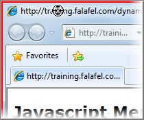
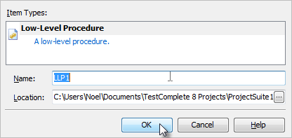
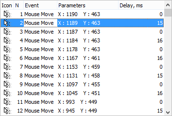

### Low Level Procedures

Objectives
----------

> This chapter explains TestComplete Low Level Procedure functionality
> and how it can be leveraged to deal with situations where they may be
> no easy alternative. You'll learn how to record, edit and execute Low
> Level Procedures. Along the way you will learn how Low-Level
> Procedures differ from standard test recordings, when to use a
> Low-Level Procedure and the difference between Window and Screen Low
> Level Procedures.

About Low Level Procedures
--------------------------

> Low Level Procedures are an alternative recording type provided by
> TestComplete where actual mouse and keyboard events are recorded. Low
> Level Procedures differ dramatically from standard recordings where
> TestComplete records higher level actions against specific onscreen
> objects.

#### Low Level Procedure Types

> There are two kinds of Low Level Procedures:
>
> **Screen Coordinates** \-- Captures events relative to the entire
> screen where the top left-hand corner of the screen is 0,0.
>
> **Window Coordinates** \-- Captures events relative to a user selected
> Window where the top left-hand corner of the window is 0,0.
>
> Window Coordinate Low Level Procedures tend to be more reliable as
> they are unaffected by the location of the selected window and will
> playback relative to the Window\'s current screen location.

#### When To Use Low Level Procedures

> From the outset, tests that rely on screen coordinates generally are a
> bad idea and usually that holds true regardless of which tool you're
> using. However, in certain situations you may find yourself attempting
> to record a scenario that simply refuses to playback properly due to
> the complexity of capturing a user\'s intent via a recorder. In these
> cases, resorting to Low Level Procedures can, at the very least, serve
> as a stop-gap until alternative solutions can be developed.
>
> Additionally, you can work on applications using third party controls
> not directly supported by TestComplete and that provide no visibility
> into the client region of the control such as a custom grid.

Recording Low Level Procedures
------------------------------

> In the \"Web Testing\" chapter we looked at a Web application that
> used JavaScript to dynamically display menu items on screen. The
> application poses an interesting challenge for GUI recorders that tend
> to capture interactions with controls such as clicks and keystrokes.
> Let\'s take a look at recording a Low-Level Window Coordinates
> Procedure to handle the menu selection and understand this alternative
> approach to recording.

#### Low Level Window Coordinates Procedure

67. For starters we\'ll launch Internet Explorer and browse to the
    Orders application located here:

> [http:*//training.falafel.com/dynamiccontent*](http://training.falafel.com/dynamiccontent)

68. Select **File \| New \| Project\...** and on the **Create Project**
    dialog click the **OK** button.

69. Start recording a new test. From the Recorder toolbar, drop down the
    Low-Level Procedure button and select the **Record Low-Level
    Procedure (window coordinates)** option.

> **Figure 222 \--Recording a Low-Level Procedure**

70. A red selection rectangle will appear. Move the rectangle onto
    Internet Explorer and click the left mouse button to select it.

> **Figure 223 \--Selecting IE**

71. On the **Create Project Item** dialog click **OK** to add the
    **Low-Level Procedures Collection** item to the project.

> **Figure 224 \--Adding the Low-Level Procedures Collection**

72. On the **Create Project Item** dialog click **OK** to add a
    Low-Level Procedure to the project.

> **Figure 225 \--Adding a Low Level Procedure**

73. Select the **Add \| New \| Customer \| Orders** menu item on the web
    page.

> **Figure 226 \--Selecting from a Dynamic Menu**

74. Click the **Stop** button on the recording toolbar.

#### Examining the Recording

> At the completion of the recording you can see that a \"LLCollection\"
> has been added in the Project Explorer. Inside the collection will be
> the Low-Level Procedure you recorded.

> **Figure 227 \--The Low Level Procedure Collection**
>
> Next, look at the **Low Level Procedure Editor** and the events
> captured by the Low Level Procedure. Double click the **Advanced \|
> LLCollection1 \| LLP1** node from the **Project Explorer**.

> **Figure 228 \--Low Level Procedure Editor**
>
> The columns in the Low-level Procedure Editor are:

  |**Column**   |**Value**|
  |---|---|
  |**Icon**     |Indicator of the type of event performed|
  |**N**        |Ordinal value of this event in the list|
  |**Event**    |Type of action to be performed|
  |**Parameters**   |Data specific to the specified event|
  |**Delay, ms**    |Delay in milliseconds between events|

> From the Low-level Procedure Editor window, you can add, edit and
> delete events from the list using the right click context menu.

> **Figure 229 \--The Editor Window Context Menu**
>
> The Edit Event dialog provides options to customize all facets of the
> captured event.

> **Figure 230 \-- The Edit Event Dialog**

Calling Low Level Procedures from Script
----------------------------------------

> To run a Low Level Procedure from a Keyword Test, first specify the
> collection followed by a period \".\", then the name of the low level
> procedure, another period \".\" and finally the **Execute()** method.
> If you want the low-level procedure to execute in relation to a
> particular window, pass the window as a parameter to the Execute
> method. Also notice in the example below that before executing the
> low-level procedure, you want to make sure that the window is
> activated and brought to the front.
>
> **var** iexplore = Aliases.iexplore.IEFrame; iexplore.Activate();
> LLCollection1.LLP1.Execute(iexplore);
>
> **Dim** iexplore = Aliases.iexplore.IEFrame iexplore.Activate()
> LLCollection1.LLP1.Execute(iexplore)

Summary
-------

> In this chapter, we looked at TestComplete Low Level Procedure
> capabilities and: Explained how this recording type differs from a
> standard object-based recording Recorded a scenario which otherwise
> requires special handling
>
> Examined the Low-Level Procedure Editor