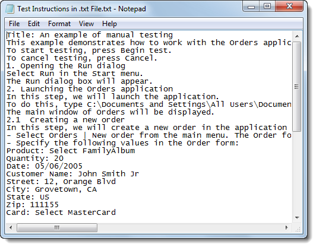

### Manual Testing

Objectives
----------

> This chapter looks at TestComplete support for Manual Testing
> including how to create, edit and execute Manual Tests. You\'ll learn
> about the upgrade path from manual to automatic tests using the
> TestComplete import and export features. You\'ll also learn how to use
> events within a manual test to allow interaction between manual and
> automated tests.

About Manual Testing
--------------------

> If you've worked in any sort of Quality Assurance capacity you\'ll
> likely be intimately familiar with manual testing and perhaps more so
> than you might like. Manual testing while extremely valuable can be
> difficult for humans to perform consistently over long periods of time
> because of human nature itself. Manual testing generally takes a great
> deal of concentration and dedicated effort to consistently produce
> results. TestComplete provides an alternative to what could be
> considered the more classical approach of using Microsoft Word or
> Excel. TestComplete support for manual testing allows the test
> developer to guide the tester through a series of steps, capture data
> as the test is being performed and automatically log the results of
> the test. The benefits of manual testing through TestComplete are:
>
> The assurance that the required steps are followed Generation of a log
> file for every test execution Verification of the results based on
> Test Log contents Ability to interact with a manual test using Events
>
> Below is an example of the TestComplete manual test user interface:

> **Figure 206 \--The TestComplete Manual Testing User Interface**

Creating Manual Tests
---------------------

> In this topic we\'ll walk through the process of creating a Manual
> Test in TestComplete.

62. Select **File \| New \| New Project\...** and click **OK** on the
    **Create New Project** dialog.

63. Right click the **Project** node in the **Project Explorer,** select
    **Add \| New Item\...** and choose **Manual Tests**.

> **Figure 207 \-- Creating the Manual Tests Project Item**

64. Click **OK** on the **Create Project Item** dialog.

65. Right click the **ManualTests** node in the Project Explorer and
    select **Add \| New Item\...**

> to create a new Manual Test.

66. On the **Create Project Item** dialog enter \"CreateOrder\" as the
    name of the manual test and click **OK** to open the Manual Test
    Editor.

> **Figure 208 \--Creating the Manual Test Item**

#### Manual Test Editor

> The TestComplete Manual Test Editor allows for the creation of a
> multi-step test that prompts the user through a series of
> instructions, collecting results with every step.

> **Figure 209 \--Manual Test Editor**

#### Manual Test Editor Controls

  |**Field**               |**Description**|
  |---|---|
  |**Test Steps**          |Tree of the steps contained within this test, used for navigation while editing|
  |**Test Caption**        |Window caption of the Manual Test dialog|
  |**ID**                  |Step ID for use within Manual Test events|
  |**Test Description**    |Sub caption of the Manual Test dialog|
  |**Test Instructions**   |Free-form HTML markup for communicating the actual actions to be performed during the test. Appears in the main portion of the Manual Test dialog|
  |**Test notes and comments**   |Notes for the test writer that are not displayed when the test is executed|

#### Editing the Test Description

> By default, the **Manual Test Editor** opens with only the initial
> node created so we\'ll need to add steps to fill out the test. To
> create a Manual Test description:

1.  Click the **Test Caption** field and enter \"Create Order Manual
    Test\".

2.  Edit the **Test Description** field and set the text to \"In this
    test we will create a new customer order and validate a new record
    is created.\"

3.  Edit the **Test Instructions** field and set the test to \"Using the
    Orders sample application we will add a new order and verify the
    data appears in the list of customer orders.\" The result should
    look like the following:

> **Figure 210 \--The Manual Test Editor with Test Description**

#### Adding Steps

> Once the description is completed we can start adding steps to the
> test as follows:

1.  Click the green (+) sign or right click in the Test Steps area and
    select **New Step** from the context menu.

> **Figure 211 \--Adding a new step to the Manual Test**

2.  Fill out the Step **Caption**, **Description** and **Instructions**
    for this step of our Manual Test. The actual information can be
    arbitrary or you can use the screenshot below to guide you.

> **Figure 212 \--Completed Manual Test**

3.  Add one more manual step and fill out the Step **Caption**,
    **Description** and **Instructions**

> for this step

#### Running Manual Tests

> Manual Tests are run from Script using the name of the test followed
> by the **Start()** method. The manual test object also comes with
> **Suspend()** and **Resume()** methods that can be used in event
> handlers.
>
> ManualTest1.Start(); ManualTest1.Start()

Manual Test Interaction With Automated Tests
--------------------------------------------

> In this topic we\'ll illustrate how manual tests interact with
> automated tests. You can call a manual test from a Keyword Test or
> Script. The reverse is also true. You an call Keyword Tests or Script
> from your manual test.
>
> You might be thinking \"Why would I do this?\" which is a fair
> question. The interesting thing about Manual Tests in TestComplete is
> that you can augment a test by performing actions automatically for
> the user and by incorporating a Manual Test into a Keyword Test or
> Script you can execute any actions necessary to ease the testing
> process such as setup test data, create/delete files, launch
> applications etc. You can also replace parts of your manual test
> incrementally as circumstances dictate, allowing you to move over to
> automated testing in a controlled manner.

Exporting a Manual Test
-----------------------

> Once you\'ve created a manual test you\'re given two options to export
> the test content using the context menu to either Microsoft Word or
> HTML:

> **Figure 213 \--Exporting Manual Tests**
>
> TestComplete provides an option to customize the Microsoft Word export
> template on the Properties tab at the bottom of the editor window. The
> export functionality works in a mail merge like fashion and allows you
> to create a Microsoft Word document containing the contents of the
> test.

> **Figure 214 \--Manual Test Editor Properties tab**
>
> You can optionally, define your own Microsoft Word template for use
> with the TestComplete export feature. TestComplete includes a default
> template that looks like this:

> **Figure 215 \--TestCompleteDefault Microsoft Word Template**

Importing a Manual Test
-----------------------

> The ability to migrate existing legacy manual tests can be a huge time
> saver. TestComplete lets you import manual tests stored in text files,
> Microsoft Word or Microsoft Excel files. TestComplete can handle
> several format arrangements:
>
> One level or multilevel, bulleted or numbered lists. Numbered lists
> can use any number style and formatting for levels.
>
> Test steps using different indents for steps of different levels.
> Tables used to organize the step hierarchy.
>
> Keywords to separate the step caption, description, instructions and
> notes.
>
> TestComplete ships with a set of sample files that can be imported.
> Each file demonstrates a particular format, e.g. text, Excel, Word
> document with headers, etc. The closer your files are to the example
> formats, the less editing you will need to perform in the Manual Tests
> editor. See the online help for complete details on supported formats.
>
> You can find example files to import at:
>
> \\TestComplete Samples\\Manual Testing\\Recommended Formats for Manual
> Test Instructions

#### Simple Text File Import

> If you open the document titled \"Test Instructions in .txt file.txt\"
> you will see steps for testing the Orders application that use numbers
> to indicate each step.

> **Figure 216 \--Sample Text File**
>
> If you open the document titled \"Test Instructions in .doc file
> (using headings).doc" you will see steps for testing the Orders
> application that uses the \"Heading1\" style to indicate a new step.

> **Figure 217 \--Sample Import Document**
>
> Test steps can even be arranged in a hierarchy by using styles, i.e.
> \"Heading1\", \"Heading2\", where \"Heading2\" represents the set of
> steps indented from \"Heading1\".
>
> See the TestComplete online help topic \"Importing Manual Tests\" for
> detailed formatting information for each document type.

#### Lab

> Let\'s walk through importing one of the sample documents.

1.  From the TestComplete **File** menu choose **Import \| Test\...**

> **Figure 218 \-- Selecting the Im port Test Option**

2.  In the **Import Test Options** page of the wizard, enter the **Test
    Name** as \"OrdersTest\". Click the ellipses of the **Source File
    Name** and locate the \"Test Instructions in .doc file (using
    headings).doc\" file in the path indicated at the top of this topic.
    Click the **Next** button to continue.

> **Figure 219 \-- Import Test Options**

3.  The wizard will take a moment to process the file and then present a
    summary. Click the

> **Finish** button to close the wizard.

> **Figure 220 \--Import Summary**

4.  The imported manual test will show under the ManualTests node in the
    Project Explorer, and all steps described in the document will be
    included in the ManualTests editor.

> **Figure 221 \--The Im ported Manual Test**

Legacy Migration
----------------

> The ability to import legacy manual test steps stored in external
> files coupled with TestComplete tools for converting Manual Test to
> fully automated Keyword Tests comprises a complete migration path.
> This path takes you from the labor-intensive, error prone and
> inconsistent to a wholly automated system that can be run reliably on
> a schedule.

Summary
-------

> In this chapter, we explored TestComplete Manual Testing features and
> discussed the advantages of developing manual tests using
> TestComplete. We learned to:
>
> Create, edit and execute Manual Tests. Call Manual Tests.
>
> Use Events within a Manual Test. Import and Export Manual Tests.