### Mobile

####  Objectives
>
> Does the mobile application you\'re testing show up in a browser on
> the device? Perhaps you\'re working with a native Android application
> but you don\'t have access to the source code. Maybe the native
> Android application is developed in-house. TestComplete provides
> testing mechanisms that make the best use for each approach. This
> chapter shows how TestComplete handles mobile web applications that
> may have multiple layouts based on screen dimension, \"black-box\"
> native Android applications where you don\'t have access to the
> application\'s internals and \"white-box\" native Android applications
> that are open to inspection.

#### Mobile Testing Strategies
>
> Here are some questions that can help determine which TestComplete
> feature will work best for your needs:
>
> Do you need to test a mobile site on a wide variety of devices,
> regardless of manufacturer and operating system, for example, iPhone,
> Android, Blackberry, Windows and so on?
>
> Do you need to test a mobile site that uses responsive design, that
> is, where the page layout changes based on device characteristics and
> dimensions?
>
> Do you need access to a device\'s GPS or hardware sensors? Do you need
> access to the internal objects of an application? Are you testing
> Xamarin applications?
>
> The Mobile Web testing option covers the greatest number of devices. In mobile web testing, TestComplete
> virtual browsers can be configured to any set of device
> characteristics and dimensions. This option is relatively easy to set
> up, leverages your existing knowledge of testing web applications and
> doesn\'t require that you have the actual physical devices. This
> option is also very good at testing sites that make heavy use of
> responsive design. The drawback is that you will not have access to
> the devices internal objects or hardware.
>
> Within the Android category, there are two approaches for native Java applications that you can use separately or
> mix-and-match. If you don\'t have access to the application\'s source
> code, you can perform black-box testing using Image Based
> Testing. TestComplete has a powerful mechanism that recognizes images on the screen and allows you
> to work with that area of the screen programmatically and through
> keyword tests. If you have access to an Android application\'s source
> code, you can perform white-box testing by configuring the application
> as an Open Android Application. This will provide you with deep access to an Android application\'s internal
> screen objects and hardware. Android is fully supported and iOS is on
> the way.
>
#### Mobile Web
>
> Verifying that websites work on all devices, dimensions and platforms
> has become a major scalability challenge. You certainly can\'t keep a
> junkyard full of physical devices and emulator platforms usually
> require download and configuration of one or more libraries for
> support. TestComplete approach is to create *virtual browsers* that
> run with a set of characteristics and dimensions that mimic a
> particular physical device. TestComplete comes with a stock set of
> pre-configured virtual browsers that run from the test recording
> toolbar.

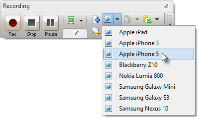

> The screenshot below shows a composite of several virtual browsers
> running the same site on iPad, iPhone 5 and Samsung Galaxy Mini.

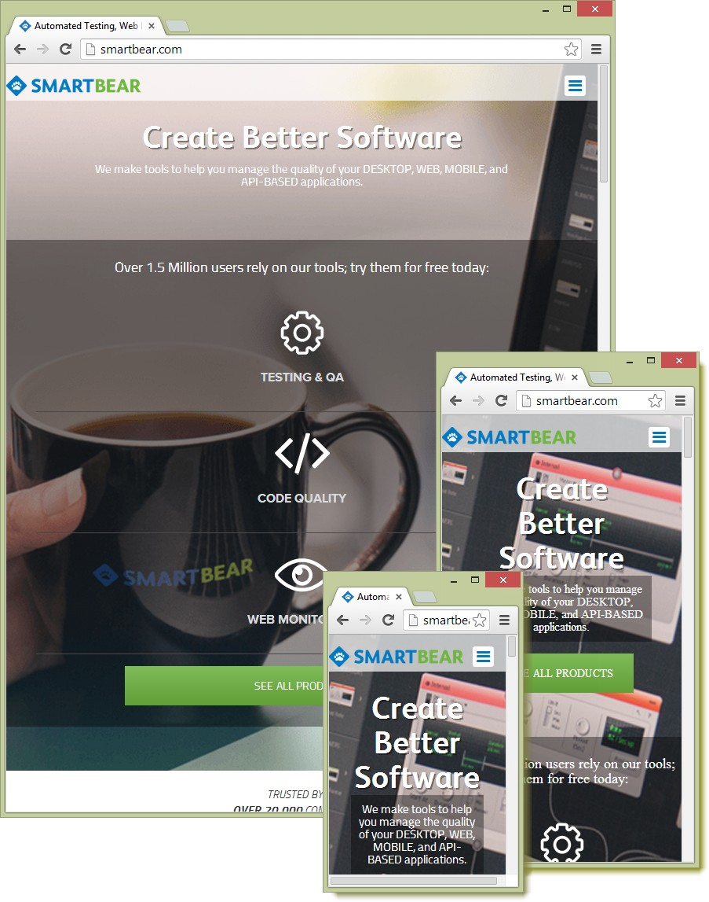

> Be aware that TestComplete uses the Chrome browser, no matter what
> browser the actual device is using. Be sure to [prepare Chrome for
> Web
> Testing](http://support.smartbear.com/viewarticle/62859/?_ga=1.49190255.819616413.1378486108)
> and also [install
> Chrome](http://support.smartbear.com/downloads/testcomplete/chrome-patches/?_ga=1.49190255.819616413.1378486108)
> [patches](http://support.smartbear.com/downloads/testcomplete/chrome-patches/?_ga=1.49190255.819616413.1378486108)
> to match the Chrome version you have.

#### Using Virtual Browsers in Script

> Virtual browsers allow you to test across mobile platforms in much the
> same way as standard [cross browser testing]{.underline}, except that
> instead of the [Browsers]{.underline} object, use the
> **VirtualBrowsers** object. The other web objects, properties and
> methods work against the virtual browser just as if you were scripting
> against a browser (which, in fact, you are). The code example below
> uses the **VirtualBrowsers Item()** method to get a reference to the
> \"Apple iPhone 5\" virtual browser. From there, all the other methods
> such as **Run()** and **Navigate()** have the same behavior as the
> same named methods from a browser object.
>
> **var** page, SeeAllProductsButton;
>
> *// get a reference to the iPhone 5 virtual browser*
>
> **var** virtualBrowser = VirtualBrowsers.Item(\"Apple iPhone 5\");
>
> *// run the browser and navigate to a web site* virtualBrowser.Run();
> virtualBrowser.Navigate(\"[http://www.smartbear.com](http://www.smartbear.com/)\",
> 5000);
>
> *// get the current Page object*
>
> page = Sys.Browser().Page(\"\*\");
>
> *// find and click an on-screen control*
>
> SeeAllProductsButton = page.NativeWebObject.Find(\"id\",
> \"mobilecta\", \"a\"); SeeAllProductsButton.Click();
>
> *// close the browse window*
>
> Sys.Browser().BrowserWindow(0).Close();

#### Defining Your Own Virtual Browsers

> As new devices become available, you can define them without waiting
> for SmartBear to update the list. You will need a *user agent string*
> and the dimensions of the device.
>
> The characteristics of the device are defined by a user agent string;
> here\'s an example of a user agent string for Apple\'s iPhone 5:
>
> Mozilla/5.0 (iPhone; CPU iPhone OS 6\_1\_4 like Mac OS X)
>
> AppleWebKit/536.26 (KHTML, like Gecko) Version/6.0 Mobile/10B350
> Safari/8536.25
>
> To learn more about user agent strings, you can Google for lists of
> user agent strings and even utilities that will return the user agent
> string for the device you\'re browsing from.
>
> The following lab will show you how to set up a new device. For this
> example, we will set up a Nokia Lumia 920 with dimensions 480 x 800.

42. From the TestComplete menu, open the **Tools** menu and select
    **Current Project Properties**.

43. In the left-hand tree-view, select **Open Applications \| Web
    Testing \| Virtual Browsers**. This step will display all of the
    current virtual browsers (see the screenshot below).

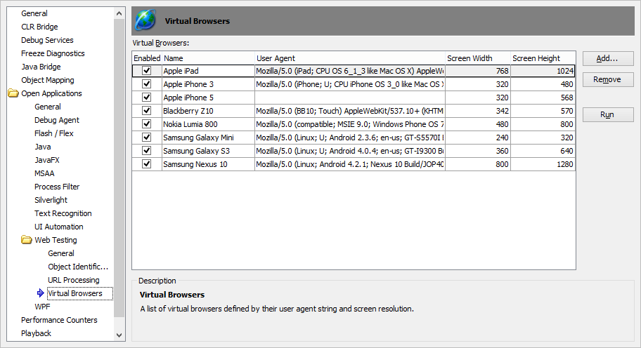

44. Click the **Add\...** button.

45. In the **Add Virtual Browser** dialog, paste the user agent string
    (see below), then click the **Next** button.

> Mozilla/5.0 (compatible; MSIE 10.0; Windows Phone 8.0; Trident/6.0;
> IEMobile/10.0; ARM; Touch; NOKIA; Lumia 920)

46. Enter the screen dimensions as 480 x 800 and click the **Next**
    button. Note that the prompt is for \"CSS pixels\". Typically, the
    browser and device screen dimensions are identical. In some cases,
    the physical device screen may have more pixels than the browser
    screen.

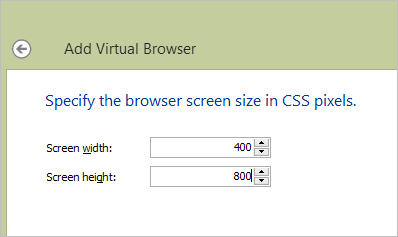

47. Enter a browser name that will show up in the **Name** column of the
    **Virtual Browsers**

> list and click the **Finish** button.

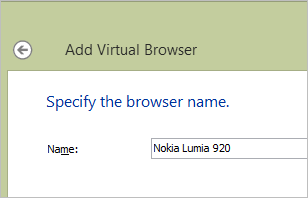

> The next time you record a test, the new entry will show in the
> drop-down list and will be available for keyword and script tests to
> use.

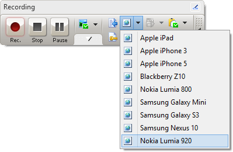

#### Android
>
> If you need greater control of an Android device than [[Mobile
> Web]{.underline}](#Mobile_Web) testing in a browser can provide,
> TestComplete has two solutions. For the best control, but requiring
> knowledge of how to program an Android application, configure an
> Open Android Application. This will open up the gates to an Android application\'s internal
> objects, sensors, GPS, operating system commands and so on. If you
> don\'t have access to the source, you can still use [[ Image Based
> Testing]{.underline}](#image-based-testing) to access on-screen
> objects using image recognition. TestComplete image recognition
> handles differences between devices, resolutions, even minor
> variations in pixels and colors.

#### The Mobile Screen

> The **Mobile Screen** is the primary tool for testing physical
> devices. It is a device emulator with mobile testing capabilities and
> an interface used to record keyword and script tests. The Mobile
> Screen allows you to interact with a variety of devices in a
> standardized UI, create mobile checkpoints, add images to \"image
> sets\", take screenshots, record multi- touch gestures and install
> Android Agent for use in \"white box\", Open Android
> Applications. The Mobile Screen can emulate devices hooked up through USB, Android SDK
> emulators and virtual machines running the Android OS (such as
> Oracle\'s VirtualBox).

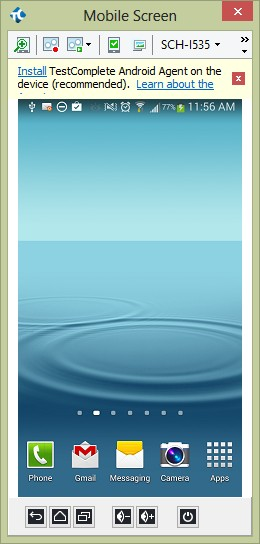

#### Note: 
>The Mobile Screen connects only to devices hooked up via USB
> cable or some emulation of USB. Wi-Fi connections are not supported.
>
> You should interact with the Mobile Screen using keyboard, mouse or
> touchpad, rather than directly with the physical device. The only
> exception is that *gestures*, input involving multiple touches, are
> performed directly on a device.
>
> To get started using the Mobile Screen, click the **Show Mobile
> Screen** button that appears on the Test Engine toolbar.

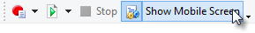

> If no device is connected, you\'ll get a warning. If there\'s only a
> single device available it will connect and run. If multiple devices
> are connected, the **Select Current Device** window displays. You can
> **Connect** to a single device or **Connect All**. The screenshot
> below shows a connected physical Samsung device (\"SCH-I535\") and an
> Android SDK emulator. After connecting, display the Mobile Screen by
> selecting a device and clicking the **OK** button.

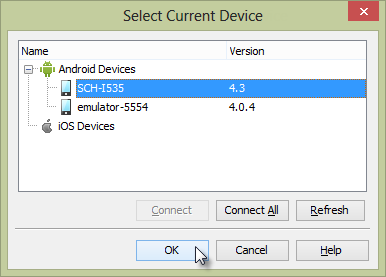

> The Mobile Screen user interface consists of a toolbar, a link to
> **Install TestComplete Agent**, the emulated screen and a footer that
> contains buttons that emulate hardware on the device. The toolbar is
> shown in the screenshot below.

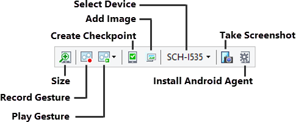

> The **Size** button gives you a slider that resizes the emulated
> device\'s screen area and a
>
> **Best Size** link to get the optimal match between the device and the
> Mobile Screen.

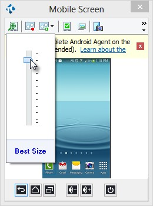

> **Record** and **Play** [[Gestures]{.underline}](#gestures) buttons
> allow you to test using complex, multiple touches on the device. See
> the Gestures topic for more on recording and playing gestures.
>
> Mobile Checkpoints allows you to take a snapshot of the device\'s screen for later comparison. This
> checkpoint option depends strictly on visual comparison.
>
> The **Add Image** button allows you to add an image to Image Sets.
>
> The **Select Device** drop down list lets you select the device that
> should show in the Mobile Screen.
>
> **Take Screenshot** records the emulated screen as a .bmp or .png
> image.
>
> Install Android Agent loads a package on the device that exchanges data with open Android
> application and retrieves data from sensors on the device.
>
> The Mobile Screen footer emulates standard hardware buttons on the
> device. From left to right, the buttons are **Back**, **Home**,
> **Menu**, **Volume Down**, **Volume Up**, and **Power**.

#### Using TestedApp to Manage Packages

> Packages contain Android application definitions in the form of .apk
> files. You can install and launch these applications in TestedApps,
> keyword tests and scripts.
>
> You can define a package in a **TestedApp** and run the TestedApp from
> the TestComplete IDE, from a Keyword Test or from script. To create a
> TestedApp representing an Android Package:

1.  In the Project Explorer, Select, the **TestedApps** node.

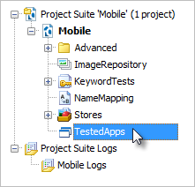

2.  In the TestedApps editor, right-click and select **Add Android
    Application\...** from the context menu.

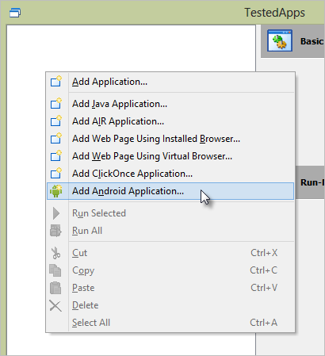

3.  Define the path for the **Android application package file**. The
    path will point to the location of the .apk file on your local PC
    where TestComplete resides or in a shared network location. Select
    the **Deploy to the device on start** checkbox then click the **OK**
    button.

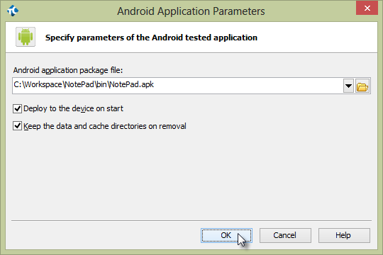

4.  Now that you have defined the TestedApp, right-click the item and
    click **Run Selected**

> from the context menu.

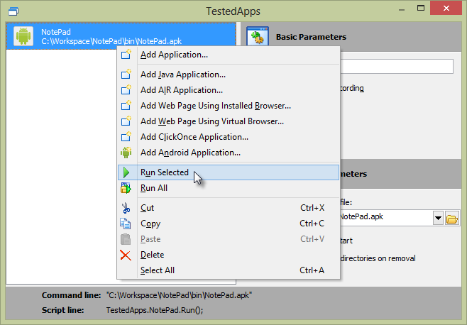

> The package will be loaded to the default device and will also show in
> the Mobile Screen. If the package was already loaded to the device it
> will be *refreshed*, that is, it will be deleted and reloaded to the
> device.
>
> For more on how to run a TestedApp from the IDE, keyword test or
> script, see the Running a TestedApp topic.

#### Using Script to Manage Packages

> While Using TestedApps to Manage Packages is a
> practical, one-size-fits-all solution, *script* provides fine-grain
> control over package information, installation, launching and removal
> when you need it. The device\'s **PackageManager** object can install
> a package using a .apk file on your local PC or network share, get a
> reference to an previously installed package using its namespace,
> launch an installed package or remove and installed package. The
> example code below gets a reference to the package manager and first
> looks to see if it\'s installed using the
> **GetInstalledPackageByName()** method. If the package isn\'t found,
> the package manager\'s **InstallPackage()** method takes care of that
> issue. You can run the application by calling **LaunchPackage()** and
> then use the application. If you want to clean up afterwards so the
> next run of the test will load the package fresh, call the
> **RemovePackage()** method to uninstall the package from the device.
>
> *// change this string to reflect your device\'s name.*
>
> *// find the name using the Show Mobile Screen button or by*
>
> *// iterating devices in code.*
>
> **var** deviceName = \"SCH-I535\";
>
> **function** TestNotepad()
>
> {
>
> **var** index, **package**, device, packageManager,
>
> path = \"C:\\\\Workspace\\\\NotePad\\\\bin\\\\NotePad.apk\",
> notepadNameSpace = \"com.example.android.notepad\";
>
> *// set the current device and get a reference to the device*
>
> *// and package manager* Mobile.SetCurrent(deviceName); device =
> Mobile.Device();
>
> packageManager = device.PackageManager;
>
> *// get the package if it\'s already installed.*
>
> **package** =
> packageManager.GetInstalledPackageByName(notepadNameSpace);
>
> *// otherwise, get the package from a file*
>
> **if** (!**package**){
>
> *// get the package file information from the local PC,*
>
> *// returns a PackageObject*
>
> **package** = packageManager.GetPackageFromAPK(path);
>
> *// load the package onto the device*
>
> packageManager.InstallPackage(**package**);
>
> }
>
> *// run the default activity from the package*
>
> packageManager.LaunchPackage(**package**);
>
> *// use the application . . .*
>
> *// delete the package from the device*
>
> packageManager.RemovePackage(**package**);
>
> }

#### Managing Devices with Script

> The top-level **Mobile** object has methods and properties for all
> devices connected to TestComplete on your PC. You can iterate devices
> using the **ChildCount** property and **Child ()** method. Use this
> mechanism to run the same test against multiple devices. The code
> below logs the names of all the connected devices:
>
> **for**(**var** i = 0; i \< Mobile.ChildCount; i++){
> Log.Message(Mobile.Child(i).DeviceName);
>
> }
>
> The **Device** goody bag includes information about the device itself,
> access to the **Desktop** object that represents the device screen,
> access to GPS and Sensor objects, ability to simulate an **SMS**, and the ability to
> **Drag**/**Swipe**/**Touch**/**TouchAndHold**/**TouchPress**/
> **TouchRelease** anything you find on-screen. You can also execute
> Android shell commands and even **Reboot** the device.

##### Accessing a Device

> To access a single device, use the **Mobile.Device()** method. Without
> parameters, the \"current\" device is returned. You can also specify a
> device name and, if more than one device has the same name, you can
> specify an optional index. The code below shows three functionally
> equivalent statements that access a device named \"SCH-I535\".
>
> **var** device;
>
> *// Use the current device* Mobile.SetCurrent(\"SCH-I535\"); device =
> Mobile.Device();
>
> *// Access by device name*
>
> device = Mobile.Device(\"SCH-I535\");
>
> *// Access by device name and index*
>
> device = Mobile.Device(\"SCH-I535\", 1);

##### Reading Device Information

> With a reference to the device, you can extract everything you need to
> know about the device, including its battery level, operating system,
> model, sensor information and even GPS coordinates. The Device object
> has immediate properties **DeviceName** and **DeviceID**, and the
> **DeviceInfo** property will get you the rest. The code below extracts
> the information to the log:
>
> **var** message, info;
>
> **var** format = \"%s/%s: Battery: %i CPU/ABI: %s Design Name: %s \" +
> \"Fingerprint: %s Mfg: %s Model %s Product Name: %s\";
>
> Mobile.SetCurrent(deviceName); info = Mobile.Device().DeviceInfo;
>
> message = aqString.Format(format, Mobile.Device().DeviceName,
> Mobile.Device().DeviceID,
>
> info.BatteryLevel, *// percentage of charge level* info.CPU\_ABI, *//
> CPU type and ABI convention* info.Device, *// design name*
> info.FingerPrint, *// unique id for the OS* info.Manufacturer, *//
> device manufacturer* info.Model, *// device name visible to user*
> info.Product); *// complete product name*
>
> The screenshot below shows sample output for one run of the test:

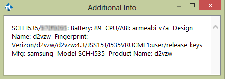

##### Device Methods

> Now that you have access to the device and a little information about
> that device, what else can we do with this powerful object? It is a
> phone after all so we should be able to make a call or send an SMS.
> The code below demonstrates how to make a call or send an SMS where
> the device methods are **Call(phoneNumber)** and **SMS(phoneNumber,
> message)**.
>
> Mobile.Device().Call(\"555-1234\"); Mobile.Device().SMS(\"555-1234\",
> \"Pizza anyone?\");
>
> The result from the **SMS()** method is shown in the screenshot of the
> Mobile Screen below. Be aware that both of these methods are
> asynchronous and your test will continue without waiting for the call
> to complete.

> All of the standard Findxxx() methods are available to [[Open Android
> Applications]{.underline}](#open-android-applications) including
> **FindAll()**, **FindAllChildren()**, **FindChild()** and
> **FindID()**. See the Open Android Applications topic for examples.
>
> To use single-touch gestures on a mobile device, the **Drag()**,
> **Swipe()** and Touchxxx() methods simulate standard user actions.
> These methods are all asynchronous. The **Drag()** method takes
> starting and ending X and Y coordinates. Optionally, you can add a
> delay time (defaults to 1000). The example below uses an item from an
> Image Set to get the starting location of an icon and then drags 
> it to position 100 pixels to the right and down.
>
> **var** calculatorPosition, X, Y;
>
> Mobile.SetCurrent(deviceName); calculatorPosition =
>
> ImageRepository.HomeScreen.CalculatorIcon.FindPosition(); X =
> calculatorPosition.Left + calculatorPosition.Width / 2;
>
> Y = calculatorPosition.Top + calculatorPosition.Height / 2;
> Mobile.Device().Drag(X, Y, X + 100, Y + 100);
>
> The **Swipe()** method also takes starting and ending X and Y
> coordinates. Optionally, you can add parameters that detail the number
> of steps to move in (defaults to 10) and the duration in milliseconds
> to make the swipe (defaults 1000). The example below gets a reference
> to the device\'s **Desktop** object, swipes from left to right, then
> from right to left.
>
> **var** desktop;
>
> Mobile.SetCurrent(deviceName); desktop = Mobile.Device().Desktop;
>
> *// swipe left to right*
>
> Mobile.Device().Swipe(0, desktop.Height / 2, desktop.Width - 5,
> desktop.Height / 2);
>
> *// swipe right to left*
>
> Mobile.Device().Swipe(desktop.Width - 5,
>
> desktop.Height / 2, 0, desktop.Height / 2);
>
> The Touchxxx methods include **Touch()**, **TouchAndHold()**,
> **TouchPress()**, and **TouchRelease()**. Each method takes an X and Y
> coordinate where the touch is happening. The **TouchAndHold()** method
> takes an additional parameter that denotes the number of milliseconds
> the touch must be held. The **TouchPress()**, **Move()** and
> **TouchRelease()** methods are frequently grouped. The
> **TouchPress()** method simulates pressing the device screen at a
> particular point, the **Move()** method simulates sliding the
> fingertip across to a new specified point and finally the
> **TouchRelease()** method simulates taking the fingertip off of the
> screen.
>
> Mobile.SetCurrent(deviceName); Mobile.Device().TouchAndHold(100, 100,
> 500);
>
> Mobile.Device().Touch(10, 10);
>
> Mobile.Device().TouchPress(20, 20);
>
> Mobile.Device().Move(50, 50);
>
> The log output is shown in the screenshot below.

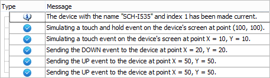

> For hardware buttons, use the **PressButton()** method. It takes one
> of the constants listed in the help under [Mobile Key
> Constants](http://support.smartbear.com/viewarticle/59690/).
> These constants cover all the alphanumeric, function keys, device keys
> (home, back, camera, etc.), game controller keys (left thumb button,
> select, etc.), media keys (eject, play, pause, etc.), modifier keys
> (various flavors of alt, ctrl, shift, etc.), and special characters
> (@, \#, \*, etc.). The code below clicks the home button, briefly
> flashes the menu and then clicks the back button.
>
> Mobile.Device().PressButton(mbkHome);
> Mobile.Device().PressButton(mbkMenu);
> Mobile.Device().PressButton(mbkBack);
>
> TestComplete uses the Android Debug Bridge (ADB) to move data to and
> from the device. If you want to directly execute ADB commands you can
> use the device\'s **ShellExecute()** method. The example below lists
> the features of the device.
>
> **var** output = Mobile.Device().ShellExecute(\"pm list features\");
> Log.Message(output);
>
> The screenshot below shows sample output:

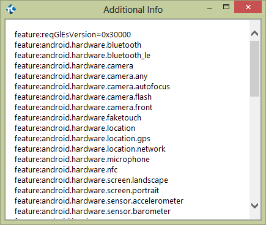

##### GPS

> You can set and get the location of the device using the device\'s
> **GPS Location** object. Use the **GPS SetLocation()** method to set
> the device to a *mock* location. The mock location overrides the
> actual location of the device and is especially useful for setting
> location on emulators that have no physical GPS hardware. You will
> need to enable your device\'s developer **Allow Mock Locations**
> setting to make this work. Later, when you need to get out of the mock
> locations mode, clear the setting and reboot the device. The code
> below takes you to the warm fragrance of Maui without all that trouble
> of getting on a plane:
>
> **var** location, message;
>
> **var** format = \"Latitude: %.3f Longitude: %.3f Altitude: %.3f
> Accuracy:
>
> \%.3f\";
>
> **Mobile**.SetCurrent(deviceName);
>
> **Mobile**.Device.GPS.SetLocation(20.8000, 156.3333, 0, 95); location
> = **Mobile**.Device.GPS.Location;
>
> **if** (location){
>
> message = **aqString**.Format(format, location.Latitude, location.
>
> Longitude,
>
> location.Altitude, location.Accuracy)
>
> **Log**.Message(message, message);
>
> }

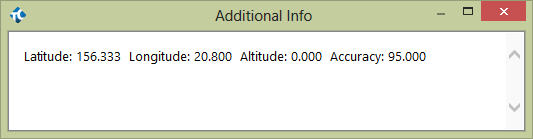

> Note that the **Location.Accuracy** property denotes the estimated
> accuracy of the device location, in meters. This number describes a
> radius where the center is the probable location of the device, and
> relates to the latitude and longitude, but not the altitude.

##### Sensors

> Each device has a **SensorsCount** and **Sensors(index)** that allow
> you to iterate every sensor on the device. Each sensor object has a
> **Values** property with sub properties **Value0**, **Value1** and
> **Value2**.
>
> **var** sensor;
>
> Mobile.SetCurrent(deviceName);
>
> **for**(**var** index = 0; index \< Mobile.Device().SensorsCount;
> index++){ sensor = Mobile.Device().Sensor(index);
> Log.AppendFolder(sensor.Name + \": \" + sensor.Type)
> Log.Message(\"Value0: \" + sensor.Values.Value0);
> Log.Message(\"Value1: \" + sensor.Values.Value1);
> Log.Message(\"Value2: \" + sensor.Values.Value2); Log.PopLogFolder();
>
> }
>
> The screenshot below shows a log of sample output:

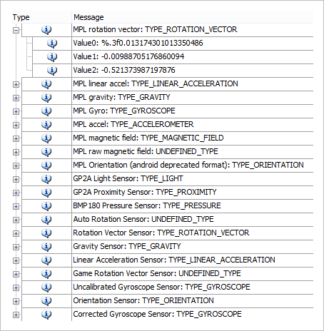

#### Image Based Testing

> You can\'t always count on having a prepared, \"white-box\"
> application that is open and lets you easily get at all the controls
> on-screen. You won\'t always have that kind of access. In these cases,
> you can test based on recognizing images. A series of objections pop
> to mind, like \"what about devices that have different sizes and
> resolutions?\", \"if I change color scheme or theme, will the image
> recognition fail?\", and \"will colors bleeding through transparent
> areas of images fool the image recognition?\" TestComplete has
> intelligent mechanisms to recognize images in all of these situations,
> including variable percentages of pixel variation and transparency.
>
> The heart of the approach is the **ImageRepository** in the Project
> Explorer. The ImageRepository has **Image Sets** where each set
> contains multiple images representing a single on-screen object. The
> screenshot below shows the ImageRepository node with two image sets
> named \"Calculator\" and \"HomeScreen\".

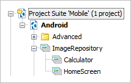

> Let\'s say you want to automate a clock icon on your device\'s home
> screen. The icon may be displayed using more than one image, depending
> on manufacturer and operating system version. Resolution can also
> vary, for example, when displayed by a Samsung Galaxy running in
> 720x1280 pixels vs. an HTC One running in 540x960. By using an Image
> Set you can recognize images for any configuration. The screenshot
> below shows the \"HomeScreen\" in the **Image Set Editor** where the
> clock is listed under **Items** on the left-hand side. The **Image
> Strip** at the bottom of the screen has a high-quality image of the
> clock from a device with 720x1280 resolution and another image taken
> from the emulator that only runs at 240x320. The resolutions are
> different, the actual artwork representing the clock is different, and
> the scary part is that the background colors are different based on
> the chosen wallpaper.
>
> When using a Keyword Test or script to reference the Clock object,
> TestComplete looks through the Image Strip and tries to match the
> image with the application under test. If it doesn\'t find the image,
> TestComplete moves to the next image in the strip and tries again.
> This mechanism handles varying resolutions and even helps recognize
> objects that use completely different artwork to represent the object.

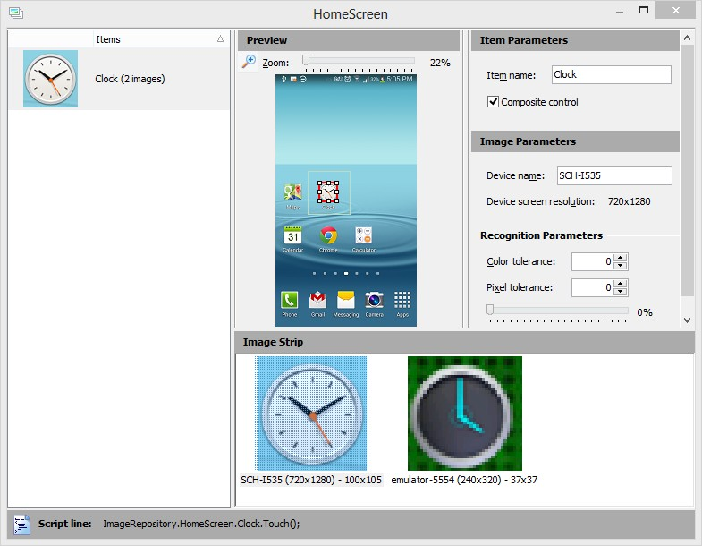

> What if the wallpaper on the device changes or there is some variation
> in the pixel quality between devices? The **Image Parameters** section
> of the Image Set Editor allow tolerance of color or pixel variations.
> **Color tolerance** accepts a number between 0..255 where zero (the
> default) requires that colors match the stored image exactly and 255
> where pixels of any color are treated as identical. **Pixel
> Tolerance** is the number of pixels that can different from the stored
> Image Strip item. By default, Pixel Tolerance is 0 and all pixels in
> the tested application and the Image Strip item must match exactly.
> The slider below the Pixel tolerance spinner allows you to quickly set
> the percentage of pixel difference that will be allowed, without
> having to know about the number of pixels in the image.

##### Adding Images

> You can conveniently add new images to an Image Set by clicking the
> **Add Image** button on The Mobile Screen.

> The **Add Image to Image Repository** dialog will display. After a few
> moments, a second window labeled **Select Object from Screen** will
> display. Use the mouse to surround a rectangular area. Click the
> **Select** button that appears to save the area to the **Add Image to
> Image Repository** dialog. You can change this selected area later.

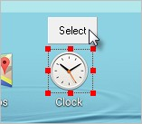

> Provide an **Item name** to be used in scripts and keyword tests. Also
> select an image set from the drop-down list. If you need to retake the
> image, click the **Select Image\...** button. Click the **Finish**
> button to create a new item in the Image Set.

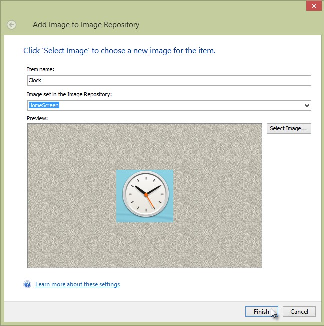

> The image will be added as an item to the Image Set editor. Notice the
> **Script line** at the bottom of the Image Set editor dialog that
> provides sample script showing how to programmatically touch the
> selected image.

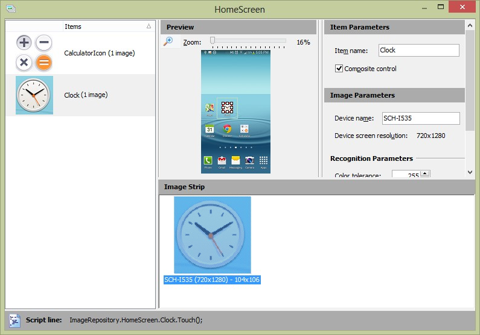

> You can add more images to the strip for the Image Set item by
> right-clicking and selecting **Add Image\...** or **Add Image From
> File\...** from the context menu. Use the **Set Recognition
> Parameters\...** context menu option to tweak color or pixel
> tolerances.

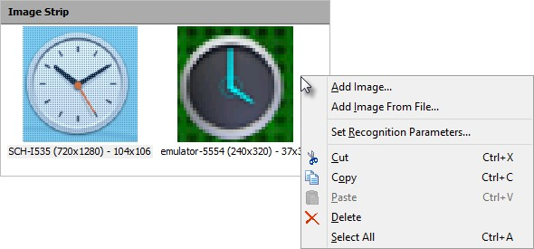

> The Image Set Editor **Item Parameters** panel will display and allow
> you to change the **Item name**. You can change the Item name at any
> time, but if keyword tests or scripts refer to it, you will need to
> update those to match the new item name. The **Composite control**
> checkbox, when selected, use the exact coordinates of the selection.
> This checkbox should be selected when the control is composed of
> several smaller controls, such as a date-time picker or a tabbed
> control. For simple controls like buttons and check boxes, leave the
> option unchecked so that selection will occur at the exact center of
> the control.

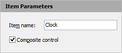

> The **Preview** panel shows the current selected Image Strip item and
> has two important rectangular regions (see screenshot below). The
> *initial target area* is the rectangle you first define when adding
> the image and is defined by a gray rectangle. The red rectangle
> defines the *recognition area* used when attempting to match the image
> set to the on- screen image being tested. You can drag the handles of
> the recognition area to refine your selection and omit problematic
> parts of the screen or right-click to drag the recognition area
> rectangle to a new location. In tests, the upper left corner of the
> initial target area is used as a reference point when touch actions
> have coordinates passed to them. Otherwise, the center of the
> recognition area is used for touch actions.

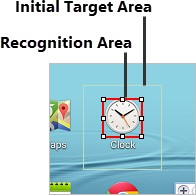

##### Using Image Sets in Script

> Image Sets are referenced in script using the syntax
> **ImageRepository.\<image set\>.**
>
> **\<image name\>**. The example below performs a touch action on an
> item named \"Clock\" that is stored in the \"HomeScreen\" Image Set.
>
> ImageRepository.HomeScreen.Clock.Touch();

##### Mobile Checkpoints

> Mobile checkpoints use Image Sets to verify the state of the
> application. If an Image Set item is found in the tested application,
> the checkpoint passes. The setup for the example that follows uses
> images taken from the Calculator application as shown in the
> screenshot below.

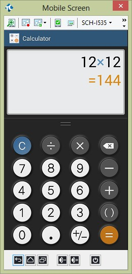

> The example uses an Image set populated from the Calculator with
> sufficient image to multiply 12x12. The Image set also includes an
> image of the result \"= 144\".

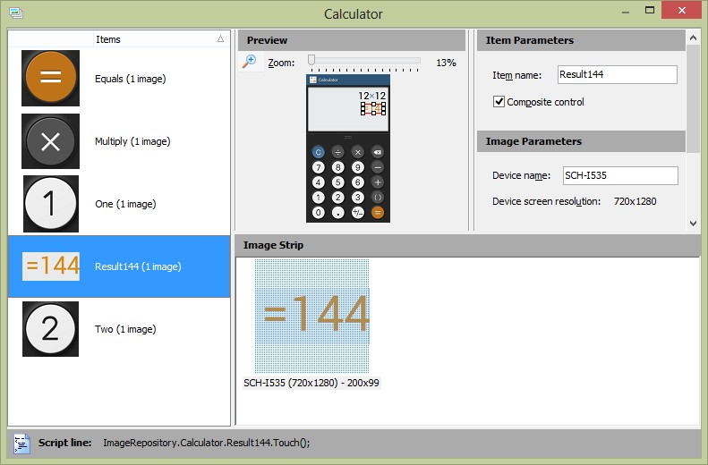

> The **Create Mobile Checkpoint** dialog displays in response to a new
> keyword **Mobile Checkpoint** operation or by clicking the **Create
> Mobile Checkpoint** option from the recording toolbar. Your options
> are to **Create a new item** or to **Use an existing item**. The
> **Create a new item** option brings up essentially the same dialog as
> used for Adding Images to an image set. If you choose
> the **Use an existing item**, select an image from the list of Image
> Repository items and click the **Finish** button.

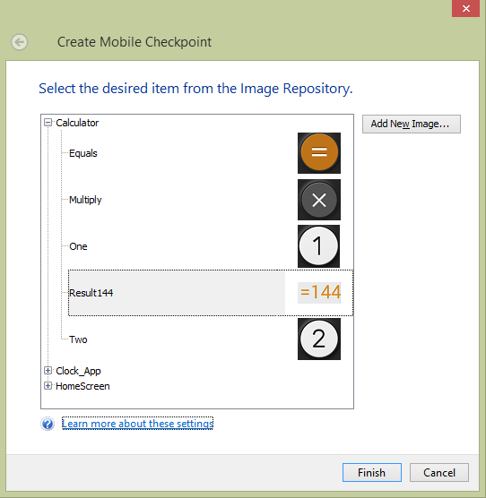

##### Mobile Checkpoints in Scripts

> The image set item **CheckImage()** method will return true if the
> image is found. The script below touches the calculator images to
> calculate 12 x 12 and verify that the result is an image of 144.
>
> ImageRepository.HomeScreen.CalculatorIcon.Touch();
> ImageRepository.Calculator.One.Touch();
> ImageRepository.Calculator.Two.Touch();
> ImageRepository.Calculator.Multiply.Touch();
> ImageRepository.Calculator.One.Touch();
> ImageRepository.Calculator.Two.Touch();
> ImageRepository.Calculator.Equals.Touch();
>
> **if** (!ImageRepository.Calculator.Result144.CheckImage()){
> Log.Error(\"CheckImage for Result144 failed\");
>
> }

#### Gestures

> *Gestures* represent multiple touch events. Gestures must be recorded
> on a touch-sensitive physical device; emulators cannot be used to
> record gestures. The Mobile Screen has a Record Gesture feature that
> allows you to record multiple touches on your device.
>
> Clicking the **Record Gesture** button on the Mobile Screen first
> prompts to add a **Android Gesture Collection** if a collection
> doesn\'t already exist. Then the **Add Gesture** dialog displays
> announcing that you can record gestures on your physical device. Once
> the dialog displays, the Mobile Screen is disabled and will display
> the message \"Use a physical device to record gestures\". Enter a name
> for the gesture, then touch your physical device to simulate
> multi-touch events. When you\'re done, click the **Stop Recording**
> button.

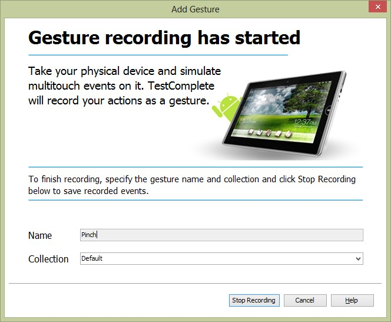

> TestComplete has a rather nifty way of graphically representing the
> movement of points touched on the device by animating each point in a
> unique color. The screenshot below shows the results of a pinching
> gesture using thumb (shown in red) and index finger (shown in green).
> Double-click the **Name** or **Playback Acceleration** column entries
> to edit them. The Playback Acceleration percentage value can be set
> between zero and 100. By default, acceleration is set to 10% for
> better accuracy. Click the **Play Gesture** button to select a
> recorded gesture and run it.

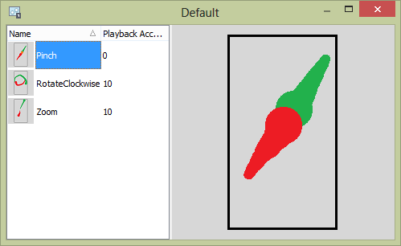

##### Playing Gestures from Script

> To play a gesture in script, use the **AndroidGestureCollection**
> object followed by the gesture collection name and finally the gesture
> name. The **Execute()** method of the gesture emulates the multi-touch
> event:
>
> AndroidGestureCollection.Default.Pinch.Execute();

#### Open Android Applications

> When an Android device is connected via USB cable to your computer,
> the Object Browser window information is sparse. There is no plus sign
> icon indicating that you can expand a device node to see individual
> processes and objects. The application is essentially a black box. The
> screenshot below shows two devices, a physical device named
> \"SCH-I535\" and an emulated device from the Android SDK. Notice the
> error text for the GPS and SensorsCount properties is letting you know
> that something called the Android Agent is not available.

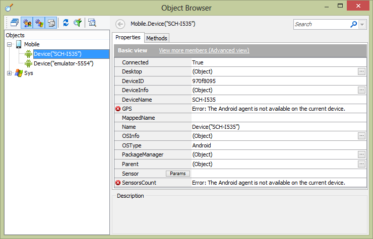

> **Figure 168 \-- Devices in the Object Browser**
>
> To involve TestComplete in a detailed conversation with your Android
> application, you need to make changes on both the Android device and
> in the Android application:
>
> Install Android Agent 
> Modify the Android Application
>
#### Note: 
> This topic does not cover installing or configuration of the
> Android SDK, Java or the Eclipse IDE. Refer to the online
> documentation for more information about these topics.

##### Install Android Agent

> The Android Agent is used to exchange data with an open Android
> application. The Android Agent also retrieves data from any sensors on
> the device including GPS data. To install the Android Agent:

1.  Click the **Show Mobile Screen** button.

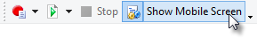

2.  Choose a device to display in the Mobile Screen.

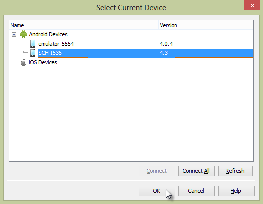

3.  When the Mobile Screen displays, click the **Install** link located
    at the top of the screen. This step will take a little time while
    the com.smartbear.androidagent package is installed to your device.

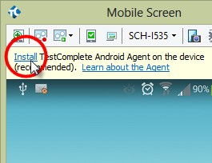

4.  A dialog will announce that the Android Agent has been installed
    successfully. Close the dialog.

5.  A page displays help and links to configure device settings. This is
    an optional step that doesn\'t need to be completed until you need
    to perform Geolocation testing or input text in multiple languages.

##### Modify the Android Application

> To get the Android application talking with TestComplete, you need to
> add a SmartBear supplied library to the Android project and add
> initialization code to hook into this library. The example assumes
> that you\'re using the Eclipse IDE and that you have the application
> source code loaded into Eclipse.

1.  Select the Eclipse **Project \| Properties** menu item.

2.  Select **Java Build Path** from the left-hand list.

3.  Select the **Libraries** tab.

4.  Click the **Add External JARs\...** button.

5.  Open **PatchServices.jar** located at **\<TestComplete install
    directory\>\\Bin\\Extensions\\Android**. This step adds a new JAR to
    the Libraries list:

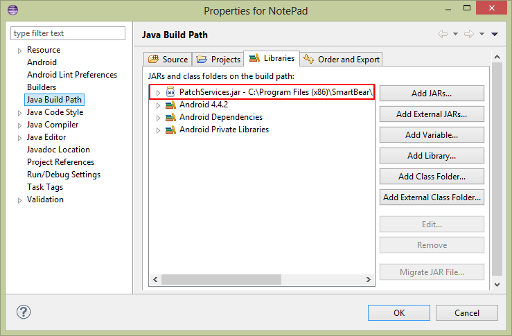

6.  Select the **Order and Export** tab.

7.  Check the box next to the PatchServices.jar entry.

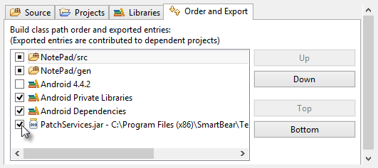

8.  Click **OK** to close the properties dialog.

9.  In the application class constructor, add initialization code:

> // Java
>
> public class NotePadApp extends Application { public NotePadApp()
>
> {
>
> **com.smartbear.uibinder.Binder.Initialize(this);**
>
> }
>
> }
>
> If your project does not already contain an object that extends
> **Application**, right-click the
>
> **src** node of your project and select **New \| Class**. Define the
> **Superclass** as **android.app. Application**. Click the **Finish**
> button to create the new class file. The screenshot below shows an
> example completed application class in the New Java Class dialog.

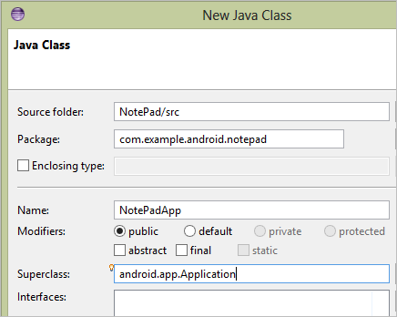

##### Use the Object Brow ser

> After installing the Android Agent and modifying the Android
> application to include the SmartBear initialization code, we should be
> able to see detail in the Object Browser. Now try running your
> application from Eclipse. In the example here, we\'re using the
> Android Notepad example application that comes with the SDK, but any
> application with the proper external JAR and initializing code will
> do. The errors flagged in the Object Browser are now gone.
>
> Next, right-click one of the devices in the Object Browser and select
> **Refresh All** from the context menu. The plus sign should display,
> indicating that you can expand the device node. Now that we\'re
> \"cooking with gas\", expand all the nodes to see all the child
> objects for the device. All of these controls can be accessed in code,
> mapped, stored and so on, just as you can with desktop or web
> applications.

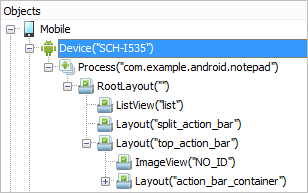

##### Scripting Walk-Through

> This lab demonstrates techniques that you\'re likely to use in most
> Android white-box tests. [[Test Multiple
> Devices]{.underline}](#test-multiple-devices)**:** Iterate devices so
> that the same script is run against each device.
>
> Manage Android Packages:
> Load package files from the PC, install, launch, assign packages to
> TestedApps, and remove packages from a device.
>
> Wait for Processes and Activities: 
> Once a package is launched, a process starts on the device. Each process has
> one or more *activities*. Wait for processes and activities to be
> available before trying to access child objects.
>
> Work with On-Screen Objects
> Find controls listed in the Object Browser with the same Findxxx script methods used
> throughout TestComplete.

##### Prerequisites

> This labs that follow assume that you have installed the Android SDK
> and the Eclipse IDE. The on-screen objects in this lab are from a
> NotePad sample project found in Android
>
> 4.4.2. Before working through the steps listed be sure to load the
> NotePad project into the Eclipse IDE, Install Android Agent] and Modify the Android
> Application to allow communication with TestComplete.

##### Test Multiple Devices

1.  Create a new TestComplete JavaScript unit.

2.  Add a new function TestNotePad().

3.  Inside of TestNotePad(), declare variables for **index** and
    **device**.

> **function** TestNotepad()
>
> {
>
> **var** index, device;
>
> }

4.  Add a **for** loop to run once for each connected child device. Use
    the Mobile

> **ChildCount** property to set the upper bound of the loop.
>
> **function** TestNotepad()
>
> {
>
> **var** index;
>
> *// iterate all devices connected to TestComplete*
>
> **for**(index = 0; index \< Mobile.ChildCount; index++){
>
> }
>
> }

5.  Get the reference of the device for the current iteration using the
    Mobile **Child()**

> method, passing the index of the device.
>
> *// get the device reference for the current iteration*
>
> device = Mobile.Child(index);

6.  Demonstrate referencing the **Device** object by logging the
    **DeviceName** property.

> *// do something with the device*
>
> Log.Message(device.DeviceName);
>
> Run the example and examine the log.
>
> The code so far looks like the example below.
>
> **function** TestNotepad()
>
> {
>
> **var** index;
>
> *// iterate all devices connected to TestComplete*
>
> **for**(index = 0; index \< Mobile.ChildCount; index++){
>
> *// get the device reference for the current iteration*
>
> device = Mobile.Child(index);
>
> *// do something with the device*
>
> Log.Message(device.DeviceName);
>
> }
>
> }
>
> **Note**: if you want to see other entries in the list, start an
> Android emulator from the Eclipse menu item **Window \| Virtual Device
> Manager**, then select a virtual device from the list and click the
> **Start\...** button. The screenshot below shows emulator for Android
> 4.0.3 being started.

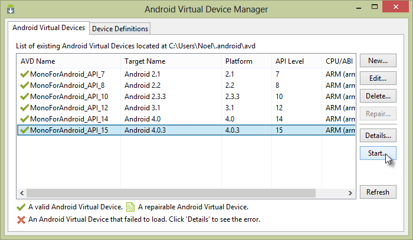

##### Manage Android Packages

> Packages contain Android application definitions in the form of .apk
> files. Packages may be loaded from your local PC, already loaded to
> your device, and can also be specified as a TestComplete
> **TestedApp**. This example uses an Android SDK example called
> NotePad. apk.
>
> This lab starts with the code from the previous Test Multiple
> Devices lab and adds the ability
> to load, install, run and remove a package.

1.  Add new variables named **package** and **path** to the **var**
    list. The **path** variable should point to the directory on your
    local PC where the .apk file is located.

> **var** index, **package**, path =
> \"C:\\\\Workspace\\\\NotePad\\\\bin\\\\NotePad.apk\";

2.  Inside the loop that iterates devices, call the device\'s
    **GetPackageFromAPK()** method to get the .apk file information from
    your local PC and return it as a **PackageObject**.

> **package** = device.PackageManager.GetPackageFromAPK(path);

3.  Now that you have a reference to the package information, you can
    load the package onto the device. Call the device\'s
    **InstallPackage()** method, passing the **PackageObject** retrieved
    in the previous step.

> device.PackageManager.InstallPackage(**package**);

4.  The package has been downloaded to the device and can be launched.
    To run the application\'s default activity, call the device\'s
    **LaunchPackage()** method and pass the **PackageObject**.

> device.PackageManager.LaunchPackage(**package**);

5.  At this point, the application will be running on the device. You
    can now wait for processes and activities, find on-screen controls
    and automate controls. We will look at those techniques in later
    labs. For now, just remove the package from the device by calling
    **RemovePackage()**, again passing the **PackageObject** reference.

> device.PackageManager.RemovePackage(**package**);
>
> The full source for this script should now look something like this:
>
> **function** TestNotepad()
>
> {
>
> **var** index, **package**,
>
> path = \"C:\\\\Workspace\\\\NotePad\\\\bin\\\\NotePad.apk\";
>
> *// iterate all devices connected to TestComplete*
>
> **for**(index = 0; index \< Mobile.ChildCount; index++){
>
> *// get the device reference for the current iteration*
>
> device = Mobile.Child(index);
>
> *// do something with the device*
>
> Log.Message(device.DeviceName);
>
> *// get the package file information from the local PC*
>
> **package** = device.PackageManager.GetPackageFromAPK(path);
>
> *// load the package onto the device*
>
> device.PackageManager.InstallPackage(**package**);
>
> *// run the default activity from the package*
>
> device.PackageManager.LaunchPackage(**package**);
>
> *// use the application . . .*
>
> *// delete the package from the device*
>
> device.PackageManager.RemovePackage(**package**);
>
> }
>
> }

##### Wait for Processes and Activities

> Like a desktop app, Android applications have a top-level process
> that, in turn, contain one or more *activities*. The process
> represents the running application. Each *activity* is an action that
> the user can perform. Using the list of notes in NotePad, editing a
> note or editing a title are all examples of activities. Before you can
> locate on-screen objects and automate them, you should wait for the
> process and main activity load and run. If your automation causes the
> app to change activities, you will need to wait again for the new
> activity to run.
>
> This lab starts with the code from the previous Manage Android
> Packages lab and adds statements that wait for the process and main activity to load.

1.  Add **notepadProcess**, **notesListActivity** and
    **notepadNameSpace** to the var list. In particular,
    notepadNameSpace matches the namespace declared in the Android
    application package source and is used to locate the process.

> **var** index, **package**,
>
> path = \"C:\\\\Workspace\\\\NotePad\\\\bin\\\\NotePad.apk\",
> ***notepadProcess, notesListActivity, notepadNameSpace =
> \"com.example.android.notepad\";***

2.  After the launching the package, add script to wait for the process
    for five seconds using the device\'s **WaitProcess()** method. Check
    the existence of the process before continuing.

> notepadProcess = device.WaitProcess(notepadNameSpace, 5000);
>
> **if** (notepadProcess.Exists){
>
> Log.Message(\"The NotePad process is running\");
>
> *// do something with the process\...*
>
> }

3.  Add code inside the **if** statement to check that a specific
    activity is running before trying to locate on-screen objects used
    by the activity. The process **WaitActivity()** method checks for
    the NotesList activity for one second.

> notesListActivity = notepadProcess.WaitActivity(\"NotesList\", 1000);
>
> **if** (notesListActivity){
>
> Log.Message(\"NotesList activity is running\");
>
> // do someting with the activity
>
> }
>
> Run the example and examine the log.

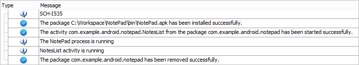

> The full script now looks like the example below.
>
> **function** TestNotepad()
>
> {
>
> **var** index, **package**,
>
> path = \"C:\\\\Workspace\\\\NotePad\\\\bin\\\\NotePad.apk\",
> notepadProcess, notesListActivity, notepadNameSpace =
> \"com.example.android.notepad\";
>
> *// iterate all devices connected to TestComplete*
>
> **for**(index = 0; index \< Mobile.ChildCount; index++){
>
> *// get the device reference for the current iteration*
>
> device = Mobile.Child(index);
>
> *// do something with the device*
>
> Log.Message(device.DeviceName);
>
> *// get the package file information from the local PC*
>
> **package** = device.PackageManager.GetPackageFromAPK(path);
>
> *// load the package onto the device*
>
> device.PackageManager.InstallPackage(**package**);
>
> *// run the default activity from the package*
>
> device.PackageManager.LaunchPackage(**package**);
>
> *// wait for the notepad application for five seconds*
>
> notepadProcess = device.WaitProcess(notepadNameSpace, 5000);
>
> *// is notepad running on the device?*
>
> **if** (notepadProcess.Exists){
>
> Log.Message(\"The NotePad process is running\");
>
> *// wait for the NotesList activity for one second*
>
> notesListActivity = notepadProcess.WaitActivity(\"NotesList\", 1000);
>
> *// is the NotesList activity running on the device?*
>
> **if** (notesListActivity){
>
> Log.Message(\"NotesList activity is running\");
>
> *// do something with the NotesList activity*
>
> }
>
> }
>
> *// delete the package from the device*
>
> device.PackageManager.RemovePackage(**package**);
>
> }
>
> }

##### Work with On-Screen Objects

> Now that the application is in a suitable state, you can use built-in
> device methods and also go spelunking for on-screen objects to
> automate your test. This lab starts with the code from the previous
> Wait for Processes and Activities lab and adds statements that find on-screen objects.
>
> Before adding the code, first find the on-screen objects that you want
> to automate in the Object Browser.

1.  Make sure the app is running on the device.

2.  Navigate to the Object Browser.

3.  Open up the **Device** node and its child nodes.

4.  Locate a node for an on-screen object that you want to automate. In
    this example, we can start with the TextView control named
    \"menu\_add\". In the Properties panel, locate properties that can
    be used to uniquely identify the control. In this example, you could
    use the **Name**, the **ViewID**, or a combination of properties.
    For this example, note the **ViewID** for later use. Repeat this
    step for each control that needs to be automated. You may need to
    navigate in the app to have all the controls you want to automate
    show up in the Object Browser. For this example, the ViewID values
    needed for scripting are \"menu\_add\", \"menu\_save\" and \"note\".

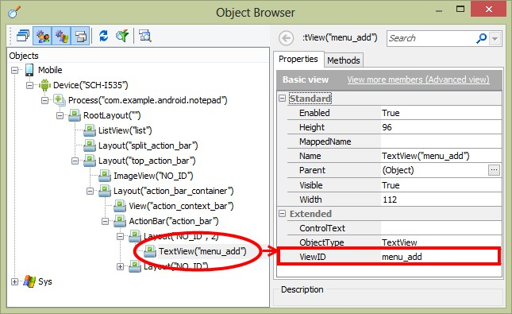

> Add new variables **menuAdd**, **menuSave, editText** and
> **noteEditorActivity** to the **var** list.
>
> **var** index, **package**,
>
> path = \"C:\\\\Workspace\\\\NotePad\\\\bin\\\\NotePad.apk\",
> notepadProcess, notesListActivity, notepadNameSpace =
> \"com.example.android.notepad\", **menuAdd, menuSave, editText,
> noteEditorActivity**;

1.  Inside the line of code that tests notesListActivity, call the
    processes **FindChild()** method and look for a control with a
    **ViewID** equal \"menu\_add\". The control is about 6 levels down
    according to the Object Browser, so pass a slightly larger value to
    the last parameter to the **FindChild()** method.

> **if** (notesListActivity){
>
> menuAdd = notepadProcess.FindChild(\[\"ViewID\"\], \[\"menu\_add\"\],
> 10);
>
> }

2.  After the call to **FindChild()**, add a call to the **Touch()**
    method of the found object.

> menuAdd.Touch();

3.  Touching the \"new\" **TextView** will cause the application to
    switch to a new activity that will edit a note. The new activity is
    called \"NoteEditor\". Wait for the NoteEditor activity for five
    seconds using the processes **WaitActivity()** method. Note: to find
    the name of the new activity you\'ll need to look it up in the Java
    source code.

> noteEditorActivity = notepadProcess.WaitActivity(\"NoteEditor\",
> 5000);
>
> **if** (noteEditorActivity){
>
> **Log**.Message(\"NoteEditor activity is running\");
>
> }

4.  Next, find the **EditText** control used to enter text. Again, use
    the processes FindChild() method, this time looking for a ViewID
    property with the value of \"note\".

> editText = notepadProcess.FindChild(\[\"ViewID\"\], \[\"note\"\], 10);

5.  Send keystrokes to the **EditText** control using the **Keys()**
    method.

> editText.Keys(\"Use the Keys() method to send keystrokes to on-screen
> objects.\");

6.  Finally, find the save button and press it.

> menuSave = notepadProcess.FindChild(\[\"ViewID\"\],
> \[\"menu\_save\"\], 10); menuSave.Touch();
>
> The full script now looks like the example below.
>
> **function** TestNotepad()
>
> {
>
> **var** index, **package**,
>
> path = \"C:\\\\Workspace\\\\NotePad\\\\bin\\\\NotePad.apk\",
> notepadProcess, notesListActivity, notepadNameSpace =
> \"com.example.android.notepad\", menuAdd, menuSave, editText,
>
> noteEditorActivity;
>
> *// iterate all devices connected to TestComplete*
>
> **for**(index = 0; index \< Mobile.ChildCount; index++){
>
> *// get the device reference for the current iteration*
>
> device = Mobile.Child(index);
>
> *// do something with the device*
>
> Log.Message(device.DeviceName);
>
> *// get the package file information from the local PC*
>
> **package** = device.PackageManager.GetPackageFromAPK(path);
>
> *// load the package onto the device*
>
> device.PackageManager.InstallPackage(**package**);
>
> *// run the default activity from the package*
>
> device.PackageManager.LaunchPackage(**package**);
>
> *// wait for the notepad application for five seconds*
>
> notepadProcess = device.WaitProcess(notepadNameSpace, 5000);
>
> *// is notepad running on the device?*
>
> **if** (notepadProcess.Exists){
>
> Log.Message(\"The NotePad process is running\");
>
> *// wait for the NotesList activity for one second*
>
> notesListActivity = notepadProcess.WaitActivity(\"NotesList\", 1000);
>
> *// is the NotesList activity running on the device?*
>
> **if** (notesListActivity){
>
> Log.Message(\"NotesList activity is running\");
>
> *// find the menu\_add object*
>
> menuAdd = notepadProcess.FindChild(\[\"ViewID\"\], \[\"menu\_add\"\],
> 10);
>
> *// press the add button, this will switch to a new activity*
>
> menuAdd.Touch();
>
> *// wait for the NoteEditor activity for five seconds.*
>
> noteEditorActivity = notepadProcess
>
> .WaitActivity(\"NoteEditor\", 5000);
>
> *// is the NoteEditor activity running?*
>
> **if** (noteEditorActivity){
>
> Log.Message(\"NoteEditor activity is running\");
>
> *// find the EditText control with ViewID \"note\"*
>
> editText = notepadProcess
>
> .FindChild(\[\"ViewID\"\], \[\"note\"\], 10);
>
> *// send keystrokes to the EditText control*
>
> editText.Keys(\"Use the Keys() method to send keystrokes \" + \"to
> on-screen objects.\");
>
> *// locate the TextView with ViewID \"menu\_save\"*
>
> menuSave = notepadProcess
>
> .FindChild(\[\"ViewID\"\], \[\"menu\_save\"\], 10);
>
> *// click the save menu item*
>
> menuSave.Touch();

> }

> }
>
> }
>
> *// delete the package from the device*
>
> device.PackageManager.RemovePackage(**package**);
>
> }
>
> }

#### Summary
>
> This chapter explored TestComplete mobile testing mechanisms including
> how to test mobile web applications that may have multiple layouts
> based on screen dimension, \"black-box\" native Android applications
> where you don\'t have access to the application\'s internals and
> \"white-box\" native Android applications that are open to inspection.