### Name Mapping

#### Objectives
>
> This chapter explains how Name Mapping and Aliases are used to improve
> the maintainability and readability of your tests. You\'ll learn the
> role of automatic Name Mapping and how to use the Name Mapping Editor
> to review and modify Name Mapping.
>
#### Understanding Name Mapping
>
> The easiest way to understand the Name Mapping and Aliases features of
> TestComplete is to look at an example. Using the Object Browser,
> we\'ll look at the objects that make up the data entry dialog of the
> Order sample application included with TestComplete. Notice that the
> Object Browser displays nodes for all of the UI elements within the
> dialog including controls that are containers such as panels and group
> boxes.

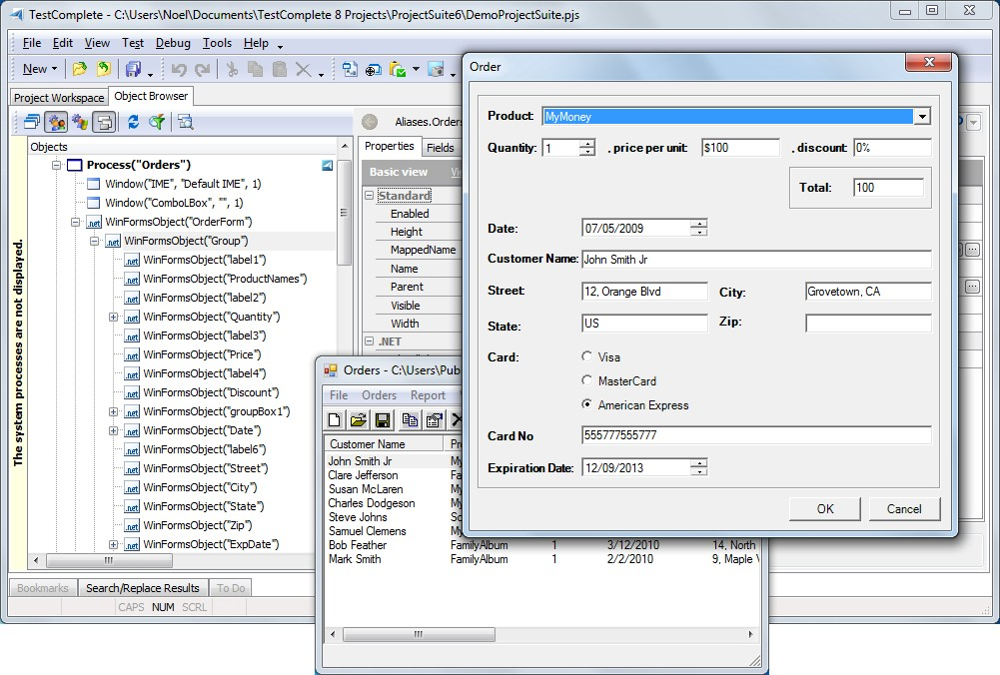

> **Figure 102 \--Orders Process and Objects**
>
> In order to manipulate and inspect elements of an application
> appearing on screen, TestComplete utilizes a process called Name
> Mapping to provide a mechanism to uniquely and consistently identify
> objects within an application. Using Name Mapping you can associate a
> user defined Name and a specific set of attributes for each object
> within an application.

#### Control Reference Options

> TestComplete provides several different ways to refer to the same
> control. Below is a table containing various paths used to denote the
> \"Customer\" edit field on the \"New Order\" dialog from the
> \"Orders\" sample application. The Name Mapping and Alias values were
> created automatically by TestComplete during a simple recording.

|**Reference**                     | **Example**                       |
|---|---|
| **FullName Property**             | Sys.Process(\"Orders\").WinFormsObject(\"OrderForm\"). WinFormsObject(\"Group\").WinFormsObject(\"Customer\")      |
| **Name Mapping**                  | NameMapping.Sys.Orders.OrderForm.Group.Customer                    |
| **Alias**                         | Aliases.Orders.OrderForm.Group.Customer                            |

> As you can see the **Name Mapping** has a one-to-one correspondence
> with objects found in the **FullName** though the **Aliases** path is
> more flexible and can be more specific to the Orders application by
> omitting the **Sys** node.

#### Benefits of Name Mapping

> Name Mapping provides several benefits that may not be immediately
> apparent such as:
>
> Provides human readable names for objects within an application,
> making tests more maintainable.
>
> Provides a level of abstraction that helps isolate the impact of UI
> changes on automated tests.
>
> Provides a more accurate mechanism to uniquely identify controls whose
> properties may change from one build to the next.

#### Automatic Name Mapping

> In early versions of TestComplete, Name Mapping had to be created
> manually, a time consuming and often tedious process. With Automatic
> Name Mapping, TestComplete constructs mapping on-the-fly at the
> completion of a recording. While Automatic Name Mapping is a welcome
> and much needed addition to the product, there are some assumptions
> regarding which properties uniquely identify an object. In many cases,
> these assumptions work very well, though you\'ll likely run into
> situations where tweaking a Name Mapping is required in order for an
> object to be recognized correctly.
>
#### Creating Name Mapping
>
> You can perform Name Mapping for a single object or for child objects
> of a given object. The difference between **Map Object\...** and **Map
> Child Objects\...** options are that **Map Object\...** maps the
> object and everything above it in the hierarchy, while **Map Child
> Objects\...** maps everything below an object in the hierarchy. These
> Name Mappings can be created from multiple places within TestComplete
> including:
>
> The Object Browser right click menu **Map Object\...** and **Map Child
> Objects\...** options.

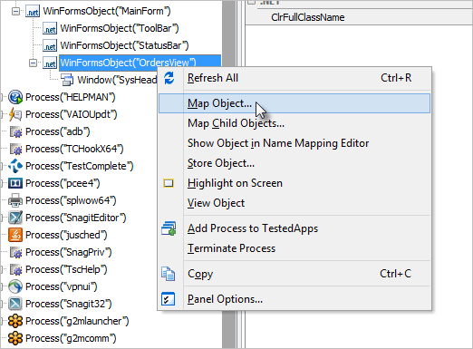

> **Figure 103 \--Object Brow ser Menu**
>
> The **Map Object From Screen** dialog.

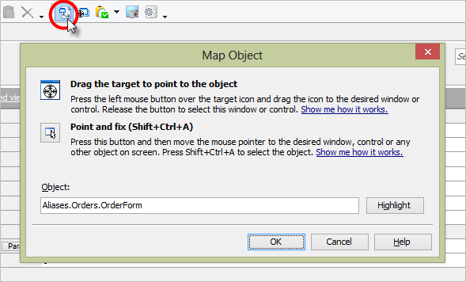

> **Figure 104 \--The Map Object Dialog**
>
> The **Map Object** and **Map Child Objects** options from the Name
> Mapping Editor\'s context menu

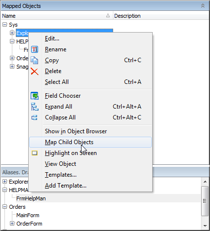

> **Figure 105 \--The Map Child Objects Dialog**

#### Mapping an Object

> Once you\'ve started the process of creating a Name Mapping,
> TestComplete will prompt you for information regarding objects to be
> mapped. For a new Name Mapping, TestComplete will prompt if you want
> to map the object as a group (that is, objects are mapped
> automatically using default properties) or if you can choose names and
> properties manually.

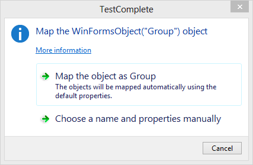

> By choosing to **Map the object as \<object name\>**, all parent
> objects are automatically mapped for you:

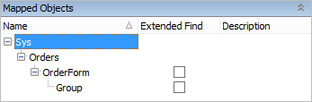

> If you select the **choose a name and properties manually** option,
> you are first asked to continue mapping the parent items.

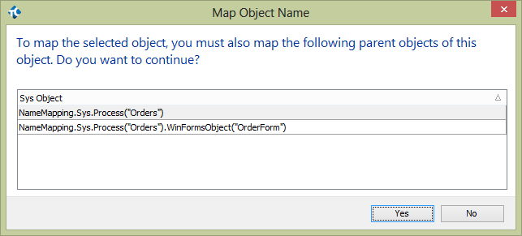

> Next, a series of **Object Name Mapping** dialogs allows you to define
> the properties for each object in turn. Notice that the heading of the
> dialog shows \"(1/3)\" indicating that it is mapping the first of
> three objects.

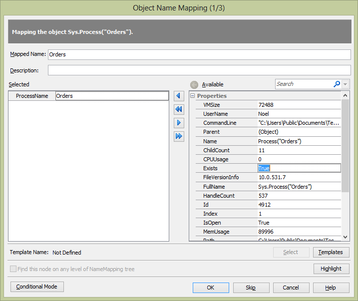

#### Mapping Child Objects

> The Map Child Objects... options maps all objects below the selected object in the hierarchy.
> The screenshots that follow show mapping the child objects of the
> object named \"Group\" found in the Orders sample project. After
> selecting the Map Child Objects..
>
> [.](#Creating_Name_Mapping) option, the **Select Objects to Map**
> dialog displays. By default, all check boxes are selected to map all
> child objects automatically. If you don\'t need to individually
> fine-tune each objects mapping, select the Map objects automatically
> checkbox located lower left on the dialog. Click the **OK** button to
> continue.

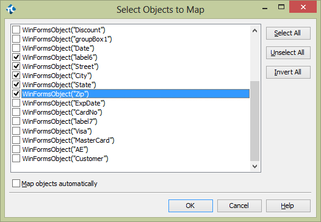

> Next, a dialog asks if you want to map the items automatically or
> manually. If you choose to map the items manually, the Object Name
> Mapping dialog appears.

#### The Object Name Mapping Dialog

> The screenshot below shows the Object Name Mapping dialog for an edit
> box named \"Street\". The dialog presents the user with **Selected**
> and **Available** property lists that define the search criteria
> TestComplete uses to locate an object within the object hierarchy. The
> TestComplete default for selected properties typically works well. But
> in the event, there is an ambiguous Name Mapping, TestComplete will
> prompt you to augment the mapping to uniquely identify the object.

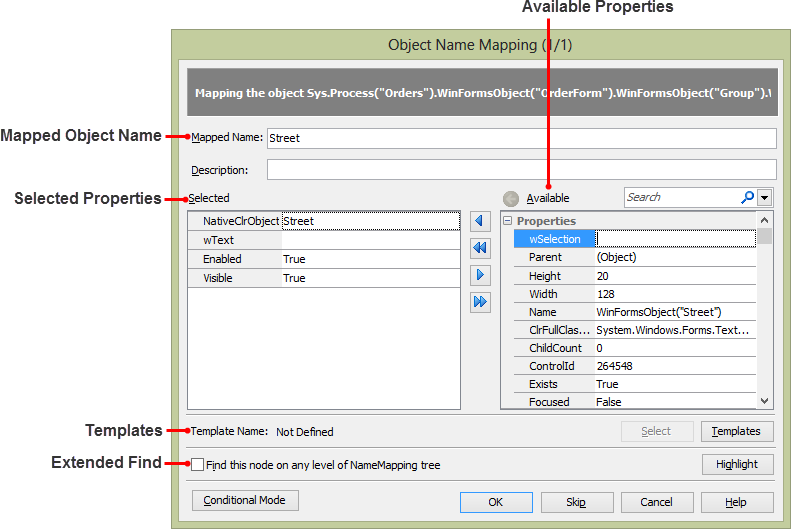

> **Figure 106 \--Object Nam e Mapping Dialog**
>
> The table below explains the elements of the Object Name Mapping
> dialog.

  |**Item** |                  **Meaning**|
  |---|---|
  |**Mapped Object Name**     | Name of the object as it will appear in code|
  |**Selected Properties**    |Properties used for object identification|
  |**Available Properties**   |Properties that can be used to augment the object\'s Name Mapping|
  |**Templates**       |Provides the option to customize the default properties used for a specific type of object|
  |**Extended Find**   |Option to expand the search for this object to all descendant objects of the parent|

#### Using Name Mapping Editor
>
> The Name Mapping Editor allows viewing, editing, updating and deleting
> elements within a Name Mapping. In addition, the editor allows for the
> creation of Name Mapping configurations which are useful for
> applications that are translated to different spoken languages. The
> Name Mapping Editor contains the following panes:
>
> Mapped Objects pane. Aliases pane.
>
> Mapped properties pane.

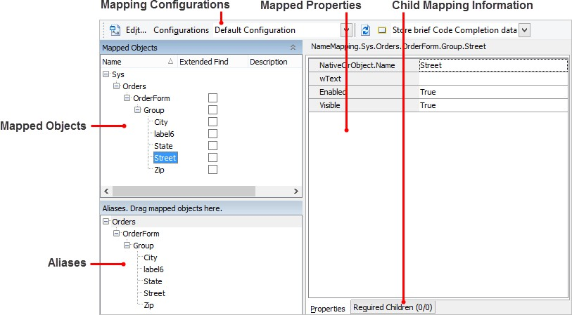

> **Figure 107 \--The Name Mapping Editor**

#### Mapped Object Pane

> The Mapped Objects Pane displays a hierarchy that directly corresponds
> to the nodes found within the Object Browser for a given application
> or object. The Mapped Objects pane must accurately reflect the
> applications own internal object structure to function properly.
> Mapped Objects can be edited using the context menu.
>
> There are columns hidden from view by default. To see them,
> right-click and select **Field Chooser** from the context menu. You
> can select the \"Extended Find\" and \"Conditional Mode\" columns.
> When **Extended Find** is checked, the search will include all
> descendant objects of the parent, not just the immediate children. If
> the **Conditional Mode** is checked, the object is mapped using
> compound conditional expressions (see the "Modifying a Name Mapping\"
> topic for more on Conditional Mode).

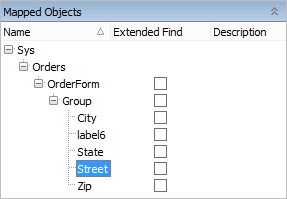

> **Figure 108 \--Mapped Objects Colum ns**

#### Aliases Pane

> The Aliases Pane is an abstract representation of the Name Mapping
> hierarchy and may not reflect the one-to-one correspondence found in
> the Name Mapping. By constructing Aliases, a user can create a more
> logical view of objects within an application and remove unnecessary
> objects from the hierarchy. For example, you can remove container
> objects which have no function other than to contain a set of child
> objects.

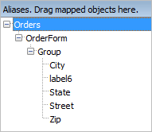

#### Properties Pane

> The Properties Pane displays a list of attributes the selected mapped
> object must have for the mapping to succeed. Each mapped object has
> one or more properties and Required Children that uniquely identify a
> specific object within an application

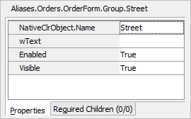

#### Leveraging Name Mapping to Manage Changes to UI

> One of the largest benefits of Name Mapping is the ability to preserve
> your investment in test automation. For example, when a UI change
> occurs that impacts the ability of an automated test to execute
> correctly, you may be able to avoid changing any of your scripts by
> simply updating the Name Mapping to adjust for the UI modification.
> Let\'s take a look at an example.
>
> Suppose in the \"Orders\" sample application the Group box on the
> \"New Order\" dialog was removed as a result of changing application
> requirements. The changes are shown in the screenshot below where the
> original dialog is displayed on the left and the modified dialog is on
> the right:

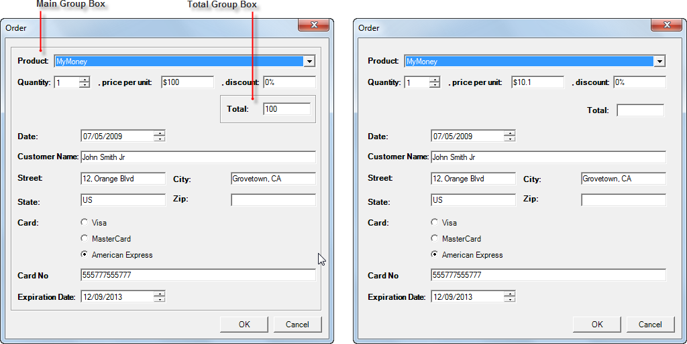

> **Figure 109 \--Original and Modified Order Dialog**
>
> All of the data entry controls previously contained by the Group box
> are now parented directly to the dialog itself. When our tests
> execute, this UI change results in an \"Object Does Not Exist\" error
> and causes the test to fail. The screenshot below shows the log with
> the error message.

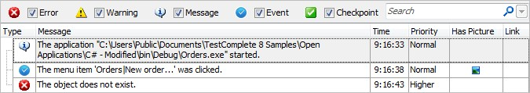

> **Figure 110 \--Failed Log After UI Change**
>
> By updating our Name Mapping we can avoid having to modify any of our
> tests, thus preserving our investment in test development and
> debugging. In this case, we can use the Name Mapping editor and
> re-parent the data entry objects that have moved and then re- run our
> tests. Here are the steps:

21. Double click the NameMapping node within the Project Explorer to
    display the Name Mapping Editor.

22. Under the Mapped Objects window select the data entry controls and
    re-parent them by dragging and dropping them onto the \"OrderForm\"
    node:

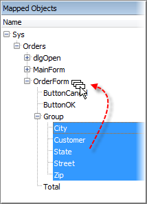

> **Figure 111 \--Re-Parenting Objects**

23. Repeat these steps for each of the data entry controls, thus
    remapping them to the \"OrderForm\". The Name Mapping will now
    appear as follows:

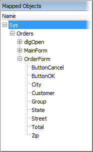

> **Figure 112 \--Rem apped Orders Dialog**
>
> These changes avoid having to modify tests that rely on a particular
> name mapping. The data entry objects are centralized, allowing us to
> quickly resolve the issues of the previous execution.

#### Handling Difficult Mapping Situations

> You may not have the luxury of knowing exactly what an object\'s
> identifier is or what property values the object contains. For this
> reason, you can map using any number of properties that uniquely
> identify an object. Instead of an object identifier, you may map using
> the object\'s text, the object position in an array, the object
> tagName if you\'re in a web page, the object\'s Parent.Name or any
> other measure that points to a particular object.

#### Modifying a Name Mapping

> In some instances where the application being tested is modified you
> will need to update the Name Mapping to allow your tests to function
> properly. In this section we\'ll look at some of the options you have
> for editing the Name Mapping.

##### Editing a Specific Object

> To modify the properties used within an existing Name Mapping simply
> right click the object from either the **Mapped Objects** or
> **Aliases** window. Then select **Edit\...** from the context menu.

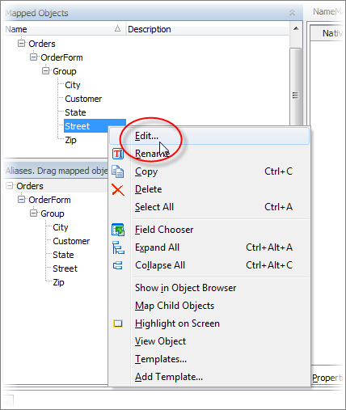

> **Figure 113 \--Editing Existing Mapping**
>
> If the object currently exists in the Object Browser you will be
> presented the **Edit Name Mapping Item** dialog allowing you to modify
> the existing mapping:

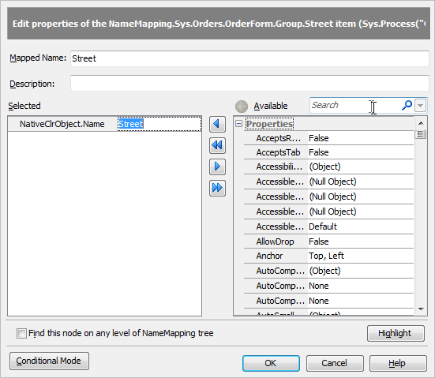

> **Figure 114 \--Modifying Existing Name Mapping**
>
> If the selected object cannot be found on your system, you\'ll be
> restricted to editing the existing values using the properties pane of
> the **Name Mapping** editor.

##### Editing a Properties Value

> Regardless of whether or not the selected object is onscreen, you can
> always modify any existing mapped properties by editing values on the
> right-hand side of the **Name Mapping editor**. Simply click the
> desired property and use the ellipsis to change the property value.

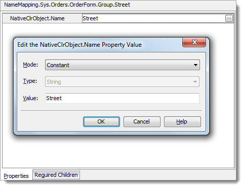

> **Figure 115 \--Edit Property**
>
#### Accessing Objects in Script
>
> TestComplete provides automatic **Name Mapping** and **Aliases** to
> tame extremely long object identifiers that have unclear default
> names. For example:
>
> Sys.Process(\"Hello\").Panel1.Panel2.Container1.Container2.button1
>
> Clearly there are numerous issues with this identifier. The identifier
> is long and awkward, not to mention we have no clue about the purpose
> or identity of \"Container1\", \"Container2\" or \"button1\". **Named
> Mappings** allow you to rename Panel1, Panel2, Container1, Container2
> and button1 to useful names like MyPanel, myInsidePanel, myTabs,
> myPages and btnSubmit. The issue here is that you still need to type:
>
> NameMappings.Sys.Process(\"Hello\").MyPanel.myInsidePanel.myTabs.myPages.btnSubmit
>
> TestComplete creates an **Alias** to represent this long string. If
> you create the Alias \"btnSubmit\", you only need to type:
>
> Aliases.btnSubmit
>
> Consider the \"Orders.exe\" application that comes as an example with
> TestComplete. If I want to have access to the header control in the
> table, TestComplete already sees the header as:
>
> \"Sys.Process(\"Orders\").WinFormsObject(\"MainForm\").WinFormsObject(\"OrdersView\")
>
> .Window(\"SysHeader32\", \"\", 1)\"
>
> \...but in TestComplete, during recording, the automatic NameMapping
> feature takes place and records the mapping as:
>
> NameMapping.Orders.MainForm.OrdersView.SysHeader32
>
> \...which makes it much easier to understand and work with in scripts.
> The screenshot below shows how this looks in the Mapped Objects and
> Aliases panes.

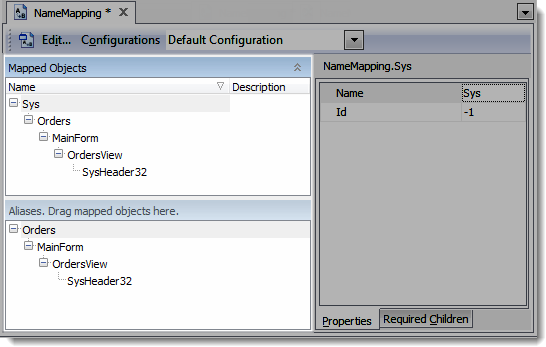

> **Figure 116 \--Nam e Mapping and Aliases**
>
> The main difference between the Mapped Objects pane and the Aliases
> pane is the fact that the Name Mapping has to respect the parenthood
> of the hierarchy of the controls on the form, but the Aliases pane can
> make the line of script much smaller by creating a specific Alias to a
> specific control that can be referred to directly in the script. So,
> with that said, we can access the Header Control in 3 different ways
> based on the example above:
>
> Sys.Process(\"Orders\").WinFormsObject(\"MainForm\")
>
> .WinFormsObject(\"OrdersView\").Window(\"SysHeader32\", \"\", 1)
> NameMapping.Orders.MainForm.OrdersView.SysHeader32
> Aliases.Orders.MainForm.OrdersView.SysHeader32
>
> But we can also drag the SysHeader32 from the Mapped Objects pane to
> the Aliases pane to make it at the same level as \"Sys\" like so:

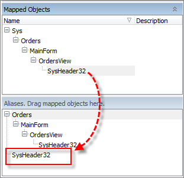

> **Figure 117 \--Dragging Mapped Object to Aliases Pane**
>
> This allows a fourth option for accessing the object:
>
> Aliases.SysHeader32
>
> In this way, Aliases allow you to ignore on-screen objects that were
> used for design but are not necessary to the test automation process.
>
> If you are recording a test, TestComplete will first try to use the
> Aliases project item in the recording. If that does not work, it will
> use the NameMapping project item. If the Alias object is available in
> the Object Browser, TestComplete will present all the properties and
> methods for that object.
>
#### Unique Identification
>
> How does TestComplete know the difference between objects on the
> screen? What happens if there are *two* controls at the same ownership
> level with the same selected properties that are equal to each other,
> how does TestComplete know how to differentiate between them when the
> test is run?
>
> For example, in the \"Orders\" application, how does TestComplete know
> the difference between edit boxes when creating a new order? In the
> screenshot below, the address portion of the dialog that creates a new
> order shows little apparent difference between the edit boxes.

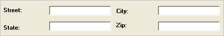

> **Figure 118 \--Address Edit Boxes**
>
> Let\'s say now you need to manually add the edit box for \"Street\" to
> your Name Mapping Project Item. From the Object Browser tab, right
> click the \"Street\" edit box item and choose the **Map Object\...**
> context menu option.

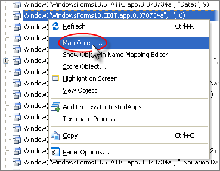

> **Figure 119 \--Mapping the Toolbar**
>
> If you have trouble locating the item in the Object Browser, invoke
> the **Object Spy** from the main toolbar. You can use this to locate
> the onscreen object you're looking for and then highlight the object
> back in the Object Browser. Or you can use the **Map Object from
> Screen** from the main toolbar to map the object starting with the
> on-screen object.

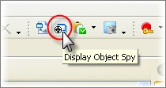

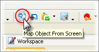

> The Object Name Mapping dialog will appear that allows you to specify
> a new name for the edit box, provide a description, and most
> importantly, select the properties that make the component unique on
> the form.
>
> By moving properties from the \"Available\" list to the \"selected\"
> list, the dialog makes TestComplete identify that control on the form
> by these attributes. Of course, the more properties you select the
> more unique the control would be. Notice in the screenshot below that
> the \"WndClass\" and \"Index\" property have been automatically
> selected to make the object unique. For best performance, it is
> important to distinguish between instances of an object using the
> fewest number of properties that make a name mapping unique.

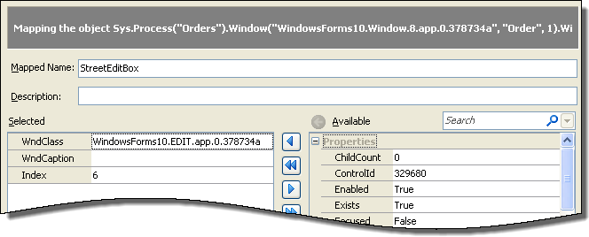

> **Figure 120 \--Object Nam e Mapping Dialog**
>
#### Summary
>
> In this chapter, we covered the TestComplete Name Mapping feature. We
> looked at:
>
> The benefits of Name Mapping for preserving automated tests when UI
> changes occur. Automatic Name Mapping.
>
> Conditional Name Mapping.
>
> Various options for creating a Name Mapping including mapping multiple
> objects at one time.
>
> The Name Mapping dialog and discussed fixing Name Mapping issues.