### Overview of TestComplete

Objectives
----------

> This chapter takes you on a tour of the TestComplete IDE including the
> windows that make up the Workspace and Object Browser. You will learn
> about the layout of the IDE, how project suites and projects are
> organized and how the TestComplete Object Browser works with processes
> and applications in your system. You will learn about the tools for
> recording and playing back tests. Finally, you see how the innovative
> Test Visualizer allows you to work with visual elements, even when the
> test is no longer running.
>
#### About the IDE
>
> The layout of TestComplete is quite similar to other software
> development tools such as Visual Studio. Below is screenshot of the
> TestComplete **Integrated Development Environment** or **\"IDE\"**.

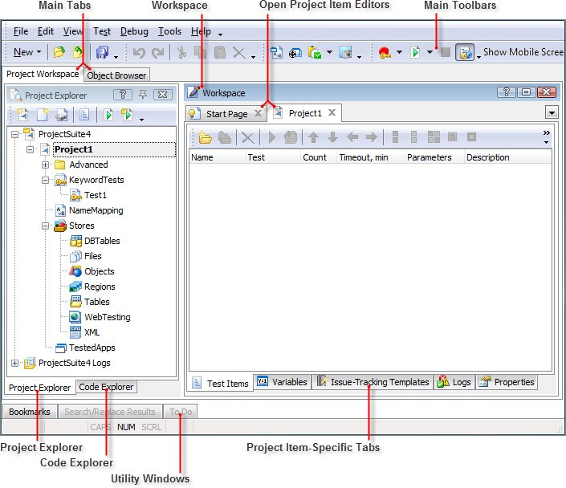

> The TestComplete IDE contains two main tabs:
>
> **Project Workspace** \-- The primary area for developing and
> executing TestComplete tests.
>
> **Object Browser** \-- A tree view explorer containing TestComplete
> objects.
>
> []{#Project_Workspace .anchor}**Project Workspace**
>
> The **Project Workspace** is used to record and develop automated
> tests. The Project Workspace contains two primary panels:
>
> **Workspace Panel** \-- Hosts the editors for any items you have
> opened from the Project Explorer.
>
> **Project Explorer Panel** \-- Used to create, edit and modify your
> test Projects.

#### Workspace Panel

> The **Workspace Panel** is where TestComplete displays various editor
> panels opened from the Project Explorer. The Workspace is a tabbed
> view displaying one tab for each of the editor windows open in the
> current session. The screenshot below shows the Workspace panel with
> tabs opened for a project, a script unit and for events.

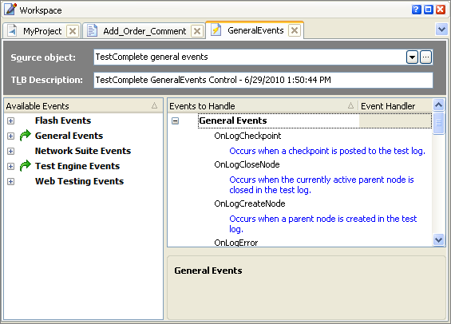

> **Figure 1 \--The Workspace Panel**
>
> The most critical editor you will see in the Workspace is for an
> opened project. The project editor is crucial because it is used to
> organize individual tests into larger suites and to reuse your tests
> in different configurations. See the \"Project Organization\" chapter
> for a complete discussion of this important topic.

#### Project Explorer Panel

> The Project Explorer panel contains **Project Explorer** and **Code
> Explorer** tabs.

##### Project Explorer

> Test organization in TestComplete has three main levels: project
> suite, project and project items. The **Project Explorer** tab
> provides a hierarchical view of the open ProjectSuite and any projects
> contained within it. Each project contains project items such as
> \"Events\" or \"Script\". Within the project items are child elements
> appropriate to the type of project
>
> item, such as script units for example. The Project Explorer also
> contains a **ProjectSuite Logs** node that contains test logs grouped
> by project.

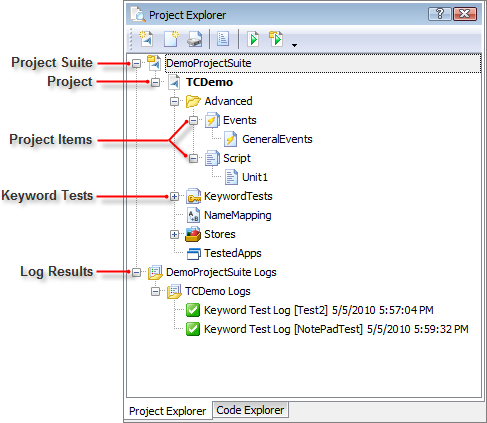

> **Figure 2 \--Project Explorer Tab**

##### Project Suites

> TestComplete organizes files into **Project Suites and** **Projects**.
> Project Suites contain one or more projects. Project suites are
> created automatically when a new project is created. Project suites
> can also be created manually before adding new projects. Project
> Suites provide a root folder for organizing the contents of your
> automated tests. While you can have more than one project in a
> ProjectSuite you can also have multiple Project Suites but only one
> may be open at any time within TestComplete.

##### Projects

> **Projects** contain **Project Items** which are specific types of
> functionality useful for performing various types of automation. From
> the **Project Explorer** you can create, edit, and delete **Project
> Items** in your project using the context menu options:

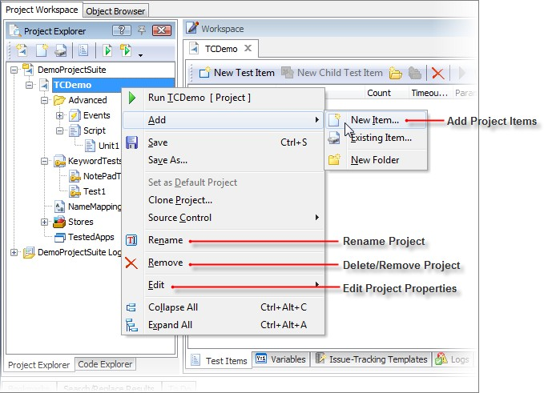

> **Figure 3 \--Project Context Menu**
>
> To add, rename or remove **Project Items,** right click the Project
> node in the Project Explorer and select **Add \| New Item\...,
> Rename** or **Remove**. TestComplete allows you completely customize
> your projects through the Project Explorer context menu. If you\'re
> using TestComplete in conjunction with a Source Control repository you
> can access the options for checking in/out various project files from
> the context menu using the **Source Control** option. For details on
> configuring a Source Control Provider refer to TestComplete online
> help.

##### Project Item Elements

> Project Items may contain zero or more **Project Item Elements**
> depending on the specific item. Project Item Elements represent the
> testing functionality of the Project Item or serve to organize its
> contents. For example, under the **KeywordTests** node you will see
> individual KeywordTest nodes and under the **Script** node you will
> see individual Script Units. Certain nodes, like **Name Mapping** have
> no Project Item Elements and others have a fixed set like the
> **Stores** Project Item.

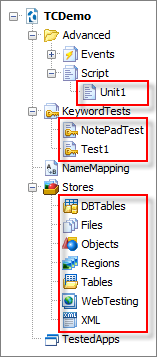

##### Code Explorer

> The **Code Explorer** tab also contains a hierarchical view of your
> project but displays Code Metrics and related data about your project
> suite, projects, units and tests. The Code Explorer view provides a
> deeper hierarchy, making it useful to help navigate script routines in
> large suites and projects. The Code Explorer also allows you to
> cut-copy-paste and execute routines directly, via the context menu.

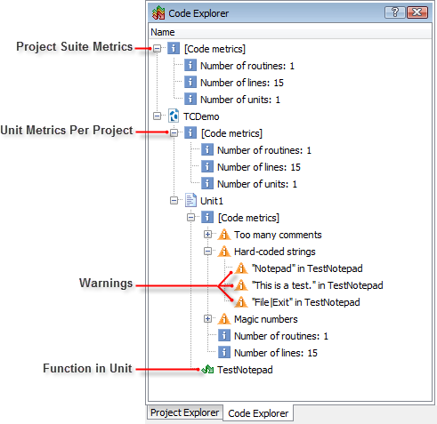

> **Figure 4 \--Code Explorer Tab**

##### TestedApps

> TestComplete provides a specific type of Project Item, **TestedApps**,
> which allows you to associate specific applications with a project.
> TestedApps makes it easy to launch and work with applications from
> within your Keyword Tests or Script.

##### TestedApps Columns

> The columns of the TestedApps Editor window are:

  **Column**       **Description**
  ---------------- ------------------------------------------------------------------------------------------------------------------------------------------------------------------------------------
  **Icon**         Show the icon associated with the tested application.
  **Launch**       When checked, this application will be run if the TestedApps.RunAll command is used (either from script or context menu).
  **Name**         The name that TestComplete uses to refer to the tested application (must be a name that the scripting language can handle).
  **File Name**    The name of the application on disk.
  **Count**        This is the number of instances of the application that TestComplete will launch. If the application is already running, TestComplete will post a warning message in the Test Log.
  **File Path**    By default, File Path is the relative path to the file name from the TestComplete project.
  **Run Mode**     How the application is launched.
  **Parameters**   Allows parameters to be set using the ellipses button.

##### Run Mode

> **Run Mode** determines the login account and execution context of a
> TestedApp. Run Mode can be one of the following values:
>
> **Simple** \-- Launches the application under the same user account as
> TestComplete. Parameters can be passed in Simple mode.
>
> **RunAs** \-- Launches the application under the user account
> specified by the parameters dialog.
>
> **Debug** \-- Launches the application under the same user account as
> TestComplete, then TestComplete attaches to the application as a
> \"debugger\". The stack trace of any exception that occurs in the
> application while the test(s) are being run will be recorded in the
> test log. This option requires debug information in the application
> under test.
>
> **Profile** \-- Launches the application inside of AQtime using the
> profile (or AQtime project) specified in the parameters dialog. For
> example, code coverage profiling could be used to see how much of the
> code is being tested by your automated tests.

##### Adding TestedApps to a Project

1.  On the Project Explorer, right click the TestedApps node and select
    **Add \| New Item\...**

2.  Click the button for the **Application** entry and choose a path to
    an executable file. **Note**

> : You can also use the Object Browser to find a running application
> and select **Add Process to TestedApps** from the context menu.

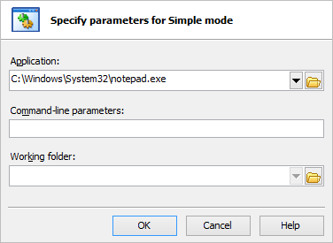

> **Figure 5 \--Adding an Application**
>
> The application is added to the list of TestedApps. Now you can change
> the File Name or other settings in the TestedApps Editor window. The
> examples in the screenshot below show \"Notepad\" and \"Internet
> Explorer\" added to the TestedApps list.

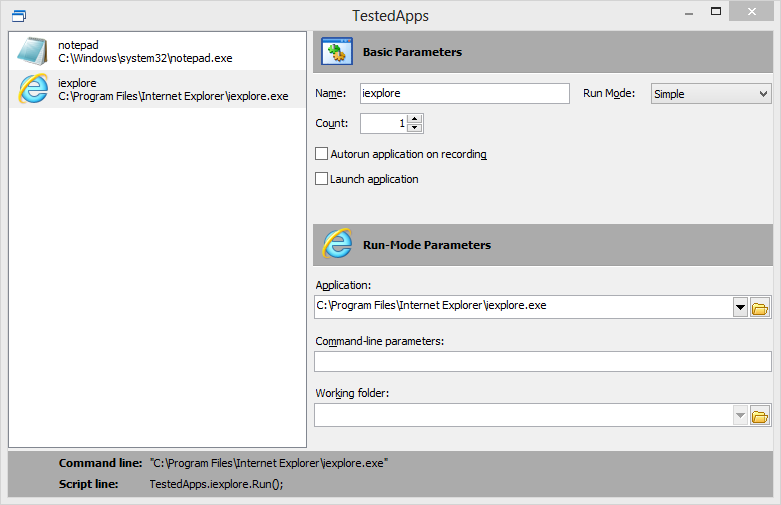

> **Figure 6 \--TestedApps**
>
> The File Path dialog will let you simply navigate to a particular file
> and open it. The file path will be entered for you. Notice in the
> screenshot above that you can also substitute variables for
> \"%SYSTEMROOT%\" and \"%PROGRAM FILES%\". If you run the test on
> another machine, the \"System\" and \"Program Files\" directories may
> be located differently, so the test will be less likely to break if
> you use these variables instead of hard coded paths.

##### Running a TestedApp

> TestedApps can be run interactively from the TestComplete IDE, from a
> keyword test or from script.
>
> To run the application from the TestComplete IDE, right-click the
> TestedApp and then select the **Run Selected** context menu option.
> The app will run according to the type of application it is. Desktop
> apps will display their main window, Android applications will be
> loaded onto the device and then launched, and so on.

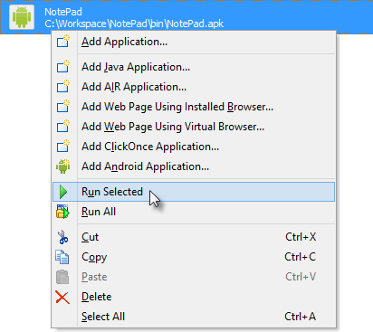

> To run a TestedApp from a Keyword test:

1.  Drag the **Run TestedApp** operation into the test area.

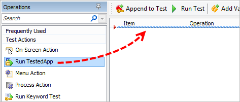

2.  Select the TestedApp you want to run in your keyword test. Click the
    **Finish** button.

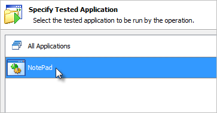

> To run a TestedApp from Script use the **TestedApps** object, followed
> by the name of the TestedApp you have defined and then call the
> **Run()** method.
>
> TestedApps.NotePad.Run();
>
> []{#Object_Browser .anchor}**Object Browser**
>
> The **Object Browser** is the core technology enabling TestComplete to
> perform automation. Understanding how it works is fundamental to
> successfully developing automated tests.
>
> The **Object Browser** displays how TestComplete \"sees\" your system,
> displaying a tree view representation of all of the Processes,
> Windows, Controls and Objects found on your machine. For each object,
> TestComplete provides a list of all **Properties** and **Methods**.
> The screenshot below shows the Object Browser window and the selected
> Properties for the \"Orders\" process.

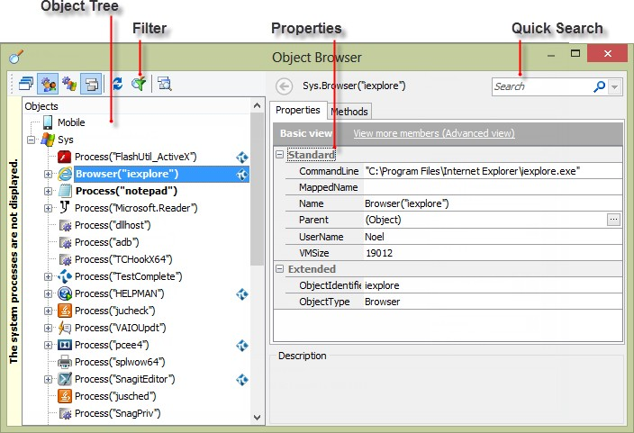

> **Figure 7 \--The Object Browser**

#### Object Tree

> The **Object Tree** displays a hierarchy of TestComplete objects
> allowing you to automate processes, windows and controls available on
> your system. The object hierarchy is refreshed frequently to provide
> an accurate \"picture\" of the various objects. The toolbar above the
> tree provides options to filter the number of objects TestComplete
> displays. Filtering allows you to hide nodes that are not relevant to
> your test automation.

#### Properties Tab

> The **Properties tab** displays a list of object properties and their
> values that reflect details of the object selected in the Object Tree.
> Properties can be read-only, read/write or write- only. Read/write
> properties can be directly manipulated within the Object Browser
> window. Some properties such as the "Parent\" property are themselves
> objects. You can use the ellipse button on the right-hand edge of the
> properties list to navigate into these parent objects. The list of
> properties may contain different categories such as **Standard**,
> **Extended** and **.NET** and can vary depending on the selected
> object. TestComplete allows you to inspect these values in your
> automated tests and uses them to uniquely identify objects through the
> use of \"Name Mapping\" (see the \"Name Mapping\" chapter for more
> information).

#### Methods Tab

> The **Methods** tab lists actions and functions that can be called
> from TestComplete on the selected object. Methods range from common
> items such as finding or waiting on child objects/properties to
> interacting with an onscreen object through functions such as
> **Click**, **DblClick** and **Keys** etc.

#### Fields and Events

> The **Fields** and **Events** tabs only display when objects have this
> information available.

#### Basic and Advanced Views

> Both Properties and Methods tabs have links that toggle between
> \"Basic View\" and \"Advanced View\". The Advanced View shows all
> possible items while the Basic View shows only the items that you\'re
> most likely to use. The screenshot below shows the Basic View for
> Properties in the \"Notepad\" process. The pane lists properties that
> you might commonly use such as the \"CommandLine\", \"Name\" and
> \"Parent\".

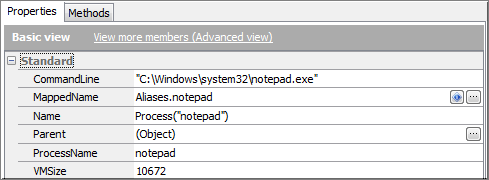

> **Figure 8 \--The Basic View**
>
> The Advanced View list includes every possible property of the
> process. The screenshot below shows the significantly longer list that
> includes the basic items plus more obscure properties such as
> \"HandleCount\" and \"ThreadCount\".

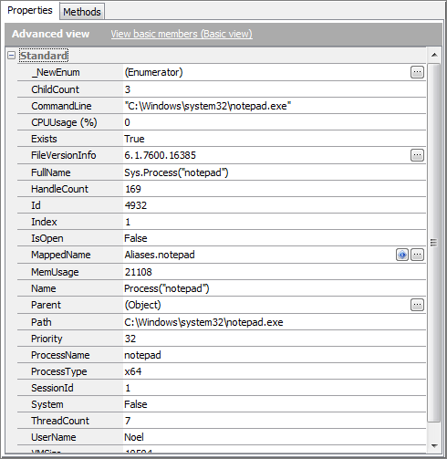

> **Figure 9 \--The Advanced View**
>
> If you don\'t see a particular property you think should be available,
> don\'t forget that you can toggle to the Advanced View for a complete
> list.

#### Quick Search

> Properties and Methods can be instantly filtered using the Quick
> Search feature. The screenshot below shows \"name\" entered as the
> search criteria and only the properties that contain \"name\" are
> listed with the search criteria highlighted. Click the \"x\" button to
> clear the filter. Use the drop-down list to choose from previous
> searches.
>
> 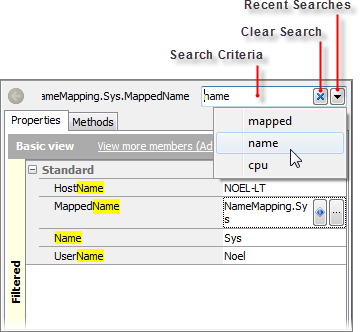
>
> **Figure 10 \--Quick Search**

#### Limitations of the Object Browser

> While the Object Browser is a powerful tool that can inspect most
> applications, there are certain situations where TestComplete is
> unable to provide access into an objects internal data or
> sub-controls. For example, if your application uses a grid control
> that is not specifically supported by TestComplete, you may not be
> able to easily see the row and column data contained within the
> control. In such cases you will need to explore alternative mechanisms
> in order to automate that object. This particular topic can get quite
> involved and goes beyond the scope of what we can cover in this book.

#### Object Browser Context Menu

> The Object Browser Context Menu lets you work with individual
> processes and windows. The screenshot below shows the context menu for
> one of the windows in the \"Notepad\" process.

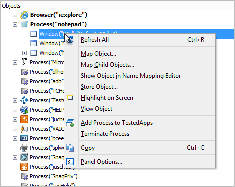

> **Figure 11 \--The Object Browser Context Menu**
>
> **Refresh** \-- Reloads the object tree.
>
> **Map Object\...** \-- Name Maps the selected object. See the \"Name
> Mapping\" topic for more information.
>
> **Map Child Objects\...** \-- Name Maps the child objects of an
> existing named object.
>
> **Show Object in Name Mapping Editor** \-- Navigates to the Name
> Mapping Editor and selects the current object. See the \"Name
> Mapping\" topic for more information.
>
> **Store Object\...** \-- Saves the object and its children in a Store.
> See the \"Stores and Checkpoints\" topic for more information.
>
> **Highlight on Screen** \-- Places a highlight border on the selected
> window if the window is visible.
>
> **View Object** \-- Captures a window in the Image Viewer.
>
> **Add Process to TestedApps** \-- Adds the selected process (or parent
> process if a window is selected) to the TestedApps node.
>
> **Terminate Process** \-- Immediately shuts down the selected process.
> It\'s not recommended that you use this option if you can close the
> application normally.
>
> **Copy** \-- Makes a copy of the text for the selected node in the
> Windows clipboard.
>
> **Panel Options\...** \-- Navigates to the main menu\'s **Tools \|
> Options** page for the Object Browser.
>
> []{#TestComplete_Toolbars .anchor}**TestComplete Toolbars**
>
> TestComplete has toolbars configured right out-of-the-box and you can
> also setup your own toolbars. The Tools and Test Engine toolbars below
> provide quick access to tasks you want to perform on-the-fly.

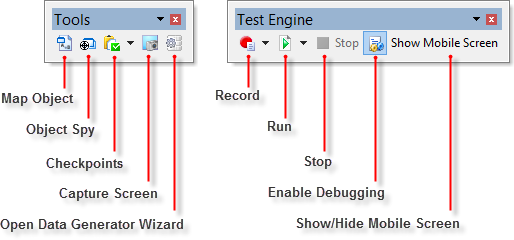

> **Map Object** \-- Displays the **Map Object** dialog with options to
> find objects and add them to Name Mapping.
>
> **Object Spy** \-- Displays the **Object Spy** dialog with options to
> find objects and display their properties and methods.
>
> **Checkpoints** \-- Allows you to add Clipboard and Manual
> Checkpoints.
>
> **Capture Screen** \-- Captures the current screen and displays in the
> Image Viewer.
>
> **Open Data Generator Wizard** \-- Opens the data generator to create
> semi-random data in spreadsheets and variables.
>
> **Record, Run, Stop** \-- The Record button starts recording a keyword
> or script test and brings up the Recording Toolbar. The Run button
> begins playing a project or project suite. The Stop button halts a
> currently playing project or project suite.
>
> **Enable Debugging** \-- When pressed, you can debug your keyword or
> script test.
>
> **Show Mobile Screen** \-- Displays or hides the **Mobile Screen**.

#### Custom Toolbars

> To customize existing toolbars or to create a brand-new toolbar,
> right-click anywhere in the existing toolbars and select **Customize**
> from the context menu. This will display the Customize dialog where
> you can enable, create, edit and delete toolbars. In the Commands tab
> of the dialog you can find all menu options used in TestComplete. You
> can drag any of these commands to your toolbars.

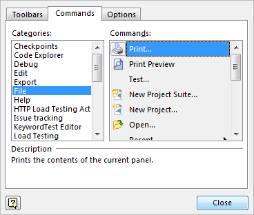

> **Figure 12 \--Customize Dialog**
>
> []{#Playback .anchor}**Playback**
>
> Similar to the options for recording tests, TestComplete provides
> multiple tools for playback. Tests can be executed from the main
> toolbar or from within the Keyword or Script editors. The Playback
> Indicator provides additional control and feedback as the test
> executes.

#### Playback from the Test Engine Toolbar

> Individual tests can be run automatically when the project runs. The
> first step to execute a test as part of a project is to create a
> **Project Test Item**.

1.  Double click the Project Explorer **Project Node** to display the
    **Project** tab in the Workspace

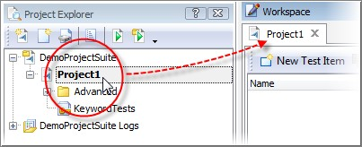

> **Figure 13 \--Displaying the Project Tab**

2.  Click the **Test Items** tab at the bottom of the Workspace

3.  Right-click the Test Items area and select **New Test Item** from
    the context menu. This will add a project item to the list.

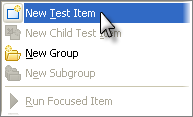

> **Figure 14 \--Creating a New Test Item**

4.  Click the ellipses in the **Test** column of the project item. This
    will display the **Select Test** dialog. Select the Script Unit from
    the list that contains your test and then select the routine from
    the Available Tests list. Click the **OK** button to save the Test
    information.

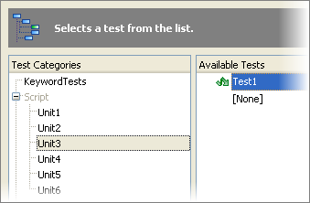

> **Figure 15 \--Selecting an Available Test**

5.  Once you\'ve created a **Test Item** for the Keyword Test, click the
    **Run Project** button on the **Test Engine** toolbar to execute all
    the **Test Items** configured for the project.

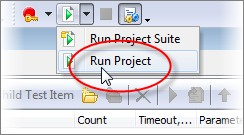

> **Figure 16 \--Run from Toolbar**
>
> For more information on Project Test Items, see the \"Project
> Organization\" chapter.

#### Playback from the Script Editor

> Script functions can be manually run directly from within the Code
> Editor window by using the **Run Current Routine** button on the
> Editor Toolbar. You can also find a matching option in the context
> menu.

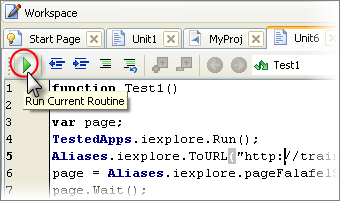

> **Figure 17 \--Running a Script Test from Toolbar**

#### Executing Keyword Tests from Script

> In addition to the above methods, Keyword Tests can be called directly
> from a script routine using the KeywordTests object. To create this
> line of code:

1.  From the Project Explorer expand the **Advanced** and **Script**
    nodes under your project.

2.  Double click a script unit to display the code editor.

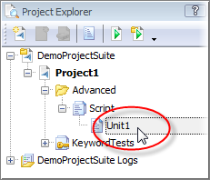

> **Figure 18 \--Opening the Code Editor**

3.  At the bottom of the script unit add the following function:

> **function** Test()
>
> {
>
> KeywordTests.Test1.Run();
>
> }
>
> **Sub** Test KeywordTests.Test1.Run
>
> **End Sub**
>
> The screenshot below shows \"Unit1\" with the new \"Test\" function.

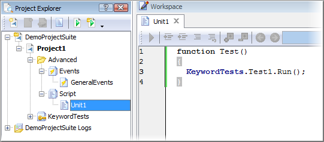

> **Figure 19 \--Calling a Keyword Test from JScript**

#### Playback Indicator

> When the test is actually run, the **Playback Indicator** displays
> status messages and allows you to pause or stop the test.

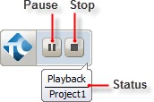

> **Figure 20 \--The Playback Indicator**
>
#### Summary
>
> In this chapter we toured the TestComplete IDE and overviewed the
> windows that make up the Workspace and Object Browser. You learned
> about the layout of the IDE, how project suites and projects are
> organized and how the TestComplete Object Browser works with processes
> and applications in your system. You learned about the tools for
> recording and playing back tests. Finally, you saw how the innovative
> Test Visualizer allows you to work with visual elements, even when the
> test is no longer running.