TestComplete© Scripting Workshop
by Alain "Lino" Tadros
------------------------------------------------------------

#### Welcome to TestComplete Scripting Workshop

##### © 2019 Alain "Lino "Tadros

All rights reserved. No parts of this work may be reproduced in any form or by any means - graphic, electronic, or mechanical, including photocopying, recording, taping, or information storage and retrieval  systems - without the written permission of the publisher.

Products that are referred to in this document may be either trademarks and/or registered trademarks of the respective owners. The publisher and the author make no claim to these trademarks.

While every precaution has been taken in the preparation of this document, the publisher and the author assume no responsibility for errors or omissions, or for damages resulting from the use of information contained in this document or from the use of programs and source code that may accompany it. In no event shall the publisher and the author be liable for any loss of profit or any other commercial damage caused or alleged to have been caused directly or indirectly by this document.

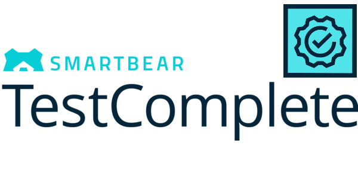

**Table of Contents**

[Overview of TestComplete](./Overview/readme.md)
--------------------------------------------------------

[Scripting](./Scripting/readme.md)
--------------------------

[Project Organization](./Project%20Organization/readme.md)
------------------------------------------------

[Test Log](./Test%20Log/readme.md)
------------------------

[Stores and Checkpoints](./Stores%20and%20Checkpoints/readme.md)
----------------------------------------------------

[Name Mapping](./Name%20Mapping/readme.md)
---------------------------------

[TestComplete Debugging](./Debugging/readme.md)
-----------------------------------------------------

[Event Handling](./Event%20Handling/readme.md)
-------------------------------------

[Data Driven Testing](./Data%20Driven%20Testing/readme.md)
-----------------------------------------------

[Web Testing](./Web%20Testing/readme.md)
-------------------------------

[Mobile](./Mobile/readme.md)
---------------------

[Web Services Testing](./Web%20Services%20Testing/readme.md)
-------------------------------------------------

[Distributed Testing](./Distributed%20Testing/readme.md)
----------------------------------------

[Manual Testing](./Manual%20Testing/readme.md)
----------------------------------------

[Low Level Procedures](./Low%20Level%20Procedures/readme.md)
-----------------------------------------------

[User Forms](./User%20Forms/readme.md)
----------------------------------------

[Best Practices](./Best%20Practices/readme.md)
-------------------------------------

[Appendix A - Cheat Sheet](./Cheat%20Sheet/readme.md)
------------------------------------------------

[Appendix B - Types of Testing](./Types%20of%20Testing/readme.md)
-------------------------------------------------------------------

### Distributed Testing

14. []{#_bookmark259 .anchor}**Distributed Testing**

> **Objectives**
>
> This chapter looks at TestComplete Distributed Testing features and
> illustrates how you can use this feature to leverage multiple machines
> during test execution. You'll learn how to create projects for use in
> distributed testing and how to make them available to remote machines.
> You\'ll also explore some of the issues with executing and
> synchronizing tests on multiple computers.

About the Network Suite
-----------------------

> Distributed tests are executed using the Project Explorer. To enable
> Distributed Testing within a project it is necessary to add the
> **Network Suite** Project Item. The Network Suite contains sub-nodes
> allowing you to configure which tests will execute and on which
> machines. The machine running the Distributed Test functions as a
> heads-up display, allowing you to monitor the status of the machines
> participating in the test.
>
> All of the machines participating in a Distributed Test must be using
> the same version of TestComplete.

#### Single Machine Test Execution

> To get a better understanding of how Distributed Testing works let\'s
> first take a look at how a single project works on one machine. In the
> illustration below we can see a single machine connected to a source
> code repository running a project where tests are executed locally.

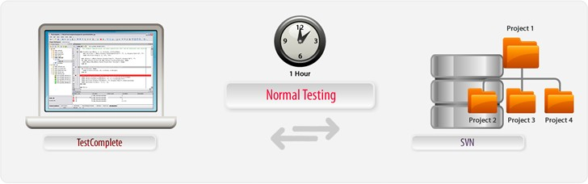{width="5.932162073490813in"
height="1.8525in"}

> **Figure 189 \--Single Project Executing on a Single CPU**
>
> In this setup the machine running TestComplete (or TestExecute) pulls
> the project source files from the repository and executes the test.
> Because the tests run synchronously, the total runtime is one hour.

#### Multiple Machine Test Execution

> Now, let\'s look at the same test run in a Distributed Testing
> environment using the Network Suite. In the illustration below, we see
> a single driver machine running a copy of TestComplete which controls
> test execution on multiple host machines running either TestComplete
> or TestExecute. All of the machines have access to the project, which
> contains the Network Suite Project Item, from the repository. In this
> setup the total running time of the project takes only 15 minutes as
> each machine executes different tests within the project.

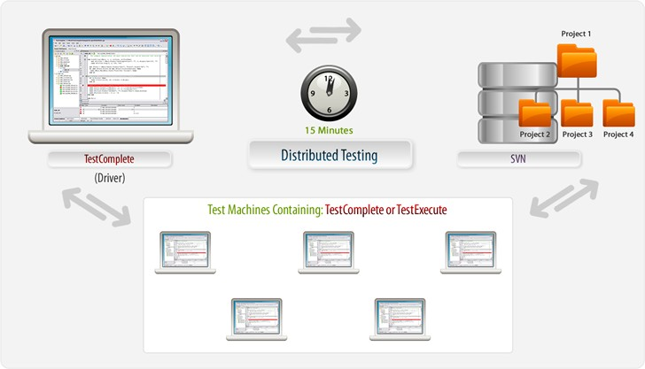{width="5.924021216097988in"
height="3.3881244531933508in"}

> **Figure 190 \--Running Parts of a Project Across Multiple Machines**
>
> In fact, this example illustrates just one scenario for Distributed
> Testing where all of the machines execute tests from a single project.
> However, tests can be executed from any project that has the Network
> Suite Project Item and do not have to be related in any significant
> way. TestComplete Distributed Testing features allow testers to tailor
> test execution to cover a wide variety of scenarios.

Setting up a Distributed Test
-----------------------------

> In this section we\'ll create a project with a simple test that we can
> execute using Distributed Testing. First, we\'ll use the recorder to
> create a basic test then modify the Project to add support for
> Distributed Testing.
>
> Our focus here is creating and configuring a Distributed Test,
> therefore we\'re going to record a very simplistic test for
> illustration purposes only.

#### Recording a Simple Test Case

54. Select **File \| New \| Project\...** and click the **OK** button on
    the Create Project dialog.

55. Right click the **TestedApps** node and select **Add \| New
    Item\...** Using the Add Tested Application dialog select
    \"C:\\Windows\\System32\\Notepad.exe\".

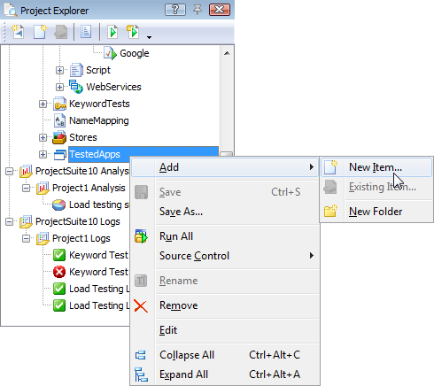{width="5.105459317585302in"
height="4.541666666666667in"}

> **Figure 191 \--Adding a TestedApp**

56. Double click the **TestedApps** node to open the editor in the
    Workspace.

57. Change the File Path for \"Notepad\" to %SystemRoot%\\System32\\
    using an environment variable to ensure the test will work on any
    Windows machine.

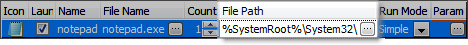{width="4.87323053368329in"
height="0.45937445319335085in"}

> **Figure 192 \--Change the File Path to use an Environm ent Variable**

58. Click the Record button on the recording toolbar.

59. Using the TestedApps drop down button start \"Notepad\".

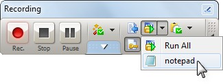{width="3.3686362642169727in"
height="1.2684372265966755in"}

> **Figure 193 \--Running Notepad**

60. In the Notepad main window type \"this is a test\".

61. On the Notepad main window select **File \| Exit** and click the
    **No** button on the confirmation dialog.

#### Configuring the Project for Distributed Testing

> We now have a test that will execute on any remote machine so let\'s
> add the **Network Suite** Project Item and configure our test to run
> on a remote system.

1.  Right click the Project node in the Project Explorer and select
    **Add \|New Item\...** from the context menu.

2.  In the Create Project Item dialog select **NetworkSuite**.

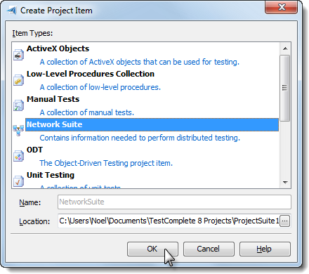{width="4.584633639545057in" height="4.0625in"}

> **Figure 194 \--Creating the Network Suite Project Item**
>
> This adds the following nodes to our Project:

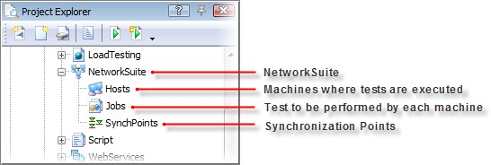{width="5.651023622047244in"
height="1.8975in"}

> **Figure 195 --Network Suite nodes**
>
> Now we can begin to add Hosts and Jobs to our Network Suite to
> construct a Distributed Test.

#### Working With Hosts

##### Adding Hosts

> Under the **NetworkSuite**, **Hosts** are machines that will execute
> as part of a Distributed Test. From the **Project Explorer** you can
> double click the **Hosts** node to view the Hosts editor window in the
> Workspace and all of the hosts configured for the Distributed Test
> will appear in the list.
>
> To add a Host to the NetworkSuite:

1.  Right click the Hosts node and select **Add \| New Item\...** from
    the context menu. On the Create Project Item dialog specify \"LAB1\"
    for the Name field and click the **OK** button.

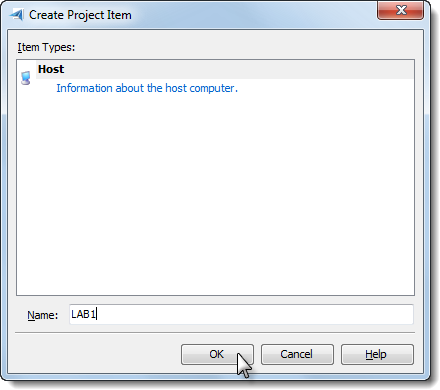{width="4.584633639545057in" height="4.0625in"}

> **Figure 196 \-- Adding a Host**

2.  In the Hosts Editor, set the **Address** column to the IP address or
    use the ellipsis to choose the machine by network name.

3.  Under the **Base Path** column assign a path relative to the Host
    machine (we\'re using \"C:

> \\Temp\" in this case).

4.  Under the **Source Path** column assign the file path to the
    Project\'s .MDS file.

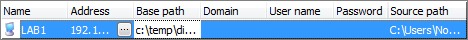{width="4.889529746281715in"
height="0.408332239720035in"}

> **Figure 197 \--Setting the IP address, Base Path and Source Path**

##### Hosts Editor Columns

> The Hosts Editor has the following columns:

  **Column**       **Description**
  ---------------- -------------------------------------------------------------------------------------------------------------------------------------------------------------------------------------------------------------------------------------------------------------------------------------------------------------------------------------------------------------------------------------------------------------------------------
  **Name**         The name used to refer to the host from scripts, keyword tests and from the task properties.
  **Address**      The network name or IP address of the computer that the new host is mapped to.
  **Login Mode**   The Manual option requires the remote machine to be logged into before running the test. The Automatic RDB Session connects to the remote computer using Remote Desktop and leaves the computer locked and unavailable to users. The Automatic RDB Session connects to the remote computer using Remote Desktop but moves the session to the remote computer\'s console, leaving the computer unlocked and available for use.
  **Domain**       Specifies the domain to which the user specified in the User name column belongs.
  **User name**    Specifies the account used to open a user session on the slave computer automatically when verifying or running the network suite.
  **Password**     Specifies the password used to open a user session on the slave computer automatically when verifying or running the network suite. If the parameter is skipped, TestComplete will use an empty string.

  **Column**        **Description**
  ----------------- -------------------------------------------------------------------------------------------------------------------------------------------------------------------------------------------------------------------
  **Base path**     Specifies the common path for several projects, which are located on the computer specified by the Address property. TestComplete uses this value to prefix paths specified by a task's Path property.
  **Source path**   Specifies the path to the folder (located on the master computer) holding the slave project that can be copied from the master computer to the host computer. The path should be relative to the master computer.

> There are several other useful items available from the context menu
> on the Hosts Editor including

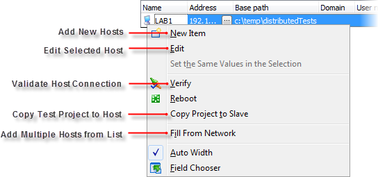{width="5.678537839020122in"
height="2.65625in"}

> **Figure 198 \--Hosts Editor Context Menu**

##### Verifying the Host Connection

> Due to the fact that remote machines may not be configured properly,
> TestComplete provides an option to verify the connection to a Host
> machine. You can use the context menu **Verify** option from the
> **Host Editor** as well as the **Project Explorer** context menu on
> the **Hosts** node.

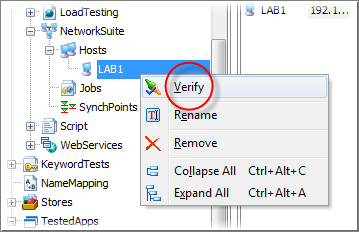{width="3.7453094925634294in"
height="2.4166666666666665in"}

> **Figure 199 \--Verifying a Host connection**
>
> Refer to TestComplete online help for Firewall configuration details.

##### Copying the Project to the Host

> Now that we\'ve verified the connection and setup our project we can
> copy it to the host machine to prepare for execution. Once we finish
> configuring our test we may want to perform this step again to ensure
> all of our updates are on the Host machine. In practice, tests should
> be stored in a source control repository and loaded onto the host
> machines from there.
>
> 1\. Right click the \"LAB1\" host entry in the Hosts Editor window and
> select **Copy Project to Slave** from the context menu.

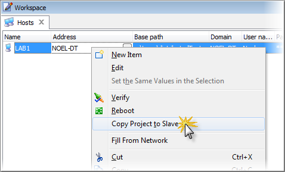{width="4.986001749781277in"
height="3.0104166666666665in"}

> **Figure 200 \--Copying the project to the Host (Slave) m achine**

##### Other Remote Tasks

> Also, be aware that you can restart the remote computer by
> right-clicking and choosing
>
> **Reboot** from the context menu.

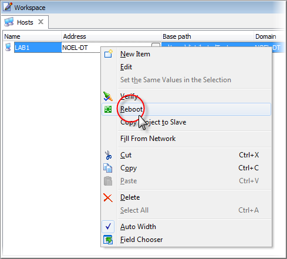{width="5.0948862642169725in"
height="4.59375in"}

> **Figure 201 \--Rebooting the Rem ote Machine**
>
> The **Run State** tab of the NetworkSuite editor displays information
> about the network suite, job or task execution. The **Remote Desktop**
> column actually shows you the window of the slave/host computer as it
> runs. The window displays in the resolution of the master computer.

#### Tasks Editor Window

> The columns in the Tasks Editor are as follows:

  **Column**   **Description**
  ------------ ---------------------------------------------------------------------------------
  **Active**   Specifies whether the task will be run when the job, to which it belongs, runs.

+-----------------------------------+-----------------------------------+
| **Column**                        | **Description**                   |
+===================================+===================================+
| **Name**                          | The name that is used to refer to |
|                                   | the task in tests.                |
+-----------------------------------+-----------------------------------+
| **Host**                          | The name of a computer where the  |
|                                   | project will be run.              |
+-----------------------------------+-----------------------------------+
| **Path**                          | The path to the TestComplete      |
|                                   | project or project suite which    |
|                                   | the task will run.                |
+-----------------------------------+-----------------------------------+
| **Test**                          | Specifies the test item to be     |
|                                   | executed by the task. There is a  |
|                                   | specific syntax for this string   |
|                                   | which is documented in            |
|                                   | TestComplete online help.         |
+-----------------------------------+-----------------------------------+
| **Tag**                           | Specifies an arbitrary string     |
|                                   | associated with the given task.   |
+-----------------------------------+-----------------------------------+
| **Action after run**              | Specifies what TestComplete will  |
|                                   | do after it finishes executing    |
|                                   | the task on the Host computer.    |
|                                   |                                   |
|                                   | Available options in the          |
|                                   | drop-down list are:               |
|                                   |                                   |
|                                   | > \[None\] - Do nothing (do not   |
|                                   | > close TestComplete or           |
|                                   | > TestExecute either). Use this   |
|                                   | > value in combination with the   |
|                                   | > Use value for the Use previous  |
|                                   | > instance option in order to     |
|                                   | > reduce the workload of the      |
|                                   | > remote computer. In this case,  |
|                                   | > after finishing the task the    |
|                                   | > TestComplete (TestExecute)      |
|                                   | > instance on the remote host     |
|                                   | > will not be closed and it will  |
|                                   | > be used for running the next    |
|                                   | > task.                           |
|                                   | >                                 |
|                                   | > \[Close\] - Close the           |
|                                   | > TestComplete (TestExecute).     |
|                                   | > Default value. \[Shut Down\] -  |
|                                   | > Shut down the Host computer.    |
|                                   | >                                 |
|                                   | > \[Reboot\] - Reboot the Host    |
|                                   | > computer.                       |
+-----------------------------------+-----------------------------------+

+-----------------------------------+-----------------------------------+
| **Column**                        | **Description**                   |
+===================================+===================================+
| **Copy remote log**               | Specifies whether and in which    |
|                                   | cases TestComplete should copy    |
|                                   | the remote log of the task        |
|                                   | execution to the master computer. |
|                                   | This property is only meaningful  |
|                                   | if the project specified by the   |
|                                   | Path property is located on a     |
|                                   | computer other than the master    |
|                                   | computer.                         |
|                                   |                                   |
|                                   | Available options in the          |
|                                   | drop-down list are:               |
|                                   |                                   |
|                                   | > \[Always\] - TestComplete       |
|                                   | > copies the results to the       |
|                                   | > master computer at the end of   |
|                                   | > the task execution. Copying     |
|                                   | > results increases the task      |
|                                   | > execution time and uses some    |
|                                   | > disk space, but you can review  |
|                                   | > the results at any time, even   |
|                                   | > if the remote computer is not   |
|                                   | > available. Copied results are   |
|                                   | > kept on your computer until you |
|                                   | > delete them.                    |
|                                   | >                                 |
|                                   | > \[When status is not OK\] -     |
|                                   | > TestComplete copies the results |
|                                   | > to the master computer only if  |
|                                   | > the log on the task execution   |
|                                   | > includes errors and/or          |
|                                   | > warnings.                       |
|                                   | >                                 |
|                                   | > \[Do not copy\] - The task      |
|                                   | > results remain on the remote    |
|                                   | > computer. To view them, you     |
|                                   | > must have access to the results |
|                                   | > folder. Storing results on the  |
|                                   | > remote computer saves disk      |
|                                   | > space on your computer, but you |
|                                   | > may not be able to view them,   |
|                                   | > since the remote computer can   |
|                                   | > be offline or the results       |
|                                   | > folder may be inaccessible.     |
+-----------------------------------+-----------------------------------+

+-----------------------------------+-----------------------------------+
| **Column**                        | **Description**                   |
+===================================+===================================+
| **Use previous instance**         | Specifies whether TestComplete    |
|                                   | will close the remote             |
|                                   | TestComplete (or TestExecute)     |
|                                   | process before executing the      |
|                                   | task.                             |
|                                   |                                   |
|                                   | Available options in the          |
|                                   | drop-down list are:               |
|                                   |                                   |
|                                   | > \[Use\] - Use the running       |
|                                   | > instance of the remote          |
|                                   | > TestComplete (TestExecute). Use |
|                                   | > this value in combination with  |
|                                   | > the None value for the Action   |
|                                   | > after run option in order to    |
|                                   | > reduce the workload of the      |
|                                   | > remote computer. In this case,  |
|                                   | > after finishing the task, the   |
|                                   | > TestComplete (TestExecute)      |
|                                   | > instance on the remote host     |
|                                   | > will not be closed and it will  |
|                                   | > be used for running the next    |
|                                   | > task.                           |
|                                   | >                                 |
|                                   | > \[Show Error\] - Display the    |
|                                   | > error message. Default value.   |
|                                   | >                                 |
|                                   | > \[Terminate\] - Reboot the      |
|                                   | > remote TestComplete             |
|                                   | > (TestExecute) process. Use this |
|                                   | > value to ensure that the task   |
|                                   | > will not fail if previous tasks |
|                                   | > or test runs caused critical    |
|                                   | > errors in the remote            |
|                                   | > TestComplete (TestExecute)      |
|                                   | > instance.                       |
+-----------------------------------+-----------------------------------+
| **Remote application**            | Specifies what testing            |
|                                   | application, TestComplete or      |
|                                   | TestExecute, will be used on the  |
|                                   | remote workstation.               |
+-----------------------------------+-----------------------------------+

#### Synchronizing Computers

> A **SynchPoint** delays execution of a test until all computers with
> that SynchPoint reach the synchronization point. When all the
> computers with a named SynchPoint hit that Synchronize Point, they
> will continue on with their test. An example of an effective use for
> SynchPoints: you want to avoid where two or more users try to edit the
> same record at the same time and post the data.

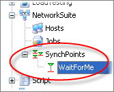{width="1.7247451881014872in"
height="1.381874453193351in"}

> **Figure 202 \--SyncPoints**

##### Using SynchPoints in Script

> To use a SynchPoint, the **NetworkSuite.Synchronize()** method,
> passing the name of the SynchPoint (\"WaitForMe\" in the example).
>
> **NetworkSuite**.Synchronize(\"WaitForMe\");
> **NetworkSuite**.Synchronize(\"WaitForMe\")

Executing Distributed Tests
---------------------------

> There are several options for executing Distributed Tests including
> manually in the Project Explorer, from Keyword Tests and from Script.

#### Manual Execution

> The easiest option is to use the context menu from the Project
> Explorer. You can execute either individual Jobs or specific Tasks
> within a job directly from the context menus.

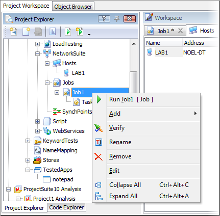{width="4.444857830271216in" height="4.3725in"}

> 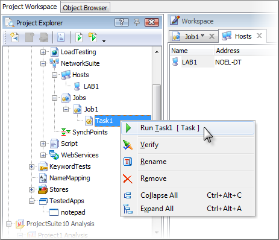{width="4.8246216097987755in"
> height="4.145833333333333in"}

#### Script Execution

> To run from Script, use the **NetworkSuite** object to access Jobs,
> then use the **ItemByName()** method to get at a specific job. From
> there, call the job\'s **Run()** method. Running tasks uses a similar
> pattern, except that from the job we drill down one more level to the
> **Tasks** and then to the specific task, again using the
> **ItemByName()** method before calling **Run()**.
>
> **NetworkSuite**.Jobs.ItemByName(\"Job1\").Run(**true**);
> **NetworkSuite**.Jobs.ItemByName(\"Job1\").Tasks.ItemByName(\"Task1\").Run(**true**);
>
> **NetworkSuite**.Jobs.ItemByName(\"Job1\").Run(**true**)
> **NetworkSuite**.Jobs.ItemByName(\"Job1\").Tasks.ItemByName(\"Task1\").Run(**true**)

#### Runtime Behavior

> TestComplete uses Windows Remote Desktop to display the remote
> computer as the test runs. You will need to configure your remote
> computer to accept Remote Desktop connections for the distributed test
> to work. See the documentation for your operating system for more
> information on accepting Remote Desktop connections.

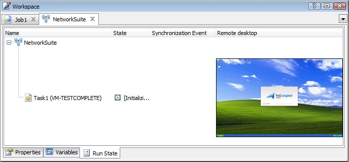{width="5.932345800524934in"
height="2.7580205599300087in"}

> **Figure 203 \--A Running Distributed Test**

Lab: Simple Distributed Test
----------------------------

#### Configure The Project

1.  Create a master project with a NetworkSuite Project Item.

2.  Create a hosted (slave) project with a **NetworkSuite** Project
    Item.

{width="3.7453094925634294in"
height="2.4166666666666665in"}

> **Figure 204 \--Verifying the Host**

3.  Add \"Notepad.exe\" to the **TestedApps** project Item of the hosted
    project.

4.  Modify the **File Path** property of the TestedApp to **\"\"**
    (blank).

#### Record a Test

1.  Create (or record) a Keyword Test to type something into notepad.
    For example:

> 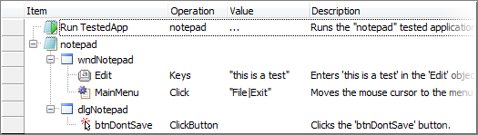{width="5.440261373578303in"
> height="1.5365616797900263in"}

2.  Save the project.

> **Figure 205 \--Testing Notepad**

#### Create the Distributed Test

1.  Select the **NetworkSuite** Project Item in the Master Project and
    enter the path to the project suite in the **Shared Path**.

2.  Expand the **Hosts** Project Item and select \"Host1\"

3.  Enter the name (or IP address) of the hosting (slave) computer.

4.  In the **Base** path property enter \"\\\\\<Master Computer
    Name\>\\\<Name of Project Suite directory\>\"

5.  Right-click on \"Host1\" and select **Verify** from the context
    menu.

6.  Expand the **Jobs** Project Item.

7.  Expand the \"Job1\" Project Item.

8.  Select the \"Task1\" Project Item.

9.  In the **Path** property enter \"\\\<Name of Hosted
    Project\>\\\<Name of Hosted Project\>. mds\".

10. In the **Copy remote log** property select \"\[Always\]\". 11.In the
    **Use previous instance** property select \"\[Use\]\".

<!-- -->

12. In the **Test** property enter the path to your test on the hosted
    machine. If you\'re running a Keyword Test then the path might be
    similar to \"\<Name of Hosted
    Project\>\\KeywordTests\\Test1\\Test1\". If running a Script then
    the path would look something like this path: \"\<Name of Hosted
    Project\>\\Script\\Unit1\\Test1\".

13. Right-click \"Task1\" and select **Verify** from the context menu.

14. Right-click the **NetworkSuite** project item and select **Run**
    from the context menu.

Lab: Synchronizing Computers
----------------------------

> There are times when you want to have one computer wait for another
> computer to complete at least part of its task before finishing the
> first computer\'s task. For example, you want the consumer\'s computer
> to wait until the bank\'s computer has processed a debit before the
> consumer\'s computer checks its balance. We will show a couple of ways
> to synchronize.

#### Using SyncPoints

1.  Modify the test in hosted (slave) project.

> **var** p1
>
> **var** w1 TestedApps.notepad.Run();
>
> p1 = Sys.Process(\"notepad\");
>
> w1 = p1.Window(\"Notepad\", \"\*\").Window(\"Edit\"); w1.HScroll.Pos =
> 0;
>
> w1.VScroll.Pos = 0;
>
> w1.Click(135, 29);
>
> w1 = p1.Window(\"Notepad\", \"\*\");
> w1.Window(\"Edit\").Keys(NetworkSuite.Variables.Var1);
> w1.Window(\"Edit\").Keys(\"\[Enter\]\");
> NetworkSuite.Synchronize(\"SynchPoint1\");
>
> w1.Close();
>
> p1.Window(\"\#32770\", \"Notepad\").Window(\"Button\",
> \"&No\").ClickButton();
>
> var p1 var w1
>
> TestedApps.notepad.Run();
>
> p1 = Sys.Process(\"notepad\");
>
> w1 = p1.Window(\"Notepad\", \"\*\").Window(\"Edit\"); w1.HScroll.Pos =
> 0;
>
> w1.VScroll.Pos = 0;
>
> w1.Click(135, 29);
>
> w1 = p1.Window(\"Notepad\", \"\*\");
> w1.Window(\"Edit\").Keys(NetworkSuite.Variables.Var1);
> w1.Window(\"Edit\").Keys(\"\[Enter\]\");
> NetworkSuite.Synchronize(\"SynchPoint1\");
>
> w1.**Close**();
>
> p1.Window(\"\#32770\", \"Notepad\").Window(\"Button\",
> \"&No\").ClickButton();

2.  Right-click the **SynchPoints** Project Item, select **Add \| New
    Item\...** from the context menu.

3.  Hit **Enter** on the Create Project Item dialog.

4.  Create a script in the master project.

> NetworkSuite.Variables.Var1 = \"TestComplete\";
> NetworkSuite.Run(**false**); NetworkSuite.WaitForState(ns\_Running);
> Delay(30000);
>
> NetworkSuite.Variables.Var1 = \"Rocks\";
> NetworkSuite.Synchronize(\"SynchPoint1\");
> NetworkSuite.WaitForState(ns\_Idle);
>
> **NetworkSuite**.Variables.Var1 = \"TestComplete\";
> **NetworkSuite**.Run(false);
> **NetworkSuite**.WaitForState(ns\_Running); Delay(30000);
>
> **NetworkSuite**.Variables.Var1 = \"Rocks\";
> **NetworkSuite**.Synchronize(\"SynchPoint1\");
> **NetworkSuite**.WaitForState(ns\_Idle);

5.  Right-click the **SynchPoints** Project Item, select **Add \| New
    Item\...** from the context menu.

6.  Hit **Enter** on the Create Project Item dialog.

7.  Right-Click in the newly created script and select **Run Current
    Routine** from the context menu.

8.  Observe that on the hosted computer, \"TestComplete\" will be typed,
    followed by a delay and then on a new line \"Rocks\" will be typed.

#### Using NetworkSuite Variables

> NetworkSuite variables allow TestComplete to send data from one
> computer to another.

1.  Modify the test in hosted (slave) project.

> **var** p1
>
> **var** w1 TestedApps.notepad.Run();
>
> p1 = Sys.Process(\"notepad\");
>
> w1 = p1.Window(\"Notepad\", \"\*\").Window(\"Edit\"); w1.HScroll.Pos =
> 0;
>
> w1.VScroll.Pos = 0;
>
> w1.Click(135, 29);
>
> w1 = p1.Window(\"Notepad\", \"\*\");
> w1.Window(\"Edit\").Keys(NetworkSuite.Variables.Var1);
> w1.Window(\"Edit\").Keys(\"\[Enter\]\"); NetworkSuite.Variables.Var2 =
> **true**; NetworkSuite.WaitForNetVarChange(\"Var2\",**false**);
> w1.Window(\"Edit\").Keys(NetworkSuite.Variables.Var1); w1.Close();
>
> p1.Window(\"\#32770\", \"Notepad\").Window(\"Button\",
> \"&No\").ClickButton();
>
> **Dim** p1
>
> **Dim** w1 TestedApps.notepad.Run
>
> **Set** p1 = Sys.Process(\"notepad\")
>
> **Set** w1 = p1.Window(\"Notepad\", \"\*\").Window(\"Edit\")
> w1.HScroll.Pos = 0
>
> w1.VScroll.Pos = 0
>
> **Call** w1.Click(135, 29)
>
> **Set** w1 = p1.Window(\"Notepad\", \"\*\")
>
> **Call** w1.Window(\"Edit\").Keys(NetworkSuite.Variables.Var1)
> **Call** w1.Window(\"Edit\").Keys(\"\[Enter\]\")
> NetworkSuite.Variables.Var2 = True
>
> **Call** NetworkSuite.WaitForNetVarChange(\"Var2\",false)
>
> **Call** w1.Window(\"Edit\").Keys(NetworkSuite.Variables.Var1)
> w1.**Close**
>
> p1.Window(\"\#32770\", \"Notepad\").Window(\"Button\",
> \"&No\").ClickButton

2.  Create a script in the master project.

> NetworkSuite.Variables.Var1 = \"TestComplete\";
> NetworkSuite.Run(**false**);
> NetworkSuite.WaitForNetVarChange(\"Var2\",**true**);
> NetworkSuite.Variables.Var1 = \"Rocks\"; NetworkSuite.Variables.Var2 =
> **false**; NetworkSuite.WaitForState(ns\_Idle);
>
> NetworkSuite.Variables.Var1 = \"TestComplete\" NetworkSuite.Run(false)
>
> **Call** NetworkSuite.WaitForNetVarChange(\"Var2\",true)
> NetworkSuite.Variables.Var1 = \"Rocks\" NetworkSuite.Variables.Var2 =
> False NetworkSuite.WaitForState(ns\_Idle)

3.  Add the variable \"Var2\" to the master project in the
    **NetworkSuite** project item.

4.  Right-click in the newly created script and select **Run Current
    Routine** from the context menu.

> The hosted computer will do the same things as the SynchPoint demo,
> but with less delay in the project. Notice that the hosted computer
> can pass data back to the master computer.

Summary
-------

> In this chapter, we looked at how TestComplete can distribute testing
> to remote machines. We looked at the structure of distributed tests
> and discussed why they can be beneficial.
>
> We also recorded a simple test and examined the necessary steps to
> execute the test in a distributed environment.

### Manual Testing

Manual Testing
==============

Objectives
----------

> This chapter looks at TestComplete support for Manual Testing
> including how to create, edit and execute Manual Tests. You\'ll learn
> about the upgrade path from manual to automatic tests using the
> TestComplete import and export features. You\'ll also learn how to use
> events within a manual test to allow interaction between manual and
> automated tests.

[]{#_bookmark287 .anchor}

About Manual Testing
--------------------

> If you've worked in any sort of Quality Assurance capacity you\'ll
> likely be intimately familiar with manual testing and perhaps more so
> than you might like. Manual testing while extremely valuable can be
> difficult for humans to perform consistently over long periods of time
> because of human nature itself. Manual testing generally takes a great
> deal of concentration and dedicated effort to consistently produce
> results. TestComplete provides an alternative to what could be
> considered the more classical approach of using Microsoft Word or
> Excel. TestComplete support for manual testing allows the test
> developer to guide the tester through a series of steps, capture data
> as the test is being performed and automatically log the results of
> the test. The benefits of manual testing through TestComplete are:
>
> The assurance that the required steps are followed Generation of a log
> file for every test execution Verification of the results based on
> Test Log contents Ability to interact with a manual test using Events
>
> Below is an example of the TestComplete manual test user interface:

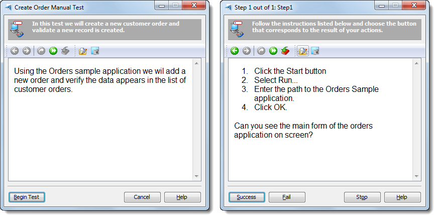{width="5.947606080489939in" height="2.9425in"}

> **Figure 206 \--The TestComplete Manual Testing User Interface**

Creating Manual Tests
---------------------

> In this topic we\'ll walk through the process of creating a Manual
> Test in TestComplete.

62. Select **File \| New \| New Project\...** and click **OK** on the
    **Create New Project** dialog.

63. Right click the **Project** node in the **Project Explorer,** select
    **Add \| New Item\...** and choose **Manual Tests**.

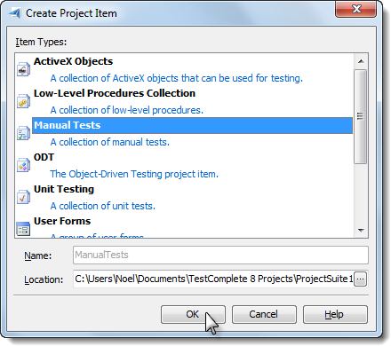{width="3.4336461067366577in"
height="3.0468744531933507in"}

> **Figure 207 \-- Creating the Manual Tests Project Item**

64. Click **OK** on the **Create Project Item** dialog.

65. Right click the **ManualTests** node in the Project Explorer and
    select **Add \| New Item\...**

> to create a new Manual Test.

66. On the **Create Project Item** dialog enter \"CreateOrder\" as the
    name of the manual test and click **OK** to open the Manual Test
    Editor.

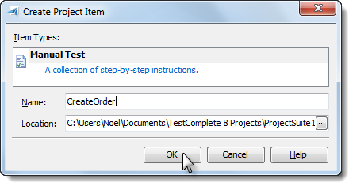{width="3.405962379702537in"
height="1.7806244531933508in"}

> **Figure 208 \--Creating the Manual Test Item**

#### Manual Test Editor

> The TestComplete Manual Test Editor allows for the creation of a
> multi-step test that prompts the user through a series of
> instructions, collecting results with every step.

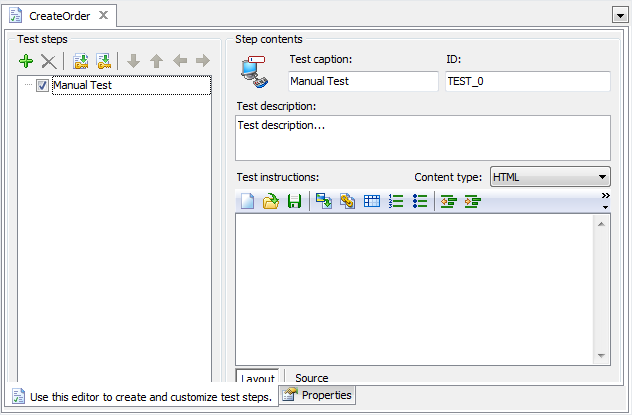{width="5.929561461067366in"
height="3.8906244531933507in"}

> **Figure 209 \--Manual Test Editor**

#### Manual Test Editor Controls

  **Field**               **Description**
  ----------------------- ----------------------------------------------------------------------------------------------------------------------------------------------------
  **Test Steps**          Tree of the steps contained within this test, used for navigation while editing.
  **Test Caption**        Window caption of the Manual Test dialog.
  **ID**                  Step ID for use within Manual Test events.
  **Test Description**    Sub caption of the Manual Test dialog.
  **Test Instructions**   Free-form HTML markup for communicating the actual actions to be performed during the test. Appears in the main portion of the Manual Test dialog.

  **Field**                     **Description**
  ----------------------------- -----------------------------------------------------------------------------
  **Test notes and comments**   Notes for the test writer that are not displayed when the test is executed.

#### Editing the Test Description

> By default, the **Manual Test Editor** opens with only the initial
> node created so we\'ll need to add steps to fill out the test. To
> create a Manual Test description:

1.  Click the **Test Caption** field and enter \"Create Order Manual
    Test\".

2.  Edit the **Test Description** field and set the text to \"In this
    test we will create a new customer order and validate a new record
    is created.\"

3.  Edit the **Test Instructions** field and set the test to \"Using the
    Orders sample application we will add a new order and verify the
    data appears in the list of customer orders.\" The result should
    look like the following:

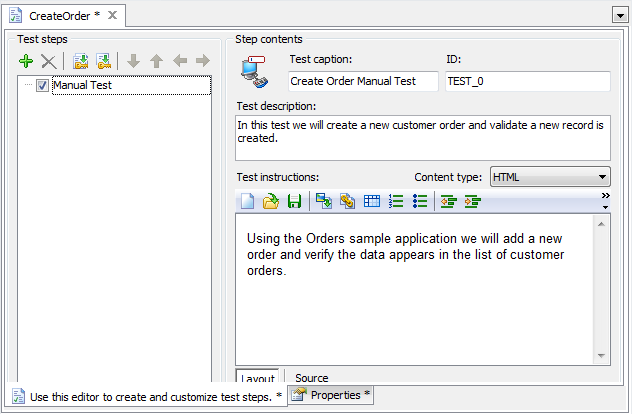{width="5.93113188976378in" height="3.88125in"}

> **Figure 210 \--The Manual Test Editor with Test Description**

#### Adding Steps

> Once the description is completed we can start adding steps to the
> test as follows:

1.  Click the green (+) sign or right click in the Test Steps area and
    select **New Step** from the context menu.

{width="3.112386264216973in"
height="1.7221872265966753in"}

> **Figure 211 \--Adding a new step to the Manual Test**

2.  Fill out the Step **Caption**, **Description** and **Instructions**
    for this step of our Manual Test. The actual information can be
    arbitrary or you can use the screenshot below to guide you.

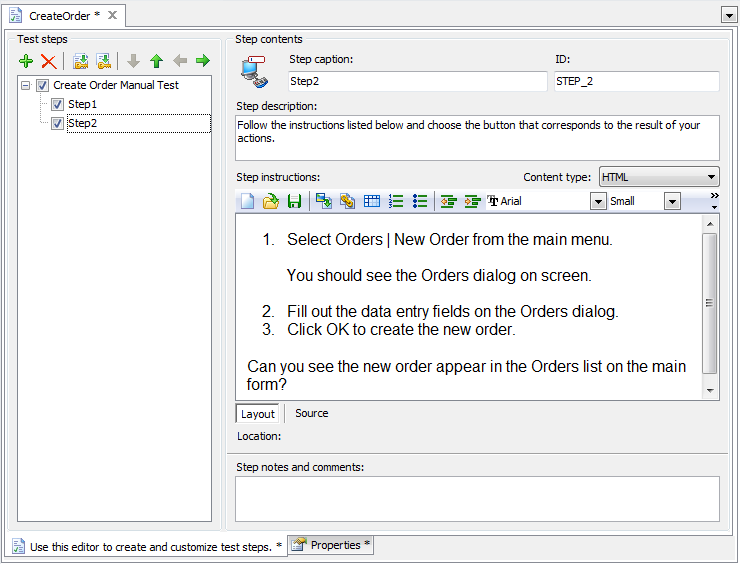{width="5.941329833770778in"
height="4.523748906386702in"}

> **Figure 212 \--Completed Manual Test**

3.  Add one more manual step and fill out the Step **Caption**,
    **Description** and **Instructions**

> for this step

#### Running Manual Tests

> Manual Tests are run from Script using the name of the test followed
> by the **Start()** method. The manual test object also comes with
> **Suspend()** and **Resume()** methods that can be used in event
> handlers.
>
> ManualTest1.Start(); ManualTest1.Start()

Manual Test Interaction With Automated Tests
--------------------------------------------

> In this topic we\'ll illustrate how manual tests interact with
> automated tests. You can call a manual test from a Keyword Test or
> Script. The reverse is also true. You an call Keyword Tests or Script
> from your manual test.
>
> You might be thinking \"Why would I do this?\" which is a fair
> question. The interesting thing about Manual Tests in TestComplete is
> that you can augment a test by performing actions automatically for
> the user and by incorporating a Manual Test into a Keyword Test or
> Script you can execute any actions necessary to ease the testing
> process such as setup test data, create/delete files, launch
> applications etc. You can also replace parts of your manual test
> incrementally as circumstances dictate, allowing you to move over to
> automated testing in a controlled manner.

Exporting a Manual Test
-----------------------

> Once you\'ve created a manual test you\'re given two options to export
> the test content using the context menu to either Microsoft Word or
> HTML:

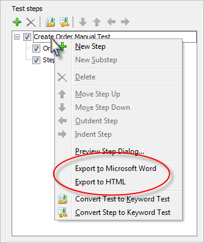{width="3.47748687664042in"
height="4.145833333333333in"}

> **Figure 213 \--Exporting Manual Tests**
>
> TestComplete provides an option to customize the Microsoft Word export
> template on the Properties tab at the bottom of the editor window. The
> export functionality works in a mail merge like fashion and allows you
> to create a Microsoft Word document containing the contents of the
> test.

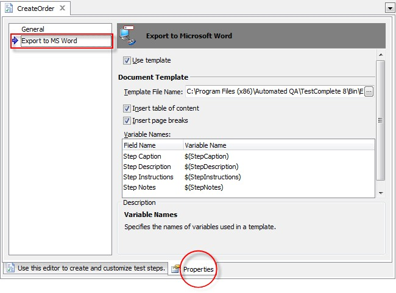{width="5.900073272090989in"
height="4.368124453193351in"}

> **Figure 214 \--Manual Test Editor Properties tab**
>
> You can optionally, define your own Microsoft Word template for use
> with the TestComplete export feature. TestComplete includes a default
> template that looks like this:

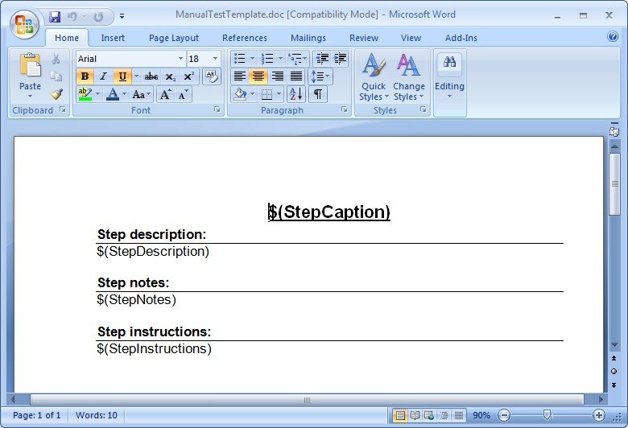{width="5.943008530183727in"
height="4.045416666666667in"}

> **Figure 215 \--TestCompleteDefault Microsoft Word Template**

Importing a Manual Test
-----------------------

> The ability to migrate existing legacy manual tests can be a huge time
> saver. TestComplete lets you import manual tests stored in text files,
> Microsoft Word or Microsoft Excel files. TestComplete can handle
> several format arrangements:
>
> One level or multilevel, bulleted or numbered lists. Numbered lists
> can use any number style and formatting for levels.
>
> Test steps using different indents for steps of different levels.
> Tables used to organize the step hierarchy.
>
> Keywords to separate the step caption, description, instructions and
> notes.
>
> TestComplete ships with a set of sample files that can be imported.
> Each file demonstrates a particular format, e.g. text, Excel, Word
> document with headers, etc. The closer your files are to the example
> formats, the less editing you will need to perform in the Manual Tests
> editor. See the online help for complete details on supported formats.
>
> You can find example files to import at:
>
> \\TestComplete Samples\\Manual Testing\\Recommended Formats for Manual
> Test Instructions

#### Simple Text File Import

> If you open the document titled \"Test Instructions in .txt file.txt\"
> you will see steps for testing the Orders application that use numbers
> to indicate each step.

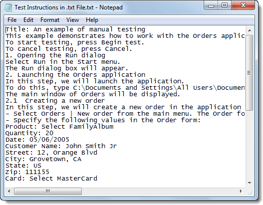{width="5.492455161854768in"
height="4.28125in"}

> **Figure 216 \--Sample Text File**
>
> If you open the document titled \"Test Instructions in .doc file
> (using headings).doc" you will see steps for testing the Orders
> application that uses the \"Heading1\" style to indicate a new step.

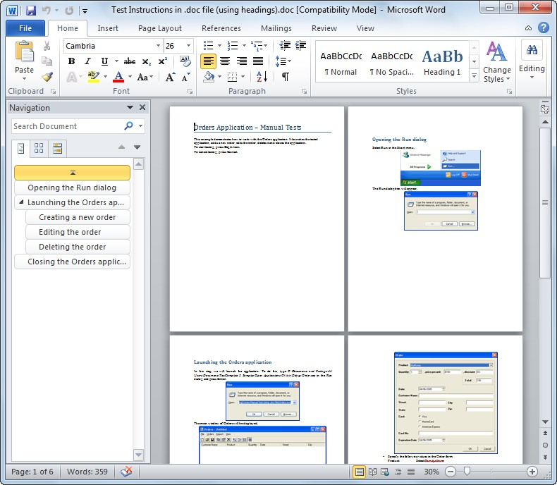{width="5.929838145231846in" height="5.16in"}

> **Figure 217 \--Sample Import Document**
>
> Test steps can even be arranged in a hierarchy by using styles, i.e.
> \"Heading1\", \"Heading2\", where \"Heading2\" represents the set of
> steps indented from \"Heading1\".
>
> See the TestComplete online help topic \"Importing Manual Tests\" for
> detailed formatting information for each document type.

#### Lab

> Let\'s walk through importing one of the sample documents.

1.  From the TestComplete **File** menu choose **Import \| Test\...**

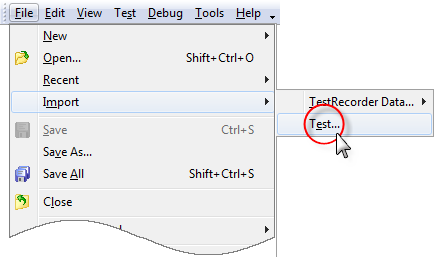{width="4.528034776902887in"
height="2.6770833333333335in"}

> **Figure 218 \-- Selecting the Im port Test Option**

2.  In the **Import Test Options** page of the wizard, enter the **Test
    Name** as \"OrdersTest\". Click the ellipses of the **Source File
    Name** and locate the \"Test Instructions in .doc file (using
    headings).doc\" file in the path indicated at the top of this topic.
    Click the **Next** button to continue.

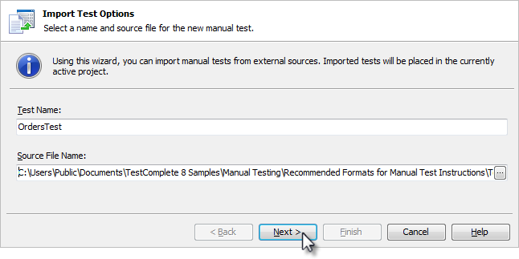{width="6.199589895013124in"
height="3.0954166666666665in"}

> **Figure 219 \-- Import Test Options**

3.  The wizard will take a moment to process the file and then present a
    summary. Click the

> **Finish** button to close the wizard.

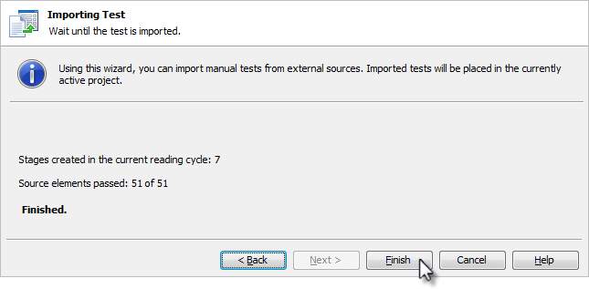{width="6.191743219597551in"
height="3.037916666666667in"}

> **Figure 220 \--Import Summary**

4.  The imported manual test will show under the ManualTests node in the
    Project Explorer, and all steps described in the document will be
    included in the ManualTests editor.

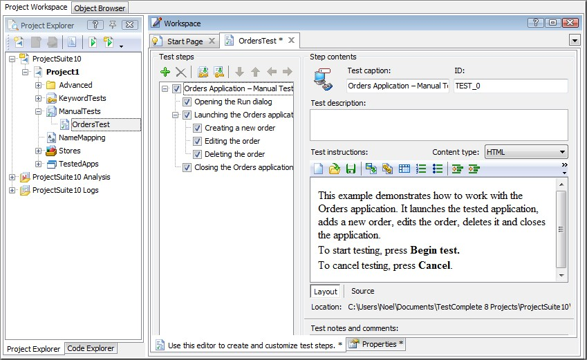{width="6.200479002624672in"
height="3.7989577865266844in"}

> **Figure 221 \--The Im ported Manual Test**

Legacy Migration
----------------

> The ability to import legacy manual test steps stored in external
> files coupled with TestComplete tools for converting Manual Test to
> fully automated Keyword Tests comprises a complete migration path.
> This path takes you from the labor-intensive, error prone and
> inconsistent to a wholly automated system that can be run reliably on
> a schedule.

Summary
-------

> In this chapter, we explored TestComplete Manual Testing features and
> discussed the advantages of developing manual tests using
> TestComplete. We learned to:
>
> Create, edit and execute Manual Tests. Call Manual Tests.
>
> Use Events within a Manual Test. Import and Export Manual Tests.

### Low Level Procedures

Low Level Procedures
====================

Objectives
----------

> This chapter explains TestComplete Low Level Procedure functionality
> and how it can be leveraged to deal with situations where they may be
> no easy alternative. You'll learn how to record, edit and execute Low
> Level Procedures. Along the way you will learn how Low-Level
> Procedures differ from standard test recordings, when to use a
> Low-Level Procedure and the difference between Window and Screen Low
> Level Procedures.

About Low Level Procedures
--------------------------

> Low Level Procedures are an alternative recording type provided by
> TestComplete where actual mouse and keyboard events are recorded. Low
> Level Procedures differ dramatically from standard recordings where
> TestComplete records higher level actions against specific onscreen
> objects.

#### Low Level Procedure Types

> There are two kinds of Low Level Procedures:
>
> **Screen Coordinates** \-- Captures events relative to the entire
> screen where the top left-hand corner of the screen is 0,0.
>
> **Window Coordinates** \-- Captures events relative to a user selected
> Window where the top left-hand corner of the window is 0,0.
>
> Window Coordinate Low Level Procedures tend to be more reliable as
> they are unaffected by the location of the selected window and will
> playback relative to the Window\'s current screen location.

#### When To Use Low Level Procedures

> From the outset, tests that rely on screen coordinates generally are a
> bad idea and usually that holds true regardless of which tool you're
> using. However, in certain situations you may find yourself attempting
> to record a scenario that simply refuses to playback properly due to
> the complexity of capturing a user\'s intent via a recorder. In these
> cases, resorting to Low Level Procedures can, at the very least, serve
> as a stop-gap until alternative solutions can be developed.
>
> Additionally, you can work on applications using third party controls
> not directly supported by TestComplete and that provide no visibility
> into the client region of the control such as a custom grid.

Recording Low Level Procedures
------------------------------

> In the \"Web Testing\" chapter we looked at a Web application that
> used JavaScript to dynamically display menu items on screen. The
> application poses an interesting challenge for GUI recorders that tend
> to capture interactions with controls such as clicks and keystrokes.
> Let\'s take a look at recording a Low-Level Window Coordinates
> Procedure to handle the menu selection and understand this alternative
> approach to recording.

#### Low Level Window Coordinates Procedure

67. For starters we\'ll launch Internet Explorer and browse to the
    Orders application located here:

> [http:*//training.falafel.com/dynamiccontent*](http://training.falafel.com/dynamiccontent)

68. Select **File \| New \| Project\...** and on the **Create Project**
    dialog click the **OK** button.

69. Start recording a new test. From the Recorder toolbar, drop down the
    Low-Level Procedure button and select the **Record Low-Level
    Procedure (window coordinates)** option.

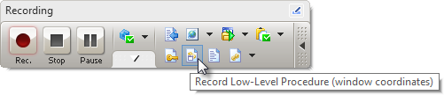{width="5.204438976377952in"
height="1.11375in"}

> **Figure 222 \--Recording a Low-Level Procedure**

70. A red selection rectangle will appear. Move the rectangle onto
    Internet Explorer and click the left mouse button to select it.

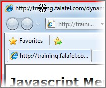{width="2.1676990376202974in"
height="1.8046872265966754in"}

> **Figure 223 \--Selecting IE**

71. On the **Create Project Item** dialog click **OK** to add the
    **Low-Level Procedures Collection** item to the project.

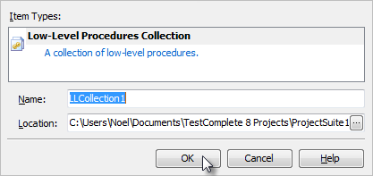{width="4.311887576552931in"
height="2.0315616797900264in"}

> **Figure 224 \--Adding the Low-Level Procedures Collection**

72. On the **Create Project Item** dialog click **OK** to add a
    Low-Level Procedure to the project.

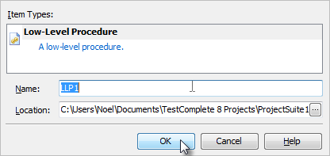{width="4.301522309711286in"
height="2.0315616797900264in"}

> **Figure 225 \--Adding a Low Level Procedure**

73. Select the **Add \| New \| Customer \| Orders** menu item on the web
    page.

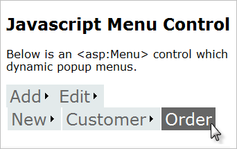{width="3.5686811023622047in"
height="2.2395833333333335in"}

> **Figure 226 \--Selecting from a Dynamic Menu**

74. Click the **Stop** button on the recording toolbar.

#### Examining the Recording

> At the completion of the recording you can see that a \"LLCollection\"
> has been added in the Project Explorer. Inside the collection will be
> the Low-Level Procedure you recorded.

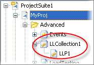{width="1.9227165354330709in"
height="1.3303116797900263in"}

> **Figure 227 \--The Low Level Procedure Collection**
>
> Next, look at the **Low Level Procedure Editor** and the events
> captured by the Low Level Procedure. Double click the **Advanced \|
> LLCollection1 \| LLP1** node from the **Project Explorer**.

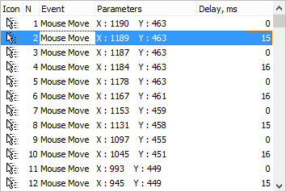{width="3.6925984251968504in"
height="2.4791666666666665in"}

> **Figure 228 \--Low Level Procedure Editor**
>
> The columns in the Low-level Procedure Editor are:

  **Column**   **Value**
  ------------ ------------------------------------------
  **Icon**     Indicator of the type of event performed
  **N**        Ordinal value of this event in the list
  **Event**    Type of action to be performed

  **Column**       **Value**
  ---------------- --------------------------------------
  **Parameters**   Data specific to the specified event
  **Delay, ms**    Delay in milliseconds between events

> From the Low-level Procedure Editor window, you can add, edit and
> delete events from the list using the right click context menu.

{width="3.6925984251968504in"
height="2.4791666666666665in"}

> **Figure 229 \--The Editor Window Context Menu**
>
> The Edit Event dialog provides options to customize all facets of the
> captured event.

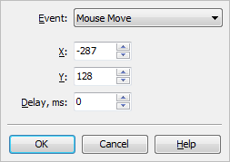{width="2.61334864391951in"
height="1.8459372265966754in"}

> **Figure 230 \-- The Edit Event Dialog**

Calling Low Level Procedures from Script
----------------------------------------

> To run a Low Level Procedure from a Keyword Test, first specify the
> collection followed by a period \".\", then the name of the low level
> procedure, another period \".\" and finally the **Execute()** method.
> If you want the low-level procedure to execute in relation to a
> particular window, pass the window as a parameter to the Execute
> method. Also notice in the example below that before executing the
> low-level procedure, you want to make sure that the window is
> activated and brought to the front.
>
> **var** iexplore = Aliases.iexplore.IEFrame; iexplore.Activate();
> LLCollection1.LLP1.Execute(iexplore);
>
> **Dim** iexplore = Aliases.iexplore.IEFrame iexplore.Activate()
> LLCollection1.LLP1.Execute(iexplore)

Summary
-------

> In this chapter, we looked at TestComplete Low Level Procedure
> capabilities and: Explained how this recording type differs from a
> standard object-based recording Recorded a scenario which otherwise
> requires special handling
>
> Examined the Low-Level Procedure Editor

### User Forms

User Forms
==========

Objectives
----------

> This chapter demonstrates how User Forms are used to display dialogs
> and windows onscreen during test execution. You\'ll learn how to use
> the TestComplete User Form\'s designer to create your own forms.
> You\'ll also see how modal and non-modal display modes manage form
> display during test execution.

[]{#Materials .anchor}

> **Using the Designer**
>
> User Forms are not part of the default project template so you\'ll
> first need to add the **User Forms** Project Item to your project.
> Once you\'ve added User Forms support to your project you can right
> click the User Forms node in the Project Explorer and add a form to
> your project. In this example, we\'ll construct a User Form that can
> be used to prompt for login credentials.

{width="2.613190069991251in"
height="1.8356244531933508in"}

> **Figure 231 \--User Form s Login Dialog**
>
> Once the form is created you will see the User Forms designer which is
> similar in style to those seen in Visual Basic, Visual Studio or other
> development tools supporting forms development. If you are familiar
> with any of these tools you\'ll immediately feel right at home in the
> designer. If not, don\'t fear. Learning the designer is quick and easy
> and you\'ll be able to construct dialogs in no time.

#### Layout of the User Forms Designer

> There are three panels of the User Forms editor including:

75. Component palette

76. Form Designer

77. Properties window

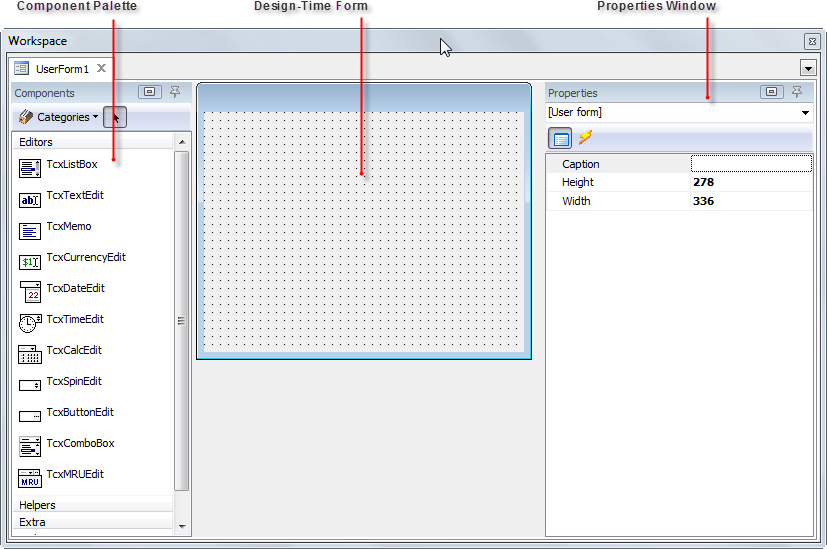{width="5.950223097112861in"
height="3.9459372265966755in"}

> **Figure 232 \--User Forms Editor**

#### Building a User Form

> To illustrate the functionality of the User Forms designer we\'ll
> build a Login dialog that you can call from within your tests. If the
> UserForms node doesn\'t already exist in the project explorer,
> right-click the project and select **Add \| New Item**. Choose \"User
> Forms\" from the list and click **OK** to create the project item.

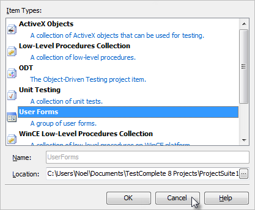{width="4.3459667541557305in"
height="3.5833333333333335in"}

> **Figure 233 \--Adding User Forms**
>
> To create the form, right click the Project Explorer **UserForms**
> node and select **Add \| New Item\...** In the **Name** edit box enter
> \"PasswordDlg\".

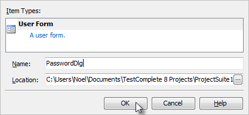{width="4.312343613298338in"
height="1.9903116797900262in"}

> **Figure 234 \--Adding a User Form**
>
> Using the Component palette, we\'ll add the components (TcxTextEdit,
> TcxLabel and TcxButton) from the **Editors**, **Helpers** and
> **Buttons** categories respectively to the form by simply double
> clicking the components. After adding a component to the design-time
> form you can use the mouse to move/size the control and the Properties
> window to change its appearance/behavior. We now have a form that
> looks like this:

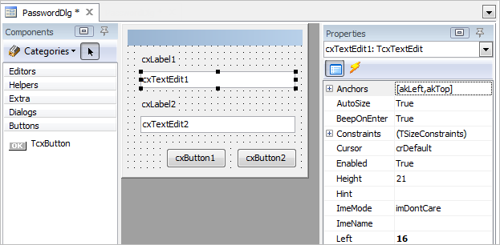{width="5.926007217847769in"
height="2.900624453193351in"}

> **Figure 235 \--Initial User Forms Layout**
>
> Next, we need to make the following property changes on the components
> placed on the form. The table below lists the components and the
> property/values for each. These changes improve the appearance of the
> dialog as well as set the expected behavior of a modal login dialog.

  **Component**   **Property**          **Value**
  --------------- --------------------- -------------
  cxTextEdit1     Name                  edUsername
                  Text                  (blank)
  cxTextEdit2     Name                  edPassword
                  Text                  (blank)
                  Properties.EchoMode   eemPassword
  cxLabel1        Caption               &Username:
                  FocusControl          edUsername

  **Component**   **Property**   **Value**
  --------------- -------------- ------------
  cxLabel2        Caption        &Password
                  FocusControl   edPassword
  cxButton1       Caption        OK
                  Default        True
                  ModalResult    mrOk
  cxButton2       Caption        Cancel
                  Cancel         True
                  ModalResult    True
  \[User Form\]   Caption        Login

> Once these properties have been assigned we\'ll have a completed User
> Form that we can use from within a Keyword Test.

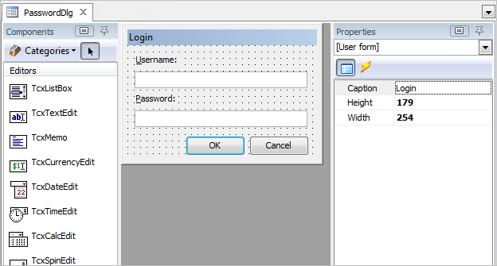{width="5.915184820647419in"
height="3.1755205599300087in"}

> **Figure 236 \--The Com pleted Form**
>
> []{#Calling_User_Forms_from_Script .anchor}**Calling User Forms from
> Script**
>
> Now that we have created a user form, we need to learn how to call the
> form from Script. There are two method used to display a user form:
> **Show()** and **ShowModal()**.
>
> ShowModal() displays the user form and stops the script from playing
> until the user answers the dialog. Show() continues with the next line
> in the script code.
>
> *//Fill in the current user name*
> UserForms.UserNameAndPassword.edtUser.Text = Sys.UserName; **if**
> (UserForms.UserNameAndPassword.ShowModal() == mrCancel)
>
> Runner.Halt(\"User Cancelled Test\");
>
> Log.Message(\"User: \" + UserForms.UserNameAndPassword.edtUser.Text +
> \" Logged in with Password: \" +
> UserForms.UserNameAndPassword.edtPassword.Text);
>
> *\'Fill in the current user name*
> UserForms.UserNameAndPassword.edtUser.Text = Sys.UserName **if**
> UserForms.UserNameAndPassword.ShowModal = mrCancel **Then**
>
> Runner.Halt(\"User Cancelled Test\")
>
> **end If**
>
> **Log**.Message(\"User: \" &
> UserForms.UserNameAndPassword.edtUser.Text &\_ \" Logged in with
> Password: \" &\_ UserForms.UserNameAndPassword.edtPassword.Text)
>
> []{#_bookmark318 .anchor}**Summary**
>
> In this chapter, we learned how to create user forms for input during
> test execution. We learned about the User Forms designer and how to
> incorporate user forms into a test.

### Best Practices

18. []{#Best_Practices .anchor}**Best Practices**

> **Objectives**
>
> This chapter includes real-world advice on how to plan, organize and
> version control your tests. Other handy tips tell you how to get the
> most out of \"smoke tests\" and how to communicate your test results
> with the team.
>
> []{#Communicating_Test_Results .anchor}**Communicating Test Results**
>
> Now you might be thinking \"huh? I haven\'t even started yet and I
> have to think about communicating my results?\" The answer is a
> resounding YES! Unfortunately, Quality Assurance and test automation
> specifically, at least in the software world, tends to get a bad rap.
> Creating solid test automation that can stand up over time and provide
> valuable ongoing feedback is a difficult task which leads a lot of
> people (read management) to think time and effort spent working on
> automation is wasted.
>
> To solve this problem, you'll want to focus on getting your test
> results published quickly and consistently to prove that your efforts
> are worth the investment. TestComplete provides some facilities for
> producing log output though you'll want to be sure and iron out your
> strategy from the start. For example, you may want to setup a web
> server where you can publish results. In fact, TestComplete supports
> exporting log results to HTML which could be a good starting place.
>
> []{#Plan_your_testing,_but_not_that_kind_of_ .anchor}**Plan your
> testing, but not that kind of planning\...**
>
> The preparation we\'re referring to has to do with your choice of
> testing tool, TestComplete. Although it\'s important to plan the
> application features to be tested, it\'s also important to be prepared
> with respect to the testing facilities available in TestComplete. You
> should gain a thorough understanding of TestComplete features before
> you embark on writing test automation to avoid a situation where your
> weeks into test development only to discover a feature that could have
> saved you numerous hours or days.
>
> TestComplete is rich with features that make test automation easier
> although like any development tool it provides many different ways to
> solve the same problem. For example, TestComplete has a powerful and
> indeed almost alluring recorder, making it easy to quickly create
> automated tests. While a test recorder is a great tool, recorded tests
> tend to be more brittle than hand written tests because they capture a
> single iteration at a given point in time and don\'t take into account
> unexpected events like an error dialog popping up. The alternative is
> handwritten tests where you can methodically plan how the test will
> react in unexpected circumstances. The down side of handwritten tests
> is they tend to take longer to develop though over the long run
> they\'ll likely require less maintenance because of the tendency to
> design the test more rigorously.
>
> []{#Organizing_your_TestComplete_Projects .anchor}**Organizing your
> TestComplete Projects**
>
> TestComplete provides the ability to customize the Project Items that
> are included by default on a new project using Project Templates. In
> order to maintain consistency across your testing organization you
> should work towards creating a project template(s) that\'s
> pre-configured for your test environment. For example, if you\'re
> testing a Window 32-bit GUI application, create a Project Template
> that has the Tested Applications node with your application already
> added to it. Also, look closely at how you can utilize Aliases to
> avoid using long dotted object names like:
>
> Sys.Process(\"iexplore\").IEFrame(0).Window(\"WorkerW\", \"\",
> 1).Window( \"ReBarWindow32\", \"\", 1).Window(\"ComboBoxEx32\", \"\",
> 1).Window(
>
> \"ComboBox\", \"\", 1).Window(\"Edit\", \"\", 1)
>
> TestComplete includes an automatic Name Mapping feature has been added
> to make this even easier.
>
> []{#Use_a_Source_Control_Repository .anchor}**Use a Source Control
> Repository**
>
> TestComplete is a development tool and as such the projects, scripts,
> data, etc. used in your tests should be kept under version control. If
> this is something you\'re already doing, skip ahead. If not, you
> should consider version control the next priority and work to get your
> test suites under version control. There are lots of options including
> some excellent Open Source projects which are freely available like
> Subversion, otherwise known as SVN. While it\'s beyond the scope of
> this document to discuss the specific merits of source control it\'s a
> subject that shouldn\'t be ignored.
>
> []{#Your_Most_Important_Test .anchor}**Your Most Important Test**
>
> Arguably, the first test you should focus on is a \"smoke test\". In
> this section we\'ll discuss what a smoke test is and provide guidance
> as to how to construct the test in such a way as to maximize its
> effectiveness.

#### Creating a Smoke Test

> Probably the most important test you\'ll write is your Smoke Test, at
> least it should be. Typically, the goal of a Smoke Test is to verify
> that the latest build delivered to QA is either worth further
> consideration or \"DOA\" (dead on arrival). The smoke test is crucial
> because of the time savings it can provide both R&D and QA. A good
> Smoke Test should:
>
> Run quickly \-- a smoke test should not last for hours but minutes and
> test the most crucial functionality.
>
> Fail quickly \-- as soon as a failure is detected in the smoke test
> should end and trigger a failure notification.
>
> Cover a broad range of functionality, focusing on breadth not depth.
> Require minimal setup/configuration of the application under test. Be
> setup to run against every build.
>
> Adapt over time as the application under test evolves. Serve as a
> model for new test automation.
>
> If you take the time to organize your Smoke Test to cover these goals
> you will undoubtedly save time and resources over the long run. Your
> Smoke Test should serve as a model that embodies your \"best
> practices\" from which your QA team can draw from for their own tests.
>
> If you\'ve never written a Smoke Test before, start small. In the
> beginning simply get the smoke test to verify even a single piece of
> functionality consistently. Over time, work to increase its coverage
> but remain focused on the quality of the test. It\'s unacceptable to
> have a Smoke Test that can\'t run consistently and without problems.

#### Executing your Tests Regularly

> Once your Smoke Test is written and under version control the next
> step is to automate its execution. SmartBear has a product called
> Automated Build Studio which can automate your TestComplete tests and
> trigger them to execute when a new build is delivered to QA, a process
> called **Continuous Integration** or **\"CI\"**. In addition to
> Automated Build Studio there are Open Source CI servers such as
> CruiseControl.NET.
>
> The main benefit of a CI server is to reduce the amount of time it
> takes to execute your test automation as well as ensure that it
> executes against every build. By setting up a CI server you can not
> only free your QA engineers from having to manually execute their
> tests. CI helps quickly identify tests that are unable to consistently
> run to completion and may require closer scrutiny. In addition, many
> CI servers include a means of publishing test results providing for
> greater visibility into the automation efforts.
>
> []{#General .anchor}**General**
>
> The following are general tips and best practices to help you get the
> most out of TestComplete:
>
> Record/Playback is a quick and easy way to get automated tests up and
> running but tend to be brittle leading to problems when the
> application changes, etc.
>
> Use the TestItems of the project as a framework for Test Cases (see
> the \"Project Organization\" chapter).
>
> Separate Data from the Test Framework (see \"Data Driven Testing\").
>
> Use the code metrics of the Code Explorer to improve the quality of
> the script code (see Overview of TestComplete).
>
> Use reusable routines whenever possible (see the \"Project
> Organization\" chapter). Keep routines short, i.e. less than a page of
> code.
>
> Use meaningful variable names. The default variable names of a
> recording are not acceptable for production use.
>
> []{#Web_Page .anchor}**Web Page**
>
> The following are tips for making effective use of TestComplete when
> testing web pages:
>
> Make sure that \"Make the Page object a child of the browser process\"
> is selected in the Project properties under **Open Applications \| Web
> Testing**.
>
> Use the \"Tree Model\" for best performance. You can set this under
> the Project properties in the General options.
>
> []{#Summary .anchor}**Summary**
>
> In this chapter you learned how to plan, organize and version control
> your tests. You also reviewed tips on how to get the most out of
> \"smoke tests\" and how to communicate your test results with the
> team.

### Appendix A - Shortcuts

[]{#SmartBear .anchor}

19. **Appendix A - Cheat Sheet**

> **Keyboard Shortcuts**
>
> **Global Shortcuts** (keys that work when TestComplete is running even
> if TestComplete does not have focus)

  **Command**              **Default Key**
  ------------------------ -----------------
  Pause script execution   SHIFT-10
  Fix Information          SHIFT-CTRL-A
  Record                   SHIFT-F1
  Stop                     SHIFT-F2
  Run                      SHIFT-F3
  Pause recording          SHIFT-F11
  Low Level Record         SHIFT-F4

> **Key Mapping** (keys that work when TestComplete has focus, generally
> in the editors)

  **Command/Section**   **Default**   **Visual Studio**   **Borland Classic**
  --------------------- ------------- ------------------- ---------------------
  **Debugging**                                           
  Run                   F9            F5                  F9
  Reset                 CTRL-F2       SHIFT-F5            CTRL-F2
  Step Over             F8            F10                 F8
  Trace Into            F7            F11                 F7
  Run to Cursor         F4            F4                  F4
  Switch Breakpoint     F5            F9                  CTRL-F8

  **Command/Section**     **Default**      **Visual Studio**   **Borland Classic**
  ----------------------- ---------------- ------------------- ---------------------
  View Evaluate           CTRL-F7          CTRL-F2             CTRL-F4
  View Call Stack         CTRL-ALT-S       ALT-7               CTRL-ALT-S
  View Watches            CTRL-ALT-W       ALT-3               CTRL-ALT-W
  View Break Points       CTRL-ALT-B       CTRL-B              CTRL-ALT-B
  **Project/Units**                                            
  Close Page              CTRL-F4          CTRL-F4             ALT-F3
  Save Unit               CTRL-S           CTRL-S              CTRL-S
  Open Project            CTRL-F11         CTRL-SHIFT-0        CTRL-F11
  New Project                              CTRL-SHIFT-N        
  Save All                                 CTRL-SHIFT-S        CTRL-SHIFT-S
  Display previous page   CTRL-SHIFT-TAB   CTRL-SHIFT-TAB      CTRL-SHIFT-TAB
  Display next page       CTRL-TAB         CTRL-TAB            CTRL-TAB
  **Cursor movement**                                          
  Cursor Left             LEFT             LEFT                LEFT
  Cursor Right            RIGHT            RIGHT               RIGHT
  Beginning of Line       HOME             HOME                HOME
  End of Line             END              END                 END
  Up one line             UP               UP                  UP
  Down one line           DOWN             DOWN                DOWN

+-----------------+-----------------+-----------------+-----------------+
| **Command/Secti | **Default**     | **Visual        | **Borland       |
| on**            |                 | Studio**        | Classic**       |
+=================+=================+=================+=================+
| Up one page     | PGUP            | PGUP            | PGUP            |
+-----------------+-----------------+-----------------+-----------------+
| Down one page   | PGDN            | PGDN            | PGDN            |
+-----------------+-----------------+-----------------+-----------------+
| Beginning of    | CTRL-HOME       | CTRL-HOME       | CTRL-PGUP       |
| Document        |                 |                 |                 |
+-----------------+-----------------+-----------------+-----------------+
| End of Document | CTRL-END        | CTRL-END        | CTRL-PGDN       |
+-----------------+-----------------+-----------------+-----------------+
| Move to word    | CTRL-LEFT       | CTRL-LEFT       | CTRL-LEFT       |
| before          |                 |                 |                 |
+-----------------+-----------------+-----------------+-----------------+
| Move to word    | CTRL-RIGHT      | CTRL-RIGHT      | CTRL-RIGHT      |
| after           |                 |                 |                 |
+-----------------+-----------------+-----------------+-----------------+
| **Delete        |                 |                 |                 |
| operations**    |                 |                 |                 |
+-----------------+-----------------+-----------------+-----------------+
| Delete          | DEL             | DEL             | DEL             |
| character at    |                 |                 |                 |
| cursor          |                 |                 |                 |
+-----------------+-----------------+-----------------+-----------------+
| Delete          | BACKSPACE       | BACKSPACE       | BACKSPACE       |
| character       |                 |                 |                 |
| before cursor   |                 |                 |                 |
+-----------------+-----------------+-----------------+-----------------+
| Delete current  | CTRL-Y          | CTRL-SHIFT-L    | CTRL-Y          |
| line            |                 |                 |                 |
+-----------------+-----------------+-----------------+-----------------+
| Delete previous | CTRL-BACKSPACE  | CTRL-BACKSPACE  | CTRL-BACKSPACE  |
| word            |                 |                 |                 |
+-----------------+-----------------+-----------------+-----------------+
| Delete next     | CTRL-T          | CTRL-DEL        | CTRL-T          |
| word            |                 |                 |                 |
+-----------------+-----------------+-----------------+-----------------+
| **Miscellaneous |                 |                 |                 |
| **              |                 |                 |                 |
+-----------------+-----------------+-----------------+-----------------+
| Indent selected | CTRL-SHIFT-I    | CTRL-SHIFT-I    | CTRL-SHIFT-I    |
| block           | **or** TAB      |                 |                 |
+-----------------+-----------------+-----------------+-----------------+
| Unindent        | CTRL-SHIFT-U    | CTRL-SHIFT-U    | CTRL-SHIFT-U    |
| selected block  | **or**          |                 |                 |
|                 |                 |                 |                 |
|                 | SHIFT-TAB       |                 |                 |
+-----------------+-----------------+-----------------+-----------------+
| Toggle insert/  | INS             | INS             | INS             |
| overwrite mode  |                 |                 |                 |
+-----------------+-----------------+-----------------+-----------------+

+-----------------+-----------------+-----------------+-----------------+
| **Command/Secti | **Default**     | **Visual        | **Borland       |
| on**            |                 | Studio**        | Classic**       |
+=================+=================+=================+=================+
| Undo            | CTRL-Z **or**   | CTRL-Z **or**   | ALT-BACKSPACE   |
|                 | ALT- BACKSPACE  | ALT- BACKSPACE  |                 |
+-----------------+-----------------+-----------------+-----------------+
| Redo            | SHIFT-CTRL-Z    | SHIFT-CTRL-Z    | ALT-SHIFT-      |
|                 | **or**          | **or**          | BACKSPACE       |
|                 |                 |                 |                 |
|                 | ALT-SHIFT-      | ALT-SHIFT-      |                 |
|                 | BACKSPACE       | BACKSPACE       |                 |
+-----------------+-----------------+-----------------+-----------------+
| Print           | CTRL-P          | CTRL-P          | CTRL-P          |
+-----------------+-----------------+-----------------+-----------------+
| Scroll display  | CTRL-UP         | CTRL-UP         | CTRL-W          |
| up one line     |                 |                 |                 |
+-----------------+-----------------+-----------------+-----------------+
| Scroll display  | CTRL-DOWN       | CTRL-DOWN       | CTRL-Z          |
| down one line   |                 |                 |                 |
+-----------------+-----------------+-----------------+-----------------+
| Display context | ALT-F10 (Code   | ALT-F10 (Code   | ALT-F10 (Code   |
| menu            |                 |                 |                 |
|                 | Editor only)    | Editor only)    | Editor only)    |
+-----------------+-----------------+-----------------+-----------------+
| Find            | CTRL-F          | CTRL-F          | CTRL-F          |
+-----------------+-----------------+-----------------+-----------------+
| Replace         | CTRL-R          | CTRL-H          | CTRL-R          |
+-----------------+-----------------+-----------------+-----------------+
| Search Again    | F3              | F3              | CTRL-L          |
+-----------------+-----------------+-----------------+-----------------+
| Select All      | CTRL-A          | CTRL-A          |                 |
+-----------------+-----------------+-----------------+-----------------+
| Invoke Code     | CTRL-SPACE      | CTRL-SPACE      | CTRL-SPACE      |
| Completion      |                 |                 |                 |
+-----------------+-----------------+-----------------+-----------------+
| Code Templates  | CTRL-J          | CTRL-J          | CTRL-J          |
+-----------------+-----------------+-----------------+-----------------+
| **Bookmarks**   |                 |                 |                 |
+-----------------+-----------------+-----------------+-----------------+
| Set Numbered    | CTRL-SHIFT-\#   | CTRL-SHIFT-\#   | CTRL-SHIFT-\#   |
| Bookmark        |                 |                 |                 |
+-----------------+-----------------+-----------------+-----------------+
| Goto Numbered   | CTRL-\#         | CTRL-\#         | CTRL-\#         |
| Bookmark        |                 |                 |                 |
+-----------------+-----------------+-----------------+-----------------+

  **Command/Section**        **Default**            **Visual Studio**      **Borland Classic**
  -------------------------- ---------------------- ---------------------- ----------------------
  Set Unnumbered Bookmark    CTRL-SHIFT-\'          CTRL-SHIFT-\'          CTRL-SHIFT-\'
  Goto Unnumbered Bookmark   CTRL-\'                CTRL-\'                CTRL-\'
  **Clipboard**                                                            
  Cut to Clipboard           CTRL-X or SHIFT- DEL   CTRL-X or SHIFT- DEL   CTRL-X or SHIFT- DEL
  Copy to Clipboard          CTRL-C or CTRL-INS     CTRL-C or CTRL-INS     CTRL-C or CTRL-INS
  Paste from Clipboard       CTRL-V or SHIFT-INS    CTRL-V or SHIFT-INS    CTRL-V or SHIFT-INS

> []{#Keyboard_Handling_in_Recorder .anchor}**Keyboard Handling in
> Recorder**
>
> TestComplete will record all keys entered to the active control while
> recording except for any keys that are in the Global Shortcuts.
>
> **Global Shortcuts** (keys that work when TestComplete is running even
> if TestComplete does not have focus)

  **Command**              **Default Key**
  ------------------------ -----------------
  Pause script execution   SHIFT-10
  Fix Information          SHIFT-CTRL-A
  Record                   SHIFT-F1
  Stop                     SHIFT-F2
  Run                      SHIFT-F3
  Pause recording          SHIFT-F11
  Low Level Record         SHIFT-F4

> []{#Configuring_Global_Shortcuts .anchor}**Configuring Global
> Shortcuts**
>
> To access and change Global Shortcuts:

78. Select **Tools \| Options** from the main menu.

79. Select **General \| Global Shortcuts** from the Options dialog.

80. Select the **Action**.

81. Type in the new keyboard shortcut (note: if it is already in use,
    you will need to clear the one using it first).

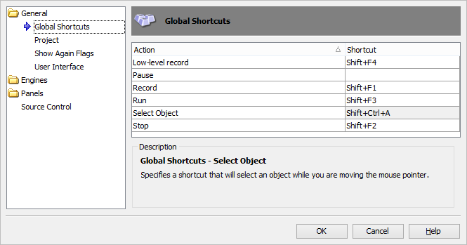{width="5.960137795275591in"
height="3.126457786526684in"}

> **Figure 237 \--Global Shortcuts**
>
> []{#Configuring_Keyboard_Emulation .anchor}**Configuring Keyboard
> Emulation**
>
> To access and change the keyboard emulation:

1.  Select **Tools \| Customize Keyboard\...** from the main menu.

2.  Choose the keyboard emulation that you want. (You can also set
    keyboard shortcuts for any command in this dialog).

{width="4.519971566054243in"
height="4.927083333333333in"}

> **Figure 238 \-- Customize Keyboard Dialog**

### Appendix B - Types of Testing

20. []{#Appendix_B_-_Types_of_Testing .anchor}**Appendix B - Types of
    Testing**

> []{#Types_of_Testing .anchor}**Types of Testing**

#### Manual Testing

> Manual Testing is where a tester methodically exercises the features
> of a product or product area without the aid of test automation. The
> single greatest strength of manual testing is that it is truly
> real-world testing, meaning that the tester can utilize the
> application under test the same way an end user would. Through manual
> testing the tester can provide a wide variety of feedback about the
> application under test not limited to simply reproducing bugs.
>
> Manual tests are difficult to perform on a regular basis. The major
> weakness of manual testing is that it is time consuming, tedious and
> requires extended periods of focused attention. Manual testing tends
> to be quite error prone, leading to situations where consistently
> reproducing a bug can be very difficult.

#### Functional Testing

> Functional Testing focuses on interactions with an application\'s user
> interface (UI) via the mouse, keyboard or other input device with
> particular attention to how the application visually responds to
> input. The goal of Functional Testing is to methodically cover all of
> the various UI features exposed by an application. Functional Testing
> should be highly organized and structured in a manner that allows for
> additional tests to easily be incorporated as new features are added.

#### Unit Testing

> Unit Testing focuses on smaller atomic portions of an application.
> Typically, Unit Testing requires internal knowledge of how an
> application performs and seeks to test portions (objects, methods and
> function) of an application in isolation. In many cases, applications
> have to be designed with Unit Testing in mind in order for this type
> of testing to be truly effective. The benefit of unit testing is that
> it tends to force application developers to write smaller, well
> defined routines with fewer dependencies allowing for highly specific
> tests to be developed.

#### Regression Testing

> Regression Testing is the process of executing tests in a repeatable
> manner and comparing the latest results with previous test executions
> to ensure that the same outcome is achieved. Regression Testing is
> extremely important and is the means of realizing the value of test
> automation. Repeatedly executing tests over time allows you to verify
> the application is still performing as intended.

#### Distributed Testing

> Distributed Testing is the act of farming different portions of a test
> out to separate machines for execution. Distributed Testing is useful
> for simulating real world interactions on a networked application such
> as a web site or web service and can exercise functionality designed
> to handle concurrent use of application resources including, but not
> restricted to data.

#### HTTP Performance Testing

> HTTP Performance Testing is the simulation of real-world interactions
> with a web application from multiple machines. TestComplete provides
> the ability to leverage networked computers and virtual users to
> simultaneously submit HTTP transactions to a web application.

#### Multi-Tier

> In software development there are typically three Tiers which are used
> to describe various aspects of an application they are Client Tier,
> Middle Tier and Data Tier. These are each defined as:
>
> **Client** \-- The user interface or presentation of an application
> and its data which is typically covered through Functional Testing.
>
> **Data Tier** \-- The storage of an application\'s data which can be
> exercised by Functional Testing as well as Unit Testing
>
> **Middle Tier** \-- Refers to the portion of the application
> responsible for moving data back and forth between the Client and the
> Data Tiers. The code that resides in this Tier can be tested from
> either the Client Tier via Functional testing or through Unit Testing
> on the code in the Middle Tier itself. Keep in mind that these are not
> strict rules as to which type of testing should be used but more
> illustrative how the different types of testing can be used.
>