TestComplete© Scripting Workshop
by Alain "Lino" Tadros
------------------------------------------------------------

#### Welcome to TestComplete Scripting Workshop

##### © 2019 Alain "Lino "Tadros

All rights reserved. No parts of this work may be reproduced in any form or by any means - graphic, electronic, or mechanical, including photocopying, recording, taping, or information storage and retrieval  systems - without the written permission of the publisher.

Products that are referred to in this document may be either trademarks and/or registered trademarks of the respective owners. The publisher and the author make no claim to these trademarks.

While every precaution has been taken in the preparation of this document, the publisher and the author assume no responsibility for errors or omissions, or for damages resulting from the use of information contained in this document or from the use of programs and source code that may accompany it. In no event shall the publisher and the author be liable for any loss of profit or any other commercial damage caused or alleged to have been caused directly or indirectly by this document.

**Table of Contents**

[Overview of TestComplete](./Overview/readme.md)
--------------------------------------------------------

[Scripting](./Scripting/readme.md)
--------------------------

[Project Organization](./Project%20Organization/readme.md)
------------------------------------------------

[Test Log](./Test%20Log/readme.md)
------------------------

[Stores and Checkpoints](./Stores%20and%20Checkpoints/readme.md)
----------------------------------------------------

[Name Mapping](./Name%20Mapping/readme.md)
---------------------------------

[TestComplete Debugging](./Debugging/readme.md)
-----------------------------------------------------

[Event Handling](./Event%20Handling/readme.md)
-------------------------------------

[Data Driven Testing](./Data%20Driven%20Testing/readme.md)
-----------------------------------------------

[Web Testing](./Web%20Testing/readme.md)
-------------------------------

[Mobile](./Mobile/readme.md)
---------------------

[Web Services Testing](./Web%20Services%20Testing/readme.md)
-------------------------------------------------

[Distributed Testing](./Distributed%20Testing/readme.md)
----------------------------------------

[Manual Testing](./Manual%20Testing/readme.md)
----------------------------------------

[Low Level Procedures](./Low%20Level%20Procedures/readme.md)
-----------------------------------------------

[User Forms](./User%20Forms/readme.md)
----------------------------------------

[Best Practices](./Best%20Practices/readme.md)
-------------------------------------

[Appendix A - Cheat Sheet](./Cheat%20Sheet/readme.md)
------------------------------------------------

[Appendix B - Types of Testing](./Types%20of%20Testing/readme.md)
-------------------------------------------------------------------

### Event Handling

9.  []{#Event_Handling .anchor}**Event Handling**

> **Objectives**
>
> This chapter explores how to create tests that respond to events that
> occur during test execution using the TestComplete Event Handling
> functionality. You\'ll learn about the available events provided by
> TestComplete, how to create event handlers and how TestComplete
> handles unexpected windows.

[]{#_bookmark173 .anchor}

> **Using Events**
>
> The TestComplete event handling mechanism allows the test writer to
> respond to conditions during test execution. **Events** are
> occurrences that happen during the running of a test, such as the
> browser navigating between pages, checkpoints, tests starting and
> stopping, logging, an unexpected window, an error or timeout.
> \"**Event Handlers\"** are routines in script or keyword tests that
> respond to these events.
>
> The **Events** project item appears under the Advanced folder in the
> Project Explorer. Using the Events editor, you can register a test to
> respond to a wide variety of events. Events are grouped by category:
>
> General Events Manual Testing Events Network Suite Events Test Engine
> Events
>
> The screenshot below shows an \"OnWebBeforeNavigate\" event being
> added.

{width="5.952159886264217in"
height="3.3833333333333333in"}

> **Figure 135 \--Events Project Item Editor**
>
> While it\'s possible to respond to ActiveX control events, we\'ll
> focus on the events included in the TestComplete General Events Source
> Object.
>
> Looking at the editor we see two columns:
>
> **Available Events** \-- displays events provided by the selected
> Source Object.
>
> **Events to Handle** \-- displays a list of events added to the
> current project.
>
> In order to respond to an event, it **must** appear under the **Events
> to Handle** column. To move events simply double click items in the
> **Available Events** column or click the **Add Selected** context menu
> item.
>
> []{#Creating_an_Event_Handler .anchor}**Creating an Event Handler**

28. Under the Events to Handle column, locate the **General Events \|
    OnUnexpectedWindow** event and click the **New** button:

{width="4.4000339020122485in"
height="3.1354166666666665in"}

> **Figure 136 \--Assigning an Event**

29. On the New Event Handler dialog select an existing unit or select
    the "Click here to add a new script unit\" link to add a new unit on
    the fly. Click the **OK** button to create the new event handler.

{width="4.599878608923884in"
height="2.8958333333333335in"}

> **Figure 137 \--The New Event Handler Dialog**

30. The editor appears with a new event handling routine inserted. This
    routine runs automatically when an unexpected window is encountered.

{width="6.252718722659668in"
height="1.388332239720035in"}

> **Figure 138 \--The New Event Handler**

31. Add a call to **Log.Picture()** to your event handler as shown in
    the code example below.

> **function** GeneralEvents\_OnUnexpectedWindow(Sender, Window,
> LogParams){ Log.Picture(Sys.Desktop,LogParams.Str);
>
> }
>
> **Sub** GeneralEvents\_OnLogError(Sender, LogParams)
>
> **Log**.Picture(Sys.Desktop,LogParams.**Str**) **End Sub**
>
> At this point, we\'ve completed the setup of our event handler which
> will be triggered whenever TestComplete detects an unexpected window
> during test execution. Attaching to any of the other events provided
> within TestComplete works in the same manner.
>
> []{#Handling_Unexpected_Windows .anchor}**Handling Unexpected
> Windows**
>
> One of the more complicated areas of GUI automation is dealing with
> unexpected windows. TestComplete provides rich functionality to
> automatically handle windows that occur unexpectedly during test
> execution. In addition, the OnUnexpectedWindow event allows you to
> customize how unexpected windows are handled.

#### Built-in Unexpected Window Behavior

> First, let\'s take a look at the logic TestComplete applies to
> unexpected windows and understand when this logic kicks in. To
> configure options that control how unexpected windows behave, double
> click the Project node and select the Properties tab. The options are
> located under the **Playback** category.

{width="5.389070428696413in"
height="3.9895833333333335in"}

> **Figure 139 \--Project Properties Tab**
>
> There are numerous options that tailor Unexpected Window Behavior:
>
> **Ignore unexpected window** \-- TestComplete unexpected window
> handling will not be used.
>
> **Stop execution** \-- Halt test execution when an unexpected window
> occurs.
>
> **Click on focused control** \-- Click the focused control (if any) on
> the unexpected window.
>
> **Press ESC** \-- Send an Escape key press to the unexpected window to
> try and dismiss it.
>
> **Press Enter** \-- Send an Enter key press to the unexpected window
> to try and dismiss it.
>
> **Send WM\_CLOSE** \-- Send the Windows API message WM\_CLOSE in an
> attempt to close the unexpected window.
>
> Also notice that the **Runtime** category has a \"Stop on Error\"
> option.

#### Unexpected Window Logic Sequence

> TestComplete has a very specific sequence it uses to handle unexpected
> windows. These rules are listed, in order, below. It\'s important to
> understand these rules and how unexpected window handling may affect
> your test automation results:

1.  Test execution is delayed until expiration of the Auto-wait timeout
    interval that is set in the Playback options of your project.

2.  If the unexpected window is still open, TestComplete generates the
    OnUnexpectedWindow event.

3.  If the window is not closed by the OnUnexpectedWindow event handler,
    TestComplete posts an error message to the log along with an image
    of the unexpected window and then acts according to the Playback
    settings.

4.  If \"Stop on error\" is checked, then the run ends at that point.

5.  Likewise, Test execution halts if \"Stop execution\" is checked in
    the Unexpected Window section. The difference is that \"Stop on
    error\" stops on any error, while \"Stop execution\" stops
    specifically on unexpected windows.

6.  Otherwise, any of the four following actions is taken, depending on
    the settings in the Unexpected window section:

    -   \"Click on focused control\" simulates a click to the window's
        default button.

    -   \"Press Esc\" simulates an ESC key press.

    -   \"Press Enter\" simulates an ENTER key press.

    -   \"Send WM\_CLOSE\" sends the window the normal window-closing
        message.

7.  If the window is still not closed, the run ends. The window may not
    close if you do not have a closing action checked, or if the closing
    action fails.

> []{#_bookmark179 .anchor}**Lab**
>
> Accompanying the projects for this courseware is a small program
> called \"CalcApp\" that divides two numbers. However, it does a very
> poor job, so that it\'s possible to perform an illegal operation, i.e.
> divide by zero. The result is an an exception dialog (see screenshot
> below). This lab will generate the exception and then handle the
> **OnUnexpectedWindow** event.

{width="5.351535433070866in" height="3.0625in"}

> **Figure 140 \--Unhandled Exception Window**

#### Handling Events with Script

> First, we\'ll record a test using \"CalcApp\" to see what happens when
> an unexpected window occurs.

1.  Add \"CalcApp\" as a TestedApp. See the \"Overview of TestComplete\"
    chapter for more information on adding TestedApps.

2.  Click the **Record** button on the main toolbar to start recording a
    new script:

{width="2.176864610673666in"
height="1.0415616797900262in"}

> **Figure 141 \--Start Recording a New Script**

3.  From the Recording toolbar, use the **TestedApp** drop down button
    and run the \"CalcApp\" TestedApp.

{width="4.302992125984252in"
height="1.3199989063867017in"}

> **Figure 142 \--Adding the TestedApp**

4.  Enter a \"12\" in the first text box, a \"0\" in the second text box
    and click the \"Calc\" button. Finally, close the \"CalcApp\"
    window.

> The unexpected window will not be detected if there is no action
> following the error.

5.  The Script should look something like the screenshot below. Be aware
    that this version has been cleaned up to remove extraneous
    keystrokes.

{width="3.578992782152231in"
height="2.2604166666666665in"}

> **Figure 143 \--The Recorded Test**

6.  Run the test to watch how TestComplete OnUnexpectedWindow handling
    works.

> Notice that after the unexpected window is detected that is starts
> working through its list of ways to close the window, including trying
> to click the default button (which just ends up showing the error
> detail) and finally simulating the ESC keystroke that successfully
> closes the window and allows the test to complete.

7.  Review the Test Log and see how TestComplete reports on the error
    dialog. Notice that the logging of the Unexpected window
    automatically records a screenshot of the problem window.

> {width="5.819727690288714in"
> height="4.351874453193351in"}
>
> **Figure 144 \--The Test Log**

8.  Create a new **OnUnexpectedWindow** event handler.

9.  In the event handler, add a **Log.Picture()** method call. Set the
    first parameter to **Sys. Desktop** to get an image of the entire
    desktop and \"An unexpected window appeared\" in the second
    parameter:

{width="5.869927821522309in"
height="0.8146872265966754in"}

> **Figure 145 \--The Event Handler**

10. Rerun the test and review the log. The log now shows that the
    OnUnexpectedWindow handler was invoked and logged a screenshot of
    the entire desktop.

{width="4.473144138232721in"
height="3.1458333333333335in"}

> **Figure 146 \--Logged Unexpected Window**

#### Reviewing the Test Log

> From the Test Log we can see that TestComplete:

1.  Generated a Log Message from our OnUnexpectedWindow event handler.

2.  Generated an OnUnexpectedWindow error message.

3.  Included a screenshot of the dialog that caused the error.

> Using the OnUnexpectedWindow event a test writer could examine the
> **Window** parameter and determine how they want the test to proceed.
> The OnUnexpectedWindow event allows for custom handling of error
> conditions and gives the test writer complete control to customize
> unexpected window handling including processing the dialog and
> controlling the log output through the **LogParams** parameter.
>
> If you didn\'t get the same results as shown in this walk through,
> verify that your \"Runtime\" and \"On Unexpected Window\" project
> settings are the same as shown in the screenshot at the top of this
> \"Handling Unexpected Windows\" topic.
>
> []{#_bookmark182 .anchor}**Summary**
>
> In this chapter, we covered TestComplete event handling features. We
> looked at: Creating Keyword Tests to respond to events.
>
> TestComplete built-in handling of unexpected windows.
>
> Unexpected window handling combined with OnUnexpectedWindow event.

### Data Driven Testing

10. []{#Data_Driven_Testing .anchor}**Data Driven Testing**

> **Objectives**
>
> This chapter demonstrates how you can drive tests from data stored in
> a database, spreadsheet or text document. You\'ll learn about the DB
> Table object used to automatically feed data to your test and how to
> leverage the DBTable checkpoint to verify database contents.
>
> []{#_bookmark184 .anchor}**The DB Table Object**
>
> TestComplete provides a built-in data driven testing object type
> called **DB Table** that provides a straight forward and consistent
> mechanism for working with a wide variety of data sources. DB Tables
> can provide connection to Excel spreadsheets, comma delimited CSV
> files and database tables such as Oracle or MS SQL.

#### Creating a DB Table Variable

> To create a DB Table variable:

32. Navigate to the **Variables** tab of for the project. Right-click
    the **Temporary Variables**

> area and select **New Item\...** from the context menu.

33. Provide a name for the table, drop down the Type list and select
    **DB Table**. Click the ellipses in the **Default Value** column.
    This will bring up **Edit DB Table Variable Value** dialog.

{width="5.028421916010498in"
height="0.8971872265966754in"}

> **Figure 147 \--Defining the Table**

34. In the **Edit DB Table Variable Value** dialog, select one of the
    data source types from the list. In the screenshot below the **CSV
    file** type is selected. Click the **Next** button to continue.

{width="5.9469061679790025in" height="3.125in"}

> **Figure 148 \--Selecting the Data Source Type**

35. In this page specify a CSV file, an Excel file or a database table,
    depending on the data source type you specified in the preceding
    step. In this example we specify the path to a CSV file called
    \"orders.txt\". Click the **Create File** button to invoke Notepad.

{width="5.50991469816273in"
height="2.8229166666666665in"}

> **Figure 149 \--Selecting a CSV File**

36. In Notepad, enter a comma-delimited list of information as shown in
    the screenshot below. The first row of information will be used as
    headings. Once you have entered the data, save and close Notepad.
    Click the **Next** button to continue.

{width="4.676351706036745in" height="1.8975in"}

37. The CSV Format Parameters page of the wizard shows a preview of the
    data and allows you to tweak parameters including the delimeters,
    treat several consecutive delimiters as a single entity, and to use
    the first row for column names. You can leave the default settings
    and click the **Finish** button.

{width="4.533639545056868in" height="3.6875in"}

38. When the wizard is finished you will have a new **Default Value**
    column entry. This entry will vary depending on the path you\'ve
    taken through the wizard. Examples of results for several file type
    choices are shown in the screenshot below. Notice that in all three
    cases, the name \"Orders\" stays the same and the type is DB Table.
    Later, if you need to change the data source, assuming the data
    source contains the same named columns, you can swap in a new data
    source without changing your test.

{width="5.020610236220472in"
height="1.7634372265966753in"}

#### Accessing DB Table Values

> In Script, use the **DBTable** variable type. To consume DBTable
> variable values, access them through the ProjectSuite or Project
> Variables object, followed by the DBTable variable name. Use the
> **Value()** method and pass the column name of the value you want to
> extract. The basic syntax is:
>
> ProjectSuite.Variables.MyTable.Value(\"TheColumnName\")
>
> The code example below accesses a column called \"Customer\" in the
> \"Orders\" table and writes the value to the test log. The \"Orders\"
> DBTable variable must already exist in the Variables collection and
> must have a column with the same name as passed to the Value() method.
>
> **function** DBTableUseValues()
>
> {
>
> *// Retrieve a value*
>
> value = Project.Variables.Orders.Value(\"Customer\");
>
> Log.Message(\"Name:\" + value);
>
> }
>
> **Sub** DBTableUseValues()
>
> *\' Retrieve a value*
>
> value = Project.Variables.Orders.Value(\"Customer\")
>
> **Log**.Message(\"Name:\" & value)
>
> **End Sub**
>
> []{#Creating_a_Data_Driven_Test .anchor}**Creating a Data Driven
> Test**
>
> A productive way to construct data driven Keyword Tests is to identify
> areas within your application where repetitious data entry is required
> such as adding customer records or creating orders. These scenarios
> are generally good targets for performing data driven testing. In this
> section we\'ll construct a data driven Keyword Test that illustrates
> just such a scenario using the \"Orders\" sample application. In this
> example we\'ll illustrate using the DB Table to read data from a comma
> separated file (CSV). To start, we\'ll record a basic data entry
> scenario of inserting a new customer order.

#### Recording the Test

1.  Select **File \| New \| Project\...** and click **OK** on the Create
    Project dialog.

2.  Launch the \"Orders\" sample application.

3.  Right-click the \"Orders\" process in the Object Browser and select
    **Add to TestedApps** from the context menu. You may need to click
    the **Refresh** option if you don\'t see the \"Orders\" process in
    the Object Browser.

{width="4.490891294838145in"
height="3.9895833333333335in"}

> **Figure 150 \--Adding to TestedApps**

4.  Close the \"Orders\" application. We\'ll launch it during the
    recording using the

> **TestedApps** button.

5.  Click the **Record** button on the toolbar button.

6.  Using the **TestedApps** button launch the Orders application.

7.  Select **Orders \| New Order\...**

8.  Fill in Customer, Street, City, State and Zip.

9.  Click **OK.**

10. Click the **Stop** button on the recording toolbar to end the
    recording.

#### Data Driven Loops

> You can set up a loop in code that iterates the rows of a DBTable and
> accesses values for particular columns during each iteration. A
> cleaned-up version of the recorded \"New Order\" test might look
> something like the code example below.
>
> **function** CreateNewOrder() { TestedApps.Orders.Run();
>
> Aliases.Orders().MainForm().MainMenu.Click(\"Orders\|New order\...\");
> Aliases.Orders().OrderForm().Group().Customer().SetText(\"Bob
> Smith\"); Aliases.Orders().OrderForm().Group().Street().SetText(\"Easy
> St.\"); Aliases.Orders().OrderForm().Group().City().SetText(\"Santa
> Cruz\"); Aliases.Orders().OrderForm().Group().State().SetText(\"CA\");
> Aliases.Orders().OrderForm().Group().Zip().SetText(\"951234\");
> Aliases.Orders().OrderForm().ButtonOK().ClickButton();
>
> }
>
> **Private Function CreateNewOrder() As \[function\]
> TestedApps.Orders.Run()**
>
> **Aliases.Orders().MainForm().MainMenu.Click(\"Orders\|New
> order\...\")
> Aliases.Orders().OrderForm().Group().Customer().SetText(\"Bob Smith\")
> Aliases.Orders().OrderForm().Group().Street().SetText(\"Easy St.\")
> Aliases.Orders().OrderForm().Group().City().SetText(\"Santa Cruz\")
> Aliases.Orders().OrderForm().Group().State().SetText(\"CA\")
> Aliases.Orders().OrderForm().Group().Zip().SetText(\"951234\")
> Aliases.Orders().OrderForm().ButtonOK().ClickButton()**
>
> **End Function**
>
> By using DBTable methods **Reset()**, **IsEOF()** and **Next()** we
> can drive through all the rows in the data and extract them using the
> DBTable **Value()** method. The **Reset()** method initializes the
> iterator, **IsEOF()** tests if we\'ve read the last record of the
> table and **Next()** moves the iterator to the next record in the
> table. Notice the call to **Disconnect()** that unlocks the files in
> use without having to stop the test.
>
> The example below runs the sample \"Orders\" application, starts the
> \"Orders\" DBTable iterator on the first record, enters a loop that
> checks for the DBTable end of file and retrieves the column values for
> each row and places them in the calls to SetText() for each edit box.
>
> **function** CreateNewOrders(){ TestedApps.Orders.Run();
> Project.Variables.Orders.Reset();
>
> **for**(; !Project.Variables.Orders.IsEOF();) {
> Aliases.Orders().MainForm().MainMenu.Click(\"Orders\|New order\...\");
> Aliases.Orders().OrderForm().Group().Customer()
>
> .SetText(Project.Variables.Orders.Value(\"Customer\"));
> Aliases.Orders().OrderForm().Group().Street()
>
> .SetText(Project.Variables.Orders.Value(\"Street\"));
> Aliases.Orders().OrderForm().Group().City()
>
> .SetText(Project.Variables.Orders.Value(\"City\"));
> Aliases.Orders().OrderForm().Group().State()
>
> .SetText(Project.Variables.Orders.Value(\"State\"));
> Aliases.Orders().OrderForm().Group().Zip()
>
> .SetText(Project.Variables.Orders.Value(\"Zip\"));
> Aliases.Orders().OrderForm().ButtonOK().ClickButton();
> Project.Variables.Orders.Next();
>
> }
>
> Project.Variables.Orders.Disconnect();
>
> }
>
> **Private Function** CreateNewOrders() **As** \[**function**\]
> TestedApps.Orders.Run() Project.Variables.Orders.**Reset**()
>
> **While Not** Project.Variables.Orders.IsEOF()
> Aliases.Orders().MainForm().MainMenu.Click(\"Orders\|New order\...\")
> Aliases.Orders().OrderForm().Group().Customer()\_
>
> .SetText(Project.Variables.Orders.Value(\"Customer\"))
> Aliases.Orders().OrderForm().Group().Street()\_
>
> .SetText(Project.Variables.Orders.Value(\"Street\"))
> Aliases.Orders().OrderForm().Group().City()\_
>
> .SetText(Project.Variables.Orders.Value(\"City\"))
> Aliases.Orders().OrderForm().Group().State()\_
>
> .SetText(Project.Variables.Orders.Value(\"State\"))
> Aliases.Orders().OrderForm().Group().Zip()\_
>
> .SetText(Project.Variables.Orders.Value(\"Zip\"))
> Aliases.Orders().OrderForm().ButtonOK().ClickButton()
> Project.Variables.Orders.\[**Next**\]()
>
> **End While**
>
> Project.Variables.Orders.Disconnect()
>
> **End Function**
>
> []{#Database_Table_Checkpoint .anchor}**Database Table Checkpoint**
>
> The **Table Checkpoint** verifies live database content, both rows and
> columns, against a static snapshot of the data stored when the
> checkpoint was created. Using the **Table Checkpoint** is very similar
> to using the Table checkpoint with the exception being the location
> where the data is retrieved. To use a **Table Checkpoint** we need:
>
> A connection string that defines access to a data provider so we can
> connect to a data store.
>
> A specific Table, View or Query that defines criteria used to fetch
> data from the store.
>
> The connection string allows for connecting to any ADO or ADO.NET
> supported data provider including data sources such as .CSV files,
> Excel spreadsheets or a wide variety of database servers.

#### Creating a DBTables Store

> For this example, we\'ll use Microsoft\'s Text Driver which provides
> access to data stored in . CSV files to illustrate the DBTable store.
> We\'ll use this provider as it does not require an actual database
> server backend and is generally available on most computers. The
> connection string for the Microsoft Text Driver is:
>
> Driver={Microsoft Text Driver (\*.txt;
> \*.csv)};Dbq=c:\\;Extensions=asc,csv,tab,txt;
>
> In this connection string the name **Dbq** specifies the folder where
> our CSV files are located. We\'ll use a file called \"c:\\order.txt\"
> to create our store from.

1.  If the **Stores \| DBTables** node does not exist in the Project
    Explorer, right-click the **Stores** node, select **Add \| New
    Item\...** from the context menu. Select the **DB tables** item from
    the list of item types and click the **OK** button to close the
    dialog.

2.  Right-click the **Stores \| DBTables** node in the Project Explorer
    and select the **Add \| New Item\...** option. This will display a
    dialog that allows you to define the store.

3.  Select the **Create a new item in Stores** option and click
    **Next**. If there are no existing DBTables stores, skip this step.

4.  Use the following values on the **Specify Connection Settings\...**
    page of the wizard.

> **Name** \-- Orders
>
> **Connection** \-- Driver={Microsoft Text Driver (\*.txt;
> \*.csv)};Dbq=c:\\;Extensions=asc,csv, tab,txt;
>
> **Custom query** \-- radio button should be checked

{width="5.190495406824147in"
height="4.03125in"}

> **Figure 151 \--Setting the Connection**

5.  Type \"select Customer, Street from Orders.txt\" as the SQL
    statement and click **Next**.

{width="5.152006780402449in"
height="1.9903116797900262in"}

> **Figure 152 \--Entering SQL**
>
> Note that you can also click the Design button here to get help
> building your SQL string.

6.  The **Specify Data Range** page of the wizard defines the number of
    rows and which columns to store. Click **Next** (we\'re using the
    defaults here).

{width="5.159082458442695in"
height="4.041666666666667in"}

> **Figure 153 \--Setting the Data Range**

7.  Next, preview of the data then click **Finish** to complete the
    DBTable checkpoint.

{width="5.151218285214348in"
height="2.0521872265966756in"}

> **Figure 154 \--Previewing the Data**

#### Creating a Database Table Checkpoint

> To create a Database Table checkpoint that compares the current state
> of the data with a DBTable store:

1.  From the Code Editor toolbar, drop down the list from the
    checkpoints button and select the **Create Database Table
    Checkpoint** option.

{width="2.8958333333333335in"
height="2.8958333333333335in"}

> **Figure 155 \--Creating a Database Table Checkpoint**

2.  In the **Specify DBTable Element** page of the wizard, select the
    **Use an existing stores item** option, make sure that the
    \"Orders\" store is selected and click **Next**.

{width="5.163638451443569in"
height="3.0208333333333335in"}

> **Figure 156 \--Specifying an Existing DBTable Store**

3.  The **Copy Text to Clipboard** dialog appears. Click the **Copy**
    button and paste the code to the editor.

{width="4.591986001749781in"
height="2.0109372265966754in"}

> **Figure 157 \--Copying the Code from Clipboard**

#### Modifying the Checkpoint

> Once the checkpoint has been created we\'ll see a new Orders node
> under **Stores \| DBTables** in our Project Explorer and we can review
> the data in the Checkpoint editor window. Using the **Edit\...**
> button we can walk through the wizard again and modify any part of the
> checkpoint.

{width="5.906521216097988in"
height="3.3366666666666664in"}

> **Figure 158 \--DBTables Checkpoint Editor**
>
> The DBTables Checkpoint editor also allows you to specify which rows
> and columns to use as well as edit the data in any individual cell. As
> an example, make a few changes here to modify the stored data. In the
> screenshot below, notice that the \"Customer\" name in row
>
> \#2 is changed.

{width="2.0833333333333335in"
height="2.0833333333333335in"}

> **Figure 159 \--Editing the Data**

#### Executing the Table Checkpoint

> Now we can execute our test to compare the DBTable data against the
> actual CSV file on disk. Again, this checkpoint is reading data from
> the CSV file and comparing it to the data we stored in the DBTables
> checkpoint for our project. When the checkpoint executes it will open
> the CSV file, execute our \"select\" query statement, return the
> results and perform the comparison. Notice, we now get a error because
> the stored data no longer matches the data from the CSV file:
>
> \"Warning: The \'Customer\' field of row 1 contains a value (John
> Smith) that differs from the stored one (Sam).\"

{width="3.834070428696413in"
height="2.8885411198600175in"}

> **Figure 160 \--DBTables Checkpoint Failure**
>
> []{#_bookmark196 .anchor}**Summary**
>
> This chapter demonstrated how you can drive tests from data stored in
> a database, spreadsheet or text document. You learned about the DB
> Table object used to automatically feed data to your test and how to
> leverage the DBTable checkpoint to verify database contents.

### Web Testing

11. []{#Web_Testing .anchor}**Web Testing**

> **Objectives**
>
> This chapter examines TestComplete web application testing features
> and functionality. First, you\'ll learn about the significant
> differences between Windows client and web application testing.
> You\'ll learn about the primary automation challenges web applications
> typically present. You\'ll also explore a few of the essential methods
> TestComplete provides to effectively automate web applications.
>
> []{#_bookmark198 .anchor}**Web Application Testing Issues**
>
> First, let\'s highlight some of the important differences between
> Windows and Web applications. For example, the following statements
> are true of Web applications:
>
> The client UI loads asynchronously, meaning the browser fetches
> different parts of the same page at the same time. The primary impact
> this has on web testing is that the test must allow for the UI to
> completely render prior to interacting with the page contents. In many
> cases this is handled automatically. However, there may be instances
> where you\'ll need to add code to allow the browser to completely
> download a page prior to your test continuing.
>
> Are typically \"stateless\", meaning that the client functions in a
> disconnected manner from the server.
>
> Use HTML/browser-based controls for data entry.
>
> May have dynamically changing UI as a result of JavaScript, AJAX or
> Silverlight executing on the page.
>
> Typically have different functional behavior than Windows
> applications. Generally, require page refreshes thus requiring a
> refresh of the Object Browser. Multiple web browsers (Internet
> Explorer, Firefox, Chrome).
>
> Multiple browser versions and platforms (x86, x64).
>
> These differences make the already challenging task of Web automation
> more difficult than automating Windows applications. To deal with
> these issues TestComplete provides special functions that take Web
> application behavior into account. Before looking to these functions,
> let\'s first take a look at the Object Browser and examine how
> TestComplete \"sees\" web application from an object perspective.
>
> []{#Understanding_The_TestComplete_View_of_W .anchor}**Understanding
> The TestComplete View of Web Applications**
>
> Below is a screenshot of the Object Browser displaying information
> about a typical web application in Internet Explorer.
>
> {width="0.10416666666666667in"
> height="0.10416666666666667in"}{width="0.15625in"
> height="0.13541666666666666in"}{width="0.13541666666666666in"
> height="0.13541666666666666in"}{width="0.13541666666666666in"
> height="0.13541666666666666in"}Earlier versions of Internet Explorer
> may look significantly different in Object Browser than the screenshot
> below. Recent versions of Internet Explorer show "Browser (iexplore)"
> in two different locations. \"Browser (iexplore)\" is the first
> instance of the browser while \"Browser (\"iexplore\", 2)\" is a
> completely separate browser window. The two pages in \"Browser
> (iexplore)\" are represented by two tabs in the browser. Each page
> contains HTML objects. Also notice that browser instances are open
> applications that expose internal information to TestComplete. Each
> browser instance is indicated by the open application icon . Special
> icons in the Object Browser tree indicate the type of open
> application, e.g. Flash {width="0.15625in"
> height="0.14583333333333334in"}, .NET , Silverlight , Java , etc.

{width="5.886606517935258in"
height="3.180833333333333in"}

> Internet Explorer, Firefox and Chrome handle multiple browser
> instances and tabs differently and these differences show up in the
> Object Browser. Let\'s set up an example where you open a Chrome
> browser window and navigate to Google, then open a second tab on the
> Falafel site and finally open a completely separate browser instance
> and navigate to [http://www.SmartBear.com](http://www.SmartBear.com/).
> The browsers would look something like the screenshot below.

{width="5.3998654855643045in"
height="3.8593744531933507in"}

> **Figure 161 \--Tw o Brow ser Window s, Three Tabs**
>
> Now replicate this configuration to open browsers and tabs for
> Internet Explorer and FireFox. The Object Browser Objects panel might
> look something like the screenshot below.

{width="4.3329461942257215in" height="4.5in"}

> **Figure 162 \--Object Brow ser View of Brow sers**
>
> To design effective web application tests, it\'s important to be aware
> of differences in browser design. Browser design will vary according
> to browser type (Internet Explorer, Firefox, etc.) and version.

#### Processes and Tabs

> Modern browsers use individual processes to isolate web applications
> hosted in separate tabs within the browser\'s main window, offering
> greater stability. In the event an individual process fails, the
> browser and other open tabs remain unaffected. If you're testing on
> earlier browser versions, you\'ll only see one process for the browser
> regardless of the number of open tabs.
>
> When recording tests against browsers that use individual processes
> for each tab, be consistent regarding the number of open browser
> windows and tabs at the time of the recording. This guideline makes it
> easier to create reliable tests and to allow TestComplete to capture
> consistent Name Mapping information.
>
> []{#Web_Tree_Models .anchor}**Web Tree Models**
>
> **Web Tree Models** define how web page elements are shown in the
> Object Browser and how they are addressed in tests. TestComplete
> supports four models:
>
> **DOM** \-- Document Object Model, the native way that Internet
> Explorer looks at web pages. The DOM model creates a very flat tree in
> the Object Browser. All items on the web page need to be re-read each
> time the web page is updated. This is the slowest method for using web
> pages.
>
> **TAG** \-- All HTML elements are sorted by their TAG value. If a link
> (\<A\> HTML tag) gets created, only the \"A\" node part of the Object
> Browser tree gets updated.
>
> **Tree** \-- Treats a web page like a normal application where the
> list follows the hierarchy of HTML elements on the web page. The names
> of the objects are taken from the element type names (rather than tag
> names). This model creates a very deep tree for most web pages. The
> tree only contains elements with text and also does not include
> document, window or body objects. This is the fastest method for using
> web pages. This is the default.
>
> **Hybrid** \-- Hybrid is a combination of both DOM and Tree.
>
> The Hybrid model, used in earlier versions of the product as the
> default, has been replaced by the Tree model. The Tree model is faster
> and is recommended for new tests. The Tree model is also required for
> cross browser tests.

#### Naming Conventions

> The naming convention for HTML elements used by TestComplete depends
> on the web page model used:
>
> **DOM** \-- HTML elements are in the form of Item(index). The index
> will be either the ID or Name attribute, if any (with the
> Identification attribute having priority). If the element does not
> have either attribute, TestComplete will assign an index number based
> on the order the item was created.
>
> **TAG** \-- HTML elements have the same form as DOM but are sorted by
> type.
>
> **Tree** \-- HTML elements have the form ObjectType(Index), for
> example: Panel(0) - div element, Image(\"Logo.gif\") - image element.

#### Setting the Project Web Tree Model

> To set the web page model used for the project:

39. In the Project Explorer, select the project node and then click on
    the workspace

##### Properties tab.

40. Select **Open Application \| Web Testing**.

41. Select the Tree model from the drop-down list.

{width="5.900003280839895in"
height="3.754166666666667in"}

> **Figure 163 \--Setting the Web Page Model**
>
> []{#Web_Stores_&_Checkpoints .anchor}**Web Stores & Checkpoints**
>
> TestComplete provides two Checkpoints specific to web testing called
> **Web Comparison** and **Web Accessibility**. In this topic we\'ll
> walk through using both Checkpoints against the \"Orders\" sample web
> site. As with all other Checkpoints, Web Comparison and Web
> Accessibility Checkpoints can be added from the Recording toolbar,
> dragged to a Keyword Test as a Checkpoint operation or created from
> the Script Editor toolbar.

#### Web Comparison

> The **Web Comparison Checkpoint** is geared towards verifying the HTML
> contents of a specific web page. Here are the steps to setup a Web
> Comparison checkpoint:

1.  Create a Web Comparison Checkpoint either from the Recording
    toolbar, drag as a Keyword Test Operation or create from the Script
    toolbar.

2.  On the **Create Web Comparison Checkpoint** dialog, drag & drop the
    cross-hairs icon anywhere onto a web page within Internet Explorer.
    For this example, we\'re using the \"Orders\" sample application
    located at
    [[http://training.falafel.com/Orders]{.underline}](http://training.falafel.com/Orders).
    Click the **Next** button.

{width="5.544225721784777in"
height="2.46875in"}

> **Figure 164 \--Selecting the Page**

3.  The **Specify a Stores element for this checkpoint** page lets you
    configure exactly how and what on the page is stored. To make a new
    store choose the **Create new item in stores** option and supply a
    **Stores object name**. In the **Mode** drop down list decide if you
    want to compare the entire page, only the tag structure or only
    specified tags. If you select the last option for only specified
    tags, you can specify that only **Links**, **Images**, **Input
    Elements** or some combination will be compared. By default, the
    page is read from the browser, but you can **Read content from the
    server** instead. Click the **Finish** button to close the dialog.

{width="5.407373140857393in"
height="4.001248906386702in"}

4.  Click **OK** on the **Create Web Comparison Checkpoint** dialog.

5.  From the **Project Explorer**, navigate to the **Advanced \| Stores
    \| Web Testing** node. Double click the web comparison node to open
    the **Web Comparison Checkpoint** editor. From the editor window you
    can modify the options selected on the **Web Comparison Checkpoint**
    dialog as well as edit the actual HTML markup used during the
    comparison.

{width="5.939494750656168in"
height="3.7199989063867016in"}

> **Figure 165 \--Web Comparison Checkpoint Editor**

#### Web Comparison Options

> The Web Comparison options provides several options that dictate the
> web elements included in the comparison. Use these options to reduce
> the scope of the Checkpoint:

{width="3.0673982939632545in"
height="1.2375in"}

> **Figure 166 \--Web Comparison Options**
>
> **Mode \--** This drop-down list specifies if the comparison will
> verify the contents of the entire web page, \"only tag structure\" or
> \"only specified tags\". If the last option to compare only specified
> tags is selected, the check boxes for **Links**, **Images** and
> **Input elements** are enabled.
>
> **Read the web contents directly from the web server \--** This
> option, controls whether TestComplete should fetch the content
> directly from the web server or from the web browser window. In some
> cases, the content can be considerably different and using this option
> can improve the stability of the results.

#### Web Accessibility

> The **Web Accessibility Checkpoint** ensures that specific web pages
> adhere to guidelines designed to improve the usability of the page by
> people with disabilities. Similar to the Web Comparison Checkpoint,
> you can control the scope of the Web Accessibility Checkpoint to focus
> on the specific items of interest. Most web applications tend to have
> accessibility issues, so you shouldn\'t be surprised if your pages
> have many warnings when applying this Checkpoint using the full range
> of available options. To use a Web Accessibility Checkpoint:

1.  Create a **Web Accessibility Checkpoint** either from the Recording
    toolbar, drag as a Keyword Test Operation or create from the Script
    toolbar

2.  On the **Create Web Accessibility Checkpoint** dialog, drag & drop
    cross-hairs icon anywhere onto a web page within the browser. This
    action will automatically set the name of the Page object. For this
    example, we\'re using the "Orders\" sample application at
    [[http://training.falafel.com/Orders]{.underline}](http://training.falafel.com/Orders).
    Click the Next button to continue.

{width="4.213719378827647in" height="2.6075in"}

> **Figure 167 \--Web Accessibility Checkpoint**

3.  Provide a name for the Checkpoint, de-select any check boxes that
    should not be part of the comparison and click the **OK** button to
    create the Checkpoint.

{width="5.935020778652668in" height="4.9875in"}

#### Web Accessibility Checkpoint Options

> The available options for the Web Accessibility checkpoint are as
> follows:
>
> **Check \"alt\" attribute** \-- All IMG, APPLET, AREA and INPUT
> elements must have a non- empty ALT attribute.
>
> **Check \"mailto:\"** \-- Web page must have at least one A element
> (link), whose REF attribute starts with mailto:
>
> **Check image sizes** \-- All IMG elements must have the WIDTH and
> HEIGHT attributes specified.
>
> **Check \"title\" tag** \-- The web page must have a non-empty TITLE
> element.
>
> **Check tab indexes** \-- All INPUT, SELECT, and TEXTAREA elements
> must have the TABINDEX attribute.
>
> **Check link accessibility** \-- Checks for broken links.
>
> **Check ActiveX objects** \-- Verifies there are no ActiveX objects on
> the web page.
>
> **Check Applet object** \-- Verifies there are no Applet objects on
> the web page.
>
> **Check multimedia links** \-- Verifies there are not AVI or SWF files
> on the web page.
>
> **Check server-side images** \-- Verifies that none of the IMG
> elements SRC attributes contain parameters (i.e. the question mark
> \"?\" is not detected in the SRC attribute).
>
> []{#_bookmark210 .anchor}**Summary**
>
> In this chapter, we looked at Web Testing and how it differs from
> standard Windows client testing. We learned:
>
> How TestComplete \"sees\" the elements of a web page from the Object
> Browser. What the Page object provides regarding web testing.
>
> How specific Web testing methods can be used to solve real world
> problems. To deal with dynamic JavaScript client-side UI.
>
> How to dynamically locate objects on a page.

### Mobile

12. []{#Mobile .anchor}**Mobile**

> **Objectives**
>
> Does the mobile application you\'re testing show up in a browser on
> the device? Perhaps you\'re working with a native Android application
> but you don\'t have access to the source code. Maybe the native
> Android application is developed in-house. TestComplete provides
> testing mechanisms that make the best use for each approach. This
> chapter shows how TestComplete handles mobile web applications that
> may have multiple layouts based on screen dimension, \"black-box\"
> native Android applications where you don\'t have access to the
> application\'s internals and \"white-box\" native Android applications
> that are open to inspection.

[]{#_bookmark212 .anchor}

> **Mobile Testing Strategies**
>
> Here are some questions that can help determine which TestComplete
> feature will work best for your needs:
>
> Do you need to test a mobile site on a wide variety of devices,
> regardless of manufacturer and operating system, for example, iPhone,
> Android, Blackberry, Windows and so on?
>
> Do you need to test a mobile site that uses responsive design, that
> is, where the page layout changes based on device characteristics and
> dimensions?
>
> Do you need access to a device\'s GPS or hardware sensors? Do you need
> access to the internal objects of an application? Are you testing
> Xamarin applications?
>
> The [[Mobile Web]{.underline}](#Mobile_Web) testing option covers the
> greatest number of devices. In mobile web testing, TestComplete
> virtual browsers can be configured to any set of device
> characteristics and dimensions. This option is relatively easy to set
> up, leverages your existing knowledge of testing web applications and
> doesn\'t require that you have the actual physical devices. This
> option is also very good at testing sites that make heavy use of
> responsive design. The drawback is that you will not have access to
> the devices internal objects or hardware.
>
> Within the [[Android]{.underline}](#Android) category, there are two
> approaches for native Java applications that you can use separately or
> mix-and-match. If you don\'t have access to the application\'s source
> code, you can perform black-box testing using [[Image Based
> Testing]{.underline}](#image-based-testing). TestComplete has a
> powerful mechanism that recognizes images on the screen and allows you
> to work with that area of the screen programmatically and through
> keyword tests. If you have access to an Android application\'s source
> code, you can perform white-box testing by configuring the application
> as an [[Open Android
> Application]{.underline}](#open-android-applications). This will
> provide you with deep access to an Android application\'s internal
> screen objects and hardware. Android is fully supported and iOS is on
> the way.
>
> []{#Mobile_Web .anchor}**Mobile Web**
>
> Verifying that websites work on all devices, dimensions and platforms
> has become a major scalability challenge. You certainly can\'t keep a
> junkyard full of physical devices and emulator platforms usually
> require download and configuration of one or more libraries for
> support. TestComplete approach is to create *virtual browsers* that
> run with a set of characteristics and dimensions that mimic a
> particular physical device. TestComplete comes with a stock set of
> pre-configured virtual browsers that run from the test recording
> toolbar.

{width="4.121692913385827in"
height="2.454374453193351in"}

> The screenshot below shows a composite of several virtual browsers
> running the same site on iPad, iPhone 5 and Samsung Galaxy Mini.

{width="5.082027559055118in"
height="6.4518744531933505in"}

> Be aware that TestComplete uses the Chrome browser, no matter what
> browser the actual device is using. Be sure to [[prepare Chrome for
> Web
> Testing]{.underline}](http://support.smartbear.com/viewarticle/62859/?_ga=1.49190255.819616413.1378486108)
> and also [[install
> Chrome]{.underline}](http://support.smartbear.com/downloads/testcomplete/chrome-patches/?_ga=1.49190255.819616413.1378486108)
> [[patches]{.underline}](http://support.smartbear.com/downloads/testcomplete/chrome-patches/?_ga=1.49190255.819616413.1378486108)
> to match the Chrome version you have.

#### Using Virtual Browsers in Script

> Virtual browsers allow you to test across mobile platforms in much the
> same way as standard [cross browser testing]{.underline}, except that
> instead of the [Browsers]{.underline} object, use the
> **VirtualBrowsers** object. The other web objects, properties and
> methods work against the virtual browser just as if you were scripting
> against a browser (which, in fact, you are). The code example below
> uses the **VirtualBrowsers Item()** method to get a reference to the
> \"Apple iPhone 5\" virtual browser. From there, all the other methods
> such as **Run()** and **Navigate()** have the same behavior as the
> same named methods from a browser object.
>
> **var** page, SeeAllProductsButton;
>
> *// get a reference to the iPhone 5 virtual browser*
>
> **var** virtualBrowser = VirtualBrowsers.Item(\"Apple iPhone 5\");
>
> *// run the browser and navigate to a web site* virtualBrowser.Run();
> virtualBrowser.Navigate(\"[http://www.smartbear.com](http://www.smartbear.com/)\",
> 5000);
>
> *// get the current Page object*
>
> page = Sys.Browser().Page(\"\*\");
>
> *// find and click an on-screen control*
>
> SeeAllProductsButton = page.NativeWebObject.Find(\"id\",
> \"mobilecta\", \"a\"); SeeAllProductsButton.Click();
>
> *// close the browse window*
>
> Sys.Browser().BrowserWindow(0).Close();

#### Defining Your Own Virtual Browsers

> As new devices become available, you can define them without waiting
> for SmartBear to update the list. You will need a *user agent string*
> and the dimensions of the device.
>
> The characteristics of the device are defined by a user agent string;
> here\'s an example of a user agent string for Apple\'s iPhone 5:
>
> Mozilla/5.0 (iPhone; CPU iPhone OS 6\_1\_4 like Mac OS X)
>
> AppleWebKit/536.26 (KHTML, like Gecko) Version/6.0 Mobile/10B350
> Safari/8536.25
>
> To learn more about user agent strings, you can Google for lists of
> user agent strings and even utilities that will return the user agent
> string for the device you\'re browsing from.
>
> The following lab will show you how to set up a new device. For this
> example, we will set up a Nokia Lumia 920 with dimensions 480 x 800.

42. From the TestComplete menu, open the **Tools** menu and select
    **Current Project Properties**.

43. In the left-hand tree-view, select **Open Applications \| Web
    Testing \| Virtual Browsers**. This step will display all of the
    current virtual browsers (see the screenshot below).

{width="5.985in" height="3.255in"}

44. Click the **Add\...** button.

45. In the **Add Virtual Browser** dialog, paste the user agent string
    (see below), then click the **Next** button.

> Mozilla/5.0 (compatible; MSIE 10.0; Windows Phone 8.0; Trident/6.0;
> IEMobile/10.0; ARM; Touch; NOKIA; Lumia 920)

46. Enter the screen dimensions as 480 x 800 and click the **Next**
    button. Note that the prompt is for \"CSS pixels\". Typically, the
    browser and device screen dimensions are identical. In some cases,
    the physical device screen may have more pixels than the browser
    screen.

{width="4.152938538932633in"
height="2.46875in"}

47. Enter a browser name that will show up in the **Name** column of the
    **Virtual Browsers**

> list and click the **Finish** button.

{width="3.1820078740157482in"
height="2.041874453193351in"}

> The next time you record a test, the new entry will show in the
> drop-down list and will be available for keyword and script tests to
> use.

{width="4.161839457567804in"
height="2.7083333333333335in"}

> []{#Android .anchor}**Android**
>
> If you need greater control of an Android device than [[Mobile
> Web]{.underline}](#Mobile_Web) testing in a browser can provide,
> TestComplete has two solutions. For the best control, but requiring
> knowledge of how to program an Android application, configure an
> [[Open Android Application]{.underline}](#open-android-applications).
> This will open up the gates to an Android application\'s internal
> objects, sensors, GPS, operating system commands and so on. If you
> don\'t have access to the source, you can still use [[ Image Based
> Testing]{.underline}](#image-based-testing) to access on-screen
> objects using image recognition. TestComplete image recognition
> handles differences between devices, resolutions, even minor
> variations in pixels and colors.

#### The Moble Screen

> The **Mobile Screen** is the primary tool for testing physical
> devices. It is a device emulator with mobile testing capabilities and
> an interface used to record keyword and script tests. The Mobile
> Screen allows you to interact with a variety of devices in a
> standardized UI, create mobile checkpoints, add images to \"image
> sets\", take screenshots, record multi- touch gestures and install
> [[Android Agent]{.underline}](#install-android-agent) for use in
> \"white box\", [[Open
> Android]{.underline}](#open-android-applications)
> [[Applications]{.underline}](#open-android-applications). The Mobile
> Screen can emulate devices hooked up through USB, Android SDK
> emulators and virtual machines running the Android OS (such as
> Oracle\'s VirtualBox).

{width="2.6758562992125983in" height="5.61in"}

> **Note**: The Mobile Screen connects only to devices hooked up via USB
> cable or some emulation of USB. Wi-Fi connections are not supported.
>
> You should interact with the Mobile Screen using keyboard, mouse or
> touchpad, rather than directly with the physical device. The only
> exception is that *gestures*, input involving multiple touches, are
> performed directly on a device.
>
> To get started using the Mobile Screen, click the **Show Mobile
> Screen** button that appears on the Test Engine toolbar.

{width="3.008513779527559in"
height="0.3879155730533683in"}

> If no device is connected, you\'ll get a warning. If there\'s only a
> single device available it will connect and run. If multiple devices
> are connected, the **Select Current Device** window displays. You can
> **Connect** to a single device or **Connect All**. The screenshot
> below shows a connected physical Samsung device (\"SCH-I535\") and an
> Android SDK emulator. After connecting, display the Mobile Screen by
> selecting a device and clicking the **OK** button.

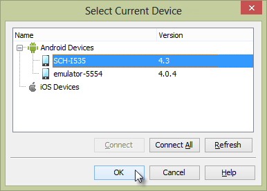{width="3.9846970691163603in"
height="2.856561679790026in"}

> The Mobile Screen user interface consists of a toolbar, a link to
> **Install TestComplete Agent**, the emulated screen and a footer that
> contains buttons that emulate hardware on the device. The toolbar is
> shown in the screenshot below.

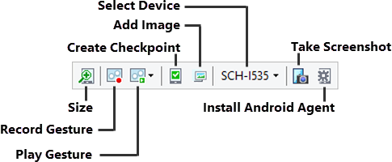{width="5.067001312335958in"
height="2.0833333333333335in"}

> The **Size** button gives you a slider that resizes the emulated
> device\'s screen area and a
>
> **Best Size** link to get the optimal match between the device and the
> Mobile Screen.

{width="2.678590332458443in"
height="3.6093744531933507in"}

> **Record** and **Play** [[Gestures]{.underline}](#gestures) buttons
> allow you to test using complex, multiple touches on the device. See
> the [[Gestures]{.underline}](#gestures) topic for more on recording
> and playing gestures.
>
> [[Mobile Checkpoints]{.underline}](#mobile-checkpoints) allows you to
> take a snapshot of the device\'s screen for later comparison. This
> checkpoint option depends strictly on visual comparison.
>
> The **Add Image** button allows you to add an image to [[Image
> Sets]{.underline}](#image-based-testing).
>
> The **Select Device** drop down list lets you select the device that
> should show in the Mobile Screen.
>
> **Take Screenshot** records the emulated screen as a .bmp or .png
> image.
>
> [[Install Android Agent]{.underline}](#install-android-agent) loads a
> package on the device that exchanges data with open Android
> application and retrieves data from sensors on the device.
>
> The Mobile Screen footer emulates standard hardware buttons on the
> device. From left to right, the buttons are **Back**, **Home**,
> **Menu**, **Volume Down**, **Volume Up**, and **Power**.

{width="2.3546314523184604in"
height="0.29302055993000875in"}

#### Using TestedApp to Manage Packages

> Packages contain Android application definitions in the form of .apk
> files. You can install and launch these applications in TestedApps,
> keyword tests and scripts.
>
> You can define a package in a **TestedApp** and run the TestedApp from
> the TestComplete IDE, from a Keyword Test or from script. To create a
> TestedApp representing an Android Package:

1.  In the Project Explorer, Select, the **TestedApps** node.

{width="2.279501312335958in"
height="2.18625in"}

2.  In the TestedApps editor, right-click and select **Add Android
    Application\...** from the context menu.

{width="4.227226596675416in"
height="4.630311679790026in"}

3.  Define the path for the **Android application package file**. The
    path will point to the location of the .apk file on your local PC
    where TestComplete resides or in a shared network location. Select
    the **Deploy to the device on start** checkbox then click the **OK**
    button.

{width="5.573920603674541in" height="3.7125in"}

4.  Now that you have defined the TestedApp, right-click the item and
    click **Run Selected**

> from the context menu.

{width="5.905713035870516in"
height="4.102916666666666in"}

> The package will be loaded to the default device and will also show in
> the Mobile Screen. If the package was already loaded to the device it
> will be *refreshed*, that is, it will be deleted and reloaded to the
> device.
>
> For more on how to run a TestedApp from the IDE, keyword test or
> script, see the [[Running]{.underline}](#running-a-testedapp) [[a
> TestedApp]{.underline}](#running-a-testedapp) topic.

#### Using Script to Manage Packages

> While [[Using TestedApps to Manage
> Packages]{.underline}](#using-testedapp-to-manage-packages) is a
> practical, one-size-fits-all solution, *script* provides fine-grain
> control over package information, installation, launching and removal
> when you need it. The device\'s **PackageManager** object can install
> a package using a .apk file on your local PC or network share, get a
> reference to an previously installed package using its namespace,
> launch an installed package or remove and installed package. The
> example code below gets a reference to the package manager and first
> looks to see if it\'s installed using the
> **GetInstalledPackageByName()** method. If the package isn\'t found,
> the package manager\'s **InstallPackage()** method takes care of that
> issue. You can run the application by calling **LaunchPackage()** and
> then use the application. If you want to clean up afterwards so the
> next run of the test will load the package fresh, call the
> **RemovePackage()** method to uninstall the package from the device.
>
> *// change this string to reflect your device\'s name.*
>
> *// find the name using the Show Mobile Screen button or by*
>
> *// iterating devices in code.*
>
> **var** deviceName = \"SCH-I535\";
>
> **function** TestNotepad()
>
> {
>
> **var** index, **package**, device, packageManager,
>
> path = \"C:\\\\Workspace\\\\NotePad\\\\bin\\\\NotePad.apk\",
> notepadNameSpace = \"com.example.android.notepad\";
>
> *// set the current device and get a reference to the device*
>
> *// and package manager* Mobile.SetCurrent(deviceName); device =
> Mobile.Device();
>
> packageManager = device.PackageManager;
>
> *// get the package if it\'s already installed.*
>
> **package** =
> packageManager.GetInstalledPackageByName(notepadNameSpace);
>
> *// otherwise, get the package from a file*
>
> **if** (!**package**){
>
> *// get the package file information from the local PC,*
>
> *// returns a PackageObject*
>
> **package** = packageManager.GetPackageFromAPK(path);
>
> *// load the package onto the device*
>
> packageManager.InstallPackage(**package**);
>
> }
>
> *// run the default activity from the package*
>
> packageManager.LaunchPackage(**package**);
>
> *// use the application . . .*
>
> *// delete the package from the device*
>
> packageManager.RemovePackage(**package**);
>
> }

#### Managing Devices with Script

> The top-level **Mobile** object has methods and properties for all
> devices connected to TestComplete on your PC. You can iterate devices
> using the **ChildCount** property and **Child ()** method. Use this
> mechanism to run the same test against multiple devices. The code
> below logs the names of all the connected devices:
>
> **for**(**var** i = 0; i \< Mobile.ChildCount; i++){
> Log.Message(Mobile.Child(i).DeviceName);
>
> }
>
> The **Device** goody bag includes information about the device itself,
> access to the **Desktop** object that represents the device screen,
> access to [[GPS]{.underline}](#gps) and
> [[Sensor]{.underline}](#sensors) objects, ability to simulate an
> **SMS**, and the ability to
> **Drag**/**Swipe**/**Touch**/**TouchAndHold**/**TouchPress**/
> **TouchRelease** anything you find on-screen. You can also execute
> Android shell commands and even **Reboot** the device.

##### Accessing a Device

> To access a single device, use the **Mobile.Device()** method. Without
> parameters, the \"current\" device is returned. You can also specify a
> device name and, if more than one device has the same name, you can
> specify an optional index. The code below shows three functionally
> equivalent statements that access a device named \"SCH-I535\".
>
> **var** device;
>
> *// Use the current device* Mobile.SetCurrent(\"SCH-I535\"); device =
> Mobile.Device();
>
> *// Access by device name*
>
> device = Mobile.Device(\"SCH-I535\");
>
> *// Access by device name and index*
>
> device = Mobile.Device(\"SCH-I535\", 1);

##### Reading Device Information

> With a reference to the device, you can extract everything you need to
> know about the device, including its battery level, operating system,
> model, sensor information and even GPS coordinates. The Device object
> has immediate properties **DeviceName** and **DeviceID**, and the
> **DeviceInfo** property will get you the rest. The code below extracts
> the information to the log:
>
> **var** message, info;
>
> **var** format = \"%s/%s: Battery: %i CPU/ABI: %s Design Name: %s \" +
> \"Fingerprint: %s Mfg: %s Model %s Product Name: %s\";
>
> Mobile.SetCurrent(deviceName); info = Mobile.Device().DeviceInfo;
>
> message = aqString.Format(format, Mobile.Device().DeviceName,
> Mobile.Device().DeviceID,
>
> info.BatteryLevel, *// percentage of charge level* info.CPU\_ABI, *//
> CPU type and ABI convention* info.Device, *// design name*
> info.FingerPrint, *// unique id for the OS* info.Manufacturer, *//
> device manufacturer* info.Model, *// device name visible to user*
> info.Product); *// complete product name*
>
> The screenshot below shows sample output for one run of the test:

{width="4.659617235345582in"
height="1.6396872265966753in"}

##### Device Methods

> Now that you have access to the device and a little information about
> that device, what else can we do with this powerful object? It is a
> phone after all so we should be able to make a call or send an SMS.
> The code below demonstrates how to make a call or send an SMS where
> the device methods are **Call(phoneNumber)** and **SMS(phoneNumber,
> message)**.
>
> Mobile.Device().Call(\"555-1234\"); Mobile.Device().SMS(\"555-1234\",
> \"Pizza anyone?\");
>
> The result from the **SMS()** method is shown in the screenshot of the
> Mobile Screen below. Be aware that both of these methods are
> asynchronous and your test will continue without waiting for the call
> to complete.

{width="2.0172408136482938in" height="3.6in"}

> All of the standard Findxxx() methods are available to [[Open Android
> Applications]{.underline}](#open-android-applications) including
> **FindAll()**, **FindAllChildren()**, **FindChild()** and
> **FindID()**. See the [[Open
> Android]{.underline}](#open-android-applications)
> [[Applications]{.underline}](#open-android-applications) topic for
> examples.
>
> To use single-touch gestures on a mobile device, the **Drag()**,
> **Swipe()** and Touchxxx() methods simulate standard user actions.
> These methods are all asynchronous. The **Drag()** method takes
> starting and ending X and Y coordinates. Optionally, you can add a
> delay time (defaults to 1000). The example below uses an item from an
> [[Image Set]{.underline}](#image-based-testing) to get the starting
> location of an icon and then drags it to position 100 pixels to the
> right and down.
>
> **var** calculatorPosition, X, Y;
>
> Mobile.SetCurrent(deviceName); calculatorPosition =
>
> ImageRepository.HomeScreen.CalculatorIcon.FindPosition(); X =
> calculatorPosition.Left + calculatorPosition.Width / 2;
>
> Y = calculatorPosition.Top + calculatorPosition.Height / 2;
> Mobile.Device().Drag(X, Y, X + 100, Y + 100);
>
> The **Swipe()** method also takes starting and ending X and Y
> coordinates. Optionally, you can add parameters that detail the number
> of steps to move in (defaults to 10) and the duration in milliseconds
> to make the swipe (defaults 1000). The example below gets a reference
> to the device\'s **Desktop** object, swipes from left to right, then
> from right to left.
>
> **var** desktop;
>
> Mobile.SetCurrent(deviceName); desktop = Mobile.Device().Desktop;
>
> *// swipe left to right*
>
> Mobile.Device().Swipe(0, desktop.Height / 2, desktop.Width - 5,
> desktop.Height / 2);
>
> *// swipe right to left*
>
> Mobile.Device().Swipe(desktop.Width - 5,
>
> desktop.Height / 2, 0, desktop.Height / 2);
>
> The Touchxxx methods include **Touch()**, **TouchAndHold()**,
> **TouchPress()**, and **TouchRelease()**. Each method takes an X and Y
> coordinate where the touch is happening. The **TouchAndHold()** method
> takes an additional parameter that denotes the number of milliseconds
> the touch must be held. The **TouchPress()**, **Move()** and
> **TouchRelease()** methods are frequently grouped. The
> **TouchPress()** method simulates pressing the device screen at a
> particular point, the **Move()** method simulates sliding the
> fingertip across to a new specified point and finally the
> **TouchRelease()** method simulates taking the fingertip off of the
> screen.
>
> Mobile.SetCurrent(deviceName); Mobile.Device().TouchAndHold(100, 100,
> 500);
>
> Mobile.Device().Touch(10, 10);
>
> Mobile.Device().TouchPress(20, 20);
>
> Mobile.Device().Move(50, 50);
>
> The log output is shown in the screenshot below.

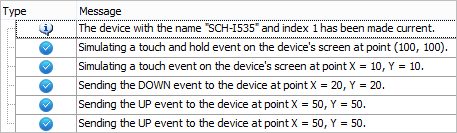{width="4.73812445319335in"
height="1.3715616797900263in"}

> For hardware buttons, use the **PressButton()** method. It takes one
> of the constants listed in the help under [[Mobile Key
> Constants]{.underline}](http://support.smartbear.com/viewarticle/59690/).
> These constants cover all the alphanumeric, function keys, device keys
> (home, back, camera, etc.), game controller keys (left thumb button,
> select, etc.), media keys (eject, play, pause, etc.), modifier keys
> (various flavors of alt, ctrl, shift, etc.), and special characters
> (@, \#, \*, etc.). The code below clicks the home button, briefly
> flashes the menu and then clicks the back button.
>
> Mobile.Device().PressButton(mbkHome);
> Mobile.Device().PressButton(mbkMenu);
> Mobile.Device().PressButton(mbkBack);
>
> TestComplete uses the Android Debug Bridge (ADB) to move data to and
> from the device. If you want to directly execute ADB commands you can
> use the device\'s **ShellExecute()** method. The example below lists
> the features of the device.
>
> **var** output = Mobile.Device().ShellExecute(\"pm list features\");
> Log.Message(output);
>
> The screenshot below shows sample output:

{width="4.487819335083115in" height="3.795in"}

##### GPS

> You can set and get the location of the device using the device\'s
> **GPS Location** object. Use the **GPS SetLocation()** method to set
> the device to a *mock* location. The mock location overrides the
> actual location of the device and is especially useful for setting
> location on emulators that have no physical GPS hardware. You will
> need to enable your device\'s developer **Allow Mock Locations**
> setting to make this work. Later, when you need to get out of the mock
> locations mode, clear the setting and reboot the device. The code
> below takes you to the warm fragrance of Maui without all that trouble
> of getting on a plane:
>
> **var** location, message;
>
> **var** format = \"Latitude: %.3f Longitude: %.3f Altitude: %.3f
> Accuracy:
>
> \%.3f\";
>
> **Mobile**.SetCurrent(deviceName);
>
> **Mobile**.Device.GPS.SetLocation(20.8000, 156.3333, 0, 95); location
> = **Mobile**.Device.GPS.Location;
>
> **if** (location){
>
> message = **aqString**.Format(format, location.Latitude, location.
>
> Longitude,
>
> location.Altitude, location.Accuracy)
>
> **Log**.Message(message, message);
>
> }

{width="5.526005030621173in"
height="1.4334372265966755in"}

> Note that the **Location.Accuracy** property denotes the estimated
> accuracy of the device location, in meters. This number describes a
> radius where the center is the probable location of the device, and
> relates to the latitude and longitude, but not the altitude.

##### Sensors

> Each device has a **SensorsCount** and **Sensors(index)** that allow
> you to iterate every sensor on the device. Each sensor object has a
> **Values** property with sub properties **Value0**, **Value1** and
> **Value2**.
>
> **var** sensor;
>
> Mobile.SetCurrent(deviceName);
>
> **for**(**var** index = 0; index \< Mobile.Device().SensorsCount;
> index++){ sensor = Mobile.Device().Sensor(index);
> Log.AppendFolder(sensor.Name + \": \" + sensor.Type)
> Log.Message(\"Value0: \" + sensor.Values.Value0);
> Log.Message(\"Value1: \" + sensor.Values.Value1);
> Log.Message(\"Value2: \" + sensor.Values.Value2); Log.PopLogFolder();
>
> }
>
> The screenshot below shows a log of sample output:

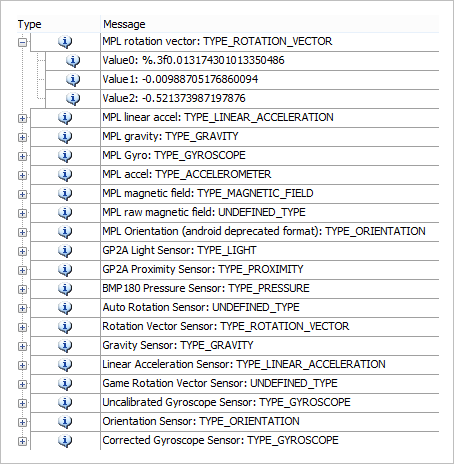{width="4.68165135608049in" height="4.785in"}

#### Image Based Testing

> You can\'t always count on having a prepared, \"white-box\"
> application that is open and lets you easily get at all the controls
> on-screen. You won\'t always have that kind of access. In these cases,
> you can test based on recognizing images. A series of objections pop
> to mind, like \"what about devices that have different sizes and
> resolutions?\", \"if I change color scheme or theme, will the image
> recognition fail?\", and \"will colors bleeding through transparent
> areas of images fool the image recognition?\" TestComplete has
> intelligent mechanisms to recognize images in all of these situations,
> including variable percentages of pixel variation and transparency.
>
> The heart of the approach is the **ImageRepository** in the Project
> Explorer. The ImageRepository has **Image Sets** where each set
> contains multiple images representing a single on-screen object. The
> screenshot below shows the ImageRepository node with two image sets
> named \"Calculator\" and \"HomeScreen\".

{width="2.2128324584426946in"
height="1.4025in"}

> Let\'s say you want to automate a clock icon on your device\'s home
> screen. The icon may be displayed using more than one image, depending
> on manufacturer and operating system version. Resolution can also
> vary, for example, when displayed by a Samsung Galaxy running in
> 720x1280 pixels vs. an HTC One running in 540x960. By using an Image
> Set you can recognize images for any configuration. The screenshot
> below shows the \"HomeScreen\" in the **Image Set Editor** where the
> clock is listed under **Items** on the left-hand side. The **Image
> Strip** at the bottom of the screen has a high-quality image of the
> clock from a device with 720x1280 resolution and another image taken
> from the emulator that only runs at 240x320. The resolutions are
> different, the actual artwork representing the clock is different, and
> the scary part is that the background colors are different based on
> the chosen wallpaper.
>
> When using a Keyword Test or script to reference the Clock object,
> TestComplete looks through the Image Strip and tries to match the
> image with the application under test. If it doesn\'t find the image,
> TestComplete moves to the next image in the strip and tries again.
> This mechanism handles varying resolutions and even helps recognize
> objects that use completely different artwork to represent the object.

{width="5.886568241469816in"
height="4.574998906386702in"}

> What if the wallpaper on the device changes or there is some variation
> in the pixel quality between devices? The **Image Parameters** section
> of the Image Set Editor allow tolerance of color or pixel variations.
> **Color tolerance** accepts a number between 0..255 where zero (the
> default) requires that colors match the stored image exactly and 255
> where pixels of any color are treated as identical. **Pixel
> Tolerance** is the number of pixels that can different from the stored
> Image Strip item. By default, Pixel Tolerance is 0 and all pixels in
> the tested application and the Image Strip item must match exactly.
> The slider below the Pixel tolerance spinner allows you to quickly set
> the percentage of pixel difference that will be allowed, without
> having to know about the number of pixels in the image.

##### Adding Images

> You can conveniently add new images to an Image Set by clicking the
> **Add Image** button on [[The Moble
> Screen]{.underline}](#the-moble-screen).

{width="2.278601268591426in"
height="1.1653116797900263in"}

> The **Add Image to Image Repository** dialog will display. After a few
> moments, a second window labeled **Select Object from Screen** will
> display. Use the mouse to surround a rectangular area. Click the
> **Select** button that appears to save the area to the **Add Image to
> Image Repository** dialog. You can change this selected area later.

{width="1.6205785214348207in"
height="1.4128116797900263in"}

> Provide an **Item name** to be used in scripts and keyword tests. Also
> select an image set from the drop-down list. If you need to retake the
> image, click the **Select Image\...** button. Click the **Finish**
> button to create a new item in the Image Set.

{width="5.927136920384952in"
height="5.958333333333333in"}

> The image will be added as an item to the Image Set editor. Notice the
> **Script line** at the bottom of the Image Set editor dialog that
> provides sample script showing how to programmatically touch the
> selected image.

{width="5.972109580052494in" height="4.17in"}

> You can add more images to the strip for the Image Set item by
> right-clicking and selecting **Add Image\...** or **Add Image From
> File\...** from the context menu. Use the **Set Recognition
> Parameters\...** context menu option to tweak color or pixel
> tolerances.

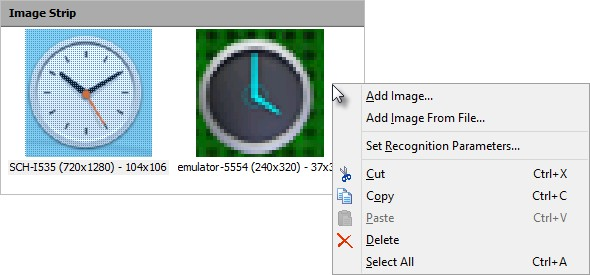{width="5.915094050743657in" height="2.75in"}

> The Image Set Editor **Item Parameters** panel will display and allow
> you to change the **Item name**. You can change the Item name at any
> time, but if keyword tests or scripts refer to it, you will need to
> update those to match the new item name. The **Composite control**
> checkbox, when selected, use the exact coordinates of the selection.
> This checkbox should be selected when the control is composed of
> several smaller controls, such as a date-time picker or a tabbed
> control. For simple controls like buttons and check boxes, leave the
> option unchecked so that selection will occur at the exact center of
> the control.

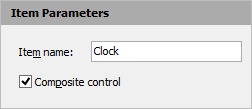{width="2.6124037620297464in"
height="1.1240616797900262in"}

> The **Preview** panel shows the current selected Image Strip item and
> has two important rectangular regions (see screenshot below). The
> *initial target area* is the rectangle you first define when adding
> the image and is defined by a gray rectangle. The red rectangle
> defines the *recognition area* used when attempting to match the image
> set to the on- screen image being tested. You can drag the handles of
> the recognition area to refine your selection and omit problematic
> parts of the screen or right-click to drag the recognition area
> rectangle to a new location. In tests, the upper left corner of the
> initial target area is used as a reference point when touch actions
> have coordinates passed to them. Otherwise, the center of the
> recognition area is used for touch actions.

{width="2.0213024934383204in"
height="2.0109372265966754in"}

##### Using Image Sets in Script

> Image Sets are referenced in script using the syntax
> **ImageRepository.\<image set\>.**
>
> **\<image name\>**. The example below performs a touch action on an
> item named \"Clock\" that is stored in the \"HomeScreen\" Image Set.
>
> ImageRepository.HomeScreen.Clock.Touch();

##### Mobile Checkpoints

> Mobile checkpoints use Image Sets to verify the state of the
> application. If an Image Set item is found in the tested application,
> the checkpoint passes. The setup for the example that follows uses
> images taken from the Calculator application as shown in the
> screenshot below.

{width="2.675910979877515in"
height="5.548124453193351in"}

> The example uses an Image set populated from the Calculator with
> sufficient image to multiply 12x12. The Image set also includes an
> image of the result \"= 144\".

{width="5.86129593175853in"
height="3.845832239720035in"}

> The **Create Mobile Checkpoint** dialog displays in response to a new
> keyword **Mobile Checkpoint** operation or by clicking the **Create
> Mobile Checkpoint** option from the recording toolbar. Your options
> are to **Create a new item** or to **Use an existing item**. The
> **Create a new item** option brings up essentially the same dialog as
> used for [[Adding]{.underline}](#adding-images)
> [[Images]{.underline}](#adding-images) to an image set. If you choose
> the **Use an existing item**, select an image from the list of Image
> Repository items and click the **Finish** button.

{width="5.589114173228347in"
height="5.73375in"}

##### Mobile Checkpoints in Scripts

> The image set item **CheckImage()** method will return true if the
> image is found. The script below touches the calculator images to
> calculate 12 x 12 and verify that the result is an image of 144.
>
> ImageRepository.HomeScreen.CalculatorIcon.Touch();
> ImageRepository.Calculator.One.Touch();
> ImageRepository.Calculator.Two.Touch();
> ImageRepository.Calculator.Multiply.Touch();
> ImageRepository.Calculator.One.Touch();
> ImageRepository.Calculator.Two.Touch();
> ImageRepository.Calculator.Equals.Touch();
>
> **if** (!ImageRepository.Calculator.Result144.CheckImage()){
> Log.Error(\"CheckImage for Result144 failed\");
>
> }

#### Gestures

> *Gestures* represent multiple touch events. Gestures must be recorded
> on a touch-sensitive physical device; emulators cannot be used to
> record gestures. The Mobile Screen has a Record Gesture feature that
> allows you to record multiple touches on your device.
>
> Clicking the **Record Gesture** button on the Mobile Screen first
> prompts to add a **Android Gesture Collection** if a collection
> doesn\'t already exist. Then the **Add Gesture** dialog displays
> announcing that you can record gestures on your physical device. Once
> the dialog displays, the Mobile Screen is disabled and will display
> the message \"Use a physical device to record gestures\". Enter a name
> for the gesture, then touch your physical device to simulate
> multi-touch events. When you\'re done, click the **Stop Recording**
> button.

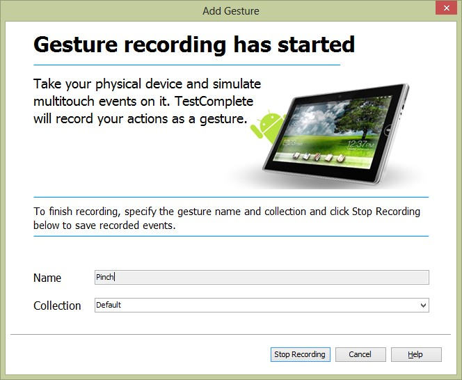{width="5.329616141732283in"
height="4.379374453193351in"}

> TestComplete has a rather nifty way of graphically representing the
> movement of points touched on the device by animating each point in a
> unique color. The screenshot below shows the results of a pinching
> gesture using thumb (shown in red) and index finger (shown in green).
> Double-click the **Name** or **Playback Acceleration** column entries
> to edit them. The Playback Acceleration percentage value can be set
> between zero and 100. By default, acceleration is set to 10% for
> better accuracy. Click the **Play Gesture** button to select a
> recorded gesture and run it.

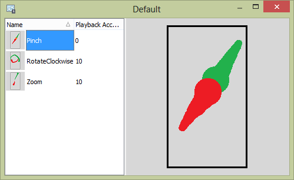{width="5.204507874015748in" height="3.1875in"}

##### Playing Gestures from Script

> To play a gesture in script, use the **AndroidGestureCollection**
> object followed by the gesture collection name and finally the gesture
> name. The **Execute()** method of the gesture emulates the multi-touch
> event:
>
> AndroidGestureCollection.Default.Pinch.Execute();

#### Open Android Applications

> When an Android device is connected via USB cable to your computer,
> the Object Browser window information is sparse. There is no plus sign
> icon indicating that you can expand a device node to see individual
> processes and objects. The application is essentially a black box. The
> screenshot below shows two devices, a physical device named
> \"SCH-I535\" and an emulated device from the Android SDK. Notice the
> error text for the GPS and SensorsCount properties is letting you know
> that something called the Android Agent is not available.

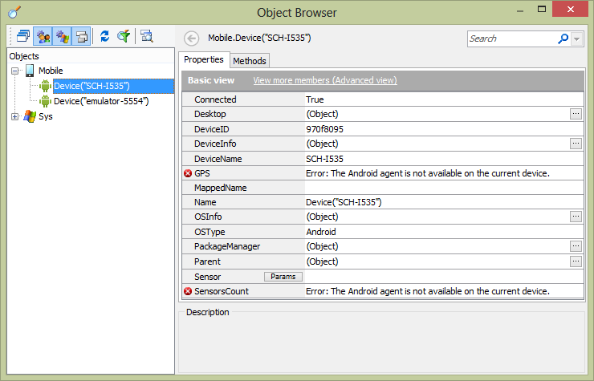{width="5.933443788276465in"
height="3.8098950131233598in"}

> **Figure 168 \-- Devices in the Object Browser**
>
> To involve TestComplete in a detailed conversation with your Android
> application, you need to make changes on both the Android device and
> in the Android application:
>
> [[Install Android Agent]{.underline}](#install-android-agent) [[Modify
> the Android Application]{.underline}](#modify-the-android-application)
>
> **Note**: This topic does not cover installing or configuration of the
> Android SDK, Java or the Eclipse IDE. Refer to the online
> documentation for more information about these topics.

##### Install Android Agent

> The Android Agent is used to exchange data with an open Android
> application. The Android Agent also retrieves data from any sensors on
> the device including GPS data. To install the Android Agent:

1.  Click the **Show Mobile Screen** button.

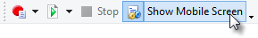{width="3.01in" height="0.43895778652668416in"}

2.  Choose a device to display in the Mobile Screen.

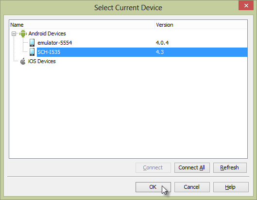{width="5.458248031496063in"
height="4.24875in"}

3.  When the Mobile Screen displays, click the **Install** link located
    at the top of the screen. This step will take a little time while
    the com.smartbear.androidagent package is installed to your device.

{width="2.763546587926509in" height="2.125in"}

4.  A dialog will announce that the Android Agent has been installed
    successfully. Close the dialog.

5.  A page displays help and links to configure device settings. This is
    an optional step that doesn\'t need to be completed until you need
    to perform Geolocation testing or input text in multiple languages.

##### Modify the Android Application

> To get the Android application talking with TestComplete, you need to
> add a SmartBear supplied library to the Android project and add
> initialization code to hook into this library. The example assumes
> that you\'re using the Eclipse IDE and that you have the application
> source code loaded into Eclipse.

1.  Select the Eclipse **Project \| Properties** menu item.

2.  Select **Java Build Path** from the left-hand list.

3.  Select the **Libraries** tab.

4.  Click the **Add External JARs\...** button.

5.  Open **PatchServices.jar** located at **\<TestComplete install
    directory\>\\Bin\\Extensions\\Android**. This step adds a new JAR to
    the Libraries list:

{width="5.928767497812774in"
height="3.8901038932633423in"}

6.  Select the **Order and Export** tab.

7.  Check the box next to the PatchServices.jar entry.

{width="5.544225721784777in"
height="2.46875in"}

8.  Click **OK** to close the properties dialog.

9.  In the application class constructor, add initialization code:

> // Java
>
> public class NotePadApp extends Application { public NotePadApp()
>
> {
>
> **com.smartbear.uibinder.Binder.Initialize(this);**
>
> }
>
> }
>
> If your project does not already contain an object that extends
> **Application**, right-click the
>
> **src** node of your project and select **New \| Class**. Define the
> **Superclass** as **android.app. Application**. Click the **Finish**
> button to create the new class file. The screenshot below shows an
> example completed application class in the New Java Class dialog.

{width="4.498864829396325in"
height="3.58875in"}

##### Use the Object Brow ser

> After installing the Android Agent and modifying the Android
> application to include the SmartBear initialization code, we should be
> able to see detail in the Object Browser. Now try running your
> application from Eclipse. In the example here, we\'re using the
> Android Notepad example application that comes with the SDK, but any
> application with the proper external JAR and initializing code will
> do. The errors flagged in the Object Browser are now gone.
>
> Next, right-click one of the devices in the Object Browser and select
> **Refresh All** from the context menu. The plus sign should display,
> indicating that you can expand the device node. Now that we\'re
> \"cooking with gas\", expand all the nodes to see all the child
> objects for the device. All of these controls can be accessed in code,
> mapped, stored and so on, just as you can with desktop or web
> applications.

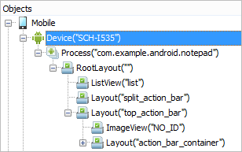{width="3.1824267279090113in"
height="1.9903116797900262in"}

##### Scripting Walk-Through

> This lab demonstrates techniques that you\'re likely to use in most
> Android white-box tests. [[Test Multiple
> Devices]{.underline}](#test-multiple-devices)**:** Iterate devices so
> that the same script is run against each device.
>
> [[Manage Android Packages]{.underline}](#manage-android-packages):
> Load package files from the PC, install, launch, assign packages to
> TestedApps, and remove packages from a device.
>
> [[Wait for Processes and
> Activities]{.underline}](#wait-for-processes-and-activities): Once a
> package is launched, a process starts on the device. Each process has
> one or more *activities*. Wait for processes and activities to be
> available before trying to access child objects.
>
> [[Work with On-Screen
> Objects](#work-with-on-screen-objects):]{.underline} Find controls
> listed in the Object Browser with the same Findxxx script methods used
> throughout TestComplete.

##### Prerequisites

> This labs that follow assume that you have installed the Android SDK
> and the Eclipse IDE. The on-screen objects in this lab are from a
> NotePad sample project found in Android
>
> 4.4.2. Before working through the steps listed be sure to load the
> NotePad project into the Eclipse IDE, [[Install Android
> Agent]{.underline}](#install-android-agent) and [[Modify the Android
> Application]{.underline}](#modify-the-android-application) to allow
> communication with TestComplete.

##### Test Multiple Devices

1.  Create a new TestComplete JavaScript unit.

2.  Add a new function TestNotePad().

3.  Inside of TestNotePad(), declare variables for **index** and
    **device**.

> **function** TestNotepad()
>
> {
>
> **var** index, device;
>
> }

4.  Add a **for** loop to run once for each connected child device. Use
    the Mobile

> **ChildCount** property to set the upper bound of the loop.
>
> **function** TestNotepad()
>
> {
>
> **var** index;
>
> *// iterate all devices connected to TestComplete*
>
> **for**(index = 0; index \< Mobile.ChildCount; index++){
>
> }
>
> }

5.  Get the reference of the device for the current iteration using the
    Mobile **Child()**

> method, passing the index of the device.
>
> *// get the device reference for the current iteration*
>
> device = Mobile.Child(index);

6.  Demonstrate referencing the **Device** object by logging the
    **DeviceName** property.

> *// do something with the device*
>
> Log.Message(device.DeviceName);
>
> Run the example and examine the log.
>
> The code so far looks like the example below.
>
> **function** TestNotepad()
>
> {
>
> **var** index;
>
> *// iterate all devices connected to TestComplete*
>
> **for**(index = 0; index \< Mobile.ChildCount; index++){
>
> *// get the device reference for the current iteration*
>
> device = Mobile.Child(index);
>
> *// do something with the device*
>
> Log.Message(device.DeviceName);
>
> }
>
> }
>
> **Note**: if you want to see other entries in the list, start an
> Android emulator from the Eclipse menu item **Window \| Virtual Device
> Manager**, then select a virtual device from the list and click the
> **Start\...** button. The screenshot below shows emulator for Android
> 4.0.3 being started.

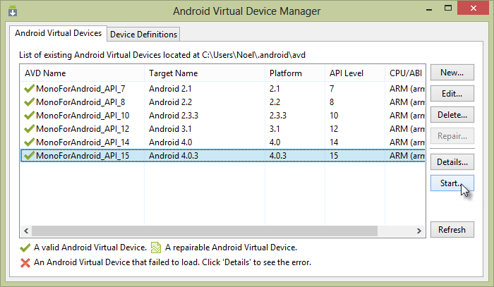{width="5.913641732283464in"
height="3.4340616797900263in"}

##### Manage Android Packages

> Packages contain Android application definitions in the form of .apk
> files. Packages may be loaded from your local PC, already loaded to
> your device, and can also be specified as a TestComplete
> **TestedApp**. This example uses an Android SDK example called
> NotePad. apk.
>
> This lab starts with the code from the previous [[Test Multiple
> Devices]{.underline}](#test-multiple-devices) lab and adds the ability
> to load, install, run and remove a package.

1.  Add new variables named **package** and **path** to the **var**
    list. The **path** variable should point to the directory on your
    local PC where the .apk file is located.

> **var** index, **package**, path =
> \"C:\\\\Workspace\\\\NotePad\\\\bin\\\\NotePad.apk\";

2.  Inside the loop that iterates devices, call the device\'s
    **GetPackageFromAPK()** method to get the .apk file information from
    your local PC and return it as a **PackageObject**.

> **package** = device.PackageManager.GetPackageFromAPK(path);

3.  Now that you have a reference to the package information, you can
    load the package onto the device. Call the device\'s
    **InstallPackage()** method, passing the **PackageObject** retrieved
    in the previous step.

> device.PackageManager.InstallPackage(**package**);

4.  The package has been downloaded to the device and can be launched.
    To run the application\'s default activity, call the device\'s
    **LaunchPackage()** method and pass the **PackageObject**.

> device.PackageManager.LaunchPackage(**package**);

5.  At this point, the application will be running on the device. You
    can now wait for processes and activities, find on-screen controls
    and automate controls. We will look at those techniques in later
    labs. For now, just remove the package from the device by calling
    **RemovePackage()**, again passing the **PackageObject** reference.

> device.PackageManager.RemovePackage(**package**);
>
> The full source for this script should now look something like this:
>
> **function** TestNotepad()
>
> {
>
> **var** index, **package**,
>
> path = \"C:\\\\Workspace\\\\NotePad\\\\bin\\\\NotePad.apk\";
>
> *// iterate all devices connected to TestComplete*
>
> **for**(index = 0; index \< Mobile.ChildCount; index++){
>
> *// get the device reference for the current iteration*
>
> device = Mobile.Child(index);
>
> *// do something with the device*
>
> Log.Message(device.DeviceName);
>
> *// get the package file information from the local PC*
>
> **package** = device.PackageManager.GetPackageFromAPK(path);
>
> *// load the package onto the device*
>
> device.PackageManager.InstallPackage(**package**);
>
> *// run the default activity from the package*
>
> device.PackageManager.LaunchPackage(**package**);
>
> *// use the application . . .*
>
> *// delete the package from the device*
>
> device.PackageManager.RemovePackage(**package**);
>
> }
>
> }

##### Wait for Processes and Activities

> Like a desktop app, Android applications have a top-level process
> that, in turn, contain one or more *activities*. The process
> represents the running application. Each *activity* is an action that
> the user can perform. Using the list of notes in NotePad, editing a
> note or editing a title are all examples of activities. Before you can
> locate on-screen objects and automate them, you should wait for the
> process and main activity load and run. If your automation causes the
> app to change activities, you will need to wait again for the new
> activity to run.
>
> This lab starts with the code from the previous [[Manage Android
> Packages]{.underline}](#manage-android-packages) lab and adds
> statements that wait for the process and main activity to load.

1.  Add **notepadProcess**, **notesListActivity** and
    **notepadNameSpace** to the var list. In particular,
    notepadNameSpace matches the namespace declared in the Android
    application package source and is used to locate the process.

> **var** index, **package**,
>
> path = \"C:\\\\Workspace\\\\NotePad\\\\bin\\\\NotePad.apk\",
> ***notepadProcess, notesListActivity, notepadNameSpace =
> \"com.example.android.notepad\";***

2.  After the launching the package, add script to wait for the process
    for five seconds using the device\'s **WaitProcess()** method. Check
    the existence of the process before continuing.

> notepadProcess = device.WaitProcess(notepadNameSpace, 5000);
>
> **if** (notepadProcess.Exists){
>
> Log.Message(\"The NotePad process is running\");
>
> *// do something with the process\...*
>
> }

3.  Add code inside the **if** statement to check that a specific
    activity is running before trying to locate on-screen objects used
    by the activity. The process **WaitActivity()** method checks for
    the NotesList activity for one second.

> notesListActivity = notepadProcess.WaitActivity(\"NotesList\", 1000);
>
> **if** (notesListActivity){
>
> Log.Message(\"NotesList activity is running\");
>
> // do someting with the activity
>
> }
>
> Run the example and examine the log.

{width="5.87063101487314in"
height="1.0608333333333333in"}

> The full script now looks like the example below.
>
> **function** TestNotepad()
>
> {
>
> **var** index, **package**,
>
> path = \"C:\\\\Workspace\\\\NotePad\\\\bin\\\\NotePad.apk\",
> notepadProcess, notesListActivity, notepadNameSpace =
> \"com.example.android.notepad\";
>
> *// iterate all devices connected to TestComplete*
>
> **for**(index = 0; index \< Mobile.ChildCount; index++){
>
> *// get the device reference for the current iteration*
>
> device = Mobile.Child(index);
>
> *// do something with the device*
>
> Log.Message(device.DeviceName);
>
> *// get the package file information from the local PC*
>
> **package** = device.PackageManager.GetPackageFromAPK(path);
>
> *// load the package onto the device*
>
> device.PackageManager.InstallPackage(**package**);
>
> *// run the default activity from the package*
>
> device.PackageManager.LaunchPackage(**package**);
>
> *// wait for the notepad application for five seconds*
>
> notepadProcess = device.WaitProcess(notepadNameSpace, 5000);
>
> *// is notepad running on the device?*
>
> **if** (notepadProcess.Exists){
>
> Log.Message(\"The NotePad process is running\");
>
> *// wait for the NotesList activity for one second*
>
> notesListActivity = notepadProcess.WaitActivity(\"NotesList\", 1000);
>
> *// is the NotesList activity running on the device?*
>
> **if** (notesListActivity){
>
> Log.Message(\"NotesList activity is running\");
>
> *// do something with the NotesList activity*
>
> }
>
> }
>
> *// delete the package from the device*
>
> device.PackageManager.RemovePackage(**package**);
>
> }
>
> }

##### Work with On-Screen Objects

> Now that the application is in a suitable state, you can use built-in
> device methods and also go spelunking for on-screen objects to
> automate your test. This lab starts with the code from the previous
> [[Wait for Processes and
> Activities]{.underline}](#wait-for-processes-and-activities) lab and
> adds statements that find on-screen objects.
>
> Before adding the code, first find the on-screen objects that you want
> to automate in the Object Browser.

1.  Make sure the app is running on the device.

2.  Navigate to the Object Browser.

3.  Open up the **Device** node and its child nodes.

4.  Locate a node for an on-screen object that you want to automate. In
    this example, we can start with the TextView control named
    \"menu\_add\". In the Properties panel, locate properties that can
    be used to uniquely identify the control. In this example, you could
    use the **Name**, the **ViewID**, or a combination of properties.
    For this example, note the **ViewID** for later use. Repeat this
    step for each control that needs to be automated. You may need to
    navigate in the app to have all the controls you want to automate
    show up in the Object Browser. For this example, the ViewID values
    needed for scripting are \"menu\_add\", \"menu\_save\" and \"note\".

{width="5.9136811023622045in"
height="3.620833333333333in"}

> Add new variables **menuAdd**, **menuSave, editText** and
> **noteEditorActivity** to the **var** list.
>
> **var** index, **package**,
>
> path = \"C:\\\\Workspace\\\\NotePad\\\\bin\\\\NotePad.apk\",
> notepadProcess, notesListActivity, notepadNameSpace =
> \"com.example.android.notepad\", **menuAdd, menuSave, editText,
> noteEditorActivity**;

1.  Inside the line of code that tests notesListActivity, call the
    processes **FindChild()** method and look for a control with a
    **ViewID** equal \"menu\_add\". The control is about 6 levels down
    according to the Object Browser, so pass a slightly larger value to
    the last parameter to the **FindChild()** method.

> **if** (notesListActivity){
>
> menuAdd = notepadProcess.FindChild(\[\"ViewID\"\], \[\"menu\_add\"\],
> 10);
>
> }

2.  After the call to **FindChild()**, add a call to the **Touch()**
    method of the found object.

> menuAdd.Touch();

3.  Touching the \"new\" **TextView** will cause the application to
    switch to a new activity that will edit a note. The new activity is
    called \"NoteEditor\". Wait for the NoteEditor activity for five
    seconds using the processes **WaitActivity()** method. Note: to find
    the name of the new activity you\'ll need to look it up in the Java
    source code.

> noteEditorActivity = notepadProcess.WaitActivity(\"NoteEditor\",
> 5000);
>
> **if** (noteEditorActivity){
>
> **Log**.Message(\"NoteEditor activity is running\");
>
> }

4.  Next, find the **EditText** control used to enter text. Again, use
    the processes FindChild() method, this time looking for a ViewID
    property with the value of \"note\".

> editText = notepadProcess.FindChild(\[\"ViewID\"\], \[\"note\"\], 10);

5.  Send keystrokes to the **EditText** control using the **Keys()**
    method.

> editText.Keys(\"Use the Keys() method to send keystrokes to on-screen
> objects.\");

6.  Finally, find the save button and press it.

> menuSave = notepadProcess.FindChild(\[\"ViewID\"\],
> \[\"menu\_save\"\], 10); menuSave.Touch();
>
> The full script now looks like the example below.
>
> **function** TestNotepad()
>
> {
>
> **var** index, **package**,
>
> path = \"C:\\\\Workspace\\\\NotePad\\\\bin\\\\NotePad.apk\",
> notepadProcess, notesListActivity, notepadNameSpace =
> \"com.example.android.notepad\", menuAdd, menuSave, editText,
>
> noteEditorActivity;
>
> *// iterate all devices connected to TestComplete*
>
> **for**(index = 0; index \< Mobile.ChildCount; index++){
>
> *// get the device reference for the current iteration*
>
> device = Mobile.Child(index);
>
> *// do something with the device*
>
> Log.Message(device.DeviceName);
>
> *// get the package file information from the local PC*
>
> **package** = device.PackageManager.GetPackageFromAPK(path);
>
> *// load the package onto the device*
>
> device.PackageManager.InstallPackage(**package**);
>
> *// run the default activity from the package*
>
> device.PackageManager.LaunchPackage(**package**);
>
> *// wait for the notepad application for five seconds*
>
> notepadProcess = device.WaitProcess(notepadNameSpace, 5000);
>
> *// is notepad running on the device?*
>
> **if** (notepadProcess.Exists){
>
> Log.Message(\"The NotePad process is running\");
>
> *// wait for the NotesList activity for one second*
>
> notesListActivity = notepadProcess.WaitActivity(\"NotesList\", 1000);
>
> *// is the NotesList activity running on the device?*
>
> **if** (notesListActivity){
>
> Log.Message(\"NotesList activity is running\");
>
> *// find the menu\_add object*
>
> menuAdd = notepadProcess.FindChild(\[\"ViewID\"\], \[\"menu\_add\"\],
> 10);
>
> *// press the add button, this will switch to a new activity*
>
> menuAdd.Touch();
>
> *// wait for the NoteEditor activity for five seconds.*
>
> noteEditorActivity = notepadProcess
>
> .WaitActivity(\"NoteEditor\", 5000);
>
> *// is the NoteEditor activity running?*
>
> **if** (noteEditorActivity){
>
> Log.Message(\"NoteEditor activity is running\");
>
> *// find the EditText control with ViewID \"note\"*
>
> editText = notepadProcess
>
> .FindChild(\[\"ViewID\"\], \[\"note\"\], 10);
>
> *// send keystrokes to the EditText control*
>
> editText.Keys(\"Use the Keys() method to send keystrokes \" + \"to
> on-screen objects.\");
>
> *// locate the TextView with ViewID \"menu\_save\"*
>
> menuSave = notepadProcess
>
> .FindChild(\[\"ViewID\"\], \[\"menu\_save\"\], 10);
>
> *// click the save menu item*
>
> menuSave.Touch();

}

> }
>
> }
>
> *// delete the package from the device*
>
> device.PackageManager.RemovePackage(**package**);
>
> }
>
> }

[]{#Xamarin_Open_Apps_Testing .anchor}

> **Summary**
>
> This chapter explored TestComplete mobile testing mechanisms including
> how to test mobile web applications that may have multiple layouts
> based on screen dimension, \"black-box\" native Android applications
> where you don\'t have access to the application\'s internals and
> \"white-box\" native Android applications that are open to inspection.

### Web Services Testing

13. []{#Web_Services_Testing .anchor}**Web Services Testing**

> **Objectives**
>
> This chapter discusses web services in general and looks at
> TestComplete support for testing web services. You\'ll learn how to
> import a web service and call a web service function directly in a
> test. You\'ll use Web Services Checkpoint and XML Checkpoint to verify
> results between test runs.
>
> []{#_bookmark247 .anchor}**Overview of Web Services**
>
> Web Services provide a standardized SOAP based mechanism for calling
> functions across a network of computers where the remote computer
> executes the specified routine and returns the results. From the
> calling computer a request is made using the SOAP protocol and the web
> service provided will execute the function specified and return the
> result.

{width="3.0108311461067365in"
height="1.5365616797900263in"}

> **Figure 169 \--Diagram of a Web Services Call**
>
> SOAP stands for Simple Object Access Protocol and is a standardized
> format for calling functions on remote computers.
>
> In order to work with Web Services, you must have access to a WSDL
> (Web Services Description Language) document that describes the
> available functions, their parameters and results. By importing the
> WSDL document into TestComplete, Web Services calls can be made using
> the Web Services checkpoint.
>
> You can use Web Services to supply data used in a test or you can test
> a Web Service itself. Web Services can be used directly from Keyword
> Tests or Script and the results used as just another data source.
>
> []{#Web_Service_Example .anchor}**Web Service Example**
>
> First, let\'s take a look at a sample web service that contains a
> number of math related functions. The web service is located at this
> URL:
>
> [http:*//training.falafel.com/testcompletews/*](http://training.falafel.com/testcompletews/)
>
> Using a web browser to hit the above URL, you can see a listing of the
> available functions provided by the web service. A link to the WSDL
> document (the link that reads \"Service Description\" in the
> screenshot below) describes the structure of each request and
> response. If you click on the \"Service Description\" link you will
> see the WSDL XML document that fully describes the web service.

{width="5.906447944006999in" height="2.9325in"}

> **Figure 170 \--Sample Web Service**
>
> Not all web services frameworks provide a page like the one above that
> allows a user to examine each function call individually. In many
> cases you will only have a WSDL link pointing to the XML document
> describing the available functions and data types.
>
> []{#Importing_a_Web_Service .anchor}**Importing a Web Service**
>
> Before calling web service functions we need to import its WSDL
> document using the **Web Services Project Item.** This project item is
> only included in the Enterprise version of TestComplete. Here are the
> steps to import a Web Service:

48. From the Project Explorer right click the project node and select
    **Add \| New Item..**. and then the Web Services Project Item:

{width="4.345608048993876in" height="3.6875in"}

> **Figure 171 \--Adding the Web Services Project Item**

49. Right click the Web Services node and select **Add \| New Item\...**
    This will display the Create Project Item dialog.

50. Specify the name for the Web Service to be imported.

{width="4.332505468066492in"
height="2.041874453193351in"}

> **Figure 172 \-- Creating the Web Service Wrapper**

51. On the Web Services editor in the Workspace click the **Select**
    button to import a Web Service:

{width="4.422877296587926in"
height="2.7708333333333335in"}

> **Figure 173 \--Web Services Editor**

52. Specify the URL of the WSDL document
    \"**<http://training.falafel.com/webservice/>
    service1.asmx?WSDL**\".

53. Click the **Get Services** button to import the Web Service, then
    click OK to finish the import process.

{width="5.206571522309711in"
height="2.84375in"}

> **Figure 174 \-- Importing the Web Service**
>
> You should now see the WSDL imported into TestComplete and be able to
> review the objects and methods provided by the web service within the
> editor.

{width="5.950994094488189in"
height="4.134374453193351in"}

> **Figure 175 \-- The Imported Web Service**
>
> []{#Lab:_Using_a_Web_Service_from_a_Script .anchor}**Lab: Using a Web
> Service from a Script**
>
> To call a web service, use the **WebServices** keyword followed by the
> name of the imported web service name. In the example below, the
> \"MyWebService\" created in the \"Importing a Web Service\" topic is
> calling the service\'s Add() method.
>
> **var** answer = WebServices.MyWebService.Add(2, 2);
> Log.Message(answer);
>
> **Dim** answer = WebServices.MyWebService.Add(2, 2)
>
> **Log**.Message(answer)
>
> The routine runs successfully and logs the correct value:

{width="1.5396380139982502in"
height="1.1859372265966754in"}

> **The Logged Web Service Result**
>
> []{#Web_Services_Checkpoints .anchor}**Web Services Checkpoints**
>
> Not only can we call the web service directly and use the results
> however we\'d like in the test, we can also test the web service
> itself to see that it returns expected results. You can perform all of
> the operations needed to call a web service method and check the
> results yourself, or you can use the **Create Web Service Checkpoint
> Wizard** to walk you through the process. Performing the operations by
> hand is more flexible, but the wizard helps you create checkpoints
> faster and more conveniently.
>
> The wizard helps you:
>
> Create an **XMLCheckpoint** project item that stores a baseline copy
> of a web service's response.
>
> Generate script code or Keyword Test steps that calls the web service
> method and checks the result.
>
> You can invoke the wizard when recording a test or at design time. To
> display the wizard when recording a test, select **Create Web Service
> Checkpoint** from the Recording toolbar. You can create Web Service
> Checkpoints for keyword tests and in code. Drag the Web Service
> Checkpoint Operation into the Keyword Test editor.

{width="3.637673884514436in"
height="2.9895833333333335in"}

> **Figure 176 \--Keyw ord Tests Checkpoints**
>
> \...or create Web Service Checkpoints using the Code Editor toolbar.

{width="3.137584208223972in"
height="2.6041666666666665in"}

> **Figure 177 \--Code Editor Checkpoints**
>
> []{#Web_Services_Test_Log_Results .anchor}**Web Services Test Log
> Results**
>
> When using the XML Checkpoint, the TestComplete Test Log provides
> additional support for examining which XML nodes differ. When we
> execute our Web Services test we get a clean test log without errors.
> If we modify our test to generate an error, we can look at the
> resulting test log and see specifically where the difference in the
> XML is located. To simulate an error, we\'re going to modify the **y**
> parameter in our call to the web service and re-execute our test.

1.  Change the y parameter value to \"21\" in the **MyWebService.Add()**
    method call.

2.  Re-execute the test.

3.  On the Test Log window click the **Details** link.

{width="4.966160323709536in"
height="1.3921872265966755in"}

> **Figure 178 \--Test Log for Web Service**
>
> The XML Checkpoint details show us the **Expected XML Data** vs. the
> **Actual XML Data**
>
> reported between the documents.

{width="5.895744750656168in"
height="4.147707786526684in"}

> []{#Lab:_Using_the_Web_Services_Checkpoint_F .anchor}**Lab: Using the
> Web Services Checkpoint From Script**
>
> In this lab, we\'ll take a look at calling a web service function,
> specifying the expected results and then verifying those results:

1.  Invoke the Web Service Checkpoint wizard. On the **Select Web
    Service** page of the wizard, select the web service project item
    that corresponds to the tested web service. Click the **Next**
    button to continue.

{width="4.077984470691163in"
height="1.6706244531933507in"}

> **Figure 179 \--Selecting the Web Service**

2.  On the **Select Web Service Method** page of the wizard, choose the
    web service method to be called.

{width="4.109081364829397in"
height="2.7916666666666665in"}

> **Figure 180 \--Selecting the Web Service Method**

3.  On the **Specify Method Parameters** page, enter the method
    parameter values. If the parameters have a simple value type (a
    string, integer, Boolean and so on), enter values directly on the
    page.

{width="4.0734897200349955in"
height="2.0315616797900264in"}

> **Figure 181 \--Specifying the Method Parameters**

4.  On the **Store Expected Response** page of the wizard, specify the
    XMLCheckpoint project item that will store the expected response of
    the web service method. The response can be saved to a new or to an
    existing XMLCheckpoint project item.

{width="4.824068241469816in"
height="4.34375in"}

> **Figure 182 \--Storing Expected Results**
>
> TestComplete automatically generates the expected response of a method
> call. By default, TestComplete uses predefined values for XML document
> elements that correspond to the result value (or values). For
> instance, if the method returns an integer value, then TestComplete
> generates the \"0\" value for the element that holds the result value.
> You should replace this pre-defined value with the expected value,
> otherwise the comparison will be meaningless.
>
> When creating a new project item, remember that TestComplete will use
> the project item's name to address this project item from script. So,
> the name must be a valid script identifier. Scripting languages
> supported by TestComplete use different naming rules. To specify a
> name that will conform to the rules of any language, enter a string
> that starts with a letter and that only contains letters, digits and
> underscore symbols.

5.  Press the **Finish** button to close the wizard. TestComplete
    automatically creates (or updates) the specified XMLCheckpoint
    project item as shown in the screenshot below.

{width="1.792557961504812in"
height="2.1759372265966754in"}

> **Figure 183 \--The New XML Checkpoint**

6.  If the checkpoint was created during recording, TestComplete
    displays the generated code in the Add Text to Script dialog. Using
    this dialog, you can insert the generated script instructions into
    the recorded code. If the checkpoint was created at design time,
    TestComplete displays the **Copy Text to Clipboard** dialog. Here,
    the generated code can be copied to the clipboard and then pasted
    into the script code.

{width="4.127432195975503in"
height="1.8459372265966754in"}

> **Figure 184 \--Copy Text to Clipboard Dialog**

7.  The generated code looks something like the code example below.

> WebServices.MyWebService.Add(10, 20);
> XML.Add.Check(WebServices.MyWebService);
>
> WebServices.MyWebService.Add(10, 20)
> XML.Add.Check(WebServices.MyWebService)

8.  Running the application should show that the XML checkpoint is
    successful.

{width="5.007557961504812in"
height="0.8971872265966754in"}

> **Figure 185 \--The Log of the XML Checkpoint**
>
> []{#XML_Checkpoint .anchor}**XML Checkpoint**
>
> Web Services communicate via XML therefore the TestComplete XML
> Checkpoint is perfectly suited to the task of verifying calls to these
> functions. However, this Checkpoint can also be used for XML files or
> URLs that return XML. In this topic will take a look at adding an XML
> Checkpoint to our existing Web Services test that validates the
> contents of a file. For example, let\'s say we have an XML file named
> \"Contacts.XML\" that looks like this:

{width="4.968770778652669in"
height="4.958333333333333in"}

> **Figure 186 \--Contacts.xml**

#### Creating an XML Checkpoint Using a File

1.  Add an **XML Checkpoint** from either the Recording toolbar, as a
    Keyword Test Operation or from the Code Editor toolbar.

2.  On the XML Checkpoint dialog, use the default \"Create new item in
    stores\", enter \"\<your local path\>\\Contacts.xml\" as the \"File
    name\" under **XML Source** and click the **Finish** button.

{width="5.747258311461067in" height="3.3125in"}

> **Figure 187 \--Creating the XML Checkpoint**
>
> We can optionally use an existing XML Stores item and/or specify a URL
> to fetch the XML document used during the comparison.

3.  Now that we\'ve added the XML Checkpoint to our test, let\'s take a
    look at the XML store item and review our options for comparison.
    Expand the **Advanced \| Stores \| XML** nodes for the project from
    the Project Explorer and double click the new \"XmlCheckpoint1\"
    node

{width="6.1515605861767275in"
height="3.183333333333333in"}

> **Figure 188 \--XML Checkpoint Editor**

#### XML Checkpoint Options

> The editor for **XML Checkpoints** has several options to customize
> the type of comparison performed during the checkpoint execution.
> These options are designed to ignore certain parts of XML documents,
> extending the capabilities of the checkpoint in situations where the
> documents might not be identical. These options include:

##### Ignore node order Ignore attributes

##### Ignore namespace declarations Ignore prefixes

> **Compare in subtree mode** \-- for comparing an XML fragment
>
> **Extended logging** \-- optionally report information on unchanged
> nodes
>
> []{#_bookmark258 .anchor}**Summary**
>
> In this chapter, we defined web services and examined TestComplete
> support for testing these systems. We looked at:
>
> Importing a web service WSDL document into TestComplete. Using a Web
> Service directly in a test.
>
> Using the Web Services Checkpoint.
>
> Calling a web service function and specifying the XML result.
> Verifying the results of XML documents using the XML Checkpoint.

### Distributed Testing

14. []{#_bookmark259 .anchor}**Distributed Testing**

> **Objectives**
>
> This chapter looks at TestComplete Distributed Testing features and
> illustrates how you can use this feature to leverage multiple machines
> during test execution. You'll learn how to create projects for use in
> distributed testing and how to make them available to remote machines.
> You\'ll also explore some of the issues with executing and
> synchronizing tests on multiple computers.

About the Network Suite
-----------------------

> Distributed tests are executed using the Project Explorer. To enable
> Distributed Testing within a project it is necessary to add the
> **Network Suite** Project Item. The Network Suite contains sub-nodes
> allowing you to configure which tests will execute and on which
> machines. The machine running the Distributed Test functions as a
> heads-up display, allowing you to monitor the status of the machines
> participating in the test.
>
> All of the machines participating in a Distributed Test must be using
> the same version of TestComplete.

#### Single Machine Test Execution

> To get a better understanding of how Distributed Testing works let\'s
> first take a look at how a single project works on one machine. In the
> illustration below we can see a single machine connected to a source
> code repository running a project where tests are executed locally.

{width="5.932162073490813in"
height="1.8525in"}

> **Figure 189 \--Single Project Executing on a Single CPU**
>
> In this setup the machine running TestComplete (or TestExecute) pulls
> the project source files from the repository and executes the test.
> Because the tests run synchronously, the total runtime is one hour.

#### Multiple Machine Test Execution

> Now, let\'s look at the same test run in a Distributed Testing
> environment using the Network Suite. In the illustration below, we see
> a single driver machine running a copy of TestComplete which controls
> test execution on multiple host machines running either TestComplete
> or TestExecute. All of the machines have access to the project, which
> contains the Network Suite Project Item, from the repository. In this
> setup the total running time of the project takes only 15 minutes as
> each machine executes different tests within the project.

{width="5.924021216097988in"
height="3.3881244531933508in"}

> **Figure 190 \--Running Parts of a Project Across Multiple Machines**
>
> In fact, this example illustrates just one scenario for Distributed
> Testing where all of the machines execute tests from a single project.
> However, tests can be executed from any project that has the Network
> Suite Project Item and do not have to be related in any significant
> way. TestComplete Distributed Testing features allow testers to tailor
> test execution to cover a wide variety of scenarios.

Setting up a Distributed Test
-----------------------------

> In this section we\'ll create a project with a simple test that we can
> execute using Distributed Testing. First, we\'ll use the recorder to
> create a basic test then modify the Project to add support for
> Distributed Testing.
>
> Our focus here is creating and configuring a Distributed Test,
> therefore we\'re going to record a very simplistic test for
> illustration purposes only.

#### Recording a Simple Test Case

54. Select **File \| New \| Project\...** and click the **OK** button on
    the Create Project dialog.

55. Right click the **TestedApps** node and select **Add \| New
    Item\...** Using the Add Tested Application dialog select
    \"C:\\Windows\\System32\\Notepad.exe\".

{width="5.105459317585302in"
height="4.541666666666667in"}

> **Figure 191 \--Adding a TestedApp**

56. Double click the **TestedApps** node to open the editor in the
    Workspace.

57. Change the File Path for \"Notepad\" to %SystemRoot%\\System32\\
    using an environment variable to ensure the test will work on any
    Windows machine.

{width="4.87323053368329in"
height="0.45937445319335085in"}

> **Figure 192 \--Change the File Path to use an Environm ent Variable**

58. Click the Record button on the recording toolbar.

59. Using the TestedApps drop down button start \"Notepad\".

{width="3.3686362642169727in"
height="1.2684372265966755in"}

> **Figure 193 \--Running Notepad**

60. In the Notepad main window type \"this is a test\".

61. On the Notepad main window select **File \| Exit** and click the
    **No** button on the confirmation dialog.

#### Configuring the Project for Distributed Testing

> We now have a test that will execute on any remote machine so let\'s
> add the **Network Suite** Project Item and configure our test to run
> on a remote system.

1.  Right click the Project node in the Project Explorer and select
    **Add \|New Item\...** from the context menu.

2.  In the Create Project Item dialog select **NetworkSuite**.

{width="4.584633639545057in" height="4.0625in"}

> **Figure 194 \--Creating the Network Suite Project Item**
>
> This adds the following nodes to our Project:

{width="5.651023622047244in"
height="1.8975in"}

> **Figure 195 --Network Suite nodes**
>
> Now we can begin to add Hosts and Jobs to our Network Suite to
> construct a Distributed Test.

#### Working With Hosts

##### Adding Hosts

> Under the **NetworkSuite**, **Hosts** are machines that will execute
> as part of a Distributed Test. From the **Project Explorer** you can
> double click the **Hosts** node to view the Hosts editor window in the
> Workspace and all of the hosts configured for the Distributed Test
> will appear in the list.
>
> To add a Host to the NetworkSuite:

1.  Right click the Hosts node and select **Add \| New Item\...** from
    the context menu. On the Create Project Item dialog specify \"LAB1\"
    for the Name field and click the **OK** button.

{width="4.584633639545057in" height="4.0625in"}

> **Figure 196 \-- Adding a Host**

2.  In the Hosts Editor, set the **Address** column to the IP address or
    use the ellipsis to choose the machine by network name.

3.  Under the **Base Path** column assign a path relative to the Host
    machine (we\'re using \"C:

> \\Temp\" in this case).

4.  Under the **Source Path** column assign the file path to the
    Project\'s .MDS file.

{width="4.889529746281715in"
height="0.408332239720035in"}

> **Figure 197 \--Setting the IP address, Base Path and Source Path**

##### Hosts Editor Columns

> The Hosts Editor has the following columns:

  **Column**       **Description**
  ---------------- -------------------------------------------------------------------------------------------------------------------------------------------------------------------------------------------------------------------------------------------------------------------------------------------------------------------------------------------------------------------------------------------------------------------------------
  **Name**         The name used to refer to the host from scripts, keyword tests and from the task properties.
  **Address**      The network name or IP address of the computer that the new host is mapped to.
  **Login Mode**   The Manual option requires the remote machine to be logged into before running the test. The Automatic RDB Session connects to the remote computer using Remote Desktop and leaves the computer locked and unavailable to users. The Automatic RDB Session connects to the remote computer using Remote Desktop but moves the session to the remote computer\'s console, leaving the computer unlocked and available for use.
  **Domain**       Specifies the domain to which the user specified in the User name column belongs.
  **User name**    Specifies the account used to open a user session on the slave computer automatically when verifying or running the network suite.
  **Password**     Specifies the password used to open a user session on the slave computer automatically when verifying or running the network suite. If the parameter is skipped, TestComplete will use an empty string.

  **Column**        **Description**
  ----------------- -------------------------------------------------------------------------------------------------------------------------------------------------------------------------------------------------------------------
  **Base path**     Specifies the common path for several projects, which are located on the computer specified by the Address property. TestComplete uses this value to prefix paths specified by a task's Path property.
  **Source path**   Specifies the path to the folder (located on the master computer) holding the slave project that can be copied from the master computer to the host computer. The path should be relative to the master computer.

> There are several other useful items available from the context menu
> on the Hosts Editor including

{width="5.678537839020122in"
height="2.65625in"}

> **Figure 198 \--Hosts Editor Context Menu**

##### Verifying the Host Connection

> Due to the fact that remote machines may not be configured properly,
> TestComplete provides an option to verify the connection to a Host
> machine. You can use the context menu **Verify** option from the
> **Host Editor** as well as the **Project Explorer** context menu on
> the **Hosts** node.

{width="3.7453094925634294in"
height="2.4166666666666665in"}

> **Figure 199 \--Verifying a Host connection**
>
> Refer to TestComplete online help for Firewall configuration details.

##### Copying the Project to the Host

> Now that we\'ve verified the connection and setup our project we can
> copy it to the host machine to prepare for execution. Once we finish
> configuring our test we may want to perform this step again to ensure
> all of our updates are on the Host machine. In practice, tests should
> be stored in a source control repository and loaded onto the host
> machines from there.
>
> 1\. Right click the \"LAB1\" host entry in the Hosts Editor window and
> select **Copy Project to Slave** from the context menu.

{width="4.986001749781277in"
height="3.0104166666666665in"}

> **Figure 200 \--Copying the project to the Host (Slave) m achine**

##### Other Remote Tasks

> Also, be aware that you can restart the remote computer by
> right-clicking and choosing
>
> **Reboot** from the context menu.

{width="5.0948862642169725in"
height="4.59375in"}

> **Figure 201 \--Rebooting the Rem ote Machine**
>
> The **Run State** tab of the NetworkSuite editor displays information
> about the network suite, job or task execution. The **Remote Desktop**
> column actually shows you the window of the slave/host computer as it
> runs. The window displays in the resolution of the master computer.

#### Tasks Editor Window

> The columns in the Tasks Editor are as follows:

  **Column**   **Description**
  ------------ ---------------------------------------------------------------------------------
  **Active**   Specifies whether the task will be run when the job, to which it belongs, runs.

+-----------------------------------+-----------------------------------+
| **Column**                        | **Description**                   |
+===================================+===================================+
| **Name**                          | The name that is used to refer to |
|                                   | the task in tests.                |
+-----------------------------------+-----------------------------------+
| **Host**                          | The name of a computer where the  |
|                                   | project will be run.              |
+-----------------------------------+-----------------------------------+
| **Path**                          | The path to the TestComplete      |
|                                   | project or project suite which    |
|                                   | the task will run.                |
+-----------------------------------+-----------------------------------+
| **Test**                          | Specifies the test item to be     |
|                                   | executed by the task. There is a  |
|                                   | specific syntax for this string   |
|                                   | which is documented in            |
|                                   | TestComplete online help.         |
+-----------------------------------+-----------------------------------+
| **Tag**                           | Specifies an arbitrary string     |
|                                   | associated with the given task.   |
+-----------------------------------+-----------------------------------+
| **Action after run**              | Specifies what TestComplete will  |
|                                   | do after it finishes executing    |
|                                   | the task on the Host computer.    |
|                                   |                                   |
|                                   | Available options in the          |
|                                   | drop-down list are:               |
|                                   |                                   |
|                                   | > \[None\] - Do nothing (do not   |
|                                   | > close TestComplete or           |
|                                   | > TestExecute either). Use this   |
|                                   | > value in combination with the   |
|                                   | > Use value for the Use previous  |
|                                   | > instance option in order to     |
|                                   | > reduce the workload of the      |
|                                   | > remote computer. In this case,  |
|                                   | > after finishing the task the    |
|                                   | > TestComplete (TestExecute)      |
|                                   | > instance on the remote host     |
|                                   | > will not be closed and it will  |
|                                   | > be used for running the next    |
|                                   | > task.                           |
|                                   | >                                 |
|                                   | > \[Close\] - Close the           |
|                                   | > TestComplete (TestExecute).     |
|                                   | > Default value. \[Shut Down\] -  |
|                                   | > Shut down the Host computer.    |
|                                   | >                                 |
|                                   | > \[Reboot\] - Reboot the Host    |
|                                   | > computer.                       |
+-----------------------------------+-----------------------------------+

+-----------------------------------+-----------------------------------+
| **Column**                        | **Description**                   |
+===================================+===================================+
| **Copy remote log**               | Specifies whether and in which    |
|                                   | cases TestComplete should copy    |
|                                   | the remote log of the task        |
|                                   | execution to the master computer. |
|                                   | This property is only meaningful  |
|                                   | if the project specified by the   |
|                                   | Path property is located on a     |
|                                   | computer other than the master    |
|                                   | computer.                         |
|                                   |                                   |
|                                   | Available options in the          |
|                                   | drop-down list are:               |
|                                   |                                   |
|                                   | > \[Always\] - TestComplete       |
|                                   | > copies the results to the       |
|                                   | > master computer at the end of   |
|                                   | > the task execution. Copying     |
|                                   | > results increases the task      |
|                                   | > execution time and uses some    |
|                                   | > disk space, but you can review  |
|                                   | > the results at any time, even   |
|                                   | > if the remote computer is not   |
|                                   | > available. Copied results are   |
|                                   | > kept on your computer until you |
|                                   | > delete them.                    |
|                                   | >                                 |
|                                   | > \[When status is not OK\] -     |
|                                   | > TestComplete copies the results |
|                                   | > to the master computer only if  |
|                                   | > the log on the task execution   |
|                                   | > includes errors and/or          |
|                                   | > warnings.                       |
|                                   | >                                 |
|                                   | > \[Do not copy\] - The task      |
|                                   | > results remain on the remote    |
|                                   | > computer. To view them, you     |
|                                   | > must have access to the results |
|                                   | > folder. Storing results on the  |
|                                   | > remote computer saves disk      |
|                                   | > space on your computer, but you |
|                                   | > may not be able to view them,   |
|                                   | > since the remote computer can   |
|                                   | > be offline or the results       |
|                                   | > folder may be inaccessible.     |
+-----------------------------------+-----------------------------------+

+-----------------------------------+-----------------------------------+
| **Column**                        | **Description**                   |
+===================================+===================================+
| **Use previous instance**         | Specifies whether TestComplete    |
|                                   | will close the remote             |
|                                   | TestComplete (or TestExecute)     |
|                                   | process before executing the      |
|                                   | task.                             |
|                                   |                                   |
|                                   | Available options in the          |
|                                   | drop-down list are:               |
|                                   |                                   |
|                                   | > \[Use\] - Use the running       |
|                                   | > instance of the remote          |
|                                   | > TestComplete (TestExecute). Use |
|                                   | > this value in combination with  |
|                                   | > the None value for the Action   |
|                                   | > after run option in order to    |
|                                   | > reduce the workload of the      |
|                                   | > remote computer. In this case,  |
|                                   | > after finishing the task, the   |
|                                   | > TestComplete (TestExecute)      |
|                                   | > instance on the remote host     |
|                                   | > will not be closed and it will  |
|                                   | > be used for running the next    |
|                                   | > task.                           |
|                                   | >                                 |
|                                   | > \[Show Error\] - Display the    |
|                                   | > error message. Default value.   |
|                                   | >                                 |
|                                   | > \[Terminate\] - Reboot the      |
|                                   | > remote TestComplete             |
|                                   | > (TestExecute) process. Use this |
|                                   | > value to ensure that the task   |
|                                   | > will not fail if previous tasks |
|                                   | > or test runs caused critical    |
|                                   | > errors in the remote            |
|                                   | > TestComplete (TestExecute)      |
|                                   | > instance.                       |
+-----------------------------------+-----------------------------------+
| **Remote application**            | Specifies what testing            |
|                                   | application, TestComplete or      |
|                                   | TestExecute, will be used on the  |
|                                   | remote workstation.               |
+-----------------------------------+-----------------------------------+

#### Synchronizing Computers

> A **SynchPoint** delays execution of a test until all computers with
> that SynchPoint reach the synchronization point. When all the
> computers with a named SynchPoint hit that Synchronize Point, they
> will continue on with their test. An example of an effective use for
> SynchPoints: you want to avoid where two or more users try to edit the
> same record at the same time and post the data.

{width="1.7247451881014872in"
height="1.381874453193351in"}

> **Figure 202 \--SyncPoints**

##### Using SynchPoints in Script

> To use a SynchPoint, the **NetworkSuite.Synchronize()** method,
> passing the name of the SynchPoint (\"WaitForMe\" in the example).
>
> **NetworkSuite**.Synchronize(\"WaitForMe\");
> **NetworkSuite**.Synchronize(\"WaitForMe\")

Executing Distributed Tests
---------------------------

> There are several options for executing Distributed Tests including
> manually in the Project Explorer, from Keyword Tests and from Script.

#### Manual Execution

> The easiest option is to use the context menu from the Project
> Explorer. You can execute either individual Jobs or specific Tasks
> within a job directly from the context menus.

{width="4.444857830271216in" height="4.3725in"}

> {width="4.8246216097987755in"
> height="4.145833333333333in"}

#### Script Execution

> To run from Script, use the **NetworkSuite** object to access Jobs,
> then use the **ItemByName()** method to get at a specific job. From
> there, call the job\'s **Run()** method. Running tasks uses a similar
> pattern, except that from the job we drill down one more level to the
> **Tasks** and then to the specific task, again using the
> **ItemByName()** method before calling **Run()**.
>
> **NetworkSuite**.Jobs.ItemByName(\"Job1\").Run(**true**);
> **NetworkSuite**.Jobs.ItemByName(\"Job1\").Tasks.ItemByName(\"Task1\").Run(**true**);
>
> **NetworkSuite**.Jobs.ItemByName(\"Job1\").Run(**true**)
> **NetworkSuite**.Jobs.ItemByName(\"Job1\").Tasks.ItemByName(\"Task1\").Run(**true**)

#### Runtime Behavior

> TestComplete uses Windows Remote Desktop to display the remote
> computer as the test runs. You will need to configure your remote
> computer to accept Remote Desktop connections for the distributed test
> to work. See the documentation for your operating system for more
> information on accepting Remote Desktop connections.

{width="5.932345800524934in"
height="2.7580205599300087in"}

> **Figure 203 \--A Running Distributed Test**

Lab: Simple Distributed Test
----------------------------

#### Configure The Project

1.  Create a master project with a NetworkSuite Project Item.

2.  Create a hosted (slave) project with a **NetworkSuite** Project
    Item.

{width="3.7453094925634294in"
height="2.4166666666666665in"}

> **Figure 204 \--Verifying the Host**

3.  Add \"Notepad.exe\" to the **TestedApps** project Item of the hosted
    project.

4.  Modify the **File Path** property of the TestedApp to **\"\"**
    (blank).

#### Record a Test

1.  Create (or record) a Keyword Test to type something into notepad.
    For example:

> {width="5.440261373578303in"
> height="1.5365616797900263in"}

2.  Save the project.

> **Figure 205 \--Testing Notepad**

#### Create the Distributed Test

1.  Select the **NetworkSuite** Project Item in the Master Project and
    enter the path to the project suite in the **Shared Path**.

2.  Expand the **Hosts** Project Item and select \"Host1\"

3.  Enter the name (or IP address) of the hosting (slave) computer.

4.  In the **Base** path property enter \"\\\\\<Master Computer
    Name\>\\\<Name of Project Suite directory\>\"

5.  Right-click on \"Host1\" and select **Verify** from the context
    menu.

6.  Expand the **Jobs** Project Item.

7.  Expand the \"Job1\" Project Item.

8.  Select the \"Task1\" Project Item.

9.  In the **Path** property enter \"\\\<Name of Hosted
    Project\>\\\<Name of Hosted Project\>. mds\".

10. In the **Copy remote log** property select \"\[Always\]\". 11.In the
    **Use previous instance** property select \"\[Use\]\".

<!-- -->

12. In the **Test** property enter the path to your test on the hosted
    machine. If you\'re running a Keyword Test then the path might be
    similar to \"\<Name of Hosted
    Project\>\\KeywordTests\\Test1\\Test1\". If running a Script then
    the path would look something like this path: \"\<Name of Hosted
    Project\>\\Script\\Unit1\\Test1\".

13. Right-click \"Task1\" and select **Verify** from the context menu.

14. Right-click the **NetworkSuite** project item and select **Run**
    from the context menu.

Lab: Synchronizing Computers
----------------------------

> There are times when you want to have one computer wait for another
> computer to complete at least part of its task before finishing the
> first computer\'s task. For example, you want the consumer\'s computer
> to wait until the bank\'s computer has processed a debit before the
> consumer\'s computer checks its balance. We will show a couple of ways
> to synchronize.

#### Using SyncPoints

1.  Modify the test in hosted (slave) project.

> **var** p1
>
> **var** w1 TestedApps.notepad.Run();
>
> p1 = Sys.Process(\"notepad\");
>
> w1 = p1.Window(\"Notepad\", \"\*\").Window(\"Edit\"); w1.HScroll.Pos =
> 0;
>
> w1.VScroll.Pos = 0;
>
> w1.Click(135, 29);
>
> w1 = p1.Window(\"Notepad\", \"\*\");
> w1.Window(\"Edit\").Keys(NetworkSuite.Variables.Var1);
> w1.Window(\"Edit\").Keys(\"\[Enter\]\");
> NetworkSuite.Synchronize(\"SynchPoint1\");
>
> w1.Close();
>
> p1.Window(\"\#32770\", \"Notepad\").Window(\"Button\",
> \"&No\").ClickButton();
>
> var p1 var w1
>
> TestedApps.notepad.Run();
>
> p1 = Sys.Process(\"notepad\");
>
> w1 = p1.Window(\"Notepad\", \"\*\").Window(\"Edit\"); w1.HScroll.Pos =
> 0;
>
> w1.VScroll.Pos = 0;
>
> w1.Click(135, 29);
>
> w1 = p1.Window(\"Notepad\", \"\*\");
> w1.Window(\"Edit\").Keys(NetworkSuite.Variables.Var1);
> w1.Window(\"Edit\").Keys(\"\[Enter\]\");
> NetworkSuite.Synchronize(\"SynchPoint1\");
>
> w1.**Close**();
>
> p1.Window(\"\#32770\", \"Notepad\").Window(\"Button\",
> \"&No\").ClickButton();

2.  Right-click the **SynchPoints** Project Item, select **Add \| New
    Item\...** from the context menu.

3.  Hit **Enter** on the Create Project Item dialog.

4.  Create a script in the master project.

> NetworkSuite.Variables.Var1 = \"TestComplete\";
> NetworkSuite.Run(**false**); NetworkSuite.WaitForState(ns\_Running);
> Delay(30000);
>
> NetworkSuite.Variables.Var1 = \"Rocks\";
> NetworkSuite.Synchronize(\"SynchPoint1\");
> NetworkSuite.WaitForState(ns\_Idle);
>
> **NetworkSuite**.Variables.Var1 = \"TestComplete\";
> **NetworkSuite**.Run(false);
> **NetworkSuite**.WaitForState(ns\_Running); Delay(30000);
>
> **NetworkSuite**.Variables.Var1 = \"Rocks\";
> **NetworkSuite**.Synchronize(\"SynchPoint1\");
> **NetworkSuite**.WaitForState(ns\_Idle);

5.  Right-click the **SynchPoints** Project Item, select **Add \| New
    Item\...** from the context menu.

6.  Hit **Enter** on the Create Project Item dialog.

7.  Right-Click in the newly created script and select **Run Current
    Routine** from the context menu.

8.  Observe that on the hosted computer, \"TestComplete\" will be typed,
    followed by a delay and then on a new line \"Rocks\" will be typed.

#### Using NetworkSuite Variables

> NetworkSuite variables allow TestComplete to send data from one
> computer to another.

1.  Modify the test in hosted (slave) project.

> **var** p1
>
> **var** w1 TestedApps.notepad.Run();
>
> p1 = Sys.Process(\"notepad\");
>
> w1 = p1.Window(\"Notepad\", \"\*\").Window(\"Edit\"); w1.HScroll.Pos =
> 0;
>
> w1.VScroll.Pos = 0;
>
> w1.Click(135, 29);
>
> w1 = p1.Window(\"Notepad\", \"\*\");
> w1.Window(\"Edit\").Keys(NetworkSuite.Variables.Var1);
> w1.Window(\"Edit\").Keys(\"\[Enter\]\"); NetworkSuite.Variables.Var2 =
> **true**; NetworkSuite.WaitForNetVarChange(\"Var2\",**false**);
> w1.Window(\"Edit\").Keys(NetworkSuite.Variables.Var1); w1.Close();
>
> p1.Window(\"\#32770\", \"Notepad\").Window(\"Button\",
> \"&No\").ClickButton();
>
> **Dim** p1
>
> **Dim** w1 TestedApps.notepad.Run
>
> **Set** p1 = Sys.Process(\"notepad\")
>
> **Set** w1 = p1.Window(\"Notepad\", \"\*\").Window(\"Edit\")
> w1.HScroll.Pos = 0
>
> w1.VScroll.Pos = 0
>
> **Call** w1.Click(135, 29)
>
> **Set** w1 = p1.Window(\"Notepad\", \"\*\")
>
> **Call** w1.Window(\"Edit\").Keys(NetworkSuite.Variables.Var1)
> **Call** w1.Window(\"Edit\").Keys(\"\[Enter\]\")
> NetworkSuite.Variables.Var2 = True
>
> **Call** NetworkSuite.WaitForNetVarChange(\"Var2\",false)
>
> **Call** w1.Window(\"Edit\").Keys(NetworkSuite.Variables.Var1)
> w1.**Close**
>
> p1.Window(\"\#32770\", \"Notepad\").Window(\"Button\",
> \"&No\").ClickButton

2.  Create a script in the master project.

> NetworkSuite.Variables.Var1 = \"TestComplete\";
> NetworkSuite.Run(**false**);
> NetworkSuite.WaitForNetVarChange(\"Var2\",**true**);
> NetworkSuite.Variables.Var1 = \"Rocks\"; NetworkSuite.Variables.Var2 =
> **false**; NetworkSuite.WaitForState(ns\_Idle);
>
> NetworkSuite.Variables.Var1 = \"TestComplete\" NetworkSuite.Run(false)
>
> **Call** NetworkSuite.WaitForNetVarChange(\"Var2\",true)
> NetworkSuite.Variables.Var1 = \"Rocks\" NetworkSuite.Variables.Var2 =
> False NetworkSuite.WaitForState(ns\_Idle)

3.  Add the variable \"Var2\" to the master project in the
    **NetworkSuite** project item.

4.  Right-click in the newly created script and select **Run Current
    Routine** from the context menu.

> The hosted computer will do the same things as the SynchPoint demo,
> but with less delay in the project. Notice that the hosted computer
> can pass data back to the master computer.

Summary
-------

> In this chapter, we looked at how TestComplete can distribute testing
> to remote machines. We looked at the structure of distributed tests
> and discussed why they can be beneficial.
>
> We also recorded a simple test and examined the necessary steps to
> execute the test in a distributed environment.

### Manual Testing

Manual Testing
==============

Objectives
----------

> This chapter looks at TestComplete support for Manual Testing
> including how to create, edit and execute Manual Tests. You\'ll learn
> about the upgrade path from manual to automatic tests using the
> TestComplete import and export features. You\'ll also learn how to use
> events within a manual test to allow interaction between manual and
> automated tests.

[]{#_bookmark287 .anchor}

About Manual Testing
--------------------

> If you've worked in any sort of Quality Assurance capacity you\'ll
> likely be intimately familiar with manual testing and perhaps more so
> than you might like. Manual testing while extremely valuable can be
> difficult for humans to perform consistently over long periods of time
> because of human nature itself. Manual testing generally takes a great
> deal of concentration and dedicated effort to consistently produce
> results. TestComplete provides an alternative to what could be
> considered the more classical approach of using Microsoft Word or
> Excel. TestComplete support for manual testing allows the test
> developer to guide the tester through a series of steps, capture data
> as the test is being performed and automatically log the results of
> the test. The benefits of manual testing through TestComplete are:
>
> The assurance that the required steps are followed Generation of a log
> file for every test execution Verification of the results based on
> Test Log contents Ability to interact with a manual test using Events
>
> Below is an example of the TestComplete manual test user interface:

{width="5.947606080489939in" height="2.9425in"}

> **Figure 206 \--The TestComplete Manual Testing User Interface**

Creating Manual Tests
---------------------

> In this topic we\'ll walk through the process of creating a Manual
> Test in TestComplete.

62. Select **File \| New \| New Project\...** and click **OK** on the
    **Create New Project** dialog.

63. Right click the **Project** node in the **Project Explorer,** select
    **Add \| New Item\...** and choose **Manual Tests**.

{width="3.4336461067366577in"
height="3.0468744531933507in"}

> **Figure 207 \-- Creating the Manual Tests Project Item**

64. Click **OK** on the **Create Project Item** dialog.

65. Right click the **ManualTests** node in the Project Explorer and
    select **Add \| New Item\...**

> to create a new Manual Test.

66. On the **Create Project Item** dialog enter \"CreateOrder\" as the
    name of the manual test and click **OK** to open the Manual Test
    Editor.

{width="3.405962379702537in"
height="1.7806244531933508in"}

> **Figure 208 \--Creating the Manual Test Item**

#### Manual Test Editor

> The TestComplete Manual Test Editor allows for the creation of a
> multi-step test that prompts the user through a series of
> instructions, collecting results with every step.

{width="5.929561461067366in"
height="3.8906244531933507in"}

> **Figure 209 \--Manual Test Editor**

#### Manual Test Editor Controls

  **Field**               **Description**
  ----------------------- ----------------------------------------------------------------------------------------------------------------------------------------------------
  **Test Steps**          Tree of the steps contained within this test, used for navigation while editing.
  **Test Caption**        Window caption of the Manual Test dialog.
  **ID**                  Step ID for use within Manual Test events.
  **Test Description**    Sub caption of the Manual Test dialog.
  **Test Instructions**   Free-form HTML markup for communicating the actual actions to be performed during the test. Appears in the main portion of the Manual Test dialog.

  **Field**                     **Description**
  ----------------------------- -----------------------------------------------------------------------------
  **Test notes and comments**   Notes for the test writer that are not displayed when the test is executed.

#### Editing the Test Description

> By default, the **Manual Test Editor** opens with only the initial
> node created so we\'ll need to add steps to fill out the test. To
> create a Manual Test description:

1.  Click the **Test Caption** field and enter \"Create Order Manual
    Test\".

2.  Edit the **Test Description** field and set the text to \"In this
    test we will create a new customer order and validate a new record
    is created.\"

3.  Edit the **Test Instructions** field and set the test to \"Using the
    Orders sample application we will add a new order and verify the
    data appears in the list of customer orders.\" The result should
    look like the following:

{width="5.93113188976378in" height="3.88125in"}

> **Figure 210 \--The Manual Test Editor with Test Description**

#### Adding Steps

> Once the description is completed we can start adding steps to the
> test as follows:

1.  Click the green (+) sign or right click in the Test Steps area and
    select **New Step** from the context menu.

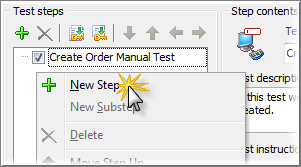{width="3.112386264216973in"
height="1.7221872265966753in"}

> **Figure 211 \--Adding a new step to the Manual Test**

2.  Fill out the Step **Caption**, **Description** and **Instructions**
    for this step of our Manual Test. The actual information can be
    arbitrary or you can use the screenshot below to guide you.

{width="5.941329833770778in"
height="4.523748906386702in"}

> **Figure 212 \--Completed Manual Test**

3.  Add one more manual step and fill out the Step **Caption**,
    **Description** and **Instructions**

> for this step

#### Running Manual Tests

> Manual Tests are run from Script using the name of the test followed
> by the **Start()** method. The manual test object also comes with
> **Suspend()** and **Resume()** methods that can be used in event
> handlers.
>
> ManualTest1.Start(); ManualTest1.Start()

Manual Test Interaction With Automated Tests
--------------------------------------------

> In this topic we\'ll illustrate how manual tests interact with
> automated tests. You can call a manual test from a Keyword Test or
> Script. The reverse is also true. You an call Keyword Tests or Script
> from your manual test.
>
> You might be thinking \"Why would I do this?\" which is a fair
> question. The interesting thing about Manual Tests in TestComplete is
> that you can augment a test by performing actions automatically for
> the user and by incorporating a Manual Test into a Keyword Test or
> Script you can execute any actions necessary to ease the testing
> process such as setup test data, create/delete files, launch
> applications etc. You can also replace parts of your manual test
> incrementally as circumstances dictate, allowing you to move over to
> automated testing in a controlled manner.

Exporting a Manual Test
-----------------------

> Once you\'ve created a manual test you\'re given two options to export
> the test content using the context menu to either Microsoft Word or
> HTML:

{width="3.47748687664042in"
height="4.145833333333333in"}

> **Figure 213 \--Exporting Manual Tests**
>
> TestComplete provides an option to customize the Microsoft Word export
> template on the Properties tab at the bottom of the editor window. The
> export functionality works in a mail merge like fashion and allows you
> to create a Microsoft Word document containing the contents of the
> test.

{width="5.900073272090989in"
height="4.368124453193351in"}

> **Figure 214 \--Manual Test Editor Properties tab**
>
> You can optionally, define your own Microsoft Word template for use
> with the TestComplete export feature. TestComplete includes a default
> template that looks like this:

{width="5.943008530183727in"
height="4.045416666666667in"}

> **Figure 215 \--TestCompleteDefault Microsoft Word Template**

Importing a Manual Test
-----------------------

> The ability to migrate existing legacy manual tests can be a huge time
> saver. TestComplete lets you import manual tests stored in text files,
> Microsoft Word or Microsoft Excel files. TestComplete can handle
> several format arrangements:
>
> One level or multilevel, bulleted or numbered lists. Numbered lists
> can use any number style and formatting for levels.
>
> Test steps using different indents for steps of different levels.
> Tables used to organize the step hierarchy.
>
> Keywords to separate the step caption, description, instructions and
> notes.
>
> TestComplete ships with a set of sample files that can be imported.
> Each file demonstrates a particular format, e.g. text, Excel, Word
> document with headers, etc. The closer your files are to the example
> formats, the less editing you will need to perform in the Manual Tests
> editor. See the online help for complete details on supported formats.
>
> You can find example files to import at:
>
> \\TestComplete Samples\\Manual Testing\\Recommended Formats for Manual
> Test Instructions

#### Simple Text File Import

> If you open the document titled \"Test Instructions in .txt file.txt\"
> you will see steps for testing the Orders application that use numbers
> to indicate each step.

{width="5.492455161854768in"
height="4.28125in"}

> **Figure 216 \--Sample Text File**
>
> If you open the document titled \"Test Instructions in .doc file
> (using headings).doc" you will see steps for testing the Orders
> application that uses the \"Heading1\" style to indicate a new step.

{width="5.929838145231846in" height="5.16in"}

> **Figure 217 \--Sample Import Document**
>
> Test steps can even be arranged in a hierarchy by using styles, i.e.
> \"Heading1\", \"Heading2\", where \"Heading2\" represents the set of
> steps indented from \"Heading1\".
>
> See the TestComplete online help topic \"Importing Manual Tests\" for
> detailed formatting information for each document type.

#### Lab

> Let\'s walk through importing one of the sample documents.

1.  From the TestComplete **File** menu choose **Import \| Test\...**

{width="4.528034776902887in"
height="2.6770833333333335in"}

> **Figure 218 \-- Selecting the Im port Test Option**

2.  In the **Import Test Options** page of the wizard, enter the **Test
    Name** as \"OrdersTest\". Click the ellipses of the **Source File
    Name** and locate the \"Test Instructions in .doc file (using
    headings).doc\" file in the path indicated at the top of this topic.
    Click the **Next** button to continue.

{width="6.199589895013124in"
height="3.0954166666666665in"}

> **Figure 219 \-- Import Test Options**

3.  The wizard will take a moment to process the file and then present a
    summary. Click the

> **Finish** button to close the wizard.

{width="6.191743219597551in"
height="3.037916666666667in"}

> **Figure 220 \--Import Summary**

4.  The imported manual test will show under the ManualTests node in the
    Project Explorer, and all steps described in the document will be
    included in the ManualTests editor.

{width="6.200479002624672in"
height="3.7989577865266844in"}

> **Figure 221 \--The Im ported Manual Test**

Legacy Migration
----------------

> The ability to import legacy manual test steps stored in external
> files coupled with TestComplete tools for converting Manual Test to
> fully automated Keyword Tests comprises a complete migration path.
> This path takes you from the labor-intensive, error prone and
> inconsistent to a wholly automated system that can be run reliably on
> a schedule.

Summary
-------

> In this chapter, we explored TestComplete Manual Testing features and
> discussed the advantages of developing manual tests using
> TestComplete. We learned to:
>
> Create, edit and execute Manual Tests. Call Manual Tests.
>
> Use Events within a Manual Test. Import and Export Manual Tests.

### Low Level Procedures

Low Level Procedures
====================

Objectives
----------

> This chapter explains TestComplete Low Level Procedure functionality
> and how it can be leveraged to deal with situations where they may be
> no easy alternative. You'll learn how to record, edit and execute Low
> Level Procedures. Along the way you will learn how Low-Level
> Procedures differ from standard test recordings, when to use a
> Low-Level Procedure and the difference between Window and Screen Low
> Level Procedures.

About Low Level Procedures
--------------------------

> Low Level Procedures are an alternative recording type provided by
> TestComplete where actual mouse and keyboard events are recorded. Low
> Level Procedures differ dramatically from standard recordings where
> TestComplete records higher level actions against specific onscreen
> objects.

#### Low Level Procedure Types

> There are two kinds of Low Level Procedures:
>
> **Screen Coordinates** \-- Captures events relative to the entire
> screen where the top left-hand corner of the screen is 0,0.
>
> **Window Coordinates** \-- Captures events relative to a user selected
> Window where the top left-hand corner of the window is 0,0.
>
> Window Coordinate Low Level Procedures tend to be more reliable as
> they are unaffected by the location of the selected window and will
> playback relative to the Window\'s current screen location.

#### When To Use Low Level Procedures

> From the outset, tests that rely on screen coordinates generally are a
> bad idea and usually that holds true regardless of which tool you're
> using. However, in certain situations you may find yourself attempting
> to record a scenario that simply refuses to playback properly due to
> the complexity of capturing a user\'s intent via a recorder. In these
> cases, resorting to Low Level Procedures can, at the very least, serve
> as a stop-gap until alternative solutions can be developed.
>
> Additionally, you can work on applications using third party controls
> not directly supported by TestComplete and that provide no visibility
> into the client region of the control such as a custom grid.

Recording Low Level Procedures
------------------------------

> In the \"Web Testing\" chapter we looked at a Web application that
> used JavaScript to dynamically display menu items on screen. The
> application poses an interesting challenge for GUI recorders that tend
> to capture interactions with controls such as clicks and keystrokes.
> Let\'s take a look at recording a Low-Level Window Coordinates
> Procedure to handle the menu selection and understand this alternative
> approach to recording.

#### Low Level Window Coordinates Procedure

67. For starters we\'ll launch Internet Explorer and browse to the
    Orders application located here:

> [http:*//training.falafel.com/dynamiccontent*](http://training.falafel.com/dynamiccontent)

68. Select **File \| New \| Project\...** and on the **Create Project**
    dialog click the **OK** button.

69. Start recording a new test. From the Recorder toolbar, drop down the
    Low-Level Procedure button and select the **Record Low-Level
    Procedure (window coordinates)** option.

{width="5.204438976377952in"
height="1.11375in"}

> **Figure 222 \--Recording a Low-Level Procedure**

70. A red selection rectangle will appear. Move the rectangle onto
    Internet Explorer and click the left mouse button to select it.

{width="2.1676990376202974in"
height="1.8046872265966754in"}

> **Figure 223 \--Selecting IE**

71. On the **Create Project Item** dialog click **OK** to add the
    **Low-Level Procedures Collection** item to the project.

{width="4.311887576552931in"
height="2.0315616797900264in"}

> **Figure 224 \--Adding the Low-Level Procedures Collection**

72. On the **Create Project Item** dialog click **OK** to add a
    Low-Level Procedure to the project.

{width="4.301522309711286in"
height="2.0315616797900264in"}

> **Figure 225 \--Adding a Low Level Procedure**

73. Select the **Add \| New \| Customer \| Orders** menu item on the web
    page.

{width="3.5686811023622047in"
height="2.2395833333333335in"}

> **Figure 226 \--Selecting from a Dynamic Menu**

74. Click the **Stop** button on the recording toolbar.

#### Examining the Recording

> At the completion of the recording you can see that a \"LLCollection\"
> has been added in the Project Explorer. Inside the collection will be
> the Low-Level Procedure you recorded.

{width="1.9227165354330709in"
height="1.3303116797900263in"}

> **Figure 227 \--The Low Level Procedure Collection**
>
> Next, look at the **Low Level Procedure Editor** and the events
> captured by the Low Level Procedure. Double click the **Advanced \|
> LLCollection1 \| LLP1** node from the **Project Explorer**.

{width="3.6925984251968504in"
height="2.4791666666666665in"}

> **Figure 228 \--Low Level Procedure Editor**
>
> The columns in the Low-level Procedure Editor are:

  **Column**   **Value**
  ------------ ------------------------------------------
  **Icon**     Indicator of the type of event performed
  **N**        Ordinal value of this event in the list
  **Event**    Type of action to be performed

  **Column**       **Value**
  ---------------- --------------------------------------
  **Parameters**   Data specific to the specified event
  **Delay, ms**    Delay in milliseconds between events

> From the Low-level Procedure Editor window, you can add, edit and
> delete events from the list using the right click context menu.

{width="3.6925984251968504in"
height="2.4791666666666665in"}

> **Figure 229 \--The Editor Window Context Menu**
>
> The Edit Event dialog provides options to customize all facets of the
> captured event.

{width="2.61334864391951in"
height="1.8459372265966754in"}

> **Figure 230 \-- The Edit Event Dialog**

Calling Low Level Procedures from Script
----------------------------------------

> To run a Low Level Procedure from a Keyword Test, first specify the
> collection followed by a period \".\", then the name of the low level
> procedure, another period \".\" and finally the **Execute()** method.
> If you want the low-level procedure to execute in relation to a
> particular window, pass the window as a parameter to the Execute
> method. Also notice in the example below that before executing the
> low-level procedure, you want to make sure that the window is
> activated and brought to the front.
>
> **var** iexplore = Aliases.iexplore.IEFrame; iexplore.Activate();
> LLCollection1.LLP1.Execute(iexplore);
>
> **Dim** iexplore = Aliases.iexplore.IEFrame iexplore.Activate()
> LLCollection1.LLP1.Execute(iexplore)

Summary
-------

> In this chapter, we looked at TestComplete Low Level Procedure
> capabilities and: Explained how this recording type differs from a
> standard object-based recording Recorded a scenario which otherwise
> requires special handling
>
> Examined the Low-Level Procedure Editor

### User Forms

User Forms
==========

Objectives
----------

> This chapter demonstrates how User Forms are used to display dialogs
> and windows onscreen during test execution. You\'ll learn how to use
> the TestComplete User Form\'s designer to create your own forms.
> You\'ll also see how modal and non-modal display modes manage form
> display during test execution.

[]{#Materials .anchor}

> **Using the Designer**
>
> User Forms are not part of the default project template so you\'ll
> first need to add the **User Forms** Project Item to your project.
> Once you\'ve added User Forms support to your project you can right
> click the User Forms node in the Project Explorer and add a form to
> your project. In this example, we\'ll construct a User Form that can
> be used to prompt for login credentials.

{width="2.613190069991251in"
height="1.8356244531933508in"}

> **Figure 231 \--User Form s Login Dialog**
>
> Once the form is created you will see the User Forms designer which is
> similar in style to those seen in Visual Basic, Visual Studio or other
> development tools supporting forms development. If you are familiar
> with any of these tools you\'ll immediately feel right at home in the
> designer. If not, don\'t fear. Learning the designer is quick and easy
> and you\'ll be able to construct dialogs in no time.

#### Layout of the User Forms Designer

> There are three panels of the User Forms editor including:

75. Component palette

76. Form Designer

77. Properties window

{width="5.950223097112861in"
height="3.9459372265966755in"}

> **Figure 232 \--User Forms Editor**

#### Building a User Form

> To illustrate the functionality of the User Forms designer we\'ll
> build a Login dialog that you can call from within your tests. If the
> UserForms node doesn\'t already exist in the project explorer,
> right-click the project and select **Add \| New Item**. Choose \"User
> Forms\" from the list and click **OK** to create the project item.

{width="4.3459667541557305in"
height="3.5833333333333335in"}

> **Figure 233 \--Adding User Forms**
>
> To create the form, right click the Project Explorer **UserForms**
> node and select **Add \| New Item\...** In the **Name** edit box enter
> \"PasswordDlg\".

{width="4.312343613298338in"
height="1.9903116797900262in"}

> **Figure 234 \--Adding a User Form**
>
> Using the Component palette, we\'ll add the components (TcxTextEdit,
> TcxLabel and TcxButton) from the **Editors**, **Helpers** and
> **Buttons** categories respectively to the form by simply double
> clicking the components. After adding a component to the design-time
> form you can use the mouse to move/size the control and the Properties
> window to change its appearance/behavior. We now have a form that
> looks like this:

{width="5.926007217847769in"
height="2.900624453193351in"}

> **Figure 235 \--Initial User Forms Layout**
>
> Next, we need to make the following property changes on the components
> placed on the form. The table below lists the components and the
> property/values for each. These changes improve the appearance of the
> dialog as well as set the expected behavior of a modal login dialog.

  **Component**   **Property**          **Value**
  --------------- --------------------- -------------
  cxTextEdit1     Name                  edUsername
                  Text                  (blank)
  cxTextEdit2     Name                  edPassword
                  Text                  (blank)
                  Properties.EchoMode   eemPassword
  cxLabel1        Caption               &Username:
                  FocusControl          edUsername

  **Component**   **Property**   **Value**
  --------------- -------------- ------------
  cxLabel2        Caption        &Password
                  FocusControl   edPassword
  cxButton1       Caption        OK
                  Default        True
                  ModalResult    mrOk
  cxButton2       Caption        Cancel
                  Cancel         True
                  ModalResult    True
  \[User Form\]   Caption        Login

> Once these properties have been assigned we\'ll have a completed User
> Form that we can use from within a Keyword Test.

{width="5.915184820647419in"
height="3.1755205599300087in"}

> **Figure 236 \--The Com pleted Form**
>
> []{#Calling_User_Forms_from_Script .anchor}**Calling User Forms from
> Script**
>
> Now that we have created a user form, we need to learn how to call the
> form from Script. There are two method used to display a user form:
> **Show()** and **ShowModal()**.
>
> ShowModal() displays the user form and stops the script from playing
> until the user answers the dialog. Show() continues with the next line
> in the script code.
>
> *//Fill in the current user name*
> UserForms.UserNameAndPassword.edtUser.Text = Sys.UserName; **if**
> (UserForms.UserNameAndPassword.ShowModal() == mrCancel)
>
> Runner.Halt(\"User Cancelled Test\");
>
> Log.Message(\"User: \" + UserForms.UserNameAndPassword.edtUser.Text +
> \" Logged in with Password: \" +
> UserForms.UserNameAndPassword.edtPassword.Text);
>
> *\'Fill in the current user name*
> UserForms.UserNameAndPassword.edtUser.Text = Sys.UserName **if**
> UserForms.UserNameAndPassword.ShowModal = mrCancel **Then**
>
> Runner.Halt(\"User Cancelled Test\")
>
> **end If**
>
> **Log**.Message(\"User: \" &
> UserForms.UserNameAndPassword.edtUser.Text &\_ \" Logged in with
> Password: \" &\_ UserForms.UserNameAndPassword.edtPassword.Text)
>
> []{#_bookmark318 .anchor}**Summary**
>
> In this chapter, we learned how to create user forms for input during
> test execution. We learned about the User Forms designer and how to
> incorporate user forms into a test.

### Best Practices

18. []{#Best_Practices .anchor}**Best Practices**

> **Objectives**
>
> This chapter includes real-world advice on how to plan, organize and
> version control your tests. Other handy tips tell you how to get the
> most out of \"smoke tests\" and how to communicate your test results
> with the team.
>
> []{#Communicating_Test_Results .anchor}**Communicating Test Results**
>
> Now you might be thinking \"huh? I haven\'t even started yet and I
> have to think about communicating my results?\" The answer is a
> resounding YES! Unfortunately, Quality Assurance and test automation
> specifically, at least in the software world, tends to get a bad rap.
> Creating solid test automation that can stand up over time and provide
> valuable ongoing feedback is a difficult task which leads a lot of
> people (read management) to think time and effort spent working on
> automation is wasted.
>
> To solve this problem, you'll want to focus on getting your test
> results published quickly and consistently to prove that your efforts
> are worth the investment. TestComplete provides some facilities for
> producing log output though you'll want to be sure and iron out your
> strategy from the start. For example, you may want to setup a web
> server where you can publish results. In fact, TestComplete supports
> exporting log results to HTML which could be a good starting place.
>
> []{#Plan_your_testing,_but_not_that_kind_of_ .anchor}**Plan your
> testing, but not that kind of planning\...**
>
> The preparation we\'re referring to has to do with your choice of
> testing tool, TestComplete. Although it\'s important to plan the
> application features to be tested, it\'s also important to be prepared
> with respect to the testing facilities available in TestComplete. You
> should gain a thorough understanding of TestComplete features before
> you embark on writing test automation to avoid a situation where your
> weeks into test development only to discover a feature that could have
> saved you numerous hours or days.
>
> TestComplete is rich with features that make test automation easier
> although like any development tool it provides many different ways to
> solve the same problem. For example, TestComplete has a powerful and
> indeed almost alluring recorder, making it easy to quickly create
> automated tests. While a test recorder is a great tool, recorded tests
> tend to be more brittle than hand written tests because they capture a
> single iteration at a given point in time and don\'t take into account
> unexpected events like an error dialog popping up. The alternative is
> handwritten tests where you can methodically plan how the test will
> react in unexpected circumstances. The down side of handwritten tests
> is they tend to take longer to develop though over the long run
> they\'ll likely require less maintenance because of the tendency to
> design the test more rigorously.
>
> []{#Organizing_your_TestComplete_Projects .anchor}**Organizing your
> TestComplete Projects**
>
> TestComplete provides the ability to customize the Project Items that
> are included by default on a new project using Project Templates. In
> order to maintain consistency across your testing organization you
> should work towards creating a project template(s) that\'s
> pre-configured for your test environment. For example, if you\'re
> testing a Window 32-bit GUI application, create a Project Template
> that has the Tested Applications node with your application already
> added to it. Also, look closely at how you can utilize Aliases to
> avoid using long dotted object names like:
>
> Sys.Process(\"iexplore\").IEFrame(0).Window(\"WorkerW\", \"\",
> 1).Window( \"ReBarWindow32\", \"\", 1).Window(\"ComboBoxEx32\", \"\",
> 1).Window(
>
> \"ComboBox\", \"\", 1).Window(\"Edit\", \"\", 1)
>
> TestComplete includes an automatic Name Mapping feature has been added
> to make this even easier.
>
> []{#Use_a_Source_Control_Repository .anchor}**Use a Source Control
> Repository**
>
> TestComplete is a development tool and as such the projects, scripts,
> data, etc. used in your tests should be kept under version control. If
> this is something you\'re already doing, skip ahead. If not, you
> should consider version control the next priority and work to get your
> test suites under version control. There are lots of options including
> some excellent Open Source projects which are freely available like
> Subversion, otherwise known as SVN. While it\'s beyond the scope of
> this document to discuss the specific merits of source control it\'s a
> subject that shouldn\'t be ignored.
>
> []{#Your_Most_Important_Test .anchor}**Your Most Important Test**
>
> Arguably, the first test you should focus on is a \"smoke test\". In
> this section we\'ll discuss what a smoke test is and provide guidance
> as to how to construct the test in such a way as to maximize its
> effectiveness.

#### Creating a Smoke Test

> Probably the most important test you\'ll write is your Smoke Test, at
> least it should be. Typically, the goal of a Smoke Test is to verify
> that the latest build delivered to QA is either worth further
> consideration or \"DOA\" (dead on arrival). The smoke test is crucial
> because of the time savings it can provide both R&D and QA. A good
> Smoke Test should:
>
> Run quickly \-- a smoke test should not last for hours but minutes and
> test the most crucial functionality.
>
> Fail quickly \-- as soon as a failure is detected in the smoke test
> should end and trigger a failure notification.
>
> Cover a broad range of functionality, focusing on breadth not depth.
> Require minimal setup/configuration of the application under test. Be
> setup to run against every build.
>
> Adapt over time as the application under test evolves. Serve as a
> model for new test automation.
>
> If you take the time to organize your Smoke Test to cover these goals
> you will undoubtedly save time and resources over the long run. Your
> Smoke Test should serve as a model that embodies your \"best
> practices\" from which your QA team can draw from for their own tests.
>
> If you\'ve never written a Smoke Test before, start small. In the
> beginning simply get the smoke test to verify even a single piece of
> functionality consistently. Over time, work to increase its coverage
> but remain focused on the quality of the test. It\'s unacceptable to
> have a Smoke Test that can\'t run consistently and without problems.

#### Executing your Tests Regularly

> Once your Smoke Test is written and under version control the next
> step is to automate its execution. SmartBear has a product called
> Automated Build Studio which can automate your TestComplete tests and
> trigger them to execute when a new build is delivered to QA, a process
> called **Continuous Integration** or **\"CI\"**. In addition to
> Automated Build Studio there are Open Source CI servers such as
> CruiseControl.NET.
>
> The main benefit of a CI server is to reduce the amount of time it
> takes to execute your test automation as well as ensure that it
> executes against every build. By setting up a CI server you can not
> only free your QA engineers from having to manually execute their
> tests. CI helps quickly identify tests that are unable to consistently
> run to completion and may require closer scrutiny. In addition, many
> CI servers include a means of publishing test results providing for
> greater visibility into the automation efforts.
>
> []{#General .anchor}**General**
>
> The following are general tips and best practices to help you get the
> most out of TestComplete:
>
> Record/Playback is a quick and easy way to get automated tests up and
> running but tend to be brittle leading to problems when the
> application changes, etc.
>
> Use the TestItems of the project as a framework for Test Cases (see
> the \"Project Organization\" chapter).
>
> Separate Data from the Test Framework (see \"Data Driven Testing\").
>
> Use the code metrics of the Code Explorer to improve the quality of
> the script code (see Overview of TestComplete).
>
> Use reusable routines whenever possible (see the \"Project
> Organization\" chapter). Keep routines short, i.e. less than a page of
> code.
>
> Use meaningful variable names. The default variable names of a
> recording are not acceptable for production use.
>
> []{#Web_Page .anchor}**Web Page**
>
> The following are tips for making effective use of TestComplete when
> testing web pages:
>
> Make sure that \"Make the Page object a child of the browser process\"
> is selected in the Project properties under **Open Applications \| Web
> Testing**.
>
> Use the \"Tree Model\" for best performance. You can set this under
> the Project properties in the General options.
>
> []{#Summary .anchor}**Summary**
>
> In this chapter you learned how to plan, organize and version control
> your tests. You also reviewed tips on how to get the most out of
> \"smoke tests\" and how to communicate your test results with the
> team.

### Appendix A - Shortcuts

[]{#SmartBear .anchor}

19. **Appendix A - Cheat Sheet**

> **Keyboard Shortcuts**
>
> **Global Shortcuts** (keys that work when TestComplete is running even
> if TestComplete does not have focus)

  **Command**              **Default Key**
  ------------------------ -----------------
  Pause script execution   SHIFT-10
  Fix Information          SHIFT-CTRL-A
  Record                   SHIFT-F1
  Stop                     SHIFT-F2
  Run                      SHIFT-F3
  Pause recording          SHIFT-F11
  Low Level Record         SHIFT-F4

> **Key Mapping** (keys that work when TestComplete has focus, generally
> in the editors)

  **Command/Section**   **Default**   **Visual Studio**   **Borland Classic**
  --------------------- ------------- ------------------- ---------------------
  **Debugging**                                           
  Run                   F9            F5                  F9
  Reset                 CTRL-F2       SHIFT-F5            CTRL-F2
  Step Over             F8            F10                 F8
  Trace Into            F7            F11                 F7
  Run to Cursor         F4            F4                  F4
  Switch Breakpoint     F5            F9                  CTRL-F8

  **Command/Section**     **Default**      **Visual Studio**   **Borland Classic**
  ----------------------- ---------------- ------------------- ---------------------
  View Evaluate           CTRL-F7          CTRL-F2             CTRL-F4
  View Call Stack         CTRL-ALT-S       ALT-7               CTRL-ALT-S
  View Watches            CTRL-ALT-W       ALT-3               CTRL-ALT-W
  View Break Points       CTRL-ALT-B       CTRL-B              CTRL-ALT-B
  **Project/Units**                                            
  Close Page              CTRL-F4          CTRL-F4             ALT-F3
  Save Unit               CTRL-S           CTRL-S              CTRL-S
  Open Project            CTRL-F11         CTRL-SHIFT-0        CTRL-F11
  New Project                              CTRL-SHIFT-N        
  Save All                                 CTRL-SHIFT-S        CTRL-SHIFT-S
  Display previous page   CTRL-SHIFT-TAB   CTRL-SHIFT-TAB      CTRL-SHIFT-TAB
  Display next page       CTRL-TAB         CTRL-TAB            CTRL-TAB
  **Cursor movement**                                          
  Cursor Left             LEFT             LEFT                LEFT
  Cursor Right            RIGHT            RIGHT               RIGHT
  Beginning of Line       HOME             HOME                HOME
  End of Line             END              END                 END
  Up one line             UP               UP                  UP
  Down one line           DOWN             DOWN                DOWN

+-----------------+-----------------+-----------------+-----------------+
| **Command/Secti | **Default**     | **Visual        | **Borland       |
| on**            |                 | Studio**        | Classic**       |
+=================+=================+=================+=================+
| Up one page     | PGUP            | PGUP            | PGUP            |
+-----------------+-----------------+-----------------+-----------------+
| Down one page   | PGDN            | PGDN            | PGDN            |
+-----------------+-----------------+-----------------+-----------------+
| Beginning of    | CTRL-HOME       | CTRL-HOME       | CTRL-PGUP       |
| Document        |                 |                 |                 |
+-----------------+-----------------+-----------------+-----------------+
| End of Document | CTRL-END        | CTRL-END        | CTRL-PGDN       |
+-----------------+-----------------+-----------------+-----------------+
| Move to word    | CTRL-LEFT       | CTRL-LEFT       | CTRL-LEFT       |
| before          |                 |                 |                 |
+-----------------+-----------------+-----------------+-----------------+
| Move to word    | CTRL-RIGHT      | CTRL-RIGHT      | CTRL-RIGHT      |
| after           |                 |                 |                 |
+-----------------+-----------------+-----------------+-----------------+
| **Delete        |                 |                 |                 |
| operations**    |                 |                 |                 |
+-----------------+-----------------+-----------------+-----------------+
| Delete          | DEL             | DEL             | DEL             |
| character at    |                 |                 |                 |
| cursor          |                 |                 |                 |
+-----------------+-----------------+-----------------+-----------------+
| Delete          | BACKSPACE       | BACKSPACE       | BACKSPACE       |
| character       |                 |                 |                 |
| before cursor   |                 |                 |                 |
+-----------------+-----------------+-----------------+-----------------+
| Delete current  | CTRL-Y          | CTRL-SHIFT-L    | CTRL-Y          |
| line            |                 |                 |                 |
+-----------------+-----------------+-----------------+-----------------+
| Delete previous | CTRL-BACKSPACE  | CTRL-BACKSPACE  | CTRL-BACKSPACE  |
| word            |                 |                 |                 |
+-----------------+-----------------+-----------------+-----------------+
| Delete next     | CTRL-T          | CTRL-DEL        | CTRL-T          |
| word            |                 |                 |                 |
+-----------------+-----------------+-----------------+-----------------+
| **Miscellaneous |                 |                 |                 |
| **              |                 |                 |                 |
+-----------------+-----------------+-----------------+-----------------+
| Indent selected | CTRL-SHIFT-I    | CTRL-SHIFT-I    | CTRL-SHIFT-I    |
| block           | **or** TAB      |                 |                 |
+-----------------+-----------------+-----------------+-----------------+
| Unindent        | CTRL-SHIFT-U    | CTRL-SHIFT-U    | CTRL-SHIFT-U    |
| selected block  | **or**          |                 |                 |
|                 |                 |                 |                 |
|                 | SHIFT-TAB       |                 |                 |
+-----------------+-----------------+-----------------+-----------------+
| Toggle insert/  | INS             | INS             | INS             |
| overwrite mode  |                 |                 |                 |
+-----------------+-----------------+-----------------+-----------------+

+-----------------+-----------------+-----------------+-----------------+
| **Command/Secti | **Default**     | **Visual        | **Borland       |
| on**            |                 | Studio**        | Classic**       |
+=================+=================+=================+=================+
| Undo            | CTRL-Z **or**   | CTRL-Z **or**   | ALT-BACKSPACE   |
|                 | ALT- BACKSPACE  | ALT- BACKSPACE  |                 |
+-----------------+-----------------+-----------------+-----------------+
| Redo            | SHIFT-CTRL-Z    | SHIFT-CTRL-Z    | ALT-SHIFT-      |
|                 | **or**          | **or**          | BACKSPACE       |
|                 |                 |                 |                 |
|                 | ALT-SHIFT-      | ALT-SHIFT-      |                 |
|                 | BACKSPACE       | BACKSPACE       |                 |
+-----------------+-----------------+-----------------+-----------------+
| Print           | CTRL-P          | CTRL-P          | CTRL-P          |
+-----------------+-----------------+-----------------+-----------------+
| Scroll display  | CTRL-UP         | CTRL-UP         | CTRL-W          |
| up one line     |                 |                 |                 |
+-----------------+-----------------+-----------------+-----------------+
| Scroll display  | CTRL-DOWN       | CTRL-DOWN       | CTRL-Z          |
| down one line   |                 |                 |                 |
+-----------------+-----------------+-----------------+-----------------+
| Display context | ALT-F10 (Code   | ALT-F10 (Code   | ALT-F10 (Code   |
| menu            |                 |                 |                 |
|                 | Editor only)    | Editor only)    | Editor only)    |
+-----------------+-----------------+-----------------+-----------------+
| Find            | CTRL-F          | CTRL-F          | CTRL-F          |
+-----------------+-----------------+-----------------+-----------------+
| Replace         | CTRL-R          | CTRL-H          | CTRL-R          |
+-----------------+-----------------+-----------------+-----------------+
| Search Again    | F3              | F3              | CTRL-L          |
+-----------------+-----------------+-----------------+-----------------+
| Select All      | CTRL-A          | CTRL-A          |                 |
+-----------------+-----------------+-----------------+-----------------+
| Invoke Code     | CTRL-SPACE      | CTRL-SPACE      | CTRL-SPACE      |
| Completion      |                 |                 |                 |
+-----------------+-----------------+-----------------+-----------------+
| Code Templates  | CTRL-J          | CTRL-J          | CTRL-J          |
+-----------------+-----------------+-----------------+-----------------+
| **Bookmarks**   |                 |                 |                 |
+-----------------+-----------------+-----------------+-----------------+
| Set Numbered    | CTRL-SHIFT-\#   | CTRL-SHIFT-\#   | CTRL-SHIFT-\#   |
| Bookmark        |                 |                 |                 |
+-----------------+-----------------+-----------------+-----------------+
| Goto Numbered   | CTRL-\#         | CTRL-\#         | CTRL-\#         |
| Bookmark        |                 |                 |                 |
+-----------------+-----------------+-----------------+-----------------+

  **Command/Section**        **Default**            **Visual Studio**      **Borland Classic**
  -------------------------- ---------------------- ---------------------- ----------------------
  Set Unnumbered Bookmark    CTRL-SHIFT-\'          CTRL-SHIFT-\'          CTRL-SHIFT-\'
  Goto Unnumbered Bookmark   CTRL-\'                CTRL-\'                CTRL-\'
  **Clipboard**                                                            
  Cut to Clipboard           CTRL-X or SHIFT- DEL   CTRL-X or SHIFT- DEL   CTRL-X or SHIFT- DEL
  Copy to Clipboard          CTRL-C or CTRL-INS     CTRL-C or CTRL-INS     CTRL-C or CTRL-INS
  Paste from Clipboard       CTRL-V or SHIFT-INS    CTRL-V or SHIFT-INS    CTRL-V or SHIFT-INS

> []{#Keyboard_Handling_in_Recorder .anchor}**Keyboard Handling in
> Recorder**
>
> TestComplete will record all keys entered to the active control while
> recording except for any keys that are in the Global Shortcuts.
>
> **Global Shortcuts** (keys that work when TestComplete is running even
> if TestComplete does not have focus)

  **Command**              **Default Key**
  ------------------------ -----------------
  Pause script execution   SHIFT-10
  Fix Information          SHIFT-CTRL-A
  Record                   SHIFT-F1
  Stop                     SHIFT-F2
  Run                      SHIFT-F3
  Pause recording          SHIFT-F11
  Low Level Record         SHIFT-F4

> []{#Configuring_Global_Shortcuts .anchor}**Configuring Global
> Shortcuts**
>
> To access and change Global Shortcuts:

78. Select **Tools \| Options** from the main menu.

79. Select **General \| Global Shortcuts** from the Options dialog.

80. Select the **Action**.

81. Type in the new keyboard shortcut (note: if it is already in use,
    you will need to clear the one using it first).

{width="5.960137795275591in"
height="3.126457786526684in"}

> **Figure 237 \--Global Shortcuts**
>
> []{#Configuring_Keyboard_Emulation .anchor}**Configuring Keyboard
> Emulation**
>
> To access and change the keyboard emulation:

1.  Select **Tools \| Customize Keyboard\...** from the main menu.

2.  Choose the keyboard emulation that you want. (You can also set
    keyboard shortcuts for any command in this dialog).

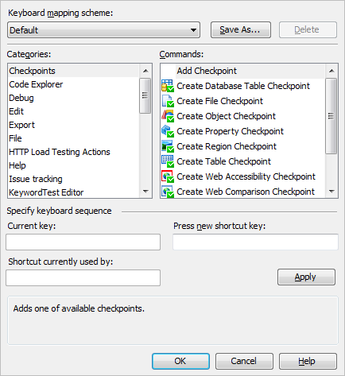{width="4.519971566054243in"
height="4.927083333333333in"}

> **Figure 238 \-- Customize Keyboard Dialog**

### Appendix B - Types of Testing

20. []{#Appendix_B_-_Types_of_Testing .anchor}**Appendix B - Types of
    Testing**

> []{#Types_of_Testing .anchor}**Types of Testing**

#### Manual Testing

> Manual Testing is where a tester methodically exercises the features
> of a product or product area without the aid of test automation. The
> single greatest strength of manual testing is that it is truly
> real-world testing, meaning that the tester can utilize the
> application under test the same way an end user would. Through manual
> testing the tester can provide a wide variety of feedback about the
> application under test not limited to simply reproducing bugs.
>
> Manual tests are difficult to perform on a regular basis. The major
> weakness of manual testing is that it is time consuming, tedious and
> requires extended periods of focused attention. Manual testing tends
> to be quite error prone, leading to situations where consistently
> reproducing a bug can be very difficult.

#### Functional Testing

> Functional Testing focuses on interactions with an application\'s user
> interface (UI) via the mouse, keyboard or other input device with
> particular attention to how the application visually responds to
> input. The goal of Functional Testing is to methodically cover all of
> the various UI features exposed by an application. Functional Testing
> should be highly organized and structured in a manner that allows for
> additional tests to easily be incorporated as new features are added.

#### Unit Testing

> Unit Testing focuses on smaller atomic portions of an application.
> Typically, Unit Testing requires internal knowledge of how an
> application performs and seeks to test portions (objects, methods and
> function) of an application in isolation. In many cases, applications
> have to be designed with Unit Testing in mind in order for this type
> of testing to be truly effective. The benefit of unit testing is that
> it tends to force application developers to write smaller, well
> defined routines with fewer dependencies allowing for highly specific
> tests to be developed.

#### Regression Testing

> Regression Testing is the process of executing tests in a repeatable
> manner and comparing the latest results with previous test executions
> to ensure that the same outcome is achieved. Regression Testing is
> extremely important and is the means of realizing the value of test
> automation. Repeatedly executing tests over time allows you to verify
> the application is still performing as intended.

#### Distributed Testing

> Distributed Testing is the act of farming different portions of a test
> out to separate machines for execution. Distributed Testing is useful
> for simulating real world interactions on a networked application such
> as a web site or web service and can exercise functionality designed
> to handle concurrent use of application resources including, but not
> restricted to data.

#### HTTP Performance Testing

> HTTP Performance Testing is the simulation of real-world interactions
> with a web application from multiple machines. TestComplete provides
> the ability to leverage networked computers and virtual users to
> simultaneously submit HTTP transactions to a web application.

#### Multi-Tier

> In software development there are typically three Tiers which are used
> to describe various aspects of an application they are Client Tier,
> Middle Tier and Data Tier. These are each defined as:
>
> **Client** \-- The user interface or presentation of an application
> and its data which is typically covered through Functional Testing.
>
> **Data Tier** \-- The storage of an application\'s data which can be
> exercised by Functional Testing as well as Unit Testing
>
> **Middle Tier** \-- Refers to the portion of the application
> responsible for moving data back and forth between the Client and the
> Data Tiers. The code that resides in this Tier can be tested from
> either the Client Tier via Functional testing or through Unit Testing
> on the code in the Middle Tier itself. Keep in mind that these are not
> strict rules as to which type of testing should be used but more
> illustrative how the different types of testing can be used.
>
> **Index**
>
> **- % -**
>
> \% 268
>
> Advanced 167
>
> Advanced View 32
>
> AJAX 195
>
> Alias 132
>
> Aliases 131, 140, 144, 145, 337
>
> Aliases Pane 141
>
> Allow Mock Locations 229
>
> **Index**
>
> \%PROGRAM FILES% 27
>
> \%SYSTEMROOT% 27
>
> **- . -**
>
> .NET 32
>
> **- 3 -**
>
> 3rd Party Comparison Tools 125
>
> **- A -**
>
> Accuracy 229 Action after run 290 Activate 327
>
> Active 290
>
> ActiveX 200
>
> activities 249
>
> activity 253
>
> Actual Image 88
>
> Actual XML Data 268, 269 Add Android Application\... 219 Add Child
> Test Item 73
>
> Add Gesture 241
>
> Add Group 73
>
> Add Image 233
>
> Add Image From File\... 233
>
> Add Image to Image Repository 233 Add Image\... 233
>
> Add Process to TestedApps 35 Add Subgroup 73
>
> Add to TestedApps 182, 183 Add Unit References 60
>
> Add Virtual Browser 212 Add Watch 156
>
> Address 286
>
> ADO 186
>
> ADO.NET 186
>
> Android 209, 224, 243, 246, 249, 250, 253
>
> Android Agent 216, 243, 244 Android application package file 219
> Android Gesture Collection 241 Android SDK 216, 243, 250, 252
>
> AndroidGestureCollection 242 Append Log Folder 87 AppendFolder 86, 87
>
> Apple iPhone 5 212
>
> Apple\'s iPhone 5 212
>
> APPLET 200
>
> AQtime 345
>
> AREA 200
>
> Attributes 91
>
> Automated Build Studio 338 Automated BuildStudio 346
>
> automatic Name Mapping 132, 337
>
> Available Events 167
>
> Available Properties 135
>
> AVI 200
>
> **- B -**
>
> Base path 285, 286
>
> Basic View 32
>
> battery level 225
>
> Beginning of Document 351 Beginning of Line 351
>
> Best Size 216
>
> Blackberry 209
>
> black-box 209
>
> Bookmarks 52
>
> Bookmarks Window 52 Borland Developer Studio 59 Breakpoint Properties
> 159
>
> Breakpoints 158
>
> Breakpoints window 158
>
> Bugzilla 74
>
> BuiltIn 63
>
> Built-in Unexpected Window Behavior 170 BuiltIn.InputBox 63
>
> BuiltIn.ShowMessage 63
>
> Buttons 329, 331
>
> **- C -**
>
> C\#Script 46
>
> C++Script 46
>
> CalculateHashValue() 123
>
> Call 225
>
> Call Object Method 268, 310
>
> Call Stack 80, 158, 164
>
> Capture Screen 36
>
> Category 74
>
> Changing Log Appearance 90 Check \"alt\" attribute 200, 206
>
> Check \"mailto:\" 200, 206
>
> Check \"title\" tag 200, 206
>
> Check ActiveX objects 200, 206
>
> Check Applet object 200, 206
>
> Check image sizes 200, 206
>
> Check link accessibility 200, 206
>
> Check multimedia links 200, 206
>
> Check server-side images 200, 206
>
> Check tab indexes 200, 206
>
> CheckImage() 240
>
> Checkpoint 99
>
> Checkpoint Wizard 98
>
> Checkpoints 36, 49, 96
>
> CheckProperty() 102
>
> Child() 224, 250
>
> ChildCount 224, 250
>
> Chrome 195, 210
>
> Chrome patches 210
>
> CI 338
>
> Click 32
>
> Click on focused control 170 Client 360
>
> Clipboard Checkpoint 128
>
> Close Page 351
>
> Code Completion 50
>
> Code Editor 48
>
> Code Editor Options dialog 49 Code Editor Toolbar 48, 49
>
> Code Explorer 21, 25, 339
>
> Code Options 54
>
> Code Templates 54, 55, 351
>
> CodeCollaborator 345
>
> Color tolerance 115, 231
>
> Comment 49
>
> Compare Files 121, 122
>
> Compare Files Operation 121, 122
>
> Compare in subtree mode 275, 277
>
> Compare() 127
>
> Comparison Mode 88
>
> Comparison Parameters 114, 115
>
> Composite control 233
>
> compound conditional expressions 144 Condition 158, 159
>
> Conditional Breakpoints 159
>
> Conditional Mode 140, 141, 144
>
> Connect All 216
>
> Connection 186
>
> Continuous Integration 338 Control Reference Options 132 Copy Project
> to Slave 286, 289
>
> Copy remote log 290, 299 Copy to Clipboard 351 Count 26
>
> Create a new item in Stores 186 Create Database Table Checkpoint 190
> Create Manual Checkpoint dialog 126 Create Mobile Checkpoint 237
>
> Create new item in stores 275 Create Object Checkpoint 102
>
> Create Object Checkpoint dialog 103, 109 Create Project Item 47
>
> Create Property Checkpoint wizard 100 Create Region Checkpoint wizard
> 114, 116 Create Table Checkpoint wizard 119 Create Web Accessibility
> Checkpoint 200
>
> Create Web Accessibility Checkpoint dialog 204 Create Web Comparison
> Checkpoint 200
>
> Create Web Comparison Checkpoint dialog 201 Create Web Service
> Checkpoint 268 CreateFolder() 87
>
> CreateNewAttributes 91 Creating an Event Handler 167 cross browser
> testing 212 CruiseControl.NET 338
>
> CSS pixels 212
>
> CSV 178, 179, 182, 186, 193
>
> Current Project Properties 212 Cursor Left 351
>
> Cursor Right 351
>
> Custom query 186
>
> Custom Toolbars 38
>
> Customize Keyboard 357 Cut to Clipboard 351
>
> **- D -**
>
> Data Driven Loop Operation 184 Data Tier 360
>
> DB Table 178, 179, 182
>
> DblClick 32
>
> Dbq 186
>
> DBTable 182, 184, 186, 190, 191, 193
>
> DBTable checkpoint 186
>
> Debug 27
>
> Debugger Toolbar 155
>
> Debugging 154, 351
>
> Default Value 74
>
> Delay 327
>
> Delete character at cursor 351 Delete character before cursor 351
> Delete current line 351
>
> Delete next word 351 Delete previous word 351 Delphi 59
>
> DelphiScript 46, 154
>
> Deploy to the device on start 219 Desktop 224
>
> Device 250
>
> Device() 224
>
> DeviceID 225
>
> DeviceInfo 225
>
> DeviceName 225, 250
>
> Diff name 125
>
> Diff utility 125
>
> Display context menu 351 Display next page 351 Display previous page
> 351 Distributed Test 284
>
> Distributed Testing 16, 280, 281, 282, 360 Distributed Testing Setup
> 280
>
> Distributed Tests 294
>
> DOM 199
>
> Domain 286
>
> Down one line 351 Down one page 351 Drag 224
>
> Drag() 225
>
> **- E -**
>
> Eclipse IDE 243, 246, 250
>
> Edit Groups\... 109
>
> Edit Name Mapping Item 144
>
> Edit Name Mapping Item dialog 145 Editing options 58
>
> Editor 50, 52
>
> Editor Display Options 57 Editor Highlighting Options 59 Editor
> Options 54
>
> Editors 329, 331
>
> EditText 256
>
> Enable Debugging 36 End of Document 351 End of Line 351 Evaluate 156
>
> Event Handlers 167
>
> Events 32, 167 Events to Handle 167 Excel 179, 186
>
> Execute() 242, 327
>
> Executing Keyword Tests from Script 42 Expected Image 88
>
> Expected XML Data 268, 269
>
> export template 311 Exporting a Manual Test 311 Expression 161
>
> Extended 32
>
> Extended Filter 80, 82 Extended Filter tab 82 Extended Find 135, 140,
> 141
>
> Extended logging 275, 277
>
> **- F -**
>
> Field Chooser 140, 141
>
> Fields 32
>
> File Checkpoint 121
>
> File Name 26
>
> File Path 26, 27, 297 Fill From Network 286 Filter 31
>
> Filter Builder dialog 80, 82
>
> Filter Data 80, 82
>
> Find 351
>
> FindAll() 225
>
> FindAllChildren() 225
>
> FindChild() 225, 256
>
> Finder Tool 99, 100, 102, 103, 114
>
> FindID() 225
>
> Firefox 195
>
> Firewall 288
>
> Fix Information 351 Formatting the Log 91 FullName 132
>
> Function List 49
>
> Functional Testing 359
>
> **- G -**
>
> General Events 167, 168
>
> Geolocation 244
>
> Gestures 241
>
> Get Services 263
>
> GetInstalledPackageByName() 223
>
> GetPackageFromAPK() 252
>
> Global Shortcuts 355, 356 Go to Error 156
>
> Goto Bookmarks 52
>
> Goto Numbered Bookmark 351 Goto Unnumbered Bookmark 351 GPS 209, 224,
> 225, 229, 244
>
> GPS Location 229
>
> Gutter 54
>
> **- H -**
>
> HashValue 122
>
> Helpers 329, 331
>
> Hide 49
>
> Highlight on Screen 35 Highlighting Options 59
>
> Host 290
>
> Host Editor 288
>
> Hosts 282, 284, 285, 299
>
> Hosts Editor 285, 286
>
> HREF 200
>
> Hybrid 199
>
> **- I -**
>
> Icon 26
>
> IDE 19
>
> Ignore attributes 275, 277
>
> Ignore namespace declarations 275, 277
>
> Ignore node order 275, 277
>
> Ignore prefixes 275, 277
>
> Ignore unexpected window 170 Image Based Testing 209, 215
>
> Image Parameters 231
>
> Image Set 225 Image Set Editor 231 Image Sets 231
>
> Image Strip 231
>
> Image Toolbar 88
>
> ImageRepository 231, 236
>
> IMG 200
>
> import 314
>
> Import Test Wizard 317 Importing a Manual Test 314 Importing a Web
> Service 264 Include Mouse Pointer 115 Indent 49
>
> Indent selected block 351 INPUT 200
>
> InputBox 63
>
> Install Android Agent 243, 250 Install TestComplete Agent 216
> InstallPackage() 223, 252
>
> Integrated Development Environment 19 Internet Explorer 195
>
> Internet Explorer Process Nodes 198 Invoke Code Completion 351
>
> iOS 209
>
> iPad 210
>
> iPhone 209, 210, 212
>
> IsEOF() 184
>
> Issue Tracking Templates 74 Item name 233
>
> Item Parameters 233
>
> ItemByName() 296
>
> **- J -**
>
> Java 243
>
> Java Build Path 246 JavaScript 195
>
> Jobs 282, 284, 295
>
> Jobs Editor Window 290 JScript 46
>
> Jump to Test 73
>
> **- K -**
>
> Key Mapping 351
>
> Keyboard Emulation 357
>
> Keyboard events 327
>
> Keys 32
>
> Keys() 256
>
> Keyword Tests 25
>
> KeywordTests 24, 42, 268, 310
>
> **- L -**
>
> Last Operation Result 90 Launch 26
>
> LaunchPackage() 223, 252
>
> Local Value 74
>
> Locals 158, 163
>
> Locals window 159
>
> Location 47, 229
>
> Location.Accuracy 229
>
> LockEvents 92
>
> Log Attributes 90
>
> Log Items 81
>
> Log Message 85, 90
>
> Log Structure 86
>
> Log Window 80, 81
>
> Log.CreateNewAttributes 91
>
> Log.LockEvents 92
>
> Log.Message 91
>
> Log.Picture() 168
>
> LogParams 167, 176
>
> Low Level Procedure Editor 322, 325 Low Level Procedure Types 321
>
> Low Level Procedures 321, 322
>
> Low Level Procedures Collection 322, 323 Low Level Record 351

+----------------------+------------+
| > **- M -**          |            |
+======================+============+
| > Make Data Loop\... | > 184      |
+----------------------+------------+
| > Manual Checkpoint  | > 128      |
+----------------------+------------+
| > Manual Checkpoints | > 126, 127 |
+----------------------+------------+

> manual test 306, 309, 310, 319
>
> Manual Test Editor 307, 308
>
> Manual Testing 305, 359
>
> Manual Testing Events 167 Manual Tests 310
>
> ManualCheck.Compare() 127
>
> ManualTests 306, 314, 317
>
> Map Child Objects 133, 140
>
> Map Object 36
>
> Map Object dialog 133
>
> Map Object from Screen 150 Map Object Name Dialog 133 Map Object\...
> 35, 150 Mapped Object Name 135 Mapped Object Pane 141
>
> Mapped Objects 140, 144, 145
>
> Mapped properties 140
>
> Mask 115
>
> Message 90
>
> Methods 31
>
> Methods tab 32
>
> Microsoft Excel 314
>
> Microsoft Script Debugger 154 Microsoft Script Debugger (MSD) 154
> Microsoft Word 314
>
> Middle Tier 360
>
> Mobile 224
>
> Mobile Checkpoint 237
>
> Mobile checkpoints 237 Mobile Key Constants 225 Mobile Screen 216, 244
>
> Mobile Web 209, 215
>
> Mode 203
>
> Mouse events 327
>
> Move Items 73
>
> Move to word after 351 Move to word before 351 Move() 225
>
> MS SQL 178
>
> MSD 154
>
> Multi-Tier 360
>
> **- N -**
>
> Name Mapping 24, 131, 132, 142, 144 Name Mapping editor 147
>
> Naming convention 199
>
> Navigate 49
>
> Navigate() 212
>
> Network Suite 280, 282, 284 Network Suite Events 167
>
> Network Suite Project Item 282
>
> NetworkSuite 282, 284, 285, 290, 296, 297, 299,
>
> 301
>
> NetworkSuite variables 301
>
> NetworkSuite.Synchronize() 294 New Event Handler 167
>
> New Project 351
>
> Next() 184
>
> Nokia Lumia 920 212
>
> **- O -**
>
> Object Browser 14, 19, 31, 32, 34, 35, 133, 196,
>
> 249, 256
>
> Object Browser Context Menu 35 Object Checkpoint 102, 103, 109, 113
>
> Object Checkpoints 108
>
> Object Name Mapping dialog 135, 150
>
> Object Spy 36, 150
>
> Object Tree 31
>
> On-Screen Action wizard 178 OnUnexpectedWindow 167, 168, 170, 172, 176
>
> OnWebBeforeNavigate 167
>
> Open Android Application 209, 215 Open Android Applications 216 Open
> Project 351
>
> Operation Parameters 178
>
> Options 49
>
> Oracle 178
>
> **- P -**
>
> PackageManager 223
>
> PackageObject 252
>
> Panel Options\... 35
>
> Parameter Completion 50, 51
>
> Parameters 26, 71
>
> Pass Count 158, 159
>
> Password 286
>
> Paste from Clipboard 351 PatchServices.jar 246
>
> Path 290
>
> Pause 38
>
> Pause recording 351 Pause script execution 351
>
> Perform the following actions instead of comparing 129
>
> Performance Testing 360
>
> Persistent Variables 74
>
> Picture 80, 85
>
> Pixel Tolerance 115, 231
>
> Play Gesture 241
>
> Playback 170
>
> Playback Acceleration 241
>
> Playback from the Test Engine toolbar 39 Playback Indicator 38, 43
>
> Pop Log Folder 87 PopLogFolder 86, 87
>
> Post Screenshot 80, 85
>
> Press Enter 170
>
> Press ESC 170
>
> PressButton() 225
>
> Print 351
>
> process 253
>
> Profile 27
>
> PROGRAM FILES 27
>
> Project Explorer 20, 21, 23
>
> Project Item 154
>
> Project Item Elements 24 Project Items 23
>
> Project Log 80
>
> Project Node 39
>
> Project Suites 22
>
> Project Templates 337 Project Test Item 39 Project Variables 182
>
> Project Web Tree Model 200 Project Workspace 19 Project Workspace
> Editor 68 Projects 22, 23
>
> ProjectSuite 182
>
> ProjectSuite Logs 21
>
> Properties 31
>
> Properties Pane 142
>
> Properties tab 32
>
> Property Checkpoint 99, 100, 102
>
> PushFolder() 87
>
> **- Q -**
>
> Quick Search 31, 33
>
> **- R -**
>
> Read the web contents directly from the web server 203
>
> Reboot 224, 286, 290
>
> recognition area 233
>
> Record 351
>
> Record Gesture 241
>
> Record Low-Level Procedure 323 Redo 351
>
> Referencing Projects 60
>
> Referencing Units 60
>
> Refresh 35
>
> Region Checkpoint 114, 116
>
> Region Checkpoints 118
>
> Regression Testing 359
>
> Remarks 80, 81, 85, 90

+----------------------+------------+
| > Remote application | > 290      |
+======================+============+
| > Remote Desktop     | > 290, 297 |
+----------------------+------------+
| > RemovePackage()    | > 223, 252 |
+----------------------+------------+
| > Replace 351        |            |
+----------------------+------------+

> Reset 351
>
> Reset() 184
>
> Resume() 310
>
> Revision Marks 50
>
> Run 351
>
> Run Current Routine 41, 63, 123, 156, 299, 301
>
> Run Mode 26
>
> Run Project 39
>
> Run Project button 69

+-----------------+-----------------+
| > Run Selected  | > 49, 73        |
+=================+=================+
| > Run State tab | > 290           |
+-----------------+-----------------+
| > Run to Cursor | > 155, 156, 351 |
+-----------------+-----------------+
| > Run() 296     |                 |
+-----------------+-----------------+
| > RunAs 27      |                 |
+-----------------+-----------------+

> Runtime 170
>
> **- S -**
>
> Samsung Galaxy Mini 210 Save All 351
>
> Save Unit 351
>
> Screen Coordinates 321
>
> Script 24, 25, 42
>
> Script Debugger 154
>
> Script Extensions 98
>
> Script Language Choice 46 Script line 233
>
> Script Project Items 47
>
> Scroll display down one line 351 Scroll display up one line 351 Search
> Again 351
>
> SELECT 200
>
> Select All 351 Select CSV File 184
>
> Select Current Device 216 Select DB Table Variable 184 Select Device
> 216
>
> Select Image\... 233
>
> Select Object from Screen 233 Select Object with Cursor 99 Select
> Objects to Map 140 Select Property 100
>
> Select Records 184
>
> Selected Properties 135
>
> Send WM\_CLOSE 170
>
> Sender 167
>
> Sensor 224
>
> sensors 209
>
> Sensors(index) 230
>
> SensorsCount 230, 243
>
> Service Description 263 Set Next Statement 156
>
> Set Numbered Bookmark 351
>
> Set Recognition Parameters\... 233 Set Unnumbered Bookmark 351
> SetFocus 327
>
> SetLocation() 229
>
> Shared Path 299
>
> ShellExecute() 225
>
> Show all children 80, 82 Show all parents 80
>
> Show Mobile Screen 216, 244
>
> Show Object in Name Mapping Editor 35 Show() 334
>
> ShowMessage 63
>
> ShowModal 334
>
> ShowModal() 334
>
> Silverlight 195
>
> Simple 27
>
> Simple Filter 80
>
> Simple Object Access Protocol 262 Simple Text File Import 314
>
> Single Machine Test Execution 280
>
> SmartBear 341
>
> Smoke Test 337, 338
>
> SMS 224, 225
>
> SOAP 262
>
> SoftwarePlanner 344
>
> Source Cont 337
>
> Source Control 23
>
> Source path 285, 286 Specify Data Range 186
>
> Specify DBTable Element 190 Specify Method or Property 178 Specify
> Method Parameters 271 Specify the data source type 184 SRC 200
>
> Standard 32
>
> Start() 310
>
> Step Into 155
>
> Step Over 155, 351
>
> Stop 38, 351
>
> Stop execution 170 Stop on Error 71 Stop on Exception 71 Stop
> Recording 241
>
> Store Expected Response 271
>
> Store Object Properties dialog 102, 109
>
> Store Object\... 35
>
> Stores 24, 102, 113
>
> Suspend() 310
>
> SWF 200
>
> Swipe 224
>
> Swipe() 225
>
> Switch Breakpoint 351
>
> SynchPoint 293
>
> SynchPoints 293, 294, 299
>
> Synchronize View 88
>
> Sys.Desktop 172
>
> SYSTEMROOT 27
>
> **- T -**
>
> TABINDEX 200
>
> Table Checkpoint 118, 119
>
> Table Checkpoints 121
>
> Table Indexes 178
>
> Tag 199, 290
>
> Take Screenshot 216
>
> target area 233
>
> Tasks 295, 296
>
> TC PROJECT EXPLORER%\> 21
>
> Templates 135
>
> Temporary Variables 74
>
> Terminate Process 35
>
> Test Caption 306, 307, 308
>
> Test Description 307, 308 Test Engine Events 167 Test Engine toolbar
> 39
>
> Test Instructions 306, 307, 308
>
> Test Items 69, 70, 73, 339
>
> Test Items tab 39, 68 Test Items Toolbar 73 Test Log 80, 81, 85 Test
> Log Pane 82
>
> Test notes and comments 306, 307 Test Parameters dialog 71
>
> Test Results 80
>
> Test Steps 306, 307
>
> Test Visualizer 21
>
> TestComplete 343
>
> Tested Applications 337
>
> TestedApp 219, 252
>
> TestedApps 25, 27, 183, 282, 297
>
> TestedApps Editor 26
>
> TEXTAREA 200
>
> TextView 256
>
> The Moble Screen 233 Timeout 71
>
> Toggle Bookmarks 52
>
> Toggle Breakpoint 156
>
> Toggle insert/overwrite mode 351 Touch 224
>
> Touch() 225, 256
>
> TouchAndHold 224
>
> TouchAndHold() 225
>
> TouchPress 224
>
> TouchPress() 225
>
> TouchRelease 224
>
> TouchRelease() 225
>
> Trace Into 351
>
> Transparent 115
>
> Tree 199
>
> Tree Model 200
>
> Type 74
>
> **- U -**
>
> Undo 351
>
> Unexpected Window Logic 171 Unindent selected block 351 Unit Testing
> 359
>
> Up one line 351 Up one page 351
>
> Update Values 184
>
> Updating Checkpoints 129
>
> Use previous instance 290, 299
>
> User Forms 329, 334
>
> User Forms Project Item 329 User Keywords 60
>
> User name 286
>
> UserForms 331
>
> USEUNIT 60, 63
>
> Using Breakpoints 154
>
> **- V -**
>
> Value() 182, 184
>
> Variables 74, 178, 179
>
> VBScript 46
>
> Verify 286, 299
>
> View Break Points 351 View Call Stack 351 View Evaluate 351
>
> View Object 35
>
> View Watches 351
>
> Virtual Browsers 210, 212 Virtual Device Manager 250 VirtualBox 216
>
> VirtualBrowsers 212
>
> Visual Basic 329
>
> Visual Studio 19, 59, 329 Visual Studio Team System 74 Visualizer 99
>
> Visualizer Images 53
>
> **- W -**
>
> WaitActivity() 253, 256
>
> WaitProcess() 253
>
> Watch List 158, 161
>
> Watch Window 161, 162, 163
>
> Web Accessibility 200
>
> Web Accessibility Checkpoint 204
>
> Web Accessibility Checkpoint Options 206 Web Comparison 200, 201
>
> Web Comparison Checkpoint 200, 201 Web Comparison dialog 203
>
> Web Comparison Options 203 Web Page 339
>
> Web Service Checkpoint 271 Web Services 262, 275
>
> Web Services Description Language 262 Web Services Project Item 263,
> 264
>
> Web Stores 200
>
> Web Tree Models 199 WebServices 266
>
> When To Use Low Level Procedures 321 white-box 209, 249
>
> Window Coordinates 321
>
> Windows 209
>
> WM\_CLOSE 170
>
> Workspace 14, 19, 20, 21
>
> WSDL 262, 263, 264
>
> **- X -**
>
> x64 195
>
> x86 195
>
> XML 263, 275
>
> XML Checkpoint 268, 275
>
> XMLCheckpoint 269, 271, 276
>
> XMLCheckpoint Options 277
