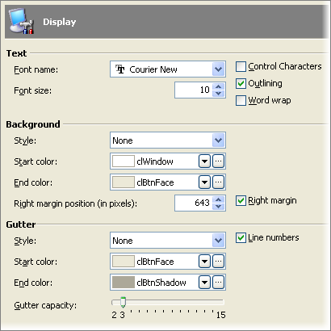

### Scripting

#### Objectives
>
> This chapter explores the how to control automation and validation
> using script. In particular you will review the issues involved with
> choosing a scripting language. You will learn how to create script
> units and about the user interface for the code editor. You will also
> learn how to create functions in other units and projects and how to
> reference these functions. The chapter will not teach general
> programming skills or programming language specifics.
>
#### Script Language Choice
>
> Each project uses one and only one scripting language. You assign the
> language when you first create the project from a list of TestComplete
> supported languages:
>
> C\#Script C++Script DelphiScript JScript VBScript
>
> When you are choosing a language for your organization, here are a few
> points to keep in mind:
>
> C\#Script and C++Script syntax are not identical with their namesakes
> C\# and C++. If you\'re tempted to choose these because others in your
> organization already use C\# or C++, JScript is actually a closer
> match.
>
> C\#Script, C++Script and DelphiScript have few examples available on
> the web relative to JScript and VBScript.
>
> In general, the language you use in your testing scripts bears no
> relation to the application being tested. For example, you can test a
> Delphi application using JScript as the test scripting language.
>
#### Script Project Items
>
> Scripting allows you to drive all the actions that TestComplete can
> perform including automation and verifying the state of applications
> through the use of Checkpoints. By default, the \"Script\" project
> item is already found under the \"Advanced\" folder. Right- clicking
> the \"Script\" project item allows you to add \"Script Units\".

> **Figure 21 \--Adding to Script Project Item**
>
> This will display the **Create Project Item** dialog. To create a new
> script unit, enter the **Name** of the new script unit, change the
> **Location** path if necessary and click the **OK** button.

> **Figure 22 \--Adding a Script Unit**
>
> The new script unit will show in the Workspace in the Editor window.

> **Figure 23 \--The Script Editor**
>
#### The Code Editor
>
> Script code is written in the Code Editor window. The Code Editor
> Toolbar lets you work against blocks of code and to navigate between
> locations in the code. The Gutter on the left of the Code Edit Box
> provides icon indicators that let you work with marked lines of code.
> Your actual script code is entered in Code Edit Box.

> **Figure 24 \--The Code Editor and Toolbar**

#### Code Editor Toolbar

> Use the Code Editor Toolbar to work against the Script in the Code
> Editor.

> **Figure 25 \--The Code Editor Toolbar**
>
> **Run Selected** \-- This option runs the current script routine
> without having to run other functions in the unit. This is handy when
> you want to make sure that a function works as expected all on its
> own.
>
> **Indent** \-- Increases or decreases the indent for a selected block
> of code. This helps you format your code for better readability.
>
> **Comment** \-- Adds or removes comment marks on selected code.
> Comment marks are specific to the scripting language being used.
>
> **Hide** \-- Collapses or expands blocks of selected code for better
> code organization and readability.
>
> **Navigate** \-- Lets you traverse backward and forward through
> previous locations in code.
>
> **Function List** \-- Contains a list of all functions in the script
> unit. Selecting a function from the list navigates you to that
> function.
>
> **Checkpoints** \-- Choose from this list to create one of the types
> of Checkpoints. See the \"Stores and Checkpoints\" chapter for more
> information.
>
> **Options** \-- Display the Code Editor Options dialog.

#### Revision Marks

> Revision marks indicate the current saved state of a line of code.
> When the script unit is first opened, there are no revision marks.
> When you change a line of code, a yellow revision mark shows between
> the code and the gutter area. When the revised code is saved, the
> revision mark shows in green.

> **Figure 26 \--Revised Code**

#### Code Completion

> One of the first features you will discover and love in the
> TestComplete Editor is **Code Completion**. Instead of having to
> research help files or have some prior knowledge, TestComplete does
> the job for you by providing a list of available objects, properties,
> events and methods. Code Completion is invoked automatically as you
> type or manually using the handy keyboard shortcut **CTRL-SPACE**.

> **Figure 27 \--Invoking Code Com pletion**

#### Parameter Completion

> When you need to know the parameters for a function or method,
> **Parameter Completion** displays a hint that shows the number and
> type of parameters that are expected and highlights the parameter
> you\'re currently editing. Invoke Parameter Completion by entering an
> open parenthesis or use the **CTRL-SHIFT-SPACE** shortcut. The
> screenshot below shows Parameter Completion in play while the
> Log.Message() method is added to the script. The second parameter
> called \"StrEx\" is about to be entered and is displayed with bold
> font in the Parameter Completion hint window.

> **Figure 28 \--Invoking Parameter Completion**

#### Bookmarks

> You can place bookmarks in Script and jump between these bookmarks
> using simple keystrokes.
>
> Toggle bookmarks by placing the cursor on a line and pressing **CTRL -
> SHIFT -** and a number between **1** and **9**. Use **CTRL - SHIFT -
> \`** to place an unnumbered bookmark on a given line. The screenshot
> below has unnumbered bookmarks on the same lines with the two function
> declarations and bookmarks 1-3 placed on lines within the functions.
> In the screenshot below, notice the yellow glyphs in the gutter that
> indicate bookmarks. The unnumbered bookmarks are set on lines 1 and
> 13. Numbered bookmarks are placed on lines 5, 9 and 15.
>
> To jump to a specific bookmark at any time, press **CTRL - 0** to
> **9** (without the SHIFT). To navigate through unnumbered bookmarks,
> press **CTRL - \`**.
>
> The Bookmarks Window lists bookmarks with their numbers, unit names
> and line numbers. You can double-click a book mark in this window to
> jump to that line in the source.
>
> You can also work with bookmarks using the editor\'s context menu
> **Toggle Bookmarks**
>
> and **Goto Bookmarks** items.

> **Figure 29 \--Bookmarks**

#### Visualizer Images

> Cues in the Code Editor gutter indicate images have been captured.
> Notice in the screenshot below lines that 10, 13, 15 and 16 all have
> image icons displayed in the gutter. The text cursor insertion point
> in the editor automatically synchronizes with the image in the Test
> Visualizer pane.

> **Figure 30 \--Visualizer Images**

#### Editor Options

> The Options button of the Code Editor Toolbar will display the options
> dialog or you can start from **Tools \| Options** under **Panels \|
> Code Editor**:

> **Figure 31 \--Editor Options**

##### Code Templates

> In TestComplete you can create your own **Code Templates**, small
> blocks of script that can be dropped in by name. TestComplete comes
> with a predefined set of templates for common blocks of code, e.g.
> \"try..finally\". In the screenshot below you will also see a new
> template called \"TCTraining\" that contains a function name \"test\"
> with a comment in it.
>
> The script itself can be anything that you expect to use a lot in your
> testing. Notice also the little pipe \"\|\" sign inside the brackets.
> The pipes indicate the position of the cursor in the code after the
> template has been inserted.

> **Figure 32 \--Defining Code Templates**
>
> Here are the steps to use this template:

1.  Choose an empty area in the code editor and press **CTRL - J**. The
    following code template helper will appear:

> **Figure 33 \--Selecting a Code Template**

4.  Choose the \"TCTraining\" template from the list and press
    **ENTER**. The code will be inserted in the script unit and the
    cursor will be blinking to the left of the comment.

##### Display

> Under the **Display** options, you have the choice to change the Text
> specifications, background colors and margin, gutter styles and
> capacity and also whether you want to show line numbers or not.

> **Figure 34 \--Display Options**

##### Editing

> The **Editing** options let you control the editor behavior including
> navigation, undo, indentation, tabs and code completion.

> **Figure 35 \--Editing Options**

##### Highlighting

> Highlighting options control font and background colors in the editor
> for a given language. In the screenshot below, \"comments\" in the
> editor will show up with a green, italic font. You can import
> highlighting schemes that match Visual Studio, Borland Developer
> Studio or Delphi styles.

> **Figure 36 \--Highlighting Options**

##### User Keyw ords

> **User Keywords** options allow you to add keywords that are
> highlighted in the editor. The screenshot below shows a new keyword
> \"MyKeyword\" added to the list.

> **Figure 37 \--User Keywords List**
>
> []{#Functions_in_Other_Units_and_Projects .anchor}**Functions in Other
> Units and Projects**
>
> To call a function or use a variable that lives in another unit, add a
> comment on the first line of the unit that will consume the other unit
> with the key word \"USEUNIT\" followed by the unit name.
>
> *//USEUNIT MyOtherUnit \'USEUNIT MyOtherUnit*
>
> You can have the IDE take care of this for you by right-clicking the
> unit and selecting the
>
> **Add Unit References** option from the context menu.

> **Figure 38 \--Add Unit References Option**
>
> This will display the **Add Unit References** dialog that will add the
> comment for you.

> **Figure 39 \--Add Unit References Dialog**
>
> If the unit you want to use is in another project, you must first add
> a reference to the other unit in your project. In the Project
> Explorer, right-click the **Script** project item and select **Add \|
> Existing Item** from the context menu. This will display the **Add
> Existing Child** dialog. Navigate to the unit on your local hard drive
> and open the script file. This will create a link to the script file
> in your project and not actually copy the file into the project. You
> can use this technique to build a library of units with common
> functions used by all your projects.
>
> []{#_bookmark78 .anchor}**Lab**
>
> In this lab you will first create a script unit with a single function
> that collects input from the user and displays the input in a dialog.
> Then you will move that functionality to a new unit and call it.

1.  Right-click the Script project item and select **Add \| New
    Item\...** from the context menu. This will display the **Create
    Project Item** dialog.

2.  Enter \"ScriptingLab\" as the **Name** and leave the **Location** at
    the default value. Click the

> **OK** button to close the dialog and create the script unit.

> **Figure 40 \--Create Script Unit**

3.  Enter the script below to the Code Editor. The **BuiltIn** object
    has methods and constants that can be used throughout your test
    script. Here you will use the InputBox() method to collect input
    from the user, store it in a variable and finally reflect the input
    to a dialog.

> **function** Main()
>
> {
>
> **var** userValue =
>
> BuiltIn.InputBox(\"Get User Input\", \"What is your name?\", \"Your
> Name\"); BuiltIn.ShowMessage(userValue);
>
> }
>
> **Sub** Main()
>
> **Dim** userValue = BuiltIn.InputBox(\"Get User Input\", \"What is
> your name?\", \_ \"Your Name\")
>
> BuiltIn.ShowMessage(userValue)
>
> **End Sub**

4.  Right-click in the editor and select **Run Current Routine** from
    the context menu. This should first display an input box followed by
    a message dialog that reflects the input.

> **Figure 41 \--InputBox and Show Message Dialogs**

5.  Create a second script unit called \"MyUtilities\".

6.  In MyUtilities, create a function called \"ShowInput()\".

7.  Copy the code from the \"ScriptingLab\" unit Main() function to the
    new ShowInput() function. \"MyUtilities\" should now look like the
    code below:

> **function** ShowInput()
>
> {
>
> **var** userValue =
>
> BuiltIn.InputBox(\"Get User Input\", \"What is your name?\", \"Your
> Name\"); BuiltIn.ShowMessage(userValue);
>
> }
>
> **Sub** ShowInput()
>
> **Dim** userValue = BuiltIn.InputBox(\"Get User Input\", \"What is
> your name?\", \_ \"Your Name\")
>
> BuiltIn.ShowMessage(userValue)
>
> **End Sub**

8.  In the Project Explorer, right-click the \"ScriptingLab\" unit and
    select Add Unit References\... from the context menu. This will
    display the Add Unit References dialog. Make sure that you\'re
    adding the unit references to the \"ScriptingLab\" unit and that the
    \"MyUtilities\" unit is checked. Click the **OK** button to create
    the reference and close the dialog.

> **Figure 42 \--Add Unit References**

9.  Notice that the first line of the \"ScriptingLab\" unit has a
    \"USEUNIT\" reference to the \"MyUtilities\" reference.

> *//USEUNIT MyUtilities*
>
> *\'USEUNIT MyUtilities*

10. Replace the code in the Main() function with the code below:

> **function** Main()
>
> {
>
> MyUtilities.ShowInput();
>
> }
>
> **Sub** Main()
>
> MyUtilities.ShowInput()
>
> **End Sub**

11. Right-click the Main() routine and select **Run Current Routine**
    from the context menu.

> Again, the Input Box should collect entry from the user and redisplay
> it in a dialog.
>
#### Summary
>
> In this chapter you learned some of the issues involved with choosing
> a scripting language. You learned how to create script units and about
> the user interface for the code editor. You also learned how to create
> functions in other units and projects and how to reference these
> functions.