### Stores and Checkpoints

#### Objectives
>
> This chapter shows how to leverage the TestComplete Stores and
> Checkpoints features to quickly add validation to your automated
> tests. We\'ll take a look at creating each of the built-in Checkpoints
> provided with TestComplete and examine the Update logic that allows
> you to refresh your project\'s test data automatically.

> The project will also use the sample \"Orders\" application that ships
> with TestComplete. See the online documentation for the location of the samples on your hard drive.
>
#### About Stores & Checkpoints
>
> The real benefit of automation is realized by validating that the
> application being tested is producing the expected results. Stores and
> Checkpoints provide the ability to perform comparisons of expected
> versus actual data and help control the flow of your tests by using
> the results of these comparisons during test execution. Checkpoints
> can optionally log comparison results helping speed test development
> and freeing the tester to focus on the tests rather than log file
> output. TestComplete provides a variety of Stores and Checkpoints,
> many of which allow complex data comparisons using a single operation.
>
> In this chapter we\'ll illustrate creating some of these checkpoints
> using the C\# version of the \"Orders\" Sample application included
> with TestComplete.
>
> Here is a screenshot of the main form of the TestComplete Orders
> application used within this chapter to illustrate Checkpoints. The
> Orders application is displaying test data from the \"MyTable.tbl\"
> data file included with TestComplete.

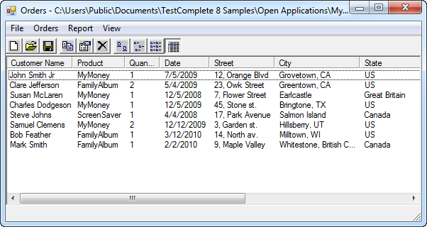

> **Figure 67 \--TestCom plete Orders Sam ple Application**

#### Creating Checkpoints

> The Checkpoint Wizard and the individual Checkpoint types can be
> invoked from multiple locations.
>
> Checkpoints can be created during a recording session from the drop
> down on the recording toolbar:

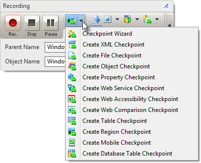

> **Figure 68 \--Recording Toolbar Checkpoints Menu**
>
> You can add Checkpoints via drag/drop from the Checkpoint section of
> the Operations palette in a Keyword test. You can also drag/drop the
> Checkpoint Wizard which will help you choose the most appropriate
> Checkpoint for a given scenario.

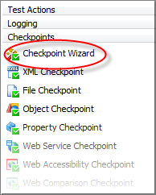

> **Figure 69 \--Checkpoint Operations**
>
> You can create Checkpoints from the toolbar on the Script Editor.

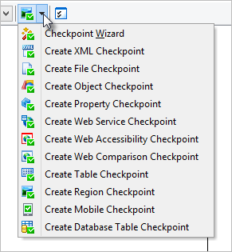

> **Figure 70 \--Checkpoints Script Editor Toolbar Menu**

#### Checkpoint Wizard

> TestComplete provides a **Checkpoint Wizard** designed to help create
> the most appropriate type of checkpoint. The first page of the
> Checkpoints Wizard looks like the screenshot below:

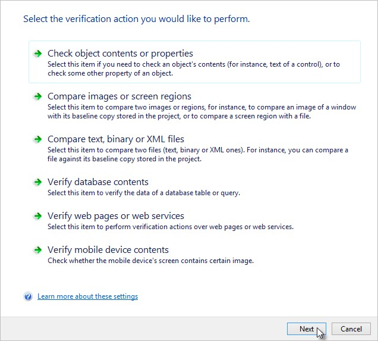

> **Figure 71 \--The Checkpoint Wizard**
>
> The wizard does not support Checkpoints added to TestComplete through
> Script Extensions. Script Extensions are plug-in functionality to the
> TestComplete environment.
>
> The Checkpoint Wizard doesn\'t actually \"create\" Checkpoints.
> Instead, it prompts the user through a series of questions to
> determine which of the built-in Checkpoints best matches the given
> scenario. Once the wizard has been completed clicking the **Finish**
> button launches a Checkpoint specific wizard for completing the
> creation of the desired Checkpoint. Once you\'re familiar with the
> available Checkpoints, you can bypass the wizard and directly select
> the specific Checkpoint.

#### Selecting an Object

> TestComplete provides wizards to help create supported Checkpoint
> types. Typically you will select an onscreen object from which to
> capture test data that\'s maintained under the Stores folder as part
> of your project. There are three options:

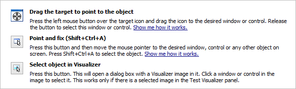

> **Figure 72 \--Object Selection Options**
>
> Using the **Drag the target to point to the object** simply drag the
> cross hairs to the desired onscreen object for selection. If dragging
> the mouse interferes with object selection, you can use the **Point
> and fix** method instead. Position the mouse over the desired object
> and press **Shift+Ctrl+A** to select the object. If necessary you can
> reconfigure the shortcut using **Tools \| Options \| General \| Global
> Shortcuts.** The third option lets you select an object from the
> Visualizer window.

#### Property Checkpoint

> The **Property Checkpoint** is perhaps the simplest of all Checkpoints
> and is used to examine a single property of an object.
>
> While the Property Checkpoint is quick and easy to create, it\'s
> restricted to a single property of an object and has several
> disadvantages when compared to an **Object Checkpoint**. You should
> consider the following when using this Checkpoint:
>
> Test data for a Property Checkpoint is stored as part of the
> Checkpoint itself and does not leverage the Stores folder. To update a
> Property Checkpoint that has new data, you have to search for and
> update the steps manually.
>
> Property Checkpoints do not support the update logic discussed at the
> end of this chapter and therefore need to be manually updated when
> there is a change in the test data.

##### Define the Property Checkpoint

15. Create the Property Checkpoint using one of the methods described in
    the [Creating Checkpoints](#creating-checkpoints) topic. This will
    display the **Create Property Checkpoint** wizard.

16. Using the **Drag the target to point to the object** option,
    drag/drop the crosshairs onto the main form of the Orders Sample
    application, then click the **Next** button.

17. On the **Create Property Checkpoint** page, first click the **View
    more members** link to see all properties.

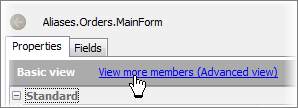

> **Figure 73 \--View ing All Properties**

18. Also in the **Create Property Checkpoint** page, choose the
    **WndCaption** property:

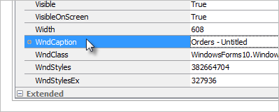

> **Figure 74 \--Selecting the WndCaption Property**

19. Click the **Next** button to specify the type of comparison. Select
    **Starts with** from the **Condition** drop down list, clear the
    Case sensitive check box and enter \"orders\" to the **Value** text
    box.

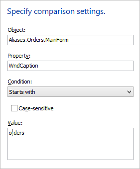

> **Figure 75 \--Setting Comparison Parameters**

20. Click the **Finish** button to complete the Checkpoint.

##### Use Property Checkpoints from Script

> After clicking the **Finish** button, the code needed to perform the
> comparison against the Property Checkpoint will be copied
> automatically to the editor (see the screenshot below). It\'s that
> simple to create a Checkpoint to verify onscreen data during your
> test. Many of the following Checkpoints function in the same manner
> with the exception being that the test data is saved under the Stores
> folder of your project. In the case of a Property Checkpoint the test
> data is passed as a parameter to the **CheckProperty()** method call
> itself.

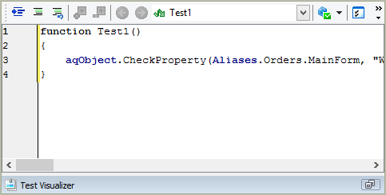

> **Figure 76 \--JScript Example**

#### Object Checkpoint

> The **Object Checkpoint** is an incredibly powerful tool for
> performing validation of test data. Unlike the **Property Checkpoint**
> which verifies a single piece of data the Object Checkpoint can
> validate an entire set of objects and optionally include their
> children. The data for an Object Checkpoint is placed under the Stores
> node of the project allowing you to easily examine and modify the test
> data.

##### Define the Object Checkpoint

1.  For this example, first select **Orders \| New Order\...** from the
    main menu of the Orders sample application.

2.  Create the Property Checkpoint using one of the methods described in
    the [Creating Checkpoints](#creating-checkpoints) topic. This will
    display the Create Object Checkpoint wizard:Using the **Drag the
    target to point to the object** tool to select the Group box
    containing the data entry controls on the New Order dialog. Drag and
    drop the crosshairs on any open spacing within the Group box (the
    large bounding rectangle on the dialog). Here is the order dialog
    displaying the first record of the MyTable.tlb test data included
    with the sample application with the group box highlighted during
    object selection:

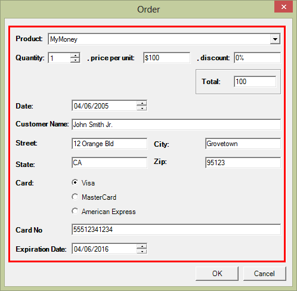

> **Figure 77 \--New Order Dialog**

3.  After selecting the group box, the Create Object Checkpoint dialog
    shows the \"Aliases. Orders.OrderForm.Group\" object is selected and
    the screenshot of the object is displayed in the Preview section of
    the dialog. Click the **Next** button to continue.

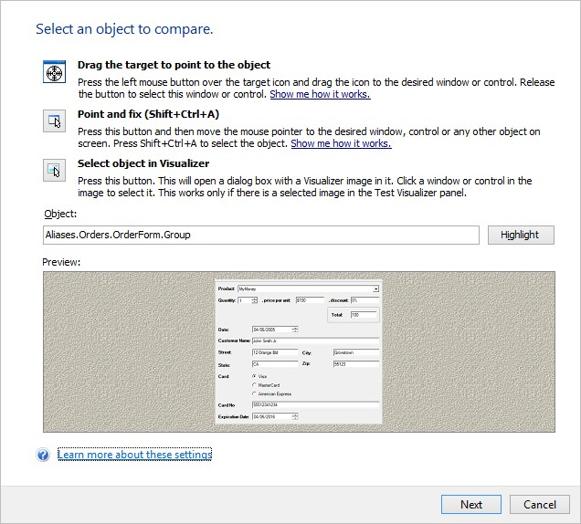

> **Figure 78 \--The Selected OrderForm Group Box**

4.  The **Create Object Checkpoint** dialog displays. Leave the default
    selection, **Retrieve data from an object** and then click the
    **Next** button.

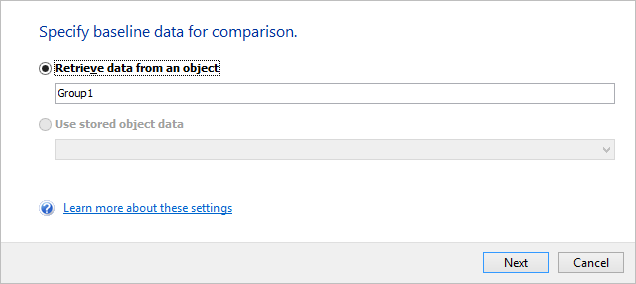

> **Figure 79 \--Create Object Checkpoint Dialog**

5.  You can validate the data in multiple controls using a single Object
    Checkpoint. Select the **Store data of the select object and its
    children** option.

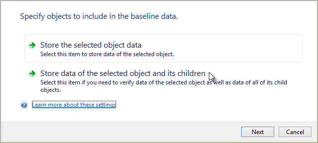

6.  The list of objects involved in the checkpoint displays. Click the
    **Properties\...** button.

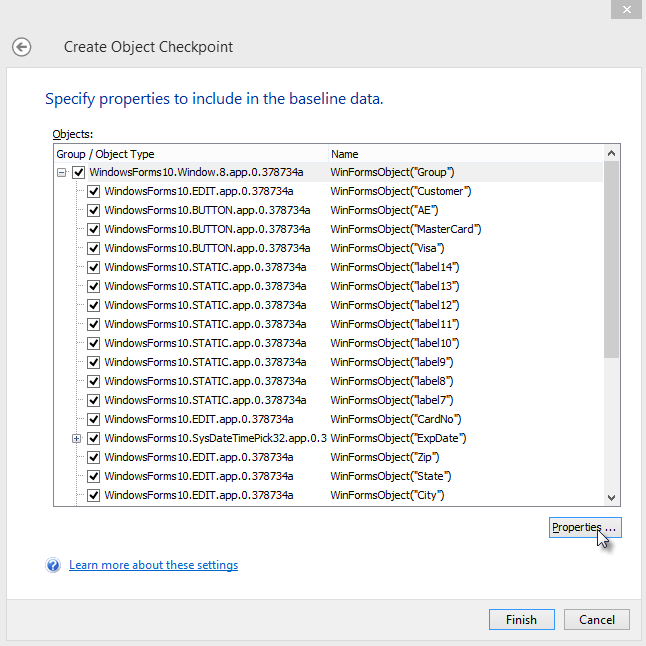

7.  The Store Object Properties dialog displays. Select specific
    properties for each object to include in the Checkpoint by using the
    property selection buttons to move properties in and out of the
    Selected Properties list.

> By default, TestComplete will choose a base set of properties for each
> control and indicate the number of selected properties in the Select
> Properties column of the tree view. In this example, we\'ll modify the
> Checkpoint to store only data from a subset of edit controls contained
> within the Group box. Click the **OK** button to close the Store
> Object Properties dialog.

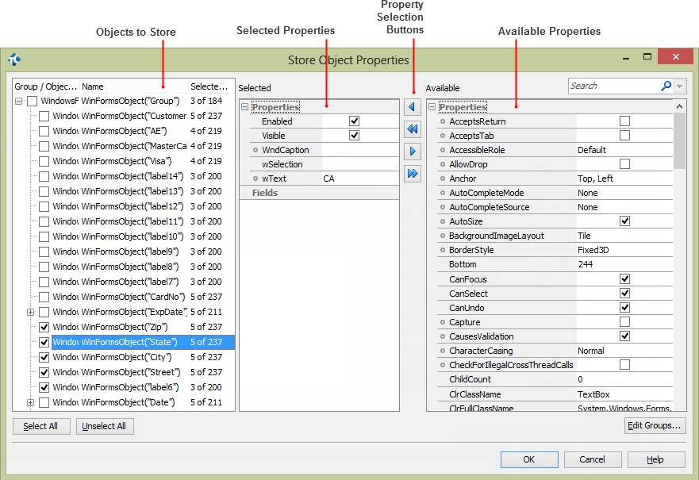

> **Figure 80 \--Store Object Properties Dialog**

8.  Click the **Finish** button to create the new Object Checkpoint.
    Under **Stores \| Objects** in the Project Explorer. You can find
    the new checkpoint. In the editor, you can select the name, click
    the F2 button and edit the name.

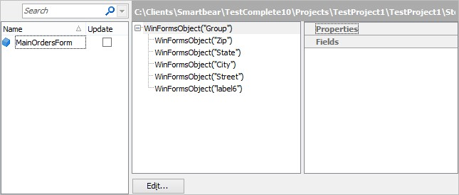

> **Figure 81 \--Setting the Stores Object Nam e**

##### Use Object Checkpoints from Script

1.  After clicking the **Finish** button the Copy Text to Clipboard
    dialog will appear with the code needed to perform the comparison
    against the Checkpoint. Click the **Copy** button to save the code,
    close the dialog and return to the script editor window.

2.  Using the main TestComplete menu, select the **Edit \| Paste** menu
    item. The code below is an example of how you might use the
    **Check()** method that gets pasted.

> **function** ObjectCheckpointExample(){
>
> **if** (!Objects.MainOrdersForm.Check(
> Aliases.Orders.wndWindowsForms10Window8app0378734a))
>
> {
>
> Log.Error(\"Objects are not identical\");
>
> }
>
> }
>
> **Sub** ObjectCheckpointExample
>
> **If** (**Not** Objects.MainOrdersForm.Check(\_
> Aliases.Orders.wndWindowsForms10Window8app0378734a)) **Then**
>
> **Log**.**Error**(\"Objects are not identical\")
>
> **End If End Sub**

##### Using Groups within an Object Checkpoint

> You\'ll notice from the above example, if you\'re
> working with a UI containing many similar controls such as edit boxes
> it can be tedious to select specific properties for each control.
> TestComplete solves this problem with the **Edit Groups\...** feature
> which allows you to create groups of controls based on the class names
> of each control. The Edit Groups\... feature is invoked from the
> **Store Object Properties** dialog.
>
> Using the **Edit Groups\...** button you can add a group, provide a
> class name that will be used to select the objects that should be in
> the group and the properties that should be selected by default. In
> the screenshot, the \"Edit Boxes\" group looks for classes that
> contain \"EDIT\". When you close the **Edit Groups** dialog, the
> selected objects list will automatically find the objects where the
> WndClass contains \"EDIT\".

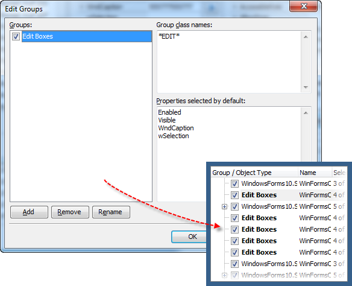

> **Figure 82 \--Editing Groups**
>
> Let\'s take a look at an example of grouping the Edit style controls
> on the Orders dialog allowing us to configure the properties for all
> edit boxes simultaneously. Here are the steps to use the **Edit
> Groups\...** feature.

1.  On the **Store Object Properties** dialog click the **Edit
    Groups\...** button.

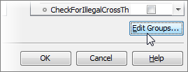

> **Figure 83 \--Clicking Edit Groups\...**

2.  In the Edit Groups dialog click the **Add** button.

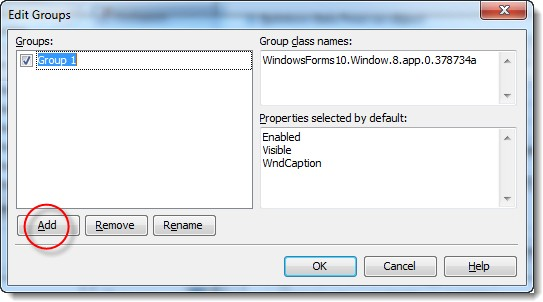

> **Figure 84 \--The Edit Groups Dialog**

3.  Type \"Edit\" (without the quotes) for the group name.

4.  In the \"Group Class Names\" edit box enter \"\*EDIT\*\" (without
    quotes).

5.  In the \"Properties Selected by Default\" edit box, enter
    \"Enabled\", \"Visible\" and \"WndCaption\".

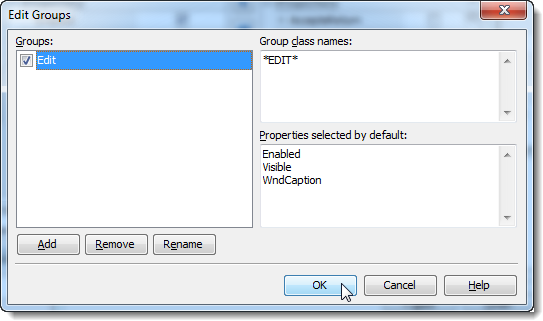

> **Figure 85 \--The Modified Edit Groups Dialog**

6.  Click the **OK** button and notice the grouping of the Edit boxes in
    the tree view on the left. Also notice that as you click between
    objects that the same Selected Properties show up for each object in
    the \"Edit\" group.

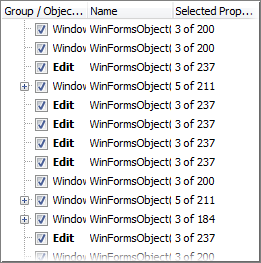

> **Figure 86 \--The Grouped Properties**

7.  Select the check boxes on the left to only include the \"Customer\",
    \"CardNo\", \"Zip\", \"State\", \"City\" and \"Street\".

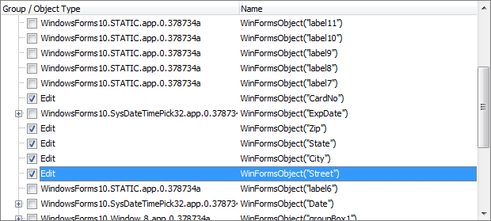

> **Figure 87 \--Selecting Properties**

8.  Finally, click the **OK** button to return to the Create Object
    Checkpoint dialog and complete the Checkpoint.

##### Modifying an Existing Object Checkpoint

> To edit an existing Checkpoint, simply double click the name of the
> Checkpoint under the
>
> **Stores** node in the Project Explorer**:**

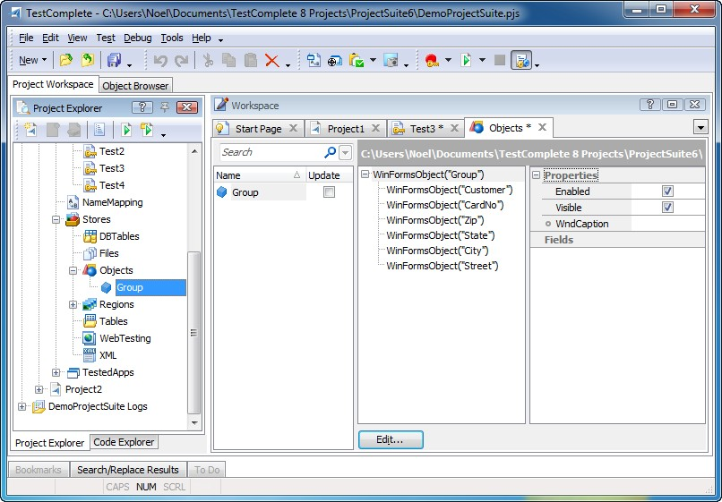

> **Figure 88 \--Object Checkpoints Editor**
>
> Use the **Edit\...** button to add or remove objects and properties
> from the Checkpoint. Also, notice the Update column on the left-hand
> window of the Workspace which contains a checkbox that allows you to
> update the information stored by this Checkpoint during test execution
> rather than comparing the data.
>
> For more on updating Checkpoints refer to the Updating Checkpoints topic.

#### Region Checkpoint

> The **Region Checkpoint** is useful for comparing data captured
> directly from an onscreen object or a specific rectangle within an
> object. The data for Region checkpoints is located under the **Stores
> \| Regions** node in the Project Explorer. Like the **Property
> Checkpoint,** the **Region Checkpoint** also has disadvantages since
> the data being captured must match exactly pixel-for-pixel. Here are a
> few recommendations:
>
> Keep your Regions small.
>
> Avoid capturing any portion of the screen containing elements that are
> specific to a particular version of Windows such as dialog borders,
> window captions or buttons.
>
> Fortunately, TestComplete handles themed windows and transparency
> automatically. For example, if we look at the Notepad application with
> two different Windows themes active, the windows might look like the
> screenshots below with the green and purple borders, respectively.
> TestComplete takes the transparent \"alpha\" into account and
> considers the two images identical.

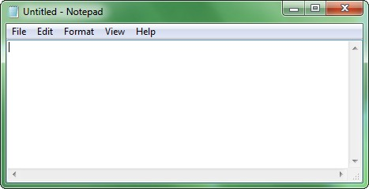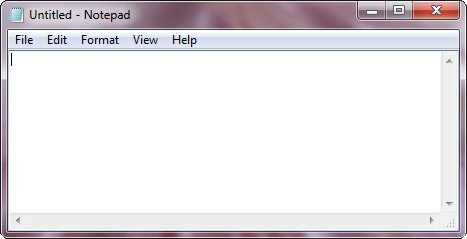

##### Comparison Parameters

> The **Comparison Parameters** of the Region Checkpoint also help allow
> for known differences.
>
> **Pixel Tolerance**: Number of pixels allowed to be different between
> the stored region and the onscreen region.
>
> **Color Tolerance**: A number between 0..255 that allows color
> differences between two images. If zero, then pixels in the two images
> must have exactly the same color. If 255, pixels of any color are
> considered identical.
>
> **Mask**: The path to a black and white image where only the pixels
> underlying the white portion of the image are taken into account.
>
> **Transparent**: If true, the topmost left pixel is treated as the
> transparent color.
>
> **Include Mouse Pointer**: If true, the image of the mouse cursor will
> be captured in the compare.

##### Define the Region Checkpoint

> For this example, rather than using a data entry application we\'ll
> use a web page containing an image to illustrate the Region
> Checkpoint.

1.  Create the **Region Checkpoint** using one of the methods described
    in the [Creating Checkpoints](#creating-checkpoints) topic. This
    will display the **Create Region Checkpoint** wizard.

2.  Launch a browser and navigate to
    [http://news.google.com/news/](http://news.google.com/news/).

3.  Using the **Drag the target to point to the object** option,
    drag/drop the crosshairs onto the Google logo. Click the **Next**
    button to continue.

4.  Leave the default **Capture an image of a window or control** option
    selected. Click the

> **Next** button to continue.

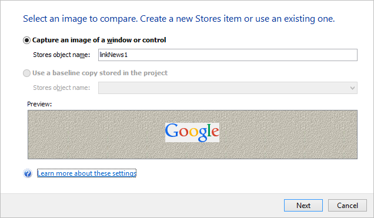

> **Figure 89 \--Im age Options**

5.  This page allows you to tweak comparison parameters to ignore a
    certain number of pixels or colors. Leave the default settings and
    click the **Next** button.

 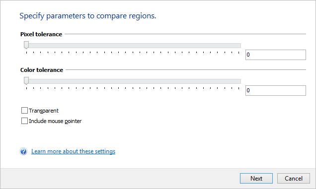
>
> **Figure 90 \--Com parison Param eters**

6.  This page allows you to \"mask\" areas of the image from the
    comparison. Leave the defaults and click the **Finish** button.

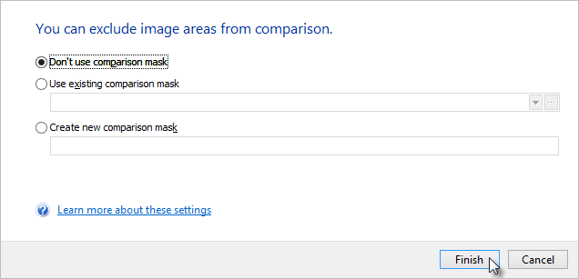

##### Use Region Checkpoints from Script

1.  After clicking the **Finish** button, the **Copy Text to Clipboard**
    dialog will appear with the code needed to perform the comparison
    against the Checkpoint. Click the **Copy** button to save the code,
    close the dialog and return to the script editor window.

2.  Using the main TestComplete menu, select the **Edit \| Paste** menu
    item. The code below is an example of how you might use the Check()
    method that gets pasted. Note that in the example below, the Alias
    has been cleaned up by hand to make it easier to read.

> **function** RegionCheckpointExample(){
>
> **if** (!Regions.GoogleNewsLogo.Check(Aliases.GoogleNewsLogo))
>
> {
>
> Log.Error(\"Regions are not identical\");
>
> }
>
> }
>
> **Sub** RegionCheckpointExample
>
> **If** (**Not** Regions.GoogleNewsLogo.Check(Aliases.GoogleNewsLogo))
> **Then Log**.**Error**(\"Regions are not identical\")
>
> **End If End Sub**

#### Table Checkpoint

> The **Table Checkpoint** is useful for comparing tabular data captured
> from an onscreen control. A tabular control is any control that
> TestComplete can accurately recognize as containing tabular data which
> includes support for a wide variety of 3rd party control libraries.
> Like the Object Checkpoint, this Checkpoint provides a powerful
> feature for comparing large amounts of data quickly and easily.

##### Define the Table Checkpoint

1.  Create the **Table Checkpoint** using one of the methods described
    in the [Creating Checkpoints](#creating-checkpoints) topic. This
    will display the **Create Table Checkpoint** wizard.

2.  Leave the default \"Retrieve data from an object\" option selected
    and set the \"Stores Table Name\" to \"Orders\". Click the **Next**
    button to continue.

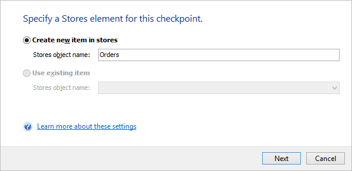

> **Figure 91 \--Creating a Table Checkpoint**

1.  Using the **Drag the target to point to the object** option,
    drag/drop the crosshairs onto the Orders window grid of records. The
    selection should encompass just the grid headers and rows. If you
    select a larger area, you will get an error message. Click the
    **Next** button to continue.

2.  In the next step, choose the columns you would like to include and
    specify the number of rows. Click the **Next** button to continue.

 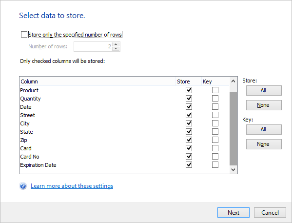
>
> **Figure 92 \--Specifying a Data Range**

5.  Preview the data to be captured by the Checkpoint then click the
    **Finish** button to create the Checkpoint.

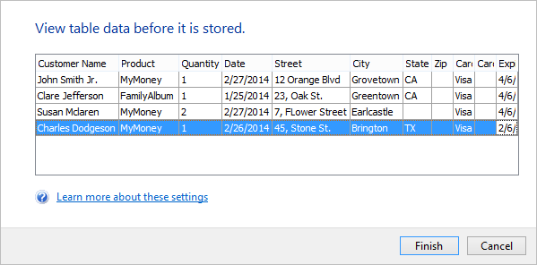

> **Figure 93 \--Preview Data**

##### Use Table Checkpoints from Script

1.  After clicking the **Finish** button the Copy Text to Clipboard
    dialog will appear with the code needed to perform the comparison
    against the Checkpoint. Click the **Copy** button to save the code,
    close the dialog and return to the script editor window.

2.  Using the main TestComplete menu, select the **Edit \| Paste** menu
    item. The code below is an example of how you might use the Check
    method.

> **function** TableCheckpointExample(){
>
> **if** (!Tables.Orders.Check())
>
> {
>
> Log.Error(\"Tables are not identical\");
>
> }
>
> }
>
> **Sub** TableCheckpointExample
>
> **If** (**Not** Tables.Orders.Check) **Then Log**.**Error**(\"Tables
> are not identical\")
>
> **End If End Sub**

#### Verifying File Contents

> You may need to verify that the contents of a file match a baseline
> copy or that the contents match some other file. The **File
> Checkpoint** verifies file contents against a baseline copy while
> **Compare Files** contrasts two different files.
>
> It\'s important to point out that the file comparisons work at the
> byte level, meaning that although two files may appear to contain the
> same data, such as Excel spreadsheets or Word documents, the actual
> files may contain differences that are not readily apparent.
> Therefore, you should use these Operations in situations where you can
> more easily discern the differences between two files. The
> recommendation would be to use the support for a third-party
> comparison tool to validate complex files.

##### Compare Files

> **Compare Files** is useful for performing byte level comparisons
> between two files. In this example we\'ll use two similar, but not
> identical, text files. You\'ll need to use Windows Notepad to create
> the files used in this example and save them to your \"c:\\\"
> directory. The only significant differences between these two files
> are tab characters used in \"report.txt\" (on the right) to separate
> the data.

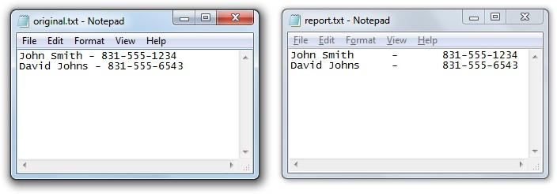

> **Figure 94 \--Sam ple Text Files**
>
> By default, *any* differences will cause the comparison to fail.
> TestComplete can use a \"HashValue\" to account for simple, known
> differences between two files. The example first shows the comparison
> failing because the second file has extra tab characters. Later in the
> example you will see how to account for these differences using the
> \"HashValue\" parameter.

##### Comparing Files in Script

1.  Right-click the **Stores \| Files** item and select **Add \| New
    Item\...** from the context menu. In the Add File dialog that
    displays, select both \"Original.txt\" and \"Report.txt\", then
    click the **Open** button.

2.  In the confirmation dialog that displays, click the **Yes** button
    to add both files to the files store.

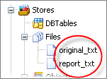

> **Figure 95 \--File Stores**

3.  Add a script routine to compare two files. The first two parameters
    of the **Files. Compare()** method are the two files as they are
    named in the **Stores \| Files** list, not the name of the files on
    disk. The third parameter is a \"hash value\" used to account for
    known files differences. The last parameter if true adds a message
    to the log that indicates if the files are equal and the actual
    HashValue if the two files are not equal.

> **function** FileCompareExample(){
>
> **if** (!Files.Compare(\"original\_txt\", \"report\_txt\", 0,
> **true**))
>
> {
>
> Log.Error(\"Files are not identical\");
>
> }
>
> }
>
> **Sub** FileCompareExample
>
> **If** (**Not** Files.**Compare**(\"original\_txt\", \"report\_txt\",
> 0, true)) **Then Log**.**Error**(\"Files are not identical\")
>
> **End If End Sub**

4.  Right-click the routine and select **Run Current Routine** from the
    context menu. When you run the routine, the Test Log will show that
    the two files are not equal. Another important detail to notice here
    is the HashValue that represents the two files and their specific
    known differences. Note this HashValue for later use.

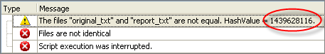

> **Figure 96 \--The Log**

5.  Change the HashValue parameter to match the HashValue reported in
    the log.

> **function** FileCompareExample(){
>
> **if** (!Files.Compare(\"original\_txt\", \"report\_txt\", 1439628116,
> **true**))
>
> {
>
> Log.Error(\"Files are not identical\");
>
> }
>
> }
>
> **Sub** FileCompareExample
>
> **If** (**Not** Files.**Compare**(\"original\_txt\", \"report\_txt\",
> 1439628116, true)) **Then Log**.**Error**(\"Files are not identical\")
>
> **End If End Sub**

6.  Run the routine again. The test log should show a successful run.

> The order that the files are compared makes a difference in the
> calculated Hash Value. For example, consider the two xml files below.
> The hash value from TestComplete if \"original\_txt\" is the first
> file in the comparison is 1439628116, if \"report\_txt\" is the first
> file the hash value is -1471526548.
>
> You can use the Files CalculateHashValue() method to get the hash
> programmatically. Just pass the two file store names as parameters. As
> with the comparisons, the order the parameters are passed counts here
> too.
>
> hash = Files.CalculateHashValue(\"report\_txt\", \"original\_txt\");
> hash = Files.CalculateHashValue(\"report\_txt\", \"original\_txt\")

##### 3rd Party Comparison Tools

> You may require a more robust file comparison tool than the relatively
> simple \"difference\" tool built into TestComplete. TestComplete
> provides an option for specifying a third-party tool for use with file
> comparisons. You can plug in your own utility using the settings found
> at **Tools \| Options \| Engines \| Stores**. By specifying a file
> path for a third-party file difference tool in the **Diff name** field
> and checking the **Active** checkbox, TestComplete will execute the
> Diff utility in place of the built-in file compare functionality.

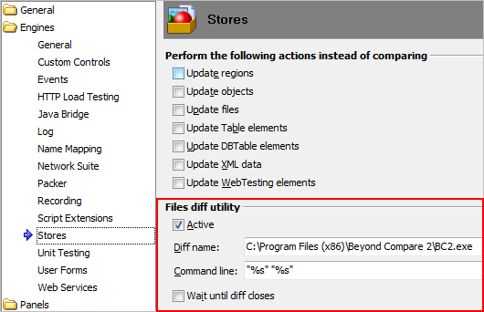

> **Figure 97 \--Stores Options**

#### Manual Checkpoint

> **Manual Checkpoints** are simply text instructions in a file store
> that are displayed to the tester. The tester reads the instructions
> during the test run and indicates if the instructions were successful
> or not. Manual Checkpoints are invoked from the recording toolbar
> after which, the **Create Manual Checkpoint** dialog will display.
> Enter a set of manual instructions and a file name to be used to
> identify the item in **Stores \| Files**.

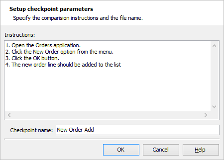

> **Figure 98 \--Create Manual Checkpoint Dialog**
>
> When the test actually runs, the \"Manual Checkpoint\" dialog displays
> the instructions again and the status of the test step depends on
> whether the tester clicks the **Success** or **Fail** button.

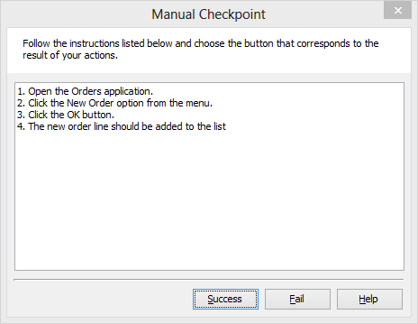

> **Figure 99 \--Manual Step During Test Run**

##### Calling Manual Checkpoints from Script

> When the recording of the Manual Checkpoint is complete, TestComplete
> will generate code that calls the **ManualCheck.Compare()** method,
> passing the store name of the file that contains the instructions. If
> the tester clicks the **Fail** button, the Compare() method returns
> false and the Log.Error() method executes.
>
> **if**(ManualCheck.Compare(\"ManualCheckPoint\_1\") == **true**)
> **Log**.Checkpoint(\"The manual checkpoint \\\"ManualCheckPoint\_1\\\"
>
> succeeded.\");
>
> **else**
>
> **Log**.Error(\"The manual checkpoint \\\"ManualCheckPoint\_1\\\"
> failed.\");

#### Clipboard Checkpoint

> The Clipboard Checkpoint is also invoked from the recording toolbar.
> This Checkpoint simply grabs whatever is on the clipboard at the time
> and makes a comparison of the clipboard at a later time when the test
> is run.

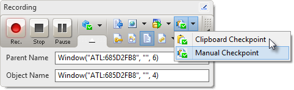

> **Figure 100 \--Invoking the Clipboard Checkpoint**
>
> The **Create Clipboard Checkpoint** dialog will display the clipboard
> contents and prompt for the kind of verification you want to perform,
> that is, **Equals to** or **Contains**. Make your selection and click
> the **OK** button.

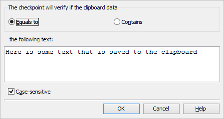

##### Calling the Clipboard Checkpoint from Script

> When the recording of the Clipboard Checkpoint is complete,
> TestComplete will generate code that performs a simple check between
> the current contents of the clipboard and the contents of the
> clipboard at the time the test step was recorded. If the contents are
> not equal, an error is logged.
>
> **if**(aqString.StrMatches(\"\^(Here is some text that is saved to the
> clipboard)\$\", NameMapping.Sys.Clipboard) == **true**)
>
> Log.Checkpoint(\"The clipboard checkpoint succeeded.\");
>
> **else**
>
> Log.Error(\"Clipboard checkpoint failed\");
>
> []{#Updating_Checkpoints .anchor}**Updating Checkpoints**
>
> Over the lifetime of your automated tests it\'s possible, and in fact
> likely, your test data will change and your Checkpoints will become
> outdated. TestComplete provides the ability to selectively update your
> Checkpoints. You can selectively control this Update logic under
> **Tools \| Options \| Engines \| Stores** in the section titled
> \"**Perform the following actions instead of comparing\"**. These
> update options cause TestComplete to capture new data while the test
> is running rather than performing comparisons. Each update option
> corresponds to a type of Checkpoint.

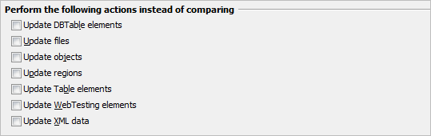

> **Figure 101 \--Options for Update vs. Com pare**
>
> Your original test data will be overwritten so be sure to have a
> backup or preferably a version of the project committed to your source
> control repository.
>
#### Summary
>
> In this chapter, we introduced the concept of Stores & Checkpoints
> that TestComplete provides to help manage your test data. We looked
> at:
>
> Selecting objects for use within Checkpoints.
>
> Adding items to the store through the creation of Checkpoints.
> Property, Object, Region, Table and File Checkpoints.
>
> TestComplete options for updating test data during test execution.