### Test Log

#### Objectives
>
> This chapter discusses the test log and the types of messages
> available in TestComplete. You will learn how to navigate, analyze and
> share the test log. You will learn about the Log Window user
> interface, about the types of available logging message and how images
> are logged. You will learn how to structure Test Log folders and
> change the appearance of messages. You will also learn how to view
> test logs in Internet Explorer and how to communicate your test
> results by email.

#### Test Results
>
> Up to this point we\'ve focused on building tests and playing them
> back. Another key element of testing is analyzing and communicating
> the test results. TestComplete includes a **Log Window** to review all
> of the output produced during a test run. It\'s important to
> understand how TestComplete manages log output so we\'ll start by
> looking at the Project Explorer. At the bottom of the Project Explorer
> window is a node which contains all of the log output for all projects
> contained within the ProjectSuite. Expanding this node lets you see
> all of the test executions for a given project. To view the Log
> Window, simply double click one of the **Project Log** nodes as
> illustrated below:

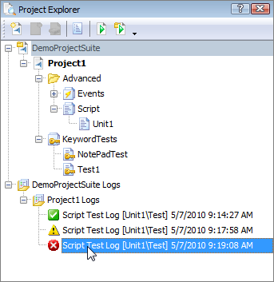

> **Figure 56 \--Opening a Log**
>
#### Log Window
>
> Logs are used to persist feedback from your tests including errors,
> warning messages and events as well as entire files and images. Logs
> are stored in a directory as XML files. The Log Window displays all of
> the output produced by the test and is divided into several regions,
> as shown in the screenshot below.

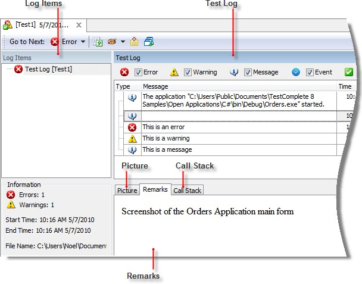

#### Test Log Pane

> This panel displays the actual log output from the test including
> **Errors**, **Warnings**, **Messages**, **Events**, and **Images**.
>
> Each of the above types has a unique glyph and can be filtered using
> the check boxes found at the top of the **Test Log** pane. Notice in
> the screenshot below that **Error** items are *not* displayed and the
> yellow bar to the left of the list indicates the view is filtered.

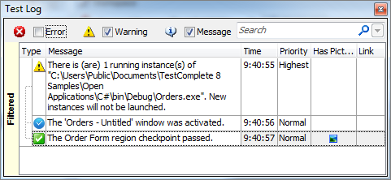

> **Figure 57 \--The Filtered Test Log**
>
> To fine-tune filtering behavior, right-click the log and choose
> **Filter Data** from the context menu. This displays the Filter
> Builder dialog. The Simple Filter tab of the dialog lets you choose
> from the same set of categories available directly in the log window.
> Log messages can be organized in a tree structure. The **Show all
> parents** and **Show all children** check boxes allow all parents and
> children of a log message to display.

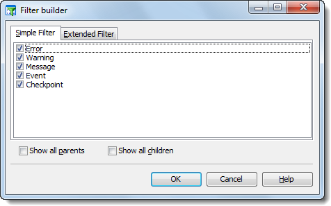

> **Figure 58 \--The Filter Builder**
>
> The **Extended Filter** tab allows you to build complex filters
> complete with AND/OR/NOT AND/NOT OR sections. The first part of each
> statement can be clicked to get a list of log elements that can be
> used such as \"Priority\" or \"Message\". The next link will display a
> list of comparison operators that work with the first part of the
> statement. The last part of the statement will be a value to compare
> against.

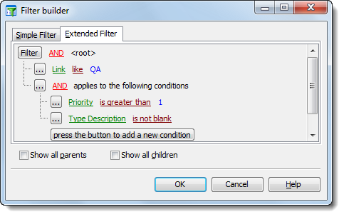

> **Figure 59 \--The Extended Filter**

#### Picture Tab

> The **Test Log** can also display pictures captured during the test
> execution. For example, you can post a screenshot using the Log object
> in your script or keyword test. Here is an example of a screen capture
> displayed in the **Test Log** upon completion of the test.

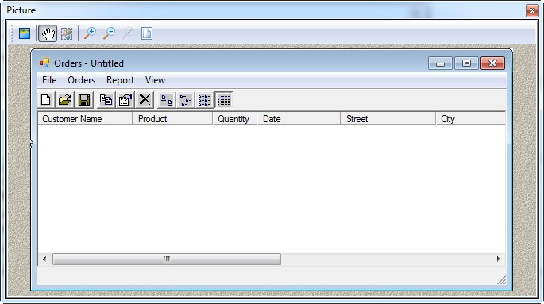

> **Figure 60 \--Picture Window of the Test Log**

#### Additional Information

> The **Additional Information** of the **Test Log** pane contains
> information associated with a specific **Test Log** item (if any). For
> example, Log Message includes a Remarks parameter that can be used to
> add straight text or HTML.

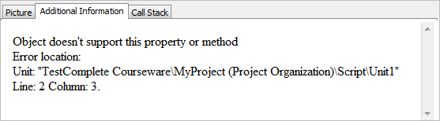

> **Figure 61 \--Additional Inform ation**
>
#### Log Structure
>
> You can create a hierarchical structure via creating and pushing log
> folders onto the log using the Log object. Here are **Log** object
> methods that can be used to restructure the log:
>
> **AppendFolder:** Creates a folder in the test log and activates this
> folder.
>
> **PopLogFolder:** Pops the folder that is currently at the top of the
> folder stack out of the stack. The folder left at the top of the stack
> is now the default folder of the test log.

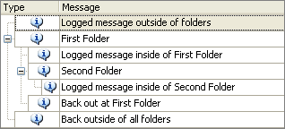

> **Figure 62 \--Hierarchical Structure in Log**
>
> All messages by default go into the active log folder (i.e., the top
> of the stack). Each \"AppendFolder\" moves the logging inside a folder
> and each \"PopLogFolder\" moves the logging out one level.

#### Logging in Scripts

> The script shown in the code snippets below creates the log shown in
> the preceding topic. Simply use **Append Log Folder** to add a folder
> and make that the active folder so that all logged messages and new
> folders are created inside of the folder. Use **Pop Log Folder** to
> move one level outside the current folder.
>
> **function** LogStructure()
>
> {
>
> Log.Message(\"Logged message outside of folders\", \"\");
> Log.AppendFolder(\"First Folder\", \"\");
>
> Log.Message(\"Logged message inside of First Folder\", \"\");
> Log.AppendFolder(\"Second Folder\", \"\");
>
> Log.Message(\"Logged message inside of Second Folder\", \"\");
> Log.PopLogFolder();
>
> Log.Message(\"Back out at First Folder\", \"\"); Log.PopLogFolder();
>
> Log.Message(\"Back outside of all folders\", \"\");
>
> }
>
> **Sub** LogStructure()
>
> **Log**.Message(\"Logged message outside of folders\", \"\")
>
> **Log**.AppendFolder(\"First Folder\", \"\")
>
> **Log**.Message(\"Logged message inside of First Folder\", \"\")
>
> **Log**.AppendFolder(\"Second Folder\", \"\")
>
> **Log**.Message(\"Logged message inside of Second Folder\", \"\")
>
> **Log**.PopLogFolder()
>
> **Log**.Message(\"Back out at First Folder\", \"\")
>
> **Log**.PopLogFolder()
>
> **Log**.Message(\"Back outside of all folders\", \"\")
>
> **End Sub**
>
> Through script you also have access to the **CreateFolder()** and
> **PushFolder()** methods. CreateFolder() creates the folder but does
> not make it active. Use the separate PushFolder () method to make the
> folder active. PushFolder(CreateFolder()) is functionally equivalent
> to AppendFolder().
>
#### Logged Images
>
> TestComplete automatically takes screenshots of Test Steps as they are
> recorded and another set during the test playback. As you click
> through the test log you can see the recorded **Expected Image** next
> to the **Actual Image** recorded during the test playback.

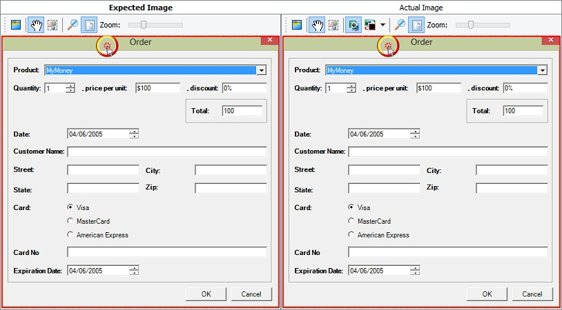

> **Figure 63 \--Logged Images**

#### Image Toolbar

> The toolbar for the **Actual Ima**ge is shown in the screenshot below.

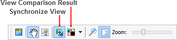

> **Figure 64 \--Actual Image Toolbar**
>
> The **Synchronize View** button is on by default and simply makes the
> Expected and Actual Image stay together as you scroll the window, e.g.
> when you scroll the Expected Image window to the right, the Actual
> Image will also scroll to the right.
>
> The **View Comparison Result** button makes analyzing the log quicker.
> When this button is pressed, the Actual Image shows the pixel
> differences between the two images in red. In the screenshot below,
> the Expected Image shows that **Customer Name is** \"Bart Simpson and
> the actual image is \"Marge Simpson\". Toggling the **View Comparison
> Result** button makes changes stand out in red. The button's drop-down
> sets the background to white, light or dark.

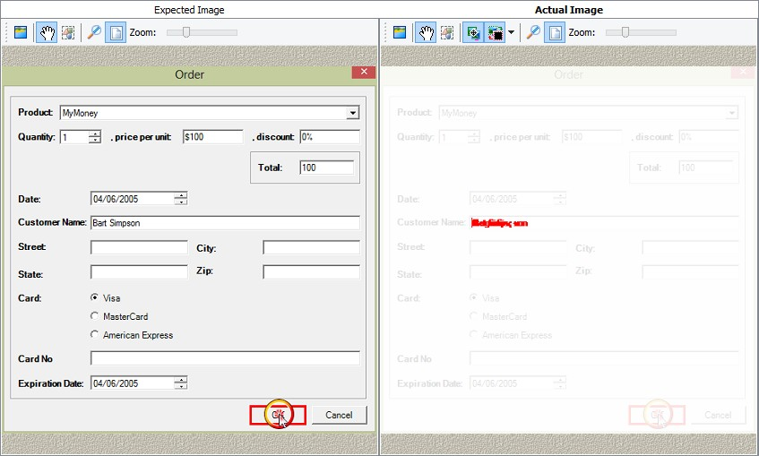

> **Figure 65 \--Expected and Actual Images**
>
> []{#Changing_Log_Appearance .anchor}**Changing Log Appearance**
>
> If you need to make a logged message or remarks stand out, you can
> format both the Message and the Remarks. The formatting can apply to
> messages, folders and logged images. The screenshot below shows the
> log message \"Incomplete results\" where the background is green and
> the font is red, bold and italic. In the Remarks section, the last
> sentence is actually a bit of HTML surrounded by bold \"\<b\>\" tags.
>
> The topic that follows will show you how to achieve a similar result.

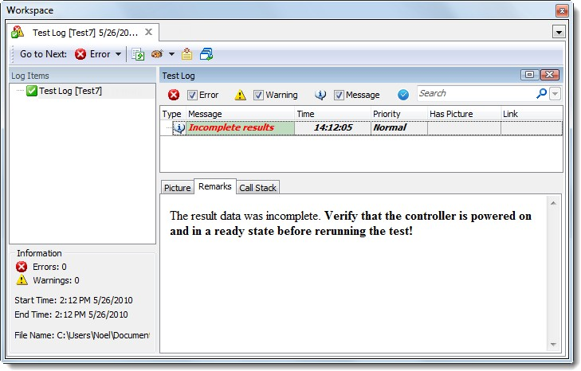

> **Figure 66 \--Formatted Log Message and Remarks**

#### Formatting the Log with Script

> To format a logged message, image or folder, you need to first create
> a new **Attributes** object returned from the
> **Log.CreateNewAttributes()** method and then fill out the properties.
> The Attributes object is then passed as a parameter to the
> **Log.Message()** method. To get HTML formatting you need to both set
> the **ExtendedMessageAsPlainText** property to false and to surround
> the message with \<HTML\> tags and any other HTML formatting you want
> showing in the Remarks. The example below surrounds the second
> sentence with Bold \"\<b\>\" tags.
>
> **function** AttributesExample()
>
> {
>
> *// the html string that will display in the Remarks area*
>
> **var** html = \"\<html\>The result data was incomplete. \" +
> \"\<b\>Verify that the controller is powered on and in a \" + \"ready
> state before rerunning the test!\</b\>\</html\>\";
>
> *// attributes to format the message*
>
> **var** attributes = Log.CreateNewAttributes(); attributes.FontColor =
> BuiltIn.clRed; attributes.BackColor = BuiltIn.clMoneyGreen;
> attributes.Italic = **true**;
>
> attributes.Bold = **true**; attributes.ExtendedMessageAsPlainText =
> **false**;
>
> *// log the message using the attributes*
>
> Log.Message(\"Incomplete results\", html, 300, attributes);
>
> }
>
> **Sub** AttributesExample()

-   *the html string that will display in the Remarks area*

> **Dim** html = \"\<html\>The result data was incomplete. \" & \_
> \"\<b\>Verify that the controller is powered on and in a \" & \_
> \"ready state before rerunning the test!\</b\>\</html\>\"

-   *attributes to format the message*

> **Dim** attributes = **Log**.CreateNewAttributes()
> attributes.FontColor = BuiltIn.clRed attributes.BackColor =
> BuiltIn.clMoneyGreen attributes.Italic = True
>
> attributes.Bold = True attributes.ExtendedMessageAsPlainText = False

-   *log the message using the attributes*

> **Log**.Message(\"Incomplete results\", html, 300, attributes)
>
> **End Function**
>
#### LockEvents
>
> With any long running test, the test result log will be filled with
> hundreds if not thousands of events. Most of the time, the tester is
> not interested in events unless there is a problem in the test run. By
> adding the **Log.LockEvents** method to the script code, no events
> will be placed into the test log unless an error occurs. By default,
> the last 20 events are logged, but this can be changed by adding a
> parameter to the Log.LockEvents command.
>
> LockEvents is specific to the Event message type of the Log. Other
> message types (errors, warnings, etc.) are not affected by calling
> LockEvents.
>
#### Summary
>
> In this chapter you became familiar with the test log and the types of
> messages available in TestComplete. You learned how to navigate,
> analyze and share the test log. You learned about the Log Window user
> interface, about the types of available logging message and how images
> are logged. You learned how to structure Test Log folders and change
> the appearance of messages. You also learned how to view test logs in
> Internet Explorer and how to communicate your test results by email.