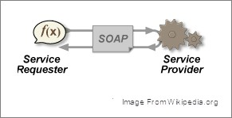
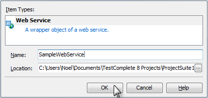
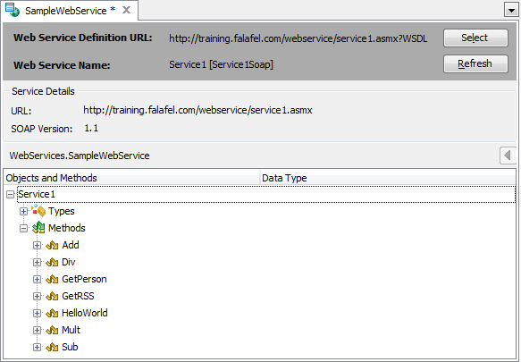
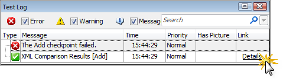
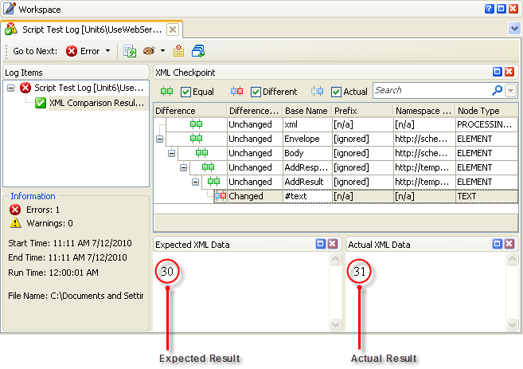
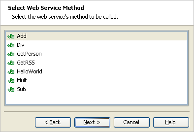
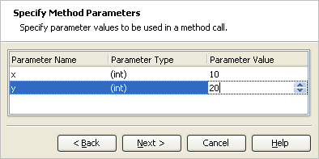
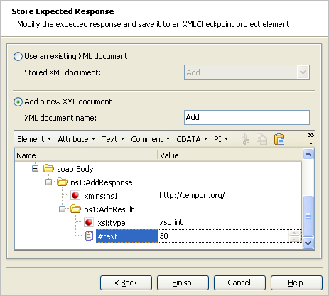
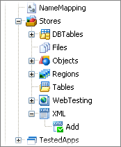
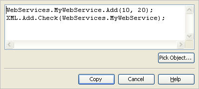

### Web Services Testing

#### Objectives
>
> This chapter discusses web services in general and looks at
> TestComplete support for testing web services. You\'ll learn how to
> import a web service and call a web service function directly in a
> test. You\'ll use Web Services Checkpoint and XML Checkpoint to verify
> results between test runs.
>
#### Overview of Web Services
>
> Web Services provide a standardized SOAP based mechanism for calling
> functions across a network of computers where the remote computer
> executes the specified routine and returns the results. From the
> calling computer a request is made using the SOAP protocol and the web
> service provided will execute the function specified and return the
> result.

> **Figure 169 \--Diagram of a Web Services Call**
>
> SOAP stands for Simple Object Access Protocol and is a standardized
> format for calling functions on remote computers.
>
> In order to work with Web Services, you must have access to a WSDL
> (Web Services Description Language) document that describes the
> available functions, their parameters and results. By importing the
> WSDL document into TestComplete, Web Services calls can be made using
> the Web Services checkpoint.
>
> You can use Web Services to supply data used in a test or you can test
> a Web Service itself. Web Services can be used directly from Keyword
> Tests or Script and the results used as just another data source.
>
#### Web Service Example
>
> First, let\'s take a look at a sample web service that contains a
> number of math related functions. The web service is located at this
> URL:
>
> [http:*//training.falafel.com/testcompletews/*](http://training.falafel.com/testcompletews/)
>
> Using a web browser to hit the above URL, you can see a listing of the
> available functions provided by the web service. A link to the WSDL
> document (the link that reads \"Service Description\" in the
> screenshot below) describes the structure of each request and
> response. If you click on the \"Service Description\" link you will
> see the WSDL XML document that fully describes the web service.

> **Figure 170 \--Sample Web Service**
>
> Not all web services frameworks provide a page like the one above that
> allows a user to examine each function call individually. In many
> cases you will only have a WSDL link pointing to the XML document
> describing the available functions and data types.
>
#### Importing a Web Service
>
> Before calling web service functions we need to import its WSDL
> document using the **Web Services Project Item.** This project item is
> only included in the Enterprise version of TestComplete. Here are the
> steps to import a Web Service:

1.  From the Project Explorer right click the project node and select
    **Add \| New Item..**. and then the Web Services Project Item:

> **Figure 171 \--Adding the Web Services Project Item**

49. Right click the Web Services node and select **Add \| New Item\...**
    This will display the Create Project Item dialog.

50. Specify the name for the Web Service to be imported.

> **Figure 172 \-- Creating the Web Service Wrapper**

51. On the Web Services editor in the Workspace click the **Select**
    button to import a Web Service:

> **Figure 173 \--Web Services Editor**

52. Specify the URL of the WSDL document
    \"**<http://training.falafel.com/webservice/>
    service1.asmx?WSDL**\".

53. Click the **Get Services** button to import the Web Service, then
    click OK to finish the import process.

> **Figure 174 \-- Importing the Web Service**
>
> You should now see the WSDL imported into TestComplete and be able to
> review the objects and methods provided by the web service within the
> editor.

> **Figure 175 \-- The Imported Web Service**
>
#### Lab: Using a Web Service from a Script
>
> To call a web service, use the **WebServices** keyword followed by the
> name of the imported web service name. In the example below, the
> \"MyWebService\" created in the \"Importing a Web Service\" topic is
> calling the service\'s Add() method.
>
> **var** answer = WebServices.MyWebService.Add(2, 2);
> Log.Message(answer);
>
> **Dim** answer = WebServices.MyWebService.Add(2, 2)
>
> **Log**.Message(answer)
>
> The routine runs successfully and logs the correct value:

> **The Logged Web Service Result**
>
#### Web Services Checkpoints
>
> Not only can we call the web service directly and use the results
> however we\'d like in the test, we can also test the web service
> itself to see that it returns expected results. You can perform all of
> the operations needed to call a web service method and check the
> results yourself, or you can use the **Create Web Service Checkpoint
> Wizard** to walk you through the process. Performing the operations by
> hand is more flexible, but the wizard helps you create checkpoints
> faster and more conveniently.
>
> The wizard helps you:
>
> Create an **XMLCheckpoint** project item that stores a baseline copy
> of a web service's response.
>
> Generate script code or Keyword Test steps that calls the web service
> method and checks the result.
>
> You can invoke the wizard when recording a test or at design time. To
> display the wizard when recording a test, select **Create Web Service
> Checkpoint** from the Recording toolbar. You can create Web Service
> Checkpoints for keyword tests and in code. Drag the Web Service
> Checkpoint Operation into the Keyword Test editor.

> **Figure 176 \--Keyw ord Tests Checkpoints**
>
> \...or create Web Service Checkpoints using the Code Editor toolbar.

> **Figure 177 \--Code Editor Checkpoints**
>
#### Web Services Test Log Results
>
> When using the XML Checkpoint, the TestComplete Test Log provides
> additional support for examining which XML nodes differ. When we
> execute our Web Services test we get a clean test log without errors.
> If we modify our test to generate an error, we can look at the
> resulting test log and see specifically where the difference in the
> XML is located. To simulate an error, we\'re going to modify the **y**
> parameter in our call to the web service and re-execute our test.

1.  Change the y parameter value to \"21\" in the **MyWebService.Add()**
    method call.

2.  Re-execute the test.

3.  On the Test Log window click the **Details** link.

> **Figure 178 \--Test Log for Web Service**
>
> The XML Checkpoint details show us the **Expected XML Data** vs. the
> **Actual XML Data**
>
> reported between the documents.

> []{#Lab:_Using_the_Web_Services_Checkpoint_F .anchor}**Lab: Using the
> Web Services Checkpoint From Script**
>
> In this lab, we\'ll take a look at calling a web service function,
> specifying the expected results and then verifying those results:

1.  Invoke the Web Service Checkpoint wizard. On the **Select Web
    Service** page of the wizard, select the web service project item
    that corresponds to the tested web service. Click the **Next**
    button to continue.

> **Figure 179 \--Selecting the Web Service**

2.  On the **Select Web Service Method** page of the wizard, choose the
    web service method to be called.

> **Figure 180 \--Selecting the Web Service Method**

3.  On the **Specify Method Parameters** page, enter the method
    parameter values. If the parameters have a simple value type (a
    string, integer, Boolean and so on), enter values directly on the
    page.

> **Figure 181 \--Specifying the Method Parameters**

4.  On the **Store Expected Response** page of the wizard, specify the
    XMLCheckpoint project item that will store the expected response of
    the web service method. The response can be saved to a new or to an
    existing XMLCheckpoint project item.

> **Figure 182 \--Storing Expected Results**
>
> TestComplete automatically generates the expected response of a method
> call. By default, TestComplete uses predefined values for XML document
> elements that correspond to the result value (or values). For
> instance, if the method returns an integer value, then TestComplete
> generates the \"0\" value for the element that holds the result value.
> You should replace this pre-defined value with the expected value,
> otherwise the comparison will be meaningless.
>
> When creating a new project item, remember that TestComplete will use
> the project item's name to address this project item from script. So,
> the name must be a valid script identifier. Scripting languages
> supported by TestComplete use different naming rules. To specify a
> name that will conform to the rules of any language, enter a string
> that starts with a letter and that only contains letters, digits and
> underscore symbols.

5.  Press the **Finish** button to close the wizard. TestComplete
    automatically creates (or updates) the specified XMLCheckpoint
    project item as shown in the screenshot below.

> **Figure 183 \--The New XML Checkpoint**

6.  If the checkpoint was created during recording, TestComplete
    displays the generated code in the Add Text to Script dialog. Using
    this dialog, you can insert the generated script instructions into
    the recorded code. If the checkpoint was created at design time,
    TestComplete displays the **Copy Text to Clipboard** dialog. Here,
    the generated code can be copied to the clipboard and then pasted
    into the script code.

> **Figure 184 \--Copy Text to Clipboard Dialog**

7.  The generated code looks something like the code example below.

> WebServices.MyWebService.Add(10, 20);
> XML.Add.Check(WebServices.MyWebService);
>
> WebServices.MyWebService.Add(10, 20)
> XML.Add.Check(WebServices.MyWebService)

8.  Running the application should show that the XML checkpoint is
    successful.

> **Figure 185 \--The Log of the XML Checkpoint**
>
> []{#XML_Checkpoint .anchor}**XML Checkpoint**
>
> Web Services communicate via XML therefore the TestComplete XML
> Checkpoint is perfectly suited to the task of verifying calls to these
> functions. However, this Checkpoint can also be used for XML files or
> URLs that return XML. In this topic will take a look at adding an XML
> Checkpoint to our existing Web Services test that validates the
> contents of a file. For example, let\'s say we have an XML file named
> \"Contacts.XML\" that looks like this:

> **Figure 186 \--Contacts.xml**

#### Creating an XML Checkpoint Using a File

1.  Add an **XML Checkpoint** from either the Recording toolbar, as a
    Keyword Test Operation or from the Code Editor toolbar.

2.  On the XML Checkpoint dialog, use the default \"Create new item in
    stores\", enter \"\<your local path\>\\Contacts.xml\" as the \"File
    name\" under **XML Source** and click the **Finish** button.

> **Figure 187 \--Creating the XML Checkpoint**
>
> We can optionally use an existing XML Stores item and/or specify a URL
> to fetch the XML document used during the comparison.

3.  Now that we\'ve added the XML Checkpoint to our test, let\'s take a
    look at the XML store item and review our options for comparison.
    Expand the **Advanced \| Stores \| XML** nodes for the project from
    the Project Explorer and double click the new \"XmlCheckpoint1\"
    node

> **Figure 188 \--XML Checkpoint Editor**

#### XML Checkpoint Options

> The editor for **XML Checkpoints** has several options to customize
> the type of comparison performed during the checkpoint execution.
> These options are designed to ignore certain parts of XML documents,
> extending the capabilities of the checkpoint in situations where the
> documents might not be identical. These options include:

##### Ignore node order Ignore attributes

##### Ignore namespace declarations Ignore prefixes

> **Compare in subtree mode** \-- for comparing an XML fragment
>
> **Extended logging** \-- optionally report information on unchanged
> nodes
>
#### Summary
>
> In this chapter, we defined web services and examined TestComplete
> support for testing these systems. We looked at:
>
> Importing a web service WSDL document into TestComplete. Using a Web
> Service directly in a test.
>
> Using the Web Services Checkpoint.
>
> Calling a web service function and specifying the XML result.
> Verifying the results of XML documents using the XML Checkpoint.