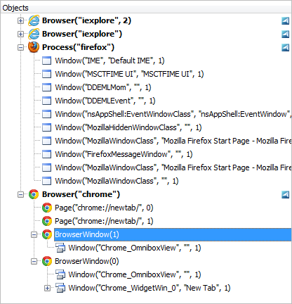
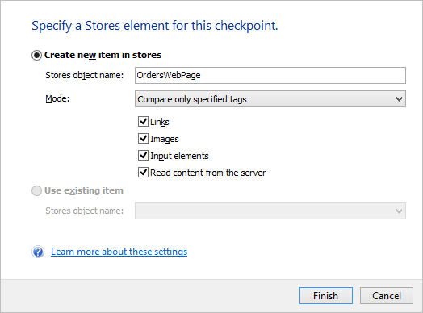
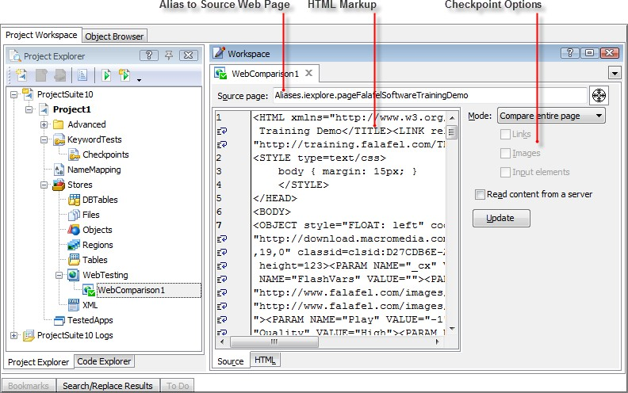
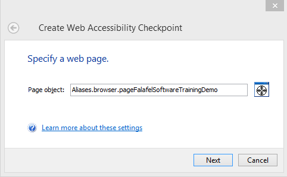

### Web Testing

#### Objectives
>
> This chapter examines TestComplete web application testing features
> and functionality. First, you\'ll learn about the significant
> differences between Windows client and web application testing.
> You\'ll learn about the primary automation challenges web applications
> typically present. You\'ll also explore a few of the essential methods
> TestComplete provides to effectively automate web applications.
>
#### Web Application Testing Issues
>
> First, let\'s highlight some of the important differences between
> Windows and Web applications. For example, the following statements
> are true of Web applications:
>
> The client UI loads asynchronously, meaning the browser fetches
> different parts of the same page at the same time. The primary impact
> this has on web testing is that the test must allow for the UI to
> completely render prior to interacting with the page contents. In many
> cases this is handled automatically. However, there may be instances
> where you\'ll need to add code to allow the browser to completely
> download a page prior to your test continuing.
>
> Are typically \"stateless\", meaning that the client functions in a
> disconnected manner from the server.
>
> Use HTML/browser-based controls for data entry.
>
> May have dynamically changing UI as a result of JavaScript, AJAX or
> Silverlight executing on the page.
>
> Typically have different functional behavior than Windows
> applications. Generally, require page refreshes thus requiring a
> refresh of the Object Browser. Multiple web browsers (Internet
> Explorer, Firefox, Chrome).
>
> Multiple browser versions and platforms (x86, x64).
>
> These differences make the already challenging task of Web automation
> more difficult than automating Windows applications. To deal with
> these issues TestComplete provides special functions that take Web
> application behavior into account. Before looking to these functions,
> let\'s first take a look at the Object Browser and examine how
> TestComplete \"sees\" web application from an object perspective.
>
> []{#Understanding_The_TestComplete_View_of_W .anchor}**Understanding
> The TestComplete View of Web Applications**
>
> Below is a screenshot of the Object Browser displaying information
> about a typical web application in Internet Explorer.
>
> 
> 
> 
> 
> Earlier versions of Internet Explorer may look significantly different in Object Browser than the screenshot
> below. Recent versions of Internet Explorer show "Browser (iexplore)"
> in two different locations. \"Browser (iexplore)\" is the first
> instance of the browser while \"Browser (\"iexplore\", 2)\" is a
> completely separate browser window. The two pages in \"Browser
> (iexplore)\" are represented by two tabs in the browser. Each page
> contains HTML objects. Also notice that browser instances are open
> applications that expose internal information to TestComplete. Each
> browser instance is indicated by the open application icon . Special
> icons in the Object Browser tree indicate the type of open
> application, e.g. Flash , .NET , Silverlight , Java , etc.

> Internet Explorer, Firefox and Chrome handle multiple browser
> instances and tabs differently and these differences show up in the
> Object Browser. Let\'s set up an example where you open a Chrome
> browser window and navigate to Google, then open a second tab on the
> Falafel site and finally open a completely separate browser instance
> and navigate to [http://www.SmartBear.com](http://www.SmartBear.com/).
> The browsers would look something like the screenshot below.

> **Figure 161 \--Tw o Brow ser Window s, Three Tabs**
>
> Now replicate this configuration to open browsers and tabs for
> Internet Explorer and FireFox. The Object Browser Objects panel might
> look something like the screenshot below.

> **Figure 162 \--Object Brow ser View of Brow sers**
>
> To design effective web application tests, it\'s important to be aware
> of differences in browser design. Browser design will vary according
> to browser type (Internet Explorer, Firefox, etc.) and version.

#### Processes and Tabs

> Modern browsers use individual processes to isolate web applications
> hosted in separate tabs within the browser\'s main window, offering
> greater stability. In the event an individual process fails, the
> browser and other open tabs remain unaffected. If you're testing on
> earlier browser versions, you\'ll only see one process for the browser
> regardless of the number of open tabs.
>
> When recording tests against browsers that use individual processes
> for each tab, be consistent regarding the number of open browser
> windows and tabs at the time of the recording. This guideline makes it
> easier to create reliable tests and to allow TestComplete to capture
> consistent Name Mapping information.
>
#### Web Tree Models
>
> **Web Tree Models** define how web page elements are shown in the
> Object Browser and how they are addressed in tests. TestComplete
> supports four models:
>
> **DOM** \-- Document Object Model, the native way that Internet
> Explorer looks at web pages. The DOM model creates a very flat tree in
> the Object Browser. All items on the web page need to be re-read each
> time the web page is updated. This is the slowest method for using web
> pages.
>
> **TAG** \-- All HTML elements are sorted by their TAG value. If a link
> (\<A\> HTML tag) gets created, only the \"A\" node part of the Object
> Browser tree gets updated.
>
> **Tree** \-- Treats a web page like a normal application where the
> list follows the hierarchy of HTML elements on the web page. The names
> of the objects are taken from the element type names (rather than tag
> names). This model creates a very deep tree for most web pages. The
> tree only contains elements with text and also does not include
> document, window or body objects. This is the fastest method for using
> web pages. This is the default.
>
> **Hybrid** \-- Hybrid is a combination of both DOM and Tree.
>
> The Hybrid model, used in earlier versions of the product as the
> default, has been replaced by the Tree model. The Tree model is faster
> and is recommended for new tests. The Tree model is also required for
> cross browser tests.

#### Naming Conventions

> The naming convention for HTML elements used by TestComplete depends
> on the web page model used:
>
> **DOM** \-- HTML elements are in the form of Item(index). The index
> will be either the ID or Name attribute, if any (with the
> Identification attribute having priority). If the element does not
> have either attribute, TestComplete will assign an index number based
> on the order the item was created.
>
> **TAG** \-- HTML elements have the same form as DOM but are sorted by
> type.
>
> **Tree** \-- HTML elements have the form ObjectType(Index), for
> example: Panel(0) - div element, Image(\"Logo.gif\") - image element.

#### Setting the Project Web Tree Model

> To set the web page model used for the project:

39. In the Project Explorer, select the project node and then click on
    the workspace

##### Properties tab.

40. Select **Open Application \| Web Testing**.

41. Select the Tree model from the drop-down list.

> **Figure 163 \--Setting the Web Page Model**
>
#### Web Stores & Checkpoints
>
> TestComplete provides two Checkpoints specific to web testing called
> **Web Comparison** and **Web Accessibility**. In this topic we\'ll
> walk through using both Checkpoints against the \"Orders\" sample web
> site. As with all other Checkpoints, Web Comparison and Web
> Accessibility Checkpoints can be added from the Recording toolbar,
> dragged to a Keyword Test as a Checkpoint operation or created from
> the Script Editor toolbar.

#### Web Comparison

> The **Web Comparison Checkpoint** is geared towards verifying the HTML
> contents of a specific web page. Here are the steps to setup a Web
> Comparison checkpoint:

1.  Create a Web Comparison Checkpoint either from the Recording
    toolbar, drag as a Keyword Test Operation or create from the Script
    toolbar.

2.  On the **Create Web Comparison Checkpoint** dialog, drag & drop the
    cross-hairs icon anywhere onto a web page within Internet Explorer.
    For this example, we\'re using the \"Orders\" sample application
    located at
    [http://training.falafel.com/Orders](http://training.falafel.com/Orders).
    Click the **Next** button.

> **Figure 164 \--Selecting the Page**

3.  The **Specify a Stores element for this checkpoint** page lets you
    configure exactly how and what on the page is stored. To make a new
    store choose the **Create new item in stores** option and supply a
    **Stores object name**. In the **Mode** drop down list decide if you
    want to compare the entire page, only the tag structure or only
    specified tags. If you select the last option for only specified
    tags, you can specify that only **Links**, **Images**, **Input
    Elements** or some combination will be compared. By default, the
    page is read from the browser, but you can **Read content from the
    server** instead. Click the **Finish** button to close the dialog.

4.  Click **OK** on the **Create Web Comparison Checkpoint** dialog.

5.  From the **Project Explorer**, navigate to the **Advanced \| Stores
    \| Web Testing** node. Double click the web comparison node to open
    the **Web Comparison Checkpoint** editor. From the editor window you
    can modify the options selected on the **Web Comparison Checkpoint**
    dialog as well as edit the actual HTML markup used during the
    comparison.

> **Figure 165 \--Web Comparison Checkpoint Editor**

#### Web Comparison Options

> The Web Comparison options provides several options that dictate the
> web elements included in the comparison. Use these options to reduce
> the scope of the Checkpoint:

> **Figure 166 \--Web Comparison Options**
>
> **Mode \--** This drop-down list specifies if the comparison will
> verify the contents of the entire web page, \"only tag structure\" or
> \"only specified tags\". If the last option to compare only specified
> tags is selected, the check boxes for **Links**, **Images** and
> **Input elements** are enabled.
>
> **Read the web contents directly from the web server \--** This
> option, controls whether TestComplete should fetch the content
> directly from the web server or from the web browser window. In some
> cases, the content can be considerably different and using this option
> can improve the stability of the results.

#### Web Accessibility

> The **Web Accessibility Checkpoint** ensures that specific web pages
> adhere to guidelines designed to improve the usability of the page by
> people with disabilities. Similar to the Web Comparison Checkpoint,
> you can control the scope of the Web Accessibility Checkpoint to focus
> on the specific items of interest. Most web applications tend to have
> accessibility issues, so you shouldn\'t be surprised if your pages
> have many warnings when applying this Checkpoint using the full range
> of available options. To use a Web Accessibility Checkpoint:

1.  Create a **Web Accessibility Checkpoint** either from the Recording
    toolbar, drag as a Keyword Test Operation or create from the Script
    toolbar

2.  On the **Create Web Accessibility Checkpoint** dialog, drag & drop
    cross-hairs icon anywhere onto a web page within the browser. This
    action will automatically set the name of the Page object. For this
    example, we\'re using the "Orders\" sample application at
    [http://training.falafel.com/Orders](http://training.falafel.com/Orders).
    Click the Next button to continue.

> **Figure 167 \--Web Accessibility Checkpoint**

3.  Provide a name for the Checkpoint, de-select any check boxes that
    should not be part of the comparison and click the **OK** button to
    create the Checkpoint.

#### Web Accessibility Checkpoint Options

> The available options for the Web Accessibility checkpoint are as
> follows:
>
> **Check \"alt\" attribute** \-- All IMG, APPLET, AREA and INPUT
> elements must have a non- empty ALT attribute.
>
> **Check \"mailto:\"** \-- Web page must have at least one A element
> (link), whose REF attribute starts with mailto:
>
> **Check image sizes** \-- All IMG elements must have the WIDTH and
> HEIGHT attributes specified.
>
> **Check \"title\" tag** \-- The web page must have a non-empty TITLE
> element.
>
> **Check tab indexes** \-- All INPUT, SELECT, and TEXTAREA elements
> must have the TABINDEX attribute.
>
> **Check link accessibility** \-- Checks for broken links.
>
> **Check ActiveX objects** \-- Verifies there are no ActiveX objects on
> the web page.
>
> **Check Applet object** \-- Verifies there are no Applet objects on
> the web page.
>
> **Check multimedia links** \-- Verifies there are not AVI or SWF files
> on the web page.
>
> **Check server-side images** \-- Verifies that none of the IMG
> elements SRC attributes contain parameters (i.e. the question mark
> \"?\" is not detected in the SRC attribute).
>
#### Summary
>
> In this chapter, we looked at Web Testing and how it differs from
> standard Windows client testing. We learned:
>
> How TestComplete \"sees\" the elements of a web page from the Object
> Browser. What the Page object provides regarding web testing.
>
> How specific Web testing methods can be used to solve real world
> problems. To deal with dynamic JavaScript client-side UI.
>
> How to dynamically locate objects on a page.